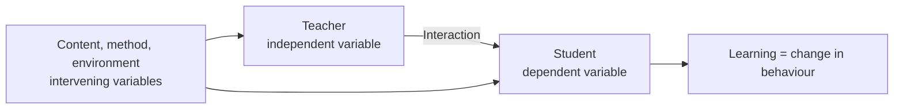
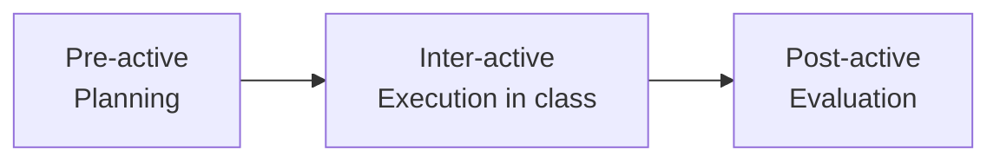
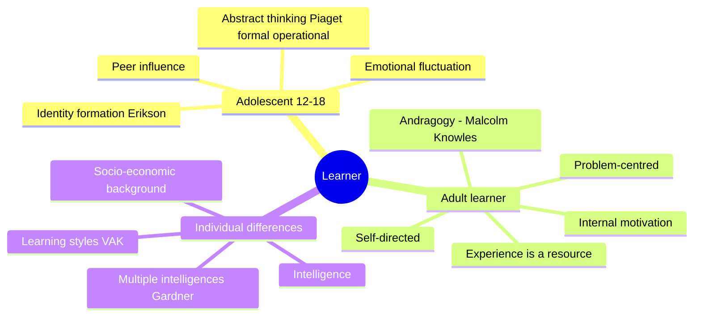
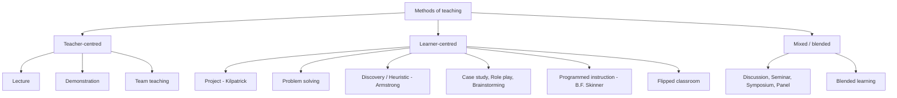
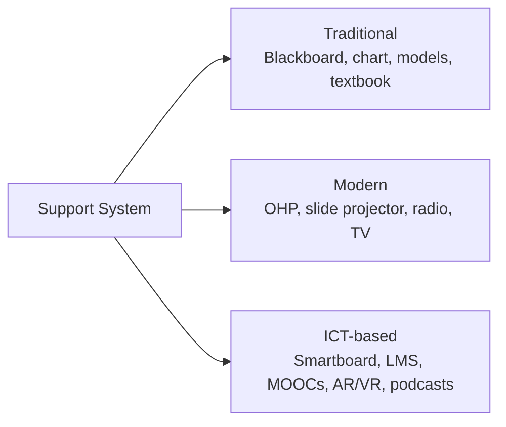
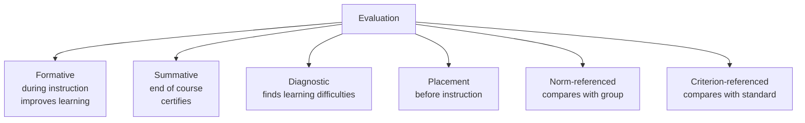
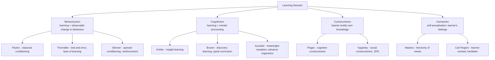
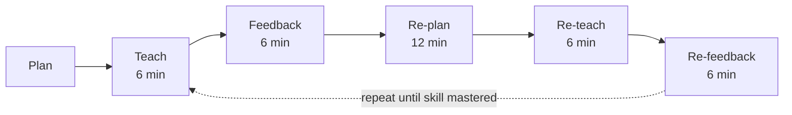

# Paper 1 · Unit 1 — Teaching Aptitude

**Expected questions: ~5 (10 marks) · Target: 5/5**

## Syllabus Checklist
- [ ] Teaching: concept, objectives, levels (memory, understanding, reflective), characteristics & basic requirements
- [ ] Learner's characteristics (adolescent & adult; academic, social, emotional, cognitive), individual differences
- [ ] Factors affecting teaching (teacher, learner, support material, instructional facilities, environment, institution)
- [ ] Methods of teaching: teacher-centred vs learner-centred; offline vs online (SWAYAM, SWAYAMPRABHA, MOOCs)
- [ ] Teaching support system: traditional, modern, ICT-based
- [ ] Evaluation systems: elements & types; evaluation in CBCS; computer-based testing; innovations

---

## 1. What is Teaching?

Teaching is far more than "telling". A lecture delivered to an empty hall is not teaching, because nothing has
changed in anyone's mind. We therefore judge teaching by its effect on the learner: has the student come to
know, do or value something new? Seen this way, teaching is a *system* with inputs (the teacher's planning
and personality, the content, the resources), a process (interaction in the classroom) and an output
(learning). Examiners often test this systems view through the language of variables.

Teaching is a **purposeful, interactive process** that brings a desirable change in the learner's behaviour
(knowledge, skills, attitudes).

<!-- latex: p1-01-teaching-variables -->


| Variable type | What it is | Example |
|---------------|-----------|---------|
| Independent | Teacher (plans, organises, leads) | Teacher's planning |
| Dependent | Student (acts as per teacher) | Learner's performance |
| Intervening | Content, method, A/V aids, environment | Smart board |

### Phases of Teaching (Philip W. Jackson)

Philip W. Jackson, observing real classrooms in *Life in Classrooms* (1968), noticed that a teacher's work
does not begin when the bell rings or end when it rings again. Good teaching is planned beforehand,
improvised sensitively during the lesson, and reviewed afterwards.

<!-- latex: p1-01-phases -->


- **Pre-active**: fixing goals, choosing content, deciding method.
- **Inter-active**: perception of class size, diagnosis, action (questioning, reinforcement).
- **Post-active**: test design, measuring changes, changing strategies.

### Levels of Teaching (most asked!)

A useful way to remember the three levels is to ask *how much thinking the learner does*. At the memory level
the learner reproduces; at the understanding level the learner sees relationships and principles; at the
reflective level the learner questions, solves problems and creates. Each higher level contains the lower
ones, which is why the levels are drawn as a stack rather than as alternatives.

<!-- latex: p1-01-levels -->
```
                 ┌────────────────────────────────────────────┐
  Level 3        │ REFLECTIVE level — Hunt (1971)             │  Student-centred, problem solving,
  (highest)      │ "thoughtful" — critical, creative thinking │  highest insight
                 ├────────────────────────────────────────────┤
  Level 2        │ UNDERSTANDING level — Morrison (1931)      │  Memory + insight; "memory with
                 │ Generalisation, principles                 │  understanding"; teacher-centred
                 ├────────────────────────────────────────────┤
  Level 1        │ MEMORY level — Herbart (Herbartian steps)  │  Rote learning, thoughtless,
  (lowest)       │ Recall, recognition                        │  teacher-dominated
                 └────────────────────────────────────────────┘
```

| Level | Proponent | Teacher role | Student role | Evaluation |
|-------|-----------|--------------|--------------|------------|
| Memory | Herbart | Dominant | Passive | Oral/written recall tests |
| Understanding | Morrison | Dominant | Semi-active | Objective + essay |
| Reflective | Hunt | Democratic/secondary | Active | Essay, problem-solving |

Herbartian 5 steps: **Preparation → Presentation → Comparison/Association → Generalisation → Application**.
Morrison's steps: **Exploration → Presentation → Assimilation → Organisation → Recitation**.

### Bloom's Taxonomy (Cognitive domain, revised 2001 by Anderson & Krathwohl)

Benjamin Bloom's committee (1956) classified educational objectives so that teachers and examiners could
write questions at a deliberate level of difficulty. The 2001 revision made two changes that are examined
repeatedly: the category names became **verbs** (what the learner *does*), and **Creating** replaced
Synthesis at the very top, above Evaluating. When you meet a question that lists action verbs ("design",
"justify", "classify"), map each verb to its level using the figure below.

<!-- latex: p1-01-bloom -->
```
                        ▲  Creating      (design, construct, produce)
                       ▲▲  Evaluating    (judge, critique, justify)
                      ▲▲▲  Analysing     (compare, differentiate)
                     ▲▲▲▲  Applying      (use, execute, solve)
                    ▲▲▲▲▲  Understanding (explain, classify)
                   ▲▲▲▲▲▲  Remembering   (recall, list, define)
```
Original (1956): Knowledge → Comprehension → Application → Analysis → **Synthesis → Evaluation**.
Revised: Evaluation comes **before** Creating (Synthesis renamed Creating; nouns became verbs).

Three domains: **Cognitive** (Bloom), **Affective** (Krathwohl: Receiving → Responding → Valuing → Organisation → Characterisation),
**Psychomotor** (Simpson / Dave: Imitation → Manipulation → Precision → Articulation → Naturalisation).

### Maxims of Teaching

Maxims are the time-tested rules of thumb that turn principles into classroom practice. Each one moves the
learner from what is familiar and easy towards what is new and demanding — so the order of the pair is
what examiners check (it is always *known → unknown*, never the reverse).
- Known → Unknown · Simple → Complex · Concrete → Abstract · Particular → General · Whole → Part
- Analysis → Synthesis · Empirical → Rational · Psychological → Logical · Induction → Deduction

---

## 2. Learner's Characteristics

No method works equally well for every learner. Questions in this area usually ask you to recognise which
characteristic belongs to which group — for example, that adults are *self-directed* and use their
*experience as a resource* (Malcolm Knowles's andragogy), or that adolescents are absorbed in forming an
*identity* (Erik Erikson).

<!-- latex: p1-01-learner -->


- **Pedagogy** = teaching children; **Andragogy** = teaching adults (Knowles); **Heutagogy** = self-determined learning.
- **Piaget stages**: Sensorimotor (0–2) → Pre-operational (2–7) → Concrete operational (7–11) → Formal operational (11+).
- **Vygotsky**: Zone of Proximal Development (ZPD), **scaffolding**, social constructivism.
- **Gardner** multiple intelligences: linguistic, logical-mathematical, spatial, musical, bodily-kinesthetic, interpersonal, intrapersonal, naturalistic (8).
- **VAK** learning styles: Visual, Auditory, Kinesthetic.

## 3. Factors Affecting Teaching

Teaching succeeds or fails through many interacting influences. It helps to group them as in the table:
the people involved (teacher and learner), the materials and facilities they use, and the wider
environment and institution in which they work. A question may describe a classroom problem and ask
which factor is responsible.

| Factor | Examples |
|--------|----------|
| Teacher | Subject knowledge, communication, personality, motivation |
| Learner | Aptitude, interest, motivation, readiness, prior knowledge |
| Support material | Textbooks, A/V aids, e-content |
| Instructional facilities | Labs, library, smart classroom |
| Learning environment | Class size, seating, light/ventilation, classroom climate |
| Institution | Policies, administration, culture |

## 4. Methods of Teaching

The central distinction is *who is active*. In teacher-centred methods the teacher transmits and the learner
receives; in learner-centred methods the learner investigates, discovers and constructs while the teacher
guides. Modern policy (including NEP 2020) favours learner-centred and blended approaches, but every method
has its place — a demonstration is still the quickest way to show a laboratory technique.

<!-- latex: p1-01-methods -->


| Method | Key idea | Proponent |
|--------|---------|-----------|
| Project method | Learning by doing, purposeful activity | W.H. Kilpatrick (based on Dewey) |
| Heuristic | Student as discoverer | H.E. Armstrong |
| Programmed instruction | Small steps, immediate feedback, linear | B.F. Skinner |
| Branching programming | Branches based on response | Norman Crowder |
| Dalton plan | Contract-based individual work | Helen Parkhurst |
| Montessori | Child-centred, didactic apparatus | Maria Montessori |
| Kindergarten | "Garden of children" | Froebel |
| Basic education (Nai Talim) | Craft-centred | Gandhi |
| Flipped classroom | Content at home, practice in class | Bergmann & Sams |

**Group discussion formats**: Seminar (paper + discussion), Symposium (several speakers on aspects of one topic),
Panel discussion (informal conversation among experts before audience), Workshop (hands-on).

### Online Teaching — Government Initiatives (asked every cycle)

India has built a large public infrastructure for digital learning. Almost every NET paper contains at least
one question on these initiatives, usually asking what a platform does or which body runs it. Learn the
table as pairs: *platform → purpose → coordinating agency*.

| Initiative | What it is |
|-----------|------------|
| **SWAYAM** | Study Webs of Active-Learning for Young Aspiring Minds — MOOC platform (2017), 4 quadrants |
| SWAYAM 4 quadrants | e-Tutorial (video), e-Content (text), Self-assessment (quiz), Discussion forum |
| **SWAYAM PRABHA** | DTH educational channels (24×7), launched with 32, now 40+ channels, via GSAT-15 |
| **NPTEL** | IITs + IISc engineering courses |
| **NDL** | National Digital Library (IIT Kharagpur) |
| **e-PG Pathshala** | PG e-content by UGC/INFLIBNET |
| **e-Yantra** | Robotics (IIT Bombay) |
| **Shodhganga** | Repository of Indian theses (INFLIBNET) |
| **Shodhgangotri** | Repository of synopses |
| **DIKSHA** | School teachers' platform (One Nation One Digital Platform) |
| **Virtual Labs** | MHRD remote labs |
| **Spoken Tutorial** | IIT Bombay software training |
| **NMEICT** | National Mission on Education through ICT |
| National coordinators of SWAYAM | AICTE, NPTEL, UGC, CEC, NCERT, NIOS, IGNOU, IIMB, NITTTR |

**MOOC**: Massive Open Online Course. Term coined by Dave Cormier (2008). cMOOC (connectivist) vs xMOOC (extended, structured).

## 5. Teaching Support System

Support systems are the tools that carry a teacher's message. They range from the blackboard to virtual
reality, and the choice among them should follow the learning objective, not fashion. Edgar Dale's cone,
shown below, explains why concrete, hands-on experiences are remembered longer than words alone.

<!-- latex: p1-01-support -->


**Edgar Dale's Cone of Experience** (most concrete at base):
<!-- latex: p1-01-dale-cone -->
```
               /\        Verbal symbols         ← most abstract
              /  \       Visual symbols
             /    \      Recordings, radio, still pictures
            /      \     Motion pictures
           /        \    Television
          /          \   Exhibits
         /            \  Field trips
        /              \ Demonstrations
       /                \Dramatised experiences
      /                  \Contrived experiences
     /____________________\ Direct purposeful experiences ← most concrete
```
People remember ~10% of what they read, ~90% of what they say and do.

Audio aids: radio, tape recorder, podcast. Visual: chart, map, blackboard. **Audio-visual**: TV, film, video.
Projected aids: OHP, LCD; Non-projected: blackboard, charts, models.

## 6. Evaluation Systems

Evaluation answers two separate questions: *when* do we evaluate, and *against what* do we compare the
result? Keeping these two axes apart removes most of the confusion in examination questions — a test can
be both formative (timing) and criterion-referenced (interpretation).

<!-- latex: p1-01-evaluation -->


| Term | Meaning |
|------|---------|
| Measurement | Quantitative description (numbers) |
| Assessment | Collecting information about learning |
| Evaluation | Measurement + value judgement (qualitative + quantitative) |
| CCE | Continuous & Comprehensive Evaluation — scholastic + co-scholastic |
| Reliability | Consistency of scores |
| Validity | Measures what it intends to measure (most important) |
| Objectivity | Free from examiner bias |
| Usability/Practicability | Easy to administer |

**Evaluation in CBCS**: credit = 1 hr lecture/week per semester (or 2 hrs practical). Letter grades:
O (10), A+ (9), A (8), B+ (7), B (6), C (5), P (4), F (0), Ab.
- **SGPA** = Σ(Cᵢ × Gᵢ) / ΣCᵢ (semester) · **CGPA** = Σ(Cᵢ × Sᵢ) / ΣCᵢ (across semesters)
- Percentage ≈ CGPA × 9.5 (UGC rule-of-thumb).
- CBCS course types: Core, Elective (Discipline-specific, Generic), Ability Enhancement (AECC, SEC).

**Computer-based testing & innovations**: CAT (Computer Adaptive Testing — difficulty adapts to answers), open-book
exams, online proctoring, e-portfolios, rubrics, peer assessment, grading instead of marks, question banks.

## 7. Deeper Dive — Learning Theories, Micro-teaching & Teaching Models

### 7.1 Learning Theories (asked in almost every cycle)

A learning theory is an explanation of *how* learning happens. Behaviourists study only what can be
observed and shaped by reinforcement; cognitivists look inside the mind at perception, memory and insight;
constructivists hold that learners actively build their own understanding, often through social
interaction; humanists emphasise the learner's needs, feelings and growth as a whole person.

<!-- latex: p1-01-learning-theories -->


| Theorist | Key idea | Classroom implication |
|----------|----------|-----------------------|
| **Pavlov** | Classical conditioning: neutral stimulus + unconditioned stimulus → conditioned response (dog & bell) | Pleasant classroom associations reduce fear of a subject |
| **Thorndike** | Connectionism; laws of **readiness, exercise, effect** | Practice, rewards, readiness before teaching |
| **Skinner** | Operant conditioning; positive/negative reinforcement, punishment, shaping, schedules of reinforcement | Programmed instruction, immediate feedback |
| **Kohler** | Insight learning (chimpanzee Sultan) — sudden "aha" grasp of relationships | Present whole problems |
| **Bruner** | Discovery learning; modes: **enactive → iconic → symbolic**; spiral curriculum | Revisit topics with increasing depth |
| **Ausubel** | Meaningful verbal learning; **advance organisers** | Start a lesson with an overview linking to prior knowledge |
| **Bandura** | Social learning / observational learning (Bobo doll); modelling; self-efficacy | Teacher as role model |
| **Gagné** | Conditions of learning; 8 types of learning; **9 events of instruction** | Structured lesson design |
| **Maslow** | Physiological → safety → love/belonging → esteem → self-actualisation | Basic needs before academic growth |

- **Negative reinforcement** = removing an unpleasant stimulus to *increase* behaviour (not punishment).
- Gagné's 9 events: gain attention → inform objectives → recall prior learning → present content → provide guidance → elicit performance → give feedback → assess performance → enhance retention and transfer.

### 7.2 Micro-teaching

Micro-teaching shrinks teaching down — fewer students, less time, a single skill — so that a trainee
teacher can practise, receive precise feedback and try again immediately. It is the teacher-training
counterpart of a musician practising one difficult passage rather than the whole piece.

Developed at **Stanford University (1961–63) by Dwight Allen** and colleagues. A scaled-down teaching encounter: one skill, 5–10 students, 5–10 minutes.

<!-- latex: p1-01-microteaching -->


- Indian model (NCERT/Passi): total cycle **36 minutes**.
- Skills: introducing a lesson, questioning (fluency, probing), explaining, illustrating with examples, **reinforcement**, stimulus variation, blackboard writing, closure, using A/V aids.
- **Simulated teaching** = role play of teaching in a training situation; **team teaching** = two or more teachers plan and teach together.

### 7.3 Models of Teaching

A model of teaching is a complete plan for a type of lesson: its goals, the sequence of activities, the
roles of teacher and learner, and how success will be judged. Bruce Joyce and Marsha Weil grouped the many
models into four families according to the kind of learning they aim at.

| Model | Proponent | Key steps / idea |
|-------|-----------|------------------|
| **Basic Teaching Model** | Robert Glaser (1962) | Instructional objectives → Entering behaviour → Instructional procedures → Performance assessment (with feedback loop) |
| Concept Attainment | Jerome Bruner | Examples & non-examples → identify concept attributes |
| Inductive Thinking | Hilda Taba | Concept formation → interpretation of data → application |
| Advance Organiser | David Ausubel | Organiser presented before content |
| Inquiry Training | Richard Suchman | Puzzling event → students ask yes/no questions → form theories |
| Jurisprudential | Oliver & Shaver | Debating public issues |
| Synectics | William Gordon | Creativity through metaphors & analogies |

Families of teaching models (**Joyce & Weil**): Information processing, Social interaction, Personal, Behavioural systems.

<!-- latex: p1-01-glaser -->
```
Glaser's Basic Teaching Model
 ┌──────────────┐   ┌──────────────┐   ┌──────────────┐   ┌──────────────┐
 │ Instructional├──►│  Entering    ├──►│ Instructional├──►│ Performance  │
 │ objectives   │   │  behaviour   │   │ procedures   │   │ assessment   │
 └──────▲───────┘   └──────▲───────┘   └──────▲───────┘   └──────┬───────┘
        └──────────────────┴──────────────────┴── feedback ───────┘
```

### 7.4 Questioning & Classroom Management

Questions are the teacher's most flexible tool: they check understanding, provoke thinking and keep a
class involved. Classroom management, in turn, creates the conditions in which questions can be asked and
answered without disorder.
- **Convergent** questions (one correct answer, lower order) vs **divergent** (many answers, creativity).
- **Wait time** (Mary Budd Rowe): waiting 3–5 seconds after a question improves answer quality.
- **Kounin**: "withitness" (teacher aware of everything), overlapping, momentum, smoothness.
- Teacher leadership styles (Lewin): **autocratic, democratic, laissez-faire** — democratic is best for learning climate.
- **Hidden curriculum**: values and norms learnt implicitly from school culture.

---

## Previous Year Questions (PYQ pattern)

**Levels of teaching**
1. The "reflective level" of teaching is associated with: (a) Herbart (b) Morrison (c) Hunt (d) Skinner — **Ans: (c)**
2. Which level of teaching is the most "thoughtless"? (a) Memory (b) Understanding (c) Reflective (d) Autonomous — **Ans: (a)**
3. Arrange the levels from lowest to highest: **Memory → Understanding → Reflective**.

**Bloom's taxonomy**

4. In revised Bloom's taxonomy the highest cognitive level is: (a) Evaluating (b) Creating (c) Analysing (d) Synthesis — **Ans: (b)**
5. "Characterisation by a value" belongs to which domain? — **Ans: Affective (Krathwohl)**
6. Match: Remembering–recall; Applying–use; Analysing–differentiate; Evaluating–judge. (Standard match question.)

**Learner characteristics**

7. Andragogy refers to: (a) teaching children (b) teaching adults (c) self-learning (d) group learning — **Ans: (b)**
8. ZPD is a concept given by: **Vygotsky**
9. Which is NOT a characteristic of adult learners? (a) self-directed (b) experience-based (c) externally driven (d) problem-centred — **Ans: (c)**

**Methods**

10. Programmed instruction is based on the theory of: (a) Classical conditioning (b) Operant conditioning (c) Insight (d) Constructivism — **Ans: (b) Skinner**
11. "Learning by doing" is the core of: **Project method (Kilpatrick)**
12. Which is a learner-centred method? (a) Lecture (b) Demonstration (c) Problem solving (d) Team teaching — **Ans: (c)**
13. In a flipped classroom, students first encounter new content: **at home (videos/readings)**

**Online initiatives**

14. SWAYAM PRABHA provides: (a) MOOCs (b) 24×7 DTH educational channels (c) Digital library (d) Thesis repository — **Ans: (b)**
15. How many quadrants does a SWAYAM course have? — **Ans: 4**
16. Shodhganga is maintained by: **INFLIBNET (Gandhinagar)**
17. The national coordinator for engineering courses on SWAYAM: **NPTEL**

**Evaluation**

18. Evaluation that takes place during the teaching-learning process is: **Formative**
19. A test that measures what it intends to measure is: **Valid**
20. Consistency of test scores refers to: **Reliability**
21. Norm-referenced test compares a student with: **performance of peer group**
22. Diagnostic evaluation is meant to: **identify learning difficulties**
23. In CBCS, the grade point for "O" (Outstanding) is: **10**

**Teaching aids**

24. In Edgar Dale's Cone, the most concrete experience is: **Direct purposeful experience**
25. Which is a non-projected aid? (a) LCD (b) OHP (c) Blackboard (d) Slide — **Ans: (c)**

**Statement-based (common format)**

26. Statement I: Effective teaching is learner-centred. Statement II: The teacher's role is only to transmit content.
    — **I true, II false**

**More practice questions**

27. Learning by insight was demonstrated by: **Wolfgang Kohler**
28. "Law of effect" is associated with: **E.L. Thorndike**
29. Advance organisers were proposed by: **David Ausubel**
30. Bruner's three modes of representation in order: **Enactive, Iconic, Symbolic**
31. Removing an unpleasant stimulus to increase a desired behaviour is: **negative reinforcement**
32. Micro-teaching was developed at: **Stanford University**
33. Duration of one micro-teaching cycle in the Indian model: **36 minutes**
34. The basic teaching model was given by: **Robert Glaser**
35. The first component of Glaser's model is: **instructional objectives**
36. Concept attainment model is associated with: **Jerome Bruner**
37. A question with several acceptable answers is: **divergent**
38. Observational (social) learning theory was given by: **Albert Bandura**
39. In Maslow's hierarchy, the highest need is: **self-actualisation**
40. Which leadership style creates the most positive classroom climate? **Democratic**
41. Statement I: Formative evaluation is diagnostic in nature. Statement II: Summative evaluation is used for certification. — **Both true**
42. Match: Kilpatrick–Project method; Skinner–Programmed learning; Armstrong–Heuristic; Parkhurst–Dalton plan.
43. Which is NOT a characteristic of effective teaching? (a) learner involvement (b) feedback (c) rote memorisation (d) use of examples — **Ans: (c)**

## Quick Revision Box
- Memory–Herbart · Understanding–Morrison · Reflective–Hunt
- Formative = during; Summative = end; Diagnostic = difficulties; Placement = before
- Validity > Reliability (valid test is always reliable, not vice versa)
- SWAYAM (2017, MOOCs, 4 quadrants) · SWAYAM PRABHA (DTH channels, 32 at launch → 40+) · Shodhganga (theses, INFLIBNET)
