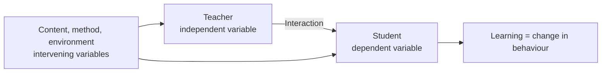
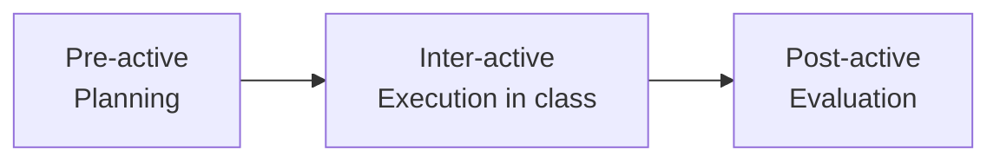
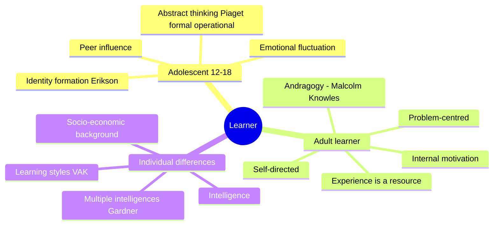
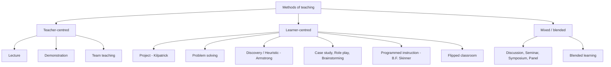
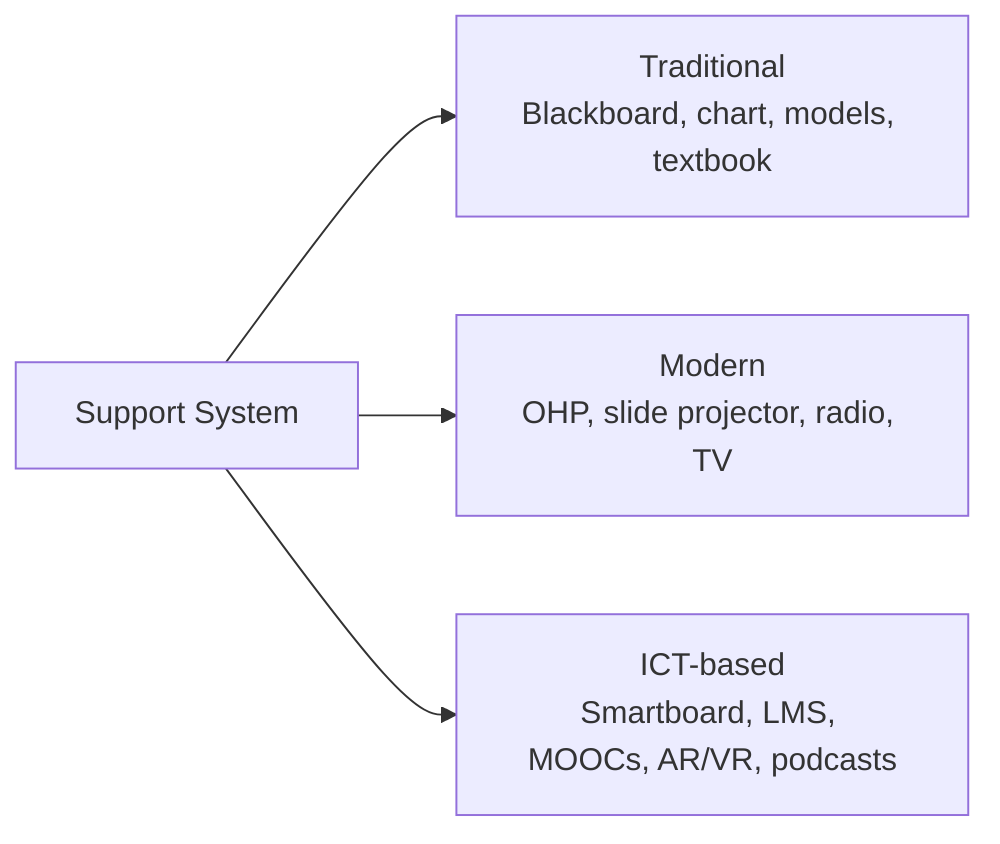
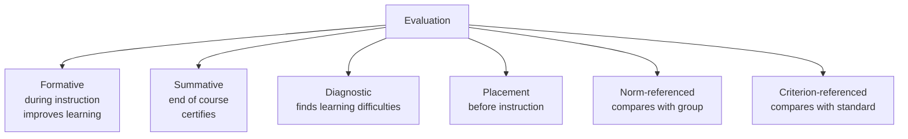

# Paper 1 · Unit 1 — Teaching Aptitude

**Expected questions: ~5 (10 marks) · Target: 5/5**

## Syllabus Checklist
- [ ] Teaching: concept, objectives, levels (memory, understanding, reflective), characteristics & basic requirements
- [ ] Learner's characteristics (adolescent & adult; academic, social, emotional, cognitive), individual differences
- [ ] Factors affecting teaching (teacher, learner, support material, instructional facilities, environment, institution)
- [ ] Methods of teaching: teacher-centred vs learner-centred; offline vs online (SWAYAM, SWAYAMPRABHA, MOOCs)
- [ ] Teaching support system: traditional, modern, ICT-based
- [ ] Evaluation systems: elements & types; evaluation in CBCS; computer-based testing; innovations

---

## 1. What is Teaching?

Teaching is a **purposeful, interactive process** that brings a desirable change in the learner's behaviour
(knowledge, skills, attitudes).



| Variable type | What it is | Example |
|---------------|-----------|---------|
| Independent | Teacher (plans, organises, leads) | Teacher's planning |
| Dependent | Student (acts as per teacher) | Learner's performance |
| Intervening | Content, method, A/V aids, environment | Smart board |

### Phases of Teaching (Philip W. Jackson)



- **Pre-active**: fixing goals, choosing content, deciding method.
- **Inter-active**: perception of class size, diagnosis, action (questioning, reinforcement).
- **Post-active**: test design, measuring changes, changing strategies.

### Levels of Teaching (most asked!)

```
                 ┌────────────────────────────────────────────┐
  Level 3        │ REFLECTIVE level  — Hunt (1971)            │  Student-centred, problem solving,
  (highest)      │ "thoughtful" — critical, creative thinking │  highest insight
                 ├────────────────────────────────────────────┤
  Level 2        │ UNDERSTANDING level — Morrison (1931)      │  Memory + insight; "Memory with
                 │ Generalisation, principles                  │  understanding"; teacher-centred-ish
                 ├────────────────────────────────────────────┤
  Level 1        │ MEMORY level — Herbart (Herbartian steps)  │  Rote learning, thoughtless
  (lowest)       │ Recall, recognition                        │  teacher-dominated
                 └────────────────────────────────────────────┘
```

| Level | Proponent | Teacher role | Student role | Evaluation |
|-------|-----------|--------------|--------------|------------|
| Memory | Herbart | Dominant | Passive | Oral/written recall tests |
| Understanding | Morrison | Dominant | Semi-active | Objective + essay |
| Reflective | Hunt | Democratic/secondary | Active | Essay, problem-solving |

Herbartian 5 steps: **Preparation → Presentation → Comparison/Association → Generalisation → Application**.
Morrison's steps: **Exploration → Presentation → Assimilation → Organisation → Recitation**.

### Bloom's Taxonomy (Cognitive domain, revised 2001 by Anderson & Krathwohl)

```
                        ▲  Creating      (design, construct, produce)
                       ▲▲  Evaluating    (judge, critique, justify)
                      ▲▲▲  Analysing     (compare, differentiate)
                     ▲▲▲▲  Applying      (use, execute, solve)
                    ▲▲▲▲▲  Understanding (explain, classify)
                   ▲▲▲▲▲▲  Remembering   (recall, list, define)
```
Original (1956): Knowledge → Comprehension → Application → Analysis → **Synthesis → Evaluation**.
Revised: Evaluation comes **before** Creating (Synthesis renamed Creating; nouns became verbs).

Three domains: **Cognitive** (Bloom), **Affective** (Krathwohl: Receiving → Responding → Valuing → Organisation → Characterisation),
**Psychomotor** (Simpson / Dave: Imitation → Manipulation → Precision → Articulation → Naturalisation).

### Maxims of Teaching
- Known → Unknown · Simple → Complex · Concrete → Abstract · Particular → General · Whole → Part
- Analysis → Synthesis · Empirical → Rational · Psychological → Logical · Induction → Deduction

---

## 2. Learner's Characteristics



- **Pedagogy** = teaching children; **Andragogy** = teaching adults (Knowles); **Heutagogy** = self-determined learning.
- **Piaget stages**: Sensorimotor (0–2) → Pre-operational (2–7) → Concrete operational (7–11) → Formal operational (11+).
- **Vygotsky**: Zone of Proximal Development (ZPD), **scaffolding**, social constructivism.
- **Gardner** multiple intelligences: linguistic, logical-mathematical, spatial, musical, bodily-kinesthetic, interpersonal, intrapersonal, naturalistic (8).
- **VAK** learning styles: Visual, Auditory, Kinesthetic.

## 3. Factors Affecting Teaching

| Factor | Examples |
|--------|----------|
| Teacher | Subject knowledge, communication, personality, motivation |
| Learner | Aptitude, interest, motivation, readiness, prior knowledge |
| Support material | Textbooks, A/V aids, e-content |
| Instructional facilities | Labs, library, smart classroom |
| Learning environment | Class size, seating, light/ventilation, classroom climate |
| Institution | Policies, administration, culture |

## 4. Methods of Teaching



| Method | Key idea | Proponent |
|--------|---------|-----------|
| Project method | Learning by doing, purposeful activity | W.H. Kilpatrick (based on Dewey) |
| Heuristic | Student as discoverer | H.E. Armstrong |
| Programmed instruction | Small steps, immediate feedback, linear | B.F. Skinner |
| Branching programming | Branches based on response | Norman Crowder |
| Dalton plan | Contract-based individual work | Helen Parkhurst |
| Montessori | Child-centred, didactic apparatus | Maria Montessori |
| Kindergarten | "Garden of children" | Froebel |
| Basic education (Nai Talim) | Craft-centred | Gandhi |
| Flipped classroom | Content at home, practice in class | Bergmann & Sams |

**Group discussion formats**: Seminar (paper + discussion), Symposium (several speakers on aspects of one topic),
Panel discussion (informal conversation among experts before audience), Workshop (hands-on).

### Online Teaching — Government Initiatives (asked every cycle)

| Initiative | What it is |
|-----------|------------|
| **SWAYAM** | Study Webs of Active-Learning for Young Aspiring Minds — MOOC platform (2017), 4 quadrants |
| SWAYAM 4 quadrants | e-Tutorial (video), e-Content (text), Self-assessment (quiz), Discussion forum |
| **SWAYAM PRABHA** | DTH educational channels (24×7), launched with 32, now 40+ channels, via GSAT-15 |
| **NPTEL** | IITs + IISc engineering courses |
| **NDL** | National Digital Library (IIT Kharagpur) |
| **e-PG Pathshala** | PG e-content by UGC/INFLIBNET |
| **e-Yantra** | Robotics (IIT Bombay) |
| **Shodhganga** | Repository of Indian theses (INFLIBNET) |
| **Shodhgangotri** | Repository of synopses |
| **DIKSHA** | School teachers' platform (One Nation One Digital Platform) |
| **Virtual Labs** | MHRD remote labs |
| **Spoken Tutorial** | IIT Bombay software training |
| **NMEICT** | National Mission on Education through ICT |
| National coordinators of SWAYAM | AICTE, NPTEL, UGC, CEC, NCERT, NIOS, IGNOU, IIMB, NITTTR |

**MOOC**: Massive Open Online Course. Term coined by Dave Cormier (2008). cMOOC (connectivist) vs xMOOC (extended, structured).

## 5. Teaching Support System



**Edgar Dale's Cone of Experience** (most concrete at base):
```
               /\        Verbal symbols         ← most abstract
              /  \       Visual symbols
             /    \      Recordings, radio, still pictures
            /      \     Motion pictures
           /        \    Television
          /          \   Exhibits
         /            \  Field trips
        /              \ Demonstrations
       /                \Dramatised experiences
      /                  \Contrived experiences
     /____________________\ Direct purposeful experiences ← most concrete
```
People remember ~10% of what they read, ~90% of what they say and do.

Audio aids: radio, tape recorder, podcast. Visual: chart, map, blackboard. **Audio-visual**: TV, film, video.
Projected aids: OHP, LCD; Non-projected: blackboard, charts, models.

## 6. Evaluation Systems



| Term | Meaning |
|------|---------|
| Measurement | Quantitative description (numbers) |
| Assessment | Collecting information about learning |
| Evaluation | Measurement + value judgement (qualitative + quantitative) |
| CCE | Continuous & Comprehensive Evaluation — scholastic + co-scholastic |
| Reliability | Consistency of scores |
| Validity | Measures what it intends to measure (most important) |
| Objectivity | Free from examiner bias |
| Usability/Practicability | Easy to administer |

**Evaluation in CBCS**: credit = 1 hr lecture/week per semester (or 2 hrs practical). Letter grades:
O (10), A+ (9), A (8), B+ (7), B (6), C (5), P (4), F (0), Ab.
- **SGPA** = Σ(Cᵢ × Gᵢ) / ΣCᵢ (semester) · **CGPA** = Σ(Cᵢ × Sᵢ) / ΣCᵢ (across semesters)
- Percentage ≈ CGPA × 9.5 (UGC rule-of-thumb).
- CBCS course types: Core, Elective (Discipline-specific, Generic), Ability Enhancement (AECC, SEC).

**Computer-based testing & innovations**: CAT (Computer Adaptive Testing — difficulty adapts to answers), open-book
exams, online proctoring, e-portfolios, rubrics, peer assessment, grading instead of marks, question banks.

---

## Previous Year Questions (PYQ pattern)

**Levels of teaching**
1. The "reflective level" of teaching is associated with: (a) Herbart (b) Morrison (c) Hunt (d) Skinner — **Ans: (c)**
2. Which level of teaching is the most "thoughtless"? (a) Memory (b) Understanding (c) Reflective (d) Autonomous — **Ans: (a)**
3. Arrange the levels from lowest to highest: **Memory → Understanding → Reflective**.

**Bloom's taxonomy**
4. In revised Bloom's taxonomy the highest cognitive level is: (a) Evaluating (b) Creating (c) Analysing (d) Synthesis — **Ans: (b)**
5. "Characterisation by a value" belongs to which domain? — **Ans: Affective (Krathwohl)**
6. Match: Remembering–recall; Applying–use; Analysing–differentiate; Evaluating–judge. (Standard match question.)

**Learner characteristics**
7. Andragogy refers to: (a) teaching children (b) teaching adults (c) self-learning (d) group learning — **Ans: (b)**
8. ZPD is a concept given by: **Vygotsky**
9. Which is NOT a characteristic of adult learners? (a) self-directed (b) experience-based (c) externally driven (d) problem-centred — **Ans: (c)**

**Methods**
10. Programmed instruction is based on the theory of: (a) Classical conditioning (b) Operant conditioning (c) Insight (d) Constructivism — **Ans: (b) Skinner**
11. "Learning by doing" is the core of: **Project method (Kilpatrick)**
12. Which is a learner-centred method? (a) Lecture (b) Demonstration (c) Problem solving (d) Team teaching — **Ans: (c)**
13. In a flipped classroom, students first encounter new content: **at home (videos/readings)**

**Online initiatives**
14. SWAYAM PRABHA provides: (a) MOOCs (b) 24×7 DTH educational channels (c) Digital library (d) Thesis repository — **Ans: (b)**
15. How many quadrants does a SWAYAM course have? — **Ans: 4**
16. Shodhganga is maintained by: **INFLIBNET (Gandhinagar)**
17. The national coordinator for engineering courses on SWAYAM: **NPTEL**

**Evaluation**
18. Evaluation that takes place during the teaching-learning process is: **Formative**
19. A test that measures what it intends to measure is: **Valid**
20. Consistency of test scores refers to: **Reliability**
21. Norm-referenced test compares a student with: **performance of peer group**
22. Diagnostic evaluation is meant to: **identify learning difficulties**
23. In CBCS, the grade point for "O" (Outstanding) is: **10**

**Teaching aids**
24. In Edgar Dale's Cone, the most concrete experience is: **Direct purposeful experience**
25. Which is a non-projected aid? (a) LCD (b) OHP (c) Blackboard (d) Slide — **Ans: (c)**

**Statement-based (common format)**
26. Statement I: Effective teaching is learner-centred. Statement II: The teacher's role is only to transmit content.
    — **I true, II false**

## Quick Revision Box
- Memory–Herbart · Understanding–Morrison · Reflective–Hunt
- Formative = during; Summative = end; Diagnostic = difficulties; Placement = before
- Validity > Reliability (valid test is always reliable, not vice versa)
- SWAYAM (2017, MOOCs, 4 quadrants) · SWAYAM PRABHA (DTH channels, 32 at launch → 40+) · Shodhganga (theses, INFLIBNET)
