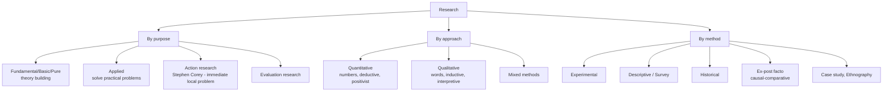
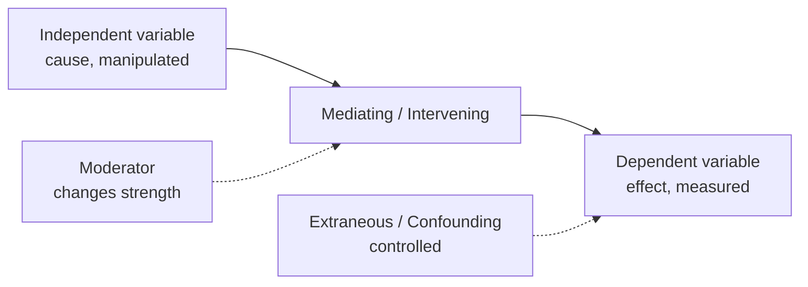
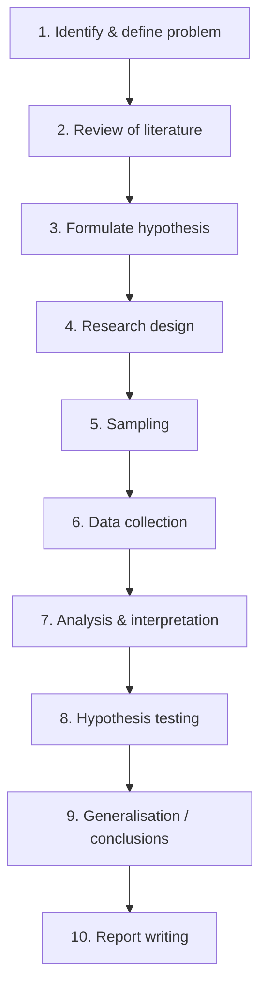
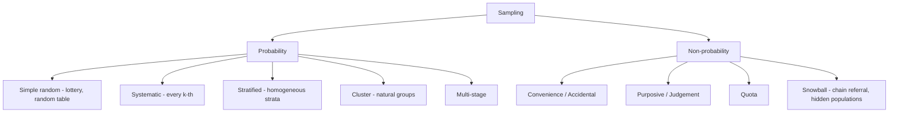
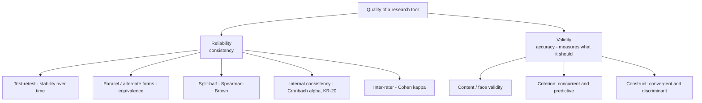

# Paper 1 · Unit 2 — Research Aptitude

**Expected questions: ~5 (10 marks) · Target: 5/5**

## Syllabus Checklist
- [ ] Research: meaning, types, characteristics; positivism & post-positivistic approach
- [ ] Methods: experimental, descriptive, historical, qualitative, quantitative
- [ ] Steps of research
- [ ] Thesis & article writing: format and styles of referencing
- [ ] Application of ICT in research
- [ ] Research ethics

---

## 1. Meaning & Characteristics

Research = **systematic, objective, controlled, empirical, critical** investigation to discover new facts or verify old ones.
(*Re + search* = search again.) Characteristics: systematic, logical, empirical, replicable, reductive, controlled, generalisable.

## 2. Types of Research



| Type | Key feature | Remember |
|------|-------------|----------|
| Fundamental | Adds to knowledge/theory | Not immediately applicable |
| Applied | Solves immediate practical problem | Product-oriented |
| **Action** | Done by practitioner (teacher) to improve own practice; cyclic | Coined by Kurt Lewin; in education by Stephen Corey |
| Experimental | Manipulation of IV + control | Most scientific, cause-effect |
| Ex-post facto | IV already occurred, no manipulation | "After the fact" |
| Historical | Past events; primary & secondary sources | External criticism (authenticity) & internal criticism (credibility) |
| Descriptive | "What is" — survey, correlational | No manipulation |
| Ethnography | Culture studied by immersion | Participant observation |
| Grounded theory | Theory emerges from data | Glaser & Strauss |
| Phenomenology | Lived experiences | Husserl |

### Positivism vs Post-positivism

| Positivism (Auguste Comte) | Post-positivism / Interpretivism |
|---------------------------|----------------------------------|
| Reality is objective, single | Reality is multiple, constructed |
| Quantitative, deductive | Qualitative (or critical realism) |
| Researcher detached | Researcher involved |
| Hypothesis testing, generalisation | Understanding meaning (*Verstehen* – Weber) |

Paradigm (Thomas Kuhn) = ontology (nature of reality) + epistemology (nature of knowledge) + methodology.

## 3. Variables & Hypothesis



- **Hypothesis** = tentative, testable statement about relationship between variables.
- **Null hypothesis (H₀)**: no relationship/difference. **Alternative (H₁)**: there is.
- **Type I error (α)**: rejecting a TRUE null. **Type II error (β)**: accepting a FALSE null. Power = 1 − β.
- Directional (one-tailed) vs non-directional (two-tailed).

## 4. Steps of Research



## 5. Sampling



**Tools of data collection**: questionnaire (closed/open), interview (structured, unstructured), observation
(participant, non-participant), schedule (filled by enumerator), rating scales (**Likert** – 5-point agree/disagree;
**Thurstone** – equal-appearing intervals; **Guttman** – cumulative; **Semantic differential** – Osgood; bipolar adjectives).

**Scales of measurement (Stevens)**: Nominal (labels) → Ordinal (rank) → Interval (no true zero, e.g. °C) → Ratio (true zero, e.g. weight).

**Parametric tests** (normal data): t-test, z-test, ANOVA (F), Pearson r.
**Non-parametric**: Chi-square, Mann-Whitney U, Wilcoxon, Kruskal-Wallis, Spearman rho, sign test.

## 6. Thesis & Article Writing

Thesis format: Preliminary pages (title, declaration, certificate, acknowledgement, contents, list of tables) →
Main body (Introduction, Review of Literature, Methodology, Results, Discussion, Conclusion) → References → Appendices.

**IMRAD** structure of research article: Introduction, Methods, Results, And Discussion.

| Style | Used in | Example in-text |
|-------|---------|-----------------|
| **APA** (American Psychological Assoc.) | Social sciences, education | (Sharma, 2020) — author-date |
| **MLA** (Modern Language Assoc.) | Humanities, literature | (Sharma 45) — author-page |
| **Chicago** | History; notes-bibliography or author-date | Footnotes |
| **Harvard** | General author-date | (Sharma 2020) |
| **IEEE** | Engineering, CS | [1] numbered |
| **Vancouver** | Medicine | numbered |

- *Ibid.* = same source as previous note; *Op. cit.* = work cited earlier (different page); *Loc. cit.* = same place cited earlier; *et al.* = and others.
- **Bibliography** = all sources consulted; **References** = only those cited.
- **Abstract**: ~150–300 words, written last, placed first. **Annotated bibliography** includes short summaries.

## 7. ICT in Research

| Need | Tool |
|------|------|
| Literature search | Google Scholar, Scopus, Web of Science, PubMed, Shodhganga, INFLIBNET N-LIST, e-ShodhSindhu |
| Reference management | Mendeley, Zotero, EndNote |
| Statistical analysis | SPSS, R, SAS, STATA, Excel |
| Qualitative analysis | NVivo, ATLAS.ti, MAXQDA |
| Plagiarism detection | **Shodhshuddhi (DrillBit/Ouriginal-URKUND)**, Turnitin, iThenticate |
| Writing | LaTeX, MS Word |
| Unique researcher ID | ORCID, Scopus Author ID, ResearcherID |
| Metrics | Impact Factor (Clarivate JCR), h-index (Hirsch), i10-index (Google Scholar), CiteScore (Scopus) |

**h-index**: a researcher has index h if h papers have ≥ h citations each.
**Impact factor (2024)** = citations in 2024 to items published in 2022–23 ÷ citable items published in 2022–23.

## 8. Research Ethics

- **Plagiarism**: UGC Regulations 2018 (Promotion of Academic Integrity and Prevention of Plagiarism):

| Level | Similarity | Penalty (for students) |
|-------|-----------|------------------------|
| Level 0 | up to 10% | Minor, no penalty |
| Level 1 | 10–40% | Resubmit within 6 months |
| Level 2 | 40–60% | Debarred from resubmission for 1 year |
| Level 3 | > 60% | Registration cancelled |

- Other ethics: informed consent, confidentiality, anonymity, no fabrication / falsification, honest authorship,
  avoid **predatory journals**; **UGC-CARE** list of quality journals (2019).
- **Salami slicing**: splitting one study into many papers. **Duplicate publication** is unethical.
- **COPE**: Committee on Publication Ethics.

## 9. Deeper Dive — Research Designs, Reliability, Validity & Statistics

### 9.1 Experimental Designs (Campbell & Stanley notation: R = random assignment, O = observation, X = treatment)

| Design | Notation | Notes |
|--------|----------|-------|
| One-shot case study (pre-experimental) | X O | No comparison; weakest |
| One-group pre-test post-test | O X O | No control group |
| Static group comparison | X O / — O | Non-random groups |
| **Pre-test post-test control group** (true) | R O X O / R O — O | Classic true experiment |
| **Post-test only control group** | R X O / R — O | Avoids testing effect |
| **Solomon four-group** | Combines both above (4 groups) | Controls pre-test sensitisation; strongest |
| Quasi-experimental: non-equivalent control group | O X O / O — O | Intact groups (e.g. two existing classes) |
| Time-series | O O O X O O O | Repeated observations |
| Factorial design | 2 × 2, 2 × 3 … | Two or more IVs and their interaction |

**Threats to internal validity**: history, maturation, testing, instrumentation, statistical regression, selection bias, experimental mortality (attrition).
**External validity** = generalisability; threats: reactive effects (Hawthorne effect), interaction of selection and treatment.

### 9.2 Reliability & Validity



- Reliability is necessary but **not sufficient** for validity. A valid test must be reliable.
- **Spearman–Brown**: full-test reliability r_full = 2r_half / (1 + r_half).
- Cronbach's α ≥ 0.7 is usually acceptable.

```
 Target analogy
  Reliable, not valid      Valid & reliable        Neither
   ┌─────────────┐         ┌─────────────┐        ┌─────────────┐
   │   ○         │         │      ○      │        │ x        x  │
   │ xxx         │         │     xxx     │        │      ○      │
   │ xx          │         │     xx      │        │  x     x    │
   └─────────────┘         └─────────────┘        └─────────────┘
   (tight cluster off-centre) (cluster on centre)  (scattered)
```

### 9.3 Statistics for Researchers

| Concept | Key point |
|---------|----------|
| Correlation r (Pearson) | −1 ≤ r ≤ +1; r = 0 → no linear relation; correlation ≠ causation |
| Spearman rank ρ | ρ = 1 − 6Σd² / (n(n² − 1)) for ordinal data |
| Coefficient of determination | r² = proportion of variance explained |
| Regression | Predicts Y from X: Y = a + bX |
| Level of significance | α = 0.05 or 0.01 (probability of Type I error) |
| Degrees of freedom | t-test (one sample) n − 1; chi-square (r − 1)(c − 1) |
| Normal curve | Mean = median = mode; 68.26% within ±1σ, 95.44% within ±2σ, 99.74% within ±3σ |
| Skewness | Positive: mean > median > mode; Negative: mean < median < mode |
| Kurtosis | Leptokurtic (peaked), Mesokurtic (normal), Platykurtic (flat) |

**Worked (Spearman ρ)**: n = 5, Σd² = 4 → ρ = 1 − (6 × 4)/(5 × 24) = 1 − 0.2 = **0.8**.

### 9.4 Research Proposal (Synopsis) Structure
Title → Introduction & background → Review of literature & research gap → Statement of the problem → Objectives → Hypotheses → Methodology (design, population, sample, tools, analysis) → Delimitations → Significance → Chapterisation → Time-frame → References.

- **Delimitations** = boundaries set by the researcher; **Limitations** = constraints beyond the researcher's control.
- **Operational definition** = defining a variable in terms of how it is measured.

---

## Previous Year Questions (PYQ pattern)

**Types of research**
1. A teacher conducts research to solve a problem of absenteeism in her class. It is: **Action research**
2. Research aimed at developing theory is: **Fundamental**
3. Study of the effect of an event that has already happened without manipulation: **Ex-post facto**
4. "Who coined action research?" — **Kurt Lewin** (in education popularised by Stephen Corey)
5. In historical research, testing authenticity of a source is: **External criticism**

**Positivism**

6. Positivism was proposed by: **Auguste Comte**
7. Which is associated with qualitative research? (a) generalisation (b) hypothesis testing (c) thick description (d) large samples — **Ans: (c)**

**Hypothesis & errors**

8. Rejecting a true null hypothesis is: **Type I error**
9. Hypothesis that states "no difference" is: **Null hypothesis**
10. The variable manipulated by the researcher: **Independent variable**

**Sampling**

11. Studying drug users via referral chains: **Snowball sampling**
12. Population divided into homogeneous subgroups then randomly sampled: **Stratified random**
13. Which is a non-probability method? (a) cluster (b) systematic (c) quota (d) stratified — **Ans: (c)**

**Scales & tools**

14. Temperature in °C is measured on which scale? **Interval**
15. A 5-point agree–disagree scale is: **Likert scale**
16. Chi-square test is: **Non-parametric**

**Writing & referencing**

17. "Ibid." is used when: **citing the same source as the immediately preceding citation**
18. APA style follows: **author–date system**
19. The abstract of a thesis is written: **at the end, placed at the beginning**
20. Correct sequence of research steps: **Problem → Literature → Hypothesis → Design → Data → Analysis → Report**

**ICT & Ethics**

21. UGC's plagiarism software made available to universities: **Shodhshuddhi (URKUND/Ouriginal, later DrillBit)**
22. As per UGC 2018 regulations, similarity up to 10% is: **Level 0 (no penalty)**
23. h-index was proposed by: **J.E. Hirsch (2005)**
24. Which identifier uniquely identifies a researcher? **ORCID**
25. Reference management software: **Mendeley / Zotero**

**More practice questions**

26. The design that controls the effect of pre-testing using four groups: **Solomon four-group design**
27. Using two intact classes without random assignment is a: **quasi-experimental design**
28. Improvement in performance because subjects know they are being observed: **Hawthorne effect**
29. Consistency of scores over time is measured by: **test-retest reliability**
30. Cronbach's alpha measures: **internal consistency**
31. Split-half reliability is corrected by: **Spearman–Brown formula**
32. A test predicting future job performance has: **predictive validity**
33. In a normal distribution, the percentage of cases within ±1σ: **68.26%**
34. When mean > median > mode, distribution is: **positively skewed**
35. Degrees of freedom for a 3 × 4 contingency table chi-square: **6**
36. Boundaries set by the researcher on the scope of study: **delimitations**
37. r = −0.9 indicates: **strong negative correlation**
38. Which is NOT a threat to internal validity? (a) history (b) maturation (c) generalisability (d) attrition — **Ans: (c)**
39. Defining "academic achievement" as "marks obtained in the annual exam" is an: **operational definition**

## Quick Revision Box
- Action research → practitioner, local, immediate · Ex-post facto → no manipulation
- Type I = reject true H₀ (α) · Type II = accept false H₀ (β)
- NOIR = Nominal, Ordinal, Interval, Ratio
- Plagiarism levels: 0 (≤10), 1 (10–40), 2 (40–60), 3 (>60)
