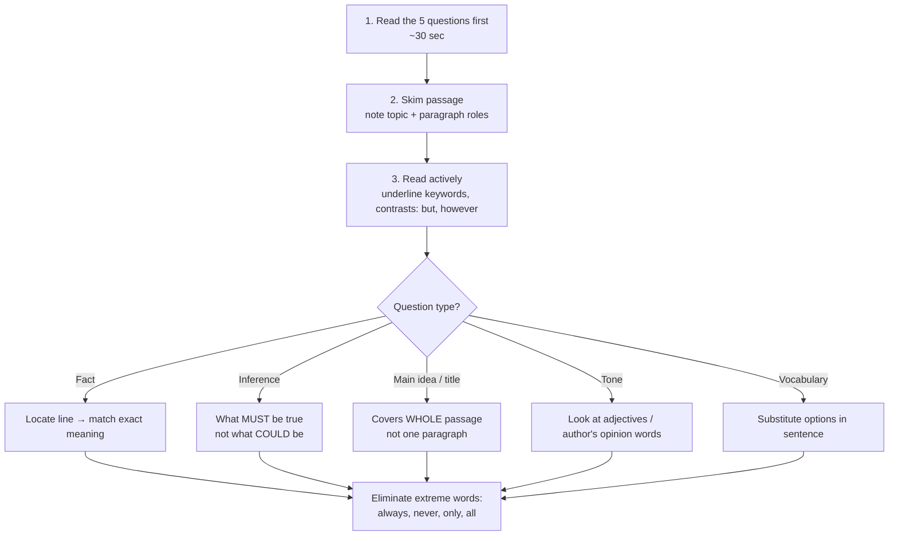

# Paper 1 · Unit 3 — Comprehension

**Expected questions: 5 (one passage) · Target: 5/5 — these are sure-shot marks**

## What Is Asked
A passage of ~400–600 words followed by **5 questions** on: central idea, title, author's tone, inference,
vocabulary in context, factual detail, and "which statement is true/false".

## Step-by-Step Strategy



## Question Types & How to Crack Them

| Type | Signal words | Trick |
|------|-------------|-------|
| Main idea | "central theme", "primarily concerned" | Answer must cover the whole passage; avoid too narrow/broad |
| Title | "suitable title" | Short, covers the main idea, often from first/last paragraph |
| Fact | "according to the passage" | Answer is *stated*; paraphrase of a line |
| Inference | "it can be inferred", "implies" | Must logically follow; no outside knowledge |
| Tone/attitude | "author's tone" | Critical, analytical, sarcastic, optimistic, pessimistic, neutral, didactic |
| Vocabulary | "the word X means" | Meaning in *this context* |
| Assumption | "the author assumes" | Unstated premise the argument depends on |
| Not true / except | "which is NOT" | Verify each option in passage |

## Tone Words Cheat Sheet

```
 Positive ◄──────────────────── Neutral ────────────────────► Negative
 laudatory, optimistic,        objective, analytical,       critical, cynical,
 appreciative, eulogistic      informative, descriptive     sarcastic, pessimistic,
 enthusiastic                  didactic (instructive)       derisive, satirical
```

## Common Traps
1. **Option true in real life but not in passage** → wrong.
2. **Partially correct** option (one half right) → wrong.
3. **Extreme/absolute words** (always, never, all) → usually wrong.
4. **Out-of-scope** generalisation → wrong.
5. Repeated exact words from the passage used in a twisted sense → check carefully.

## Solved Mini-Example

> *Passage (excerpt):* "Digital technology has democratised access to knowledge. Yet access alone does not
> produce learning; without guidance, learners drown in information. Teachers therefore are not replaced by
> technology but repositioned — from transmitters of facts to curators and mentors."

1. Main idea? → **Technology changes, rather than eliminates, the teacher's role.**
2. The author's tone? → **Analytical / balanced**.
3. "Curators" means here? → **Selectors and organisers of relevant content.**
4. Which can be inferred? → (a) technology is harmful (b) access ensures learning (c) guidance is necessary for learning from digital resources (d) teachers are obsolete → **(c)**
5. Which is NOT stated? → "Teachers will become obsolete" — contradicted.

## Previous Year Questions (PYQ pattern — typical stems seen every cycle)

1. "The central idea of the passage is…" — pick the option that covers all paragraphs.
2. "Which of the following is the most appropriate title?"
3. "According to the passage, which of the following statements is/are correct? (A)… (B)… (C)… Choose: A and B only / B and C only…" — verify each individually.
4. "The author's attitude towards X is…"
5. "What does the author mean by the phrase '…'?"
6. "Which of the following can be inferred from the passage?"
7. "Which one of the following is NOT supported by the passage?"

Past passages have covered: environment & sustainability, education policy, Indian philosophy/culture,
technology & society, economics of development, ethics, colonial history, art & literature.

## Practice Routine for 5/5
- Daily: 1 editorial (The Hindu / Indian Express) → write a 1-line main idea + tone.
- Weekly: 5 timed passages (8 minutes each).
- Maintain a vocabulary notebook of words met in context.
