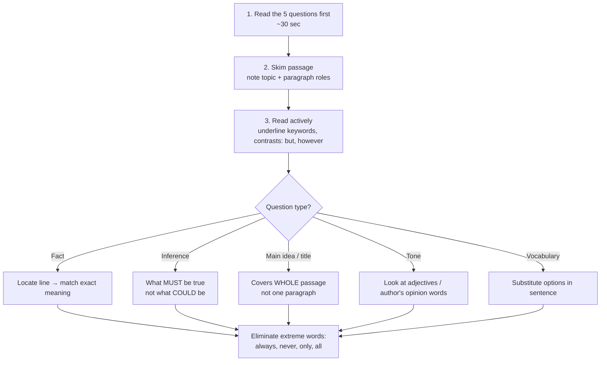

# Paper 1 · Unit 3 — Comprehension

**Expected questions: 5 (one passage) · Target: 5/5 — these are sure-shot marks**

## What Is Asked

Comprehension tests the oldest academic skill of all: reading closely and reasoning only from what the text
actually says. It needs no subject knowledge, which is exactly why careless answers are common — an option
can sound sensible and still be unsupported by the passage.
A passage of ~400–600 words followed by **5 questions** on: central idea, title, author's tone, inference,
vocabulary in context, factual detail, and "which statement is true/false".

## Step-by-Step Strategy

Reading the questions first tells you what to look for, so the first reading of the passage becomes
purposeful rather than passive. Treat each question type differently, as the figure shows: a factual
question is answered by locating a line, while an inference must follow necessarily from several lines.

<!-- latex: p1-03-strategy -->


## Question Types & How to Crack Them

| Type | Signal words | Trick |
|------|-------------|-------|
| Main idea | "central theme", "primarily concerned" | Answer must cover the whole passage; avoid too narrow/broad |
| Title | "suitable title" | Short, covers the main idea, often from first/last paragraph |
| Fact | "according to the passage" | Answer is *stated*; paraphrase of a line |
| Inference | "it can be inferred", "implies" | Must logically follow; no outside knowledge |
| Tone/attitude | "author's tone" | Critical, analytical, sarcastic, optimistic, pessimistic, neutral, didactic |
| Vocabulary | "the word X means" | Meaning in *this context* |
| Assumption | "the author assumes" | Unstated premise the argument depends on |
| Not true / except | "which is NOT" | Verify each option in passage |

## Tone Words Cheat Sheet

Tone is the author's attitude towards the subject. Decide first whether the author approves, stays
detached or disapproves; only then choose the precise word. Most passages in this examination are
analytical or balanced, so strongly emotional options are usually wrong.

<!-- latex: p1-03-tone -->
```
 Positive ◄──────────────────── Neutral ────────────────────► Negative
 laudatory, optimistic,        objective, analytical,       critical, cynical,
 appreciative, eulogistic      informative, descriptive     sarcastic, pessimistic,
 enthusiastic                  didactic (instructive)       derisive, satirical
```

## Common Traps
1. **Option true in real life but not in passage** → wrong.
2. **Partially correct** option (one half right) → wrong.
3. **Extreme/absolute words** (always, never, all) → usually wrong.
4. **Out-of-scope** generalisation → wrong.
5. Repeated exact words from the passage used in a twisted sense → check carefully.

## Solved Mini-Example

> *Passage (excerpt):* "Digital technology has democratised access to knowledge. Yet access alone does not
> produce learning; without guidance, learners drown in information. Teachers therefore are not replaced by
> technology but repositioned — from transmitters of facts to curators and mentors."

1. Main idea? → **Technology changes, rather than eliminates, the teacher's role.**
2. The author's tone? → **Analytical / balanced**.
3. "Curators" means here? → **Selectors and organisers of relevant content.**
4. Which can be inferred? → (a) technology is harmful (b) access ensures learning (c) guidance is necessary for learning from digital resources (d) teachers are obsolete → **(c)**
5. Which is NOT stated? → "Teachers will become obsolete" — contradicted.

## Deeper Dive — Two Full Practice Passages (solve in 8 minutes each)

### Passage 1

> India's traditional knowledge systems were never confined to scriptures alone. Farmers who read the
> sky to predict monsoon onset, healers who classified hundreds of plants by their effects, and
> artisans who worked metals without modern furnaces all practised forms of empirical inquiry. Yet
> because this knowledge travelled orally and through apprenticeship, it was rarely recorded in the
> formats that modern institutions recognise. Colonial administrators, trained to value written
> evidence, frequently dismissed it as superstition.
>
> The challenge today is not to romanticise this heritage but to examine it critically. Some practices
> survive rigorous testing; others do not. Treating every traditional claim as valid is as unscientific
> as rejecting all of them. What is needed is a dialogue in which communities are partners, not merely
> sources of data, and in which the benefits of any discovery return to those who preserved the knowledge.

1. The passage primarily argues that traditional knowledge should be:
   (a) accepted without question (b) rejected as superstition (c) critically examined in partnership with communities (d) recorded only in scriptures — **Ans: (c)**
2. According to the passage, traditional knowledge was dismissed during colonial times mainly because:
   **it was transmitted orally rather than in written form**
3. The author's tone is best described as: **balanced and analytical**
4. "Romanticise" in the passage means: **to present something as better or more ideal than it is**
5. Which statement is NOT supported by the passage?
   (a) Artisans practised empirical inquiry (b) All traditional practices survive testing (c) Communities should benefit from discoveries (d) Knowledge was passed through apprenticeship — **Ans: (b)**

### Passage 2

> Universities are often described as engines of economic growth, and policymakers increasingly
> measure them by patents, start-ups and graduate salaries. These indicators matter, but they capture
> only what is easily counted. A university also preserves languages, questions received wisdom and
> trains citizens to disagree without hostility. None of these appears in a ranking table.
>
> When funding follows only measurable outputs, departments that produce long-term, uncertain or
> critical knowledge are the first to shrink. The irony is that many technologies now celebrated as
> commercial successes grew out of research that once looked useless. A wiser policy would balance
> accountability with patience, judging institutions over decades rather than budget cycles.

1. The central idea: **Universities have valuable functions beyond measurable economic outputs, and policy should recognise them.**
2. The "irony" mentioned refers to: **commercially successful technologies originating from research once considered useless**
3. The author would most likely support: **long-term evaluation of universities**
4. Which is an assumption of the author? **Funding decisions influence which departments survive.**
5. Suitable title: **"Beyond the Ranking Table: What Universities Are For"**

### Inference vs Assumption vs Conclusion

| Term | Meaning | Test |
|------|---------|------|
| Inference | Logically follows from what is stated | "Must this be true if the passage is true?" |
| Assumption | Unstated premise the argument relies on | Negate it — does the argument collapse? |
| Conclusion | The main claim the author argues for | Usually signalled by "therefore", "thus", or the last line |

## Previous Year Questions (PYQ pattern — typical stems seen every cycle)

1. "The central idea of the passage is…" — pick the option that covers all paragraphs.
2. "Which of the following is the most appropriate title?"
3. "According to the passage, which of the following statements is/are correct? (A)… (B)… (C)… Choose: A and B only / B and C only…" — verify each individually.
4. "The author's attitude towards X is…"
5. "What does the author mean by the phrase '…'?"
6. "Which of the following can be inferred from the passage?"
7. "Which one of the following is NOT supported by the passage?"

Past passages have covered: environment & sustainability, education policy, Indian philosophy/culture,
technology & society, economics of development, ethics, colonial history, art & literature.

**More practice: common distractor patterns**

8. Option repeats a phrase from the passage but changes its meaning → **wrong (distortion)**
9. Option is true in general knowledge but not mentioned → **wrong (outside scope)**
10. Option covers only one paragraph when the question asks for the central idea → **too narrow**
11. Option makes a sweeping claim ("all", "never") → **usually extreme, wrong**

## Practice Routine for 5/5
- Daily: 1 editorial (The Hindu / Indian Express) → write a 1-line main idea + tone.
- Weekly: 5 timed passages (8 minutes each).
- Maintain a vocabulary notebook of words met in context.
