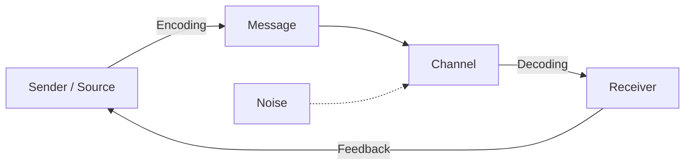
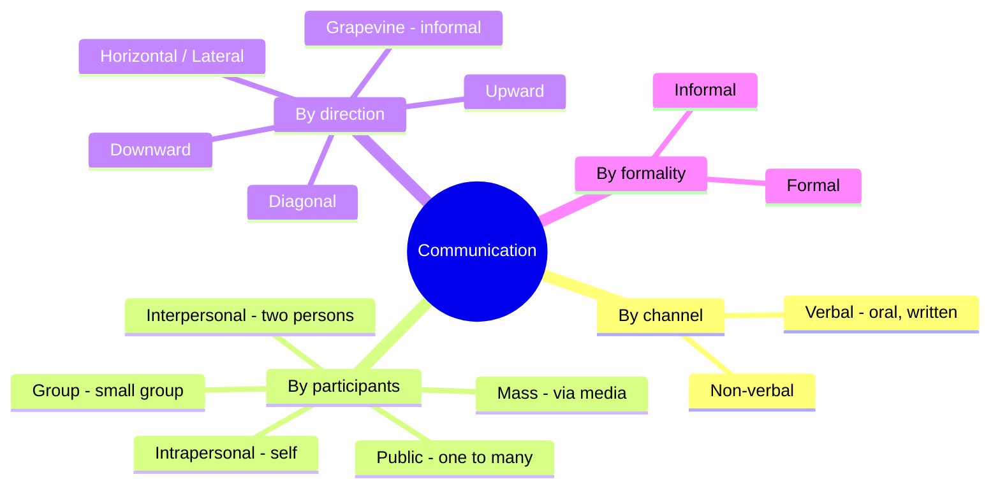
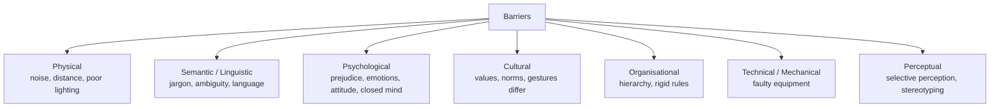
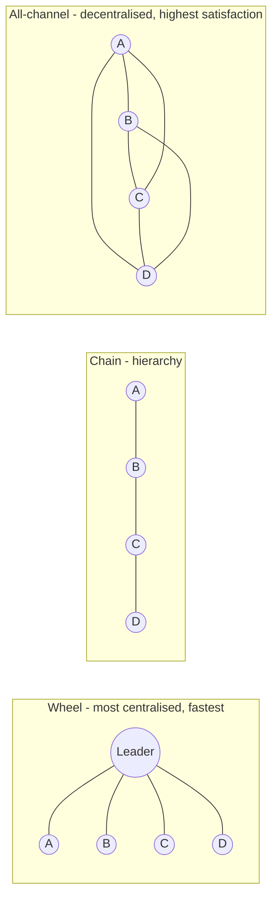

# Paper 1 · Unit 4 — Communication

**Expected questions: ~5 (10 marks) · Target: 5/5**

## Syllabus Checklist
- [ ] Communication: meaning, types and characteristics
- [ ] Effective communication: verbal & non-verbal, inter-cultural & group communication, classroom communication
- [ ] Barriers to effective communication
- [ ] Mass-media and society

---

## 1. Meaning

At its simplest, communication succeeds when the receiver understands what the sender meant. Every model
in this unit is an attempt to explain how that shared meaning is achieved — and why it so often is not.
Latin *communis / communicare* = "to make common / to share". Communication is the process of transmitting
information, ideas and feelings to create **shared understanding**.

## 2. Models of Communication

Models simplify a complex process so that its parts can be studied. Early *linear* models (Aristotle,
Lasswell, Shannon–Weaver) treat communication as a one-way transmission. *Interactive* models add feedback,
and *transactional* models see both parties sending and receiving at once. The single most examined idea is
**noise**, introduced by Shannon and Weaver: anything that distorts the message on its way.

<!-- latex: p1-04-model -->


| Model | Type | Key point |
|-------|------|-----------|
| **Aristotle** | Linear, oldest | Speaker → Speech → Audience (persuasion: ethos, pathos, logos) |
| **Lasswell (1948)** | Linear | *Who says What in which Channel to Whom with what Effect* |
| **Shannon–Weaver (1949)** | Linear, "mother of all models" | Introduced **noise**; information source, transmitter, channel, receiver, destination |
| **Berlo SMCR (1960)** | Linear | Source, Message, Channel, Receiver |
| **Osgood–Schramm** | Circular | Both are encoder-interpreter-decoder |
| **Schramm (1954)** | Interactive | **Field of experience** must overlap |
| **Westley–MacLean** | Mass comm | Gatekeeper role |
| **Dance (helical)** | Transactional | Communication grows like a helix |
| **Barnlund** | Transactional | Simultaneous sending & receiving |

<!-- latex: p1-04-schramm -->
```
 Schramm's model — meaning is shared only where fields of experience overlap

      ┌────────────────────┐              ┌────────────────────┐
      │ SENDER             │   message    │ RECEIVER           │
      │ field of experience├─────────────►│ field of experience│
      │ (encoder)          │◄─────────────┤ (decoder)          │
      └────────────────────┘   feedback   └────────────────────┘
                  ╲                              ╱
                   ╲──── common experience ─────╱
                        = shared meaning
```

## 3. Types of Communication

Communication can be classified by the channel used, the number of people involved, the direction of flow
in an organisation, and its degree of formality. A single act — a principal's circular to teachers, for
example — is written, downward, formal and group communication all at once.

<!-- latex: p1-04-types -->


### Non-verbal communication (frequently asked)

Much of what we communicate is carried not by words but by the body, the voice, space and time. The
technical names (kinesics, proxemics, haptics, chronemics) are frequently asked; Edward T. Hall's zones of
personal space are illustrated below.

<!-- latex: p1-04-proxemics -->


| Kind | Meaning |
|------|---------|
| **Kinesics** | Body movements, gestures, facial expressions, posture |
| **Proxemics** | Use of space / distance (Edward T. Hall) |
| **Haptics** | Touch |
| **Chronemics** | Use of time |
| **Paralanguage / Vocalics** | Tone, pitch, volume, pauses — *how* it is said |
| **Oculesics** | Eye contact |
| **Artifactics** | Clothing, appearance, objects |
| **Olfactics** | Smell |

Hall's proxemic zones: Intimate (0–1.5 ft), Personal (1.5–4 ft), Social (4–12 ft), Public (12 ft+).

**Mehrabian's 7-38-55 rule** (for feelings/attitudes): 7% words, 38% tone of voice, 55% body language.

### Classroom Communication
- Mostly **interpersonal + group**; should be two-way, with feedback.
- **Flanders' Interaction Analysis Category System (FIACS)** — 10 categories (7 teacher talk, 2 student talk, 1 silence/confusion); teacher talk = indirect (1–4) + direct (5–7).
- Effective classroom communication: clarity, eye contact, questioning, active listening, empathy, using examples.

## 4. Barriers to Communication

A barrier is anything that prevents the intended meaning from reaching the receiver. Questions usually
describe a situation — jargon in a lecture, a noisy hall, a student's prejudice — and ask you to name the
barrier, so learn the categories with an example of each.

<!-- latex: p1-04-barriers -->


7 Cs of effective communication: **Clear, Concise, Concrete, Correct, Coherent, Complete, Courteous**.

## 5. Inter-cultural & Group Communication

When sender and receiver come from different cultures, their fields of experience overlap less, and
misunderstanding becomes more likely. Groups add their own dynamics: they pass through recognisable stages
before they work well together.
- **Hofstede's cultural dimensions**: power distance, individualism–collectivism, masculinity–femininity, uncertainty avoidance, long-term orientation, indulgence.
- **High-context** cultures (India, Japan) rely on implicit cues; **low-context** (USA, Germany) are explicit (E.T. Hall).
- Ethnocentrism = judging other cultures by one's own — barrier.
- Tuckman's group stages: **Forming → Storming → Norming → Performing → Adjourning**.

<!-- latex: p1-04-tuckman -->


## 6. Mass Media & Society

Theories of mass communication have swung between two views of the audience: as passive targets of
powerful media (the "magic bullet") and as active users who select, interpret and resist. The two-step flow
model introduced the influential middle layer of *opinion leaders*.

<!-- latex: p1-04-twostep -->


| Theory | Idea |
|--------|------|
| **Hypodermic needle / Magic bullet** | Media has direct, powerful effect on passive audience |
| **Two-step flow** (Lazarsfeld & Katz) | Media → opinion leaders → public |
| **Agenda-setting** (McCombs & Shaw) | Media tells us *what to think about* |
| **Uses & Gratifications** (Katz, Blumler) | Active audience uses media to satisfy needs |
| **Cultivation** (George Gerbner) | Long TV exposure shapes perception of reality ("mean world") |
| **Spiral of silence** (Noelle-Neumann) | Minority opinion holders stay silent |
| **Medium is the message** (Marshall McLuhan) | "Global village"; hot vs cool media |
| **Gatekeeping** (Kurt Lewin, David Manning White) | Editors filter news |

**Functions of mass media (Lasswell + Wright)**: surveillance, correlation, transmission of culture, entertainment.
Indian landmarks: First newspaper — *Hicky's Bengal Gazette* (1780, James Augustus Hicky); Doordarshan (1959);
All India Radio (1936, named; Akashvani 1957); Press Council of India (1966); Prasar Bharati (1997).

## 7. Deeper Dive — Listening, Feedback, Networks & Classroom Talk

### 7.1 Listening

Listening is the neglected half of communication. A message is complete only when it has been heard,
understood and responded to, which is why the stages of listening end with *responding*.

Hearing is physiological; **listening** is psychological (attending, understanding, remembering, responding).

| Type of listening | Purpose |
|-------------------|---------|
| Active / empathetic | Understand the speaker's feelings; paraphrase, nod, ask clarifying questions |
| Critical / evaluative | Judge the message, logic and evidence |
| Informational / comprehensive | Learn and retain content (lectures) |
| Appreciative | Enjoyment (music, poetry) |
| Selective | Hearing only what one wants — a barrier |

Stages (HURIER model, Brownell): **Hearing → Understanding → Remembering → Interpreting → Evaluating → Responding**.

### 7.2 Feedback

Feedback turns a monologue into a dialogue. For the sender it confirms whether the message was understood;
for the receiver it is information about how others see them — the idea captured by the Johari window.
- **Positive** (reinforces), **negative / corrective** (points out errors), **descriptive** (specific, non-judgemental), **evaluative** (judgement).
- Good feedback is specific, timely, focused on behaviour (not the person), and actionable.
- **Johari window** (Joseph Luft & Harrington Ingham): self-awareness in communication.

<!-- latex: p1-04-johari -->
```
                 Known to self        Not known to self
              ┌───────────────────┬────────────────────┐
 Known to     │  OPEN (arena)     │  BLIND spot        │
 others       │                   │                    │
              ├───────────────────┼────────────────────┤
 Not known to │  HIDDEN (facade)  │  UNKNOWN           │
 others       │                   │                    │
              └───────────────────┴────────────────────┘
 Feedback from others shrinks the blind area; self-disclosure shrinks the hidden area.
```

### 7.3 Communication Networks (small groups)

Small-group experiments (Bavelas, Leavitt) showed that the *pattern* of who may talk to whom affects speed,
accuracy, leadership and morale. Centralised networks are efficient for simple tasks; decentralised ones
suit complex problems and keep members more satisfied.

<!-- latex: p1-04-networks -->


| Network | Speed (simple tasks) | Accuracy | Member satisfaction | Leader emergence |
|---------|----------------------|----------|---------------------|------------------|
| Wheel | High | High | Low (except centre) | High |
| Chain | Moderate | High | Low | Moderate |
| Circle | Slow | Low | High | None |
| All-channel | Fast for complex tasks | Moderate | **Highest** | None |

### 7.4 Effective Classroom Communication
- Use **simple language**, examples from learners' lives, and checks for understanding.
- Combine verbal with **non-verbal** cues (eye contact, gestures, movement).
- **Two-way**: questions, discussions, feedback.
- **Barriers** in class: noise, overcrowding, teacher's monotone, unclear objectives, learner's anxiety.
- **Teacher immediacy**: behaviours that reduce psychological distance (smiling, using names) → better learning.

### 7.5 Communication Ethics & Digital Communication
- Accuracy, honesty, respect for privacy, avoidance of plagiarism and misinformation.
- **Fake news / misinformation** (false but shared without intent to deceive) vs **disinformation** (deliberately false).
- **Netiquette**: rules of good online behaviour; ALL CAPS = shouting.
- **Digital divide**: unequal access to ICT.

---

## Previous Year Questions (PYQ pattern)

1. "Who says what in which channel to whom with what effect" was given by: **Harold Lasswell**
2. Which model first introduced the concept of "noise"? **Shannon–Weaver**
3. The study of body movements as communication: **Kinesics**
4. Use of space in communication: **Proxemics**
5. The study of touch: **Haptics**
6. Tone and pitch of voice belong to: **Paralanguage**
7. Communication from subordinates to superiors: **Upward**
8. Informal communication network in an organisation: **Grapevine**
9. Jargon and ambiguous words cause which barrier? **Semantic**
10. Prejudice is a: **Psychological barrier**
11. "The medium is the message" — **Marshall McLuhan**
12. Media determines "what to think about" — **Agenda-setting theory**
13. Theory that the audience actively selects media to satisfy needs: **Uses and Gratifications**
14. Heavy TV viewers perceive the world as more dangerous — **Cultivation theory (Gerbner)**
15. "Global village" — **McLuhan**
16. Feedback in communication helps to: **verify that the message was understood as intended**
17. Classroom communication is basically: **Interactive / two-way, interpersonal + group**
18. FIACS was developed by: **Ned Flanders** (10 categories)
19. Arrange Tuckman's stages: **Forming, Storming, Norming, Performing, Adjourning**
20. The first newspaper in India: **Hicky's Bengal Gazette (1780)**
21. Communication with oneself: **Intrapersonal**
22. Statement: "Effective communication requires the sender and receiver to share a common field of experience." — **True (Schramm)**

**More practice questions**

23. The first stage of the listening process: **Hearing (receiving)**
24. In the Johari window, information known to others but not to self is the: **blind area**
25. Self-disclosure reduces the: **hidden area**
26. The most centralised small-group network: **wheel**
27. Network with highest member satisfaction: **all-channel**
28. Feedback should be: **specific, timely and descriptive**
29. Deliberately false information spread to deceive: **disinformation**
30. Typing in ALL CAPS in online communication is considered: **shouting (poor netiquette)**
31. Teacher behaviours that reduce psychological distance: **immediacy behaviours**
32. Which is NOT a characteristic of effective classroom communication? (a) two-way (b) jargon-heavy (c) clear (d) learner-centred — **Ans: (b)**

## Quick Revision Box
- Lasswell = 5 Ws · Shannon-Weaver = noise · Schramm = field of experience · Berlo = SMCR
- Kinesics–body, Proxemics–space, Haptics–touch, Chronemics–time
- Agenda setting (what to think about) vs Cultivation (TV shapes reality) vs Two-step (opinion leaders)
