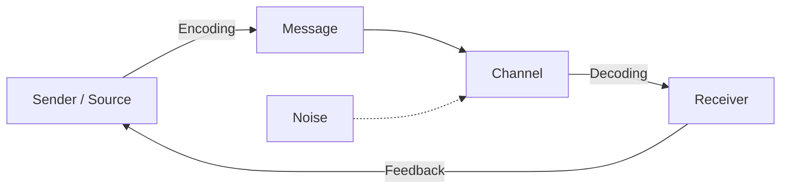
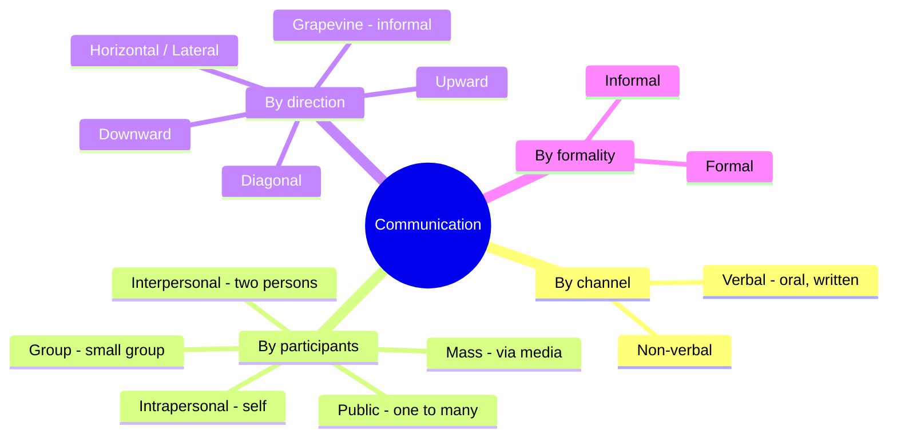
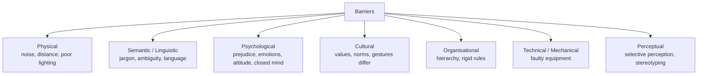

# Paper 1 · Unit 4 — Communication

**Expected questions: ~5 (10 marks) · Target: 5/5**

## Syllabus Checklist
- [ ] Communication: meaning, types and characteristics
- [ ] Effective communication: verbal & non-verbal, inter-cultural & group communication, classroom communication
- [ ] Barriers to effective communication
- [ ] Mass-media and society

---

## 1. Meaning
Latin *communis / communicare* = "to make common / to share". Communication is the process of transmitting
information, ideas and feelings to create **shared understanding**.

## 2. Models of Communication



| Model | Type | Key point |
|-------|------|-----------|
| **Aristotle** | Linear, oldest | Speaker → Speech → Audience (persuasion: ethos, pathos, logos) |
| **Lasswell (1948)** | Linear | *Who says What in which Channel to Whom with what Effect* |
| **Shannon–Weaver (1949)** | Linear, "mother of all models" | Introduced **noise**; information source, transmitter, channel, receiver, destination |
| **Berlo SMCR (1960)** | Linear | Source, Message, Channel, Receiver |
| **Osgood–Schramm** | Circular | Both are encoder-interpreter-decoder |
| **Schramm (1954)** | Interactive | **Field of experience** must overlap |
| **Westley–MacLean** | Mass comm | Gatekeeper role |
| **Dance (helical)** | Transactional | Communication grows like a helix |
| **Barnlund** | Transactional | Simultaneous sending & receiving |

```
Schramm's model — overlap of experience = shared meaning
   ┌──────────────┐
   │ Sender's     │   ╳ overlap ╳   ┌──────────────┐
   │ field of     │◄══════════════►│ Receiver's   │
   │ experience   │                 │ field of exp │
   └──────────────┘                 └──────────────┘
```

## 3. Types of Communication



### Non-verbal communication (frequently asked)

| Kind | Meaning |
|------|---------|
| **Kinesics** | Body movements, gestures, facial expressions, posture |
| **Proxemics** | Use of space / distance (Edward T. Hall) |
| **Haptics** | Touch |
| **Chronemics** | Use of time |
| **Paralanguage / Vocalics** | Tone, pitch, volume, pauses — *how* it is said |
| **Oculesics** | Eye contact |
| **Artifactics** | Clothing, appearance, objects |
| **Olfactics** | Smell |

Hall's proxemic zones: Intimate (0–1.5 ft), Personal (1.5–4 ft), Social (4–12 ft), Public (12 ft+).

**Mehrabian's 7-38-55 rule** (for feelings/attitudes): 7% words, 38% tone of voice, 55% body language.

### Classroom Communication
- Mostly **interpersonal + group**; should be two-way, with feedback.
- **Flanders' Interaction Analysis Category System (FIACS)** — 10 categories (7 teacher talk, 2 student talk, 1 silence/confusion); teacher talk = indirect (1–4) + direct (5–7).
- Effective classroom communication: clarity, eye contact, questioning, active listening, empathy, using examples.

## 4. Barriers to Communication



7 Cs of effective communication: **Clear, Concise, Concrete, Correct, Coherent, Complete, Courteous**.

## 5. Inter-cultural & Group Communication
- **Hofstede's cultural dimensions**: power distance, individualism–collectivism, masculinity–femininity, uncertainty avoidance, long-term orientation, indulgence.
- **High-context** cultures (India, Japan) rely on implicit cues; **low-context** (USA, Germany) are explicit (E.T. Hall).
- Ethnocentrism = judging other cultures by one's own — barrier.
- Tuckman's group stages: **Forming → Storming → Norming → Performing → Adjourning**.

## 6. Mass Media & Society

| Theory | Idea |
|--------|------|
| **Hypodermic needle / Magic bullet** | Media has direct, powerful effect on passive audience |
| **Two-step flow** (Lazarsfeld & Katz) | Media → opinion leaders → public |
| **Agenda-setting** (McCombs & Shaw) | Media tells us *what to think about* |
| **Uses & Gratifications** (Katz, Blumler) | Active audience uses media to satisfy needs |
| **Cultivation** (George Gerbner) | Long TV exposure shapes perception of reality ("mean world") |
| **Spiral of silence** (Noelle-Neumann) | Minority opinion holders stay silent |
| **Medium is the message** (Marshall McLuhan) | "Global village"; hot vs cool media |
| **Gatekeeping** (Kurt Lewin, David Manning White) | Editors filter news |

**Functions of mass media (Lasswell + Wright)**: surveillance, correlation, transmission of culture, entertainment.
Indian landmarks: First newspaper — *Hicky's Bengal Gazette* (1780, James Augustus Hicky); Doordarshan (1959);
All India Radio (1936, named; Akashvani 1957); Press Council of India (1966); Prasar Bharati (1997).

---

## Previous Year Questions (PYQ pattern)

1. "Who says what in which channel to whom with what effect" was given by: **Harold Lasswell**
2. Which model first introduced the concept of "noise"? **Shannon–Weaver**
3. The study of body movements as communication: **Kinesics**
4. Use of space in communication: **Proxemics**
5. The study of touch: **Haptics**
6. Tone and pitch of voice belong to: **Paralanguage**
7. Communication from subordinates to superiors: **Upward**
8. Informal communication network in an organisation: **Grapevine**
9. Jargon and ambiguous words cause which barrier? **Semantic**
10. Prejudice is a: **Psychological barrier**
11. "The medium is the message" — **Marshall McLuhan**
12. Media determines "what to think about" — **Agenda-setting theory**
13. Theory that the audience actively selects media to satisfy needs: **Uses and Gratifications**
14. Heavy TV viewers perceive the world as more dangerous — **Cultivation theory (Gerbner)**
15. "Global village" — **McLuhan**
16. Feedback in communication helps to: **verify that the message was understood as intended**
17. Classroom communication is basically: **Interactive / two-way, interpersonal + group**
18. FIACS was developed by: **Ned Flanders** (10 categories)
19. Arrange Tuckman's stages: **Forming, Storming, Norming, Performing, Adjourning**
20. The first newspaper in India: **Hicky's Bengal Gazette (1780)**
21. Communication with oneself: **Intrapersonal**
22. Statement: "Effective communication requires the sender and receiver to share a common field of experience." — **True (Schramm)**

## Quick Revision Box
- Lasswell = 5 Ws · Shannon-Weaver = noise · Schramm = field of experience · Berlo = SMCR
- Kinesics–body, Proxemics–space, Haptics–touch, Chronemics–time
- Agenda setting (what to think about) vs Cultivation (TV shapes reality) vs Two-step (opinion leaders)
