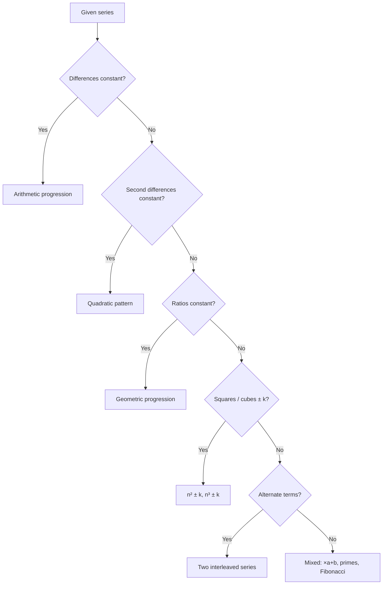
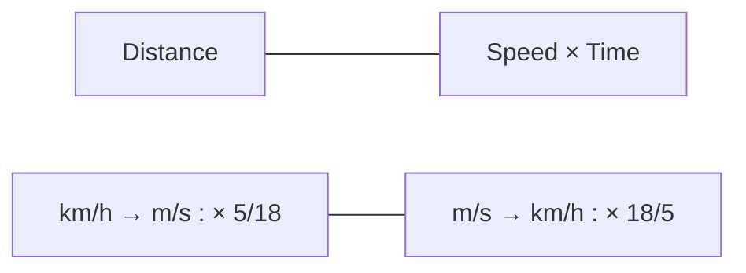

# Paper 1 · Unit 5 — Mathematical Reasoning & Aptitude

**Expected questions: ~5 (10 marks) · Target: 5/5 (pure practice unit)**

## Syllabus Checklist
- [ ] Types of reasoning
- [ ] Number series, letter series, codes
- [ ] Relationships (blood relations)
- [ ] Classification
- [ ] Mathematical aptitude: fraction, time & distance, ratio, proportion, percentage, profit & loss,
      interest & discounting, averages

---

## 1. Number Series — Pattern Checklist

A number series hides a rule that generates each term from the ones before it. The quickest way to find it is
to test the simplest rules first — constant differences, then constant ratios — and only then look for
squares, alternating patterns or mixed operations. Writing the differences beneath the series takes a few
seconds and solves most questions.

<!-- latex: p1-05-series -->


Examples:
- 2, 6, 12, 20, 30, **42** → n(n+1)
- 3, 7, 15, 31, 63, **127** → ×2 + 1
- 1, 8, 27, 64, **125** → n³
- 2, 3, 5, 7, 11, **13** → primes
- 1, 1, 2, 3, 5, 8, **13** → Fibonacci
- 4, 9, 25, 49, 121, **169** → squares of primes
- 1, 2, 6, 24, 120, **720** → ×2, ×3, ×4 … (factorials)

## 2. Letter Series & Coding

Letter questions become number questions once each letter is replaced by its position in the alphabet.
Memorise the positions and their reverses so that no time is lost counting; the reference table below is
worth learning by heart.

Position table (memorise both directions):
<!-- latex: p1-05-alphabet -->
```
A B C D E F G H I J K  L  M  N  O  P  Q  R  S  T  U  V  W  X  Y  Z
1 2 3 4 5 6 7 8 9 10 11 12 13 14 15 16 17 18 19 20 21 22 23 24 25 26
Z Y X W V U T S R Q P  O  N  M  L  K  J  I  H  G  F  E  D  C  B  A   (reverse)
```
Trick: **EJOTY** = 5, 10, 15, 20, 25. Opposite pairs sum to 27 (A↔Z, M↔N).

- Coding: If CAT → DBU (+1 each), then DOG → **EPH**.
- If CAT = 24 (3+1+20), then DOG = 4+15+7 = **26**.
- Reverse coding: CAT → XZG (opposite letters).

## 3. Blood Relations

Relationship puzzles are confusing in words and trivial on paper. Draw a small family tree as you read each
clause, marking gender and generation, and the answer can simply be read off.

Use a **family tree diagram** with symbols:
<!-- latex: p1-05-family -->
```
  +  male    −  female    ═  married    │ parent-child    ─ siblings

  Example: "A is the brother of B. B is the daughter of C. C is the husband of D."
              C(+) ═ D(−)
                  │
           ┌──────┴──────┐
         A(+)          B(−)
   → D is A's MOTHER.
```
Coded relations: "P + Q means P is father of Q; P × Q means P is sister of Q" → draw step-by-step.

## 4. Classification (Odd one out)

Look for the property shared by all options but one: being prime, a perfect square, a multiple of a number,
a vowel, a member of a category. When two different properties seem to work, prefer the more specific one.
Find the common property in 3 of 4: primes, squares, multiples, vowels, same-category items.
Example: 121, 144, 169, **190** → 190 is not a perfect square.

## 5. Arithmetic Aptitude — Formula Bank

Arithmetic questions in Paper I are not difficult, but they reward speed. Each formula below replaces several
lines of working; understand where it comes from once, then use it directly in the examination.

### Percentage

Percentages express every quantity as a fraction of 100, which makes comparison easy. Successive changes do
*not* simply add: a 20% rise followed by a 20% fall leaves you 4% poorer, because the fall is taken on a
larger base.
<!-- latex: p1-05-percent -->
```
x% of y = y% of x
Increase by a% then b% ⇒ net = a + b + ab/100
If price ↑ r%, consumption must ↓ by r/(100+r) × 100 % to keep expenditure same
Successive discount d1, d2 ⇒ d1 + d2 − d1·d2/100
```

### Profit & Loss

Profit and loss percentages are always calculated on the **cost price** unless the question says otherwise;
discounts are always calculated on the **marked price**.
<!-- latex: p1-05-profit -->
```
Profit% = (SP − CP)/CP × 100
SP = CP × (100 + P%)/100
Marked price M, discount d% ⇒ SP = M(100 − d)/100
Two items sold at same SP, one at x% gain, other at x% loss ⇒ always LOSS of x²/100 %
Dishonest dealer (uses 900g for 1kg) ⇒ gain = 100/900 × 100 = 11.11%
```

### Simple & Compound Interest

Simple interest is earned only on the original principal; compound interest is also earned on interest
already added. The difference between them grows with time, and the two-year difference formula is the most
frequently used shortcut.
<!-- latex: p1-05-interest -->
```
SI = P·R·T/100
CI: A = P(1 + R/100)^T ;  CI = A − P
CI − SI for 2 yrs = P(R/100)²
CI − SI for 3 yrs = P(R/100)²(3 + R/100)
Money doubles in T years at SI ⇒ R = 100/T
```

### Ratio, Proportion, Averages

A ratio compares two quantities; a proportion states that two ratios are equal. Averages smooth a set of
values into one representative number — but note that the average *speed* over equal distances is a
harmonic mean, not the simple average of the speeds.
<!-- latex: p1-05-ratio -->
```
a : b = c : d  ⇒ ad = bc
Mean proportional of a, b = √(ab);  Third proportional to a, b = b²/a
Average = Sum / Count
If one value replaced changes average by d over n items ⇒ change in value = n·d
Average speed (equal distances) = 2xy/(x + y)
```

### Time, Speed, Distance

Nearly every motion problem — trains, boats, races — reduces to the single relation distance = speed ×
time, applied carefully with consistent units and, where two bodies move, with their *relative* speed.
<!-- latex: p1-05-tsd -->

- Relative speed: same direction **(a − b)**, opposite direction **(a + b)**.
- Train crossing pole: time = L / S; crossing platform: (L + P) / S.
- Boats: downstream = u + v, upstream = u − v; still water speed = (D + U)/2, stream = (D − U)/2.

### Time & Work

Think of work as a rate: if A finishes a job in *a* days, A does 1/*a* of it each day. Rates of people (or
pipes) working together simply add.
<!-- latex: p1-05-work -->
```
A does work in a days, B in b days ⇒ together = ab/(a + b) days
Pipes: inlet +, outlet − (rates add)
M1·D1·H1 / W1 = M2·D2·H2 / W2
```

## Worked Examples

1. A price rises 20% then falls 20%. Net? → 20 − 20 − 400/100 = **−4%** (loss).
2. ₹5000 at 10% CI for 2 yrs: CI − SI = 5000 × (0.1)² = **₹50**.
3. A car goes at 40 km/h and returns at 60 km/h. Average speed = 2×40×60/100 = **48 km/h**.
4. A can finish in 10 days, B in 15. Together = 150/25 = **6 days**.
5. Two articles each sold at ₹990, one at 10% profit, another at 10% loss. → **1% loss**.

## 6. Deeper Dive — More Question Types with Shortcuts

### 6.1 Types of Reasoning
- **Deductive**: general → specific; conclusion certain. **Inductive**: specific → general; conclusion probable.
- **Abductive**: inference to the best explanation (a doctor diagnosing from symptoms).
- **Analogical**: reasoning from similarity of two cases.

### 6.2 Mixtures & Alligation

Alligation is a quick way of finding the ratio in which two ingredients at different prices (or
concentrations) must be mixed to give a mixture of a desired mean value.

<!-- latex: p1-05-alligation -->
```
   Cheaper (c)            Dearer (d)
         ╲                ╱
          ╲    Mean (m)  ╱
          ╱            ╲
         ╱              ╲
   (d − m)              (m − c)
   Ratio  cheaper : dearer = (d − m) : (m − c)
```
**Example**: Rice at ₹40/kg and ₹60/kg mixed to get ₹52/kg → ratio = (60 − 52) : (52 − 40) = 8 : 12 = **2 : 3**.

Repeated dilution: from a vessel of x litres, y litres replaced by water n times → remaining pure = x(1 − y/x)ⁿ.

### 6.3 Ages
Translate words into equations. "A is twice as old as B; 10 years ago A was three times as old as B":
A = 2B, A − 10 = 3(B − 10) → 2B − 10 = 3B − 30 → **B = 20, A = 40**.

### 6.4 Partnership
Profit shared in ratio of **capital × time**. A invests ₹5000 for 12 months, B ₹6000 for 8 months → 60000 : 48000 = **5 : 4**.

### 6.5 Discounting (banker's & true discount)
<!-- latex: p1-05-discount -->
```
True discount TD = (Amount × R × T) / (100 + R·T)
Banker's discount BD = SI on the amount = A·R·T/100
BD − TD = SI on TD (Banker's gain) ; Present worth PW = A − TD
```
**Example**: A = ₹1100 due in 1 year at 10%: TD = 1100 × 10/110 = ₹100; PW = ₹1000; BD = ₹110; BG = ₹10.

### 6.6 Coding–Decoding Variants

| Type | Example |
|------|---------|
| Letter shift | COMPUTER → DPNQVUFS (+1) |
| Reverse alphabet | GOOD → TLLW (A↔Z) |
| Position sum | BAD = 2 + 1 + 4 = 7 |
| Word reversal | READ → DAER |
| Symbol substitution | If + means ×, − means ÷: 8 + 2 − 4 = 8 × 2 ÷ 4 = **4** |

### 6.7 Fractions & Comparison
- To compare fractions quickly, cross-multiply: 5/7 vs 7/10 → 50 vs 49 → **5/7 is larger**.
- Recurring decimals: 0.333… = 1/3; 0.2727… = 27/99 = 3/11.

### 6.8 Worked Mixed Set
1. Successive discounts 20% and 10% = 20 + 10 − 2 = **28%**.
2. A sum becomes ₹1331 in 3 years at 10% CI → principal = 1331/1.331 = **₹1000**.
3. 15 men finish work in 20 days; how many days for 25 men? 15 × 20 / 25 = **12 days**.
4. Boat: 16 km downstream in 2 h, 8 km upstream in 2 h → speeds 8 and 4 → still water **6 km/h**, stream **2 km/h**.
5. Average of first 50 natural numbers = (50 + 1)/2 = **25.5**.

---

## Previous Year Questions (PYQ pattern)

1. Next term: 2, 5, 10, 17, 26, ? → **37** (n² + 1)
2. Next term: 1, 4, 9, 16, 25, ? → **36**
3. Missing: 3, 12, 48, ?, 768 → **192** (×4)
4. Next: 6, 11, 21, 36, 56, ? → **81** (diffs 5,10,15,20,25)
5. Letter series: AZ, BY, CX, ? → **DW**
6. If TEACHER is coded as VGCEJGT (+2), then STUDENT → **UVWFGPV**
7. If PEN = 35 (16+5+14), INK = ? → 9+14+11 = **34**
8. Pointing to a photograph, a man says, "Her mother is the only daughter of my mother." The man is the girl's: **Maternal uncle**
9. A is B's sister, C is B's mother, D is C's father, E is D's mother. A is E's: **Great-granddaughter**
10. Odd one out: 27, 64, 125, 144 → **144** (not a cube)
11. A shopkeeper marks 25% above CP and allows 10% discount. Gain% = 1.25 × 0.9 = 1.125 → **12.5%**
12. A sum doubles in 8 years at SI. Rate = **12.5%**
13. A train 150 m long passes a pole in 15 s. Speed = 10 m/s = **36 km/h**
14. Average of 5 numbers is 20; one number removed, average becomes 18. Removed number = 100 − 72 = **28**
15. Ratio of A:B = 2:3, B:C = 4:5. A:B:C = **8:12:15**
16. If the population increases 10% annually, from 10000 after 2 years: **12100**
17. Salary increased by 25%; by what % must it be reduced to restore? 25/125 × 100 = **20%**
18. Two trains 120 m and 180 m at 50 & 40 km/h opposite directions. Time to cross = 300 / (90×5/18) = 300/25 = **12 s**

**More practice questions**

19. Milk at ₹30/L mixed with water (free) to sell at ₹30 with 20% profit. Ratio milk : water = **5 : 1** (cost price of mixture 25 → (25 − 0) : (30 − 25))
20. Next term: 1, 3, 7, 15, 31, ? → **63**
21. Next term: 3, 5, 9, 17, 33, ? → **65** (×2 − 1)
22. Find the odd one: 3, 5, 11, 14, 17 → **14** (not prime)
23. A and B invest ₹20,000 and ₹30,000 for 6 and 4 months; profit ratio = 120000 : 120000 = **1 : 1**
24. Ten years ago, father was 4 times his son's age; now he is twice. Son's present age: S − 10 = (2S − 10)/4 → **15 years**
25. If 'SCHOOL' is coded as 'RBGNNK' (−1), then 'COLLEGE' is: **BNKKDFD**
26. Pointing to a lady, Rahul says, "She is the daughter of my grandfather's only son." The lady is Rahul's: **sister**
27. 40% of a number is 60. 75% of it = **112.5**
28. Ratio of present worth to true discount for ₹1210 due in 2 years at 10% SI: PW = 1210/1.2 = 1008.33; TD = 201.67 → **5 : 1**

## Quick Revision Box
- Net % change = a + b + ab/100 · Same SP, ±x% ⇒ loss x²/100 %
- CI−SI (2 yr) = P(R/100)² · Avg speed = 2xy/(x+y)
- EJOTY = 5,10,15,20,25 · Opposite letters sum to 27
