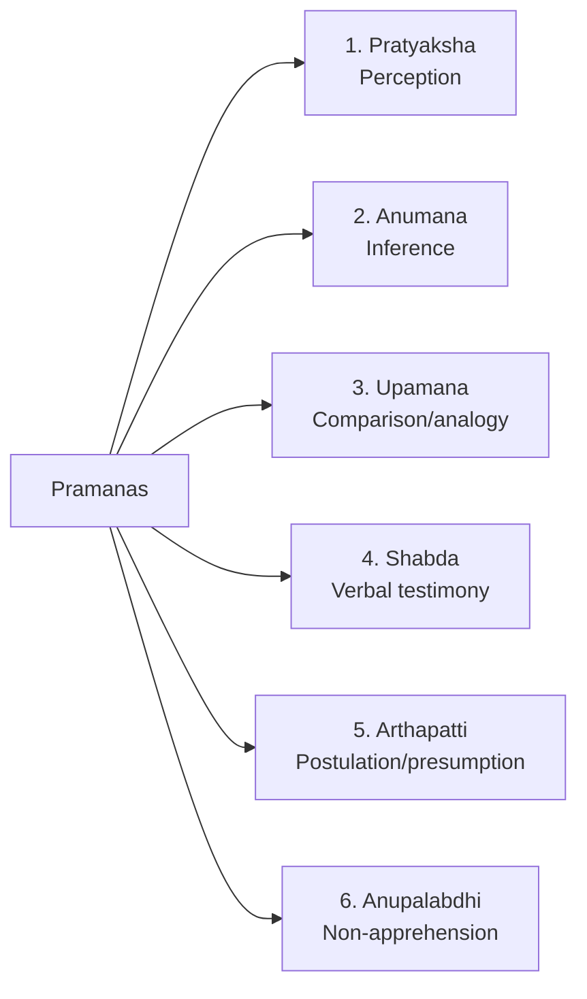

# Paper 1 · Unit 6 — Logical Reasoning

**Expected questions: ~5 (10 marks) · Target: 5/5**

## Syllabus Checklist
- [ ] Structure of arguments: argument forms, categorical propositions, mood & figure, formal & informal fallacies, uses of language, connotations & denotations, classical square of opposition
- [ ] Evaluating & distinguishing deductive and inductive reasoning
- [ ] Analogies
- [ ] Venn diagram: simple & multiple use for establishing validity of arguments
- [ ] Indian Logic: means of knowledge (Pramanas), structure & kinds of Anumana (inference), Hetvabhasas (fallacies of inference)

---

## 1. Argument Basics

An **argument** = premises + conclusion. Premise indicators: *since, because, for*. Conclusion indicators: *therefore, hence, thus, so*.

| | Deductive | Inductive |
|-|-----------|-----------|
| Direction | General → particular (not strictly) | Particular → general |
| Conclusion | Necessarily follows | Probably follows |
| Evaluation | **Valid / invalid**; sound = valid + true premises | **Strong / weak**; cogent = strong + true premises |
| Example | All men are mortal; Socrates is a man; ∴ mortal | Every crow seen is black ∴ all crows are black |

Validity is about **form**, not truth. An argument with false premises can be valid.

## 2. Categorical Propositions (A E I O)

| Code | Form | Quantity | Quality | Distributes |
|------|------|----------|---------|-------------|
| **A** | All S are P | Universal | Affirmative | S only |
| **E** | No S is P | Universal | Negative | S and P |
| **I** | Some S are P | Particular | Affirmative | None |
| **O** | Some S are not P | Particular | Negative | P only |

Memory: **A**ff**I**rmo (A, I affirmative), n**E**g**O** (E, O negative). Distribution: "**ASEBINOP**" — A: Subject, E: Both, I: Nothing, O: Predicate.

### Square of Opposition

```
        A ─────────── contraries ─────────── E
        │  ╲                               ╱  │
        │    ╲                           ╱    │
 sub-   │      ╲   contradictories     ╱      │  sub-
 alter- │        ╲                   ╱        │  alter-
 nation │          ╳               ╳          │  nation
        │        ╱                   ╲        │
        │      ╱                       ╲      │
        │    ╱                           ╲    │
        I ──────────── sub-contraries ──────── O
```

| Relation | Pair | Rule |
|----------|------|------|
| Contradictory | A–O, E–I | Exactly one is true (opposite truth values always) |
| Contrary | A–E | Both cannot be true; both can be false |
| Sub-contrary | I–O | Both cannot be false; both can be true |
| Sub-alternation | A→I, E→O | If universal true ⇒ particular true; if particular false ⇒ universal false |

**Inference table** (if given proposition is TRUE):

| Given true | A | E | I | O |
|-----------|---|---|---|---|
| A | T | F | T | F |
| E | F | T | F | T |
| I | ? | F | T | ? |
| O | F | ? | ? | T |

If given FALSE: A false → O true, E?, I?; E false → I true; I false → E true, A false, O true; O false → A true, E false, I true.

## 3. Categorical Syllogism — Mood & Figure

Three terms: Major (P – predicate of conclusion), Minor (S – subject of conclusion), Middle (M – in both premises, not conclusion).

```
Figure 1      Figure 2      Figure 3      Figure 4
M – P         P – M         M – P         P – M
S – M         S – M         M – S         M – S
─────         ─────         ─────         ─────
S – P         S – P         S – P         S – P
```
**Mood** = the letters of the three propositions, e.g. AAA-1 (Barbara), EAE-1 (Celarent), AII-1 (Darii), EIO-1 (Ferio).

### Rules of validity
1. Middle term must be distributed at least once (else **fallacy of undistributed middle**).
2. A term distributed in conclusion must be distributed in premise (else **illicit major/minor**).
3. Two negative premises → no conclusion (**exclusive premises**).
4. A negative premise → negative conclusion; and vice-versa.
5. Two particular premises → no conclusion.
6. Exactly three terms (else **four-term fallacy**).

### Venn Diagram Method (for syllogism questions)

```
 Premise: All A are B       Premise: Some B are C      Possible conclusions:
     ┌───────────┐                                    "Some A are C"  → NOT definite
     │  B  ┌───┐ │   ┌──────┐                         "Some C are B"  → TRUE (conversion of I)
     │     │ A │ │◄─►│  C   │
     │     └───┘ │   └──────┘
     └───────────┘
```
Technique: draw the **minimum overlap** diagram; a conclusion follows only if it is true in **every** possible diagram.

## 4. Fallacies

### Formal fallacies
Undistributed middle, illicit major, illicit minor, affirming the consequent (p→q, q ∴ p), denying the antecedent (p→q, ¬p ∴ ¬q), four terms.

### Informal fallacies

| Fallacy | Meaning |
|---------|---------|
| Ad hominem | Attacking the person, not the argument |
| Ad populum (bandwagon) | Many people believe it ⇒ true |
| Ad verecundiam | Appeal to inappropriate authority |
| Ad ignorantiam | Not proved false ⇒ true |
| Ad misericordiam | Appeal to pity |
| Ad baculum | Appeal to force |
| Straw man | Distorting opponent's argument |
| Red herring | Diverting to an irrelevant issue |
| Begging the question (petitio principii) | Conclusion assumed in premise (circular) |
| Hasty generalisation | Too small a sample |
| False cause (post hoc) | After this, therefore because of this |
| Slippery slope | One step leads to disaster chain |
| False dilemma | Only two options presented |
| Equivocation | Word used in two senses |
| Composition / Division | Parts ↔ whole wrongly transferred |

## 5. Uses of Language; Connotation & Denotation
- Functions of language (Copi): **Informative, Expressive, Directive**, (also ceremonial, performative).
- **Denotation (extension)** = the set of objects a term refers to. **Connotation (intension)** = properties/attributes.
- As connotation increases, denotation decreases (inverse relation). e.g. "animal" → "mammal" → "dog".

## 6. Analogies
A : B :: C : ? — identify relation: part-whole, cause-effect, tool-worker, synonym, antonym, product-raw material, degree.
- Pen : Writer :: Scalpel : **Surgeon** · Cow : Calf :: Horse : **Foal** · Ornithology : Birds :: Entomology : **Insects**

## 7. Indian Logic (Nyaya) — Very High Weightage

### Pramanas (means of valid knowledge)



| School | Pramanas accepted | Count |
|--------|------------------|-------|
| Charvaka | Pratyaksha only | 1 |
| Buddhism, Vaisheshika | Pratyaksha, Anumana | 2 |
| Samkhya, Yoga, Jainism | + Shabda | 3 |
| **Nyaya** | + Upamana | 4 |
| Prabhakara Mimamsa | + Arthapatti | 5 |
| Bhatta Mimamsa, Advaita Vedanta | + Anupalabdhi | 6 |

- **Arthapatti**: "Devadatta is fat but doesn't eat by day ⇒ he eats at night."
- **Anupalabdhi**: knowing the absence of a jar by not perceiving it.

### Anumana — Five-membered syllogism (Panchavayava)

```
1. Pratijna   (Proposition)  : The hill has fire.
2. Hetu       (Reason)       : Because it has smoke.
3. Udaharana  (Example)      : Whatever has smoke has fire, like a kitchen.
4. Upanaya    (Application)  : The hill has smoke (pervaded by fire).
5. Nigamana   (Conclusion)   : Therefore the hill has fire.
```
Terms: **Paksha** (minor term: hill), **Sadhya** (major term: fire), **Hetu/Linga** (middle term: smoke).
**Vyapti** = invariable concomitance (universal relation) between hetu and sadhya — the basis of inference.

Kinds of anumana:
- By purpose: **Svarthanumana** (for oneself) and **Pararthanumana** (for others, uses 5 members).
- By Nyaya (Gautama): **Purvavat** (cause → effect), **Sheshavat** (effect → cause), **Samanyatodrishta** (based on general observation).
- By vyapti: Kevalanvayi, Kevalavyatireki, Anvaya-vyatireki.

### Hetvabhasa (fallacies of inference — 5)

| Hetvabhasa | Meaning |
|-----------|---------|
| **Savyabhichara** (Anaikantika) | Irregular / inconclusive middle — hetu found with and without sadhya |
| **Viruddha** | Contradictory — hetu proves the opposite |
| **Satpratipaksha** | Counter-balanced — another hetu proves the opposite |
| **Asiddha** (Sadhyasama) | Unproved — hetu itself not established |
| **Badhita** (Kalatita) | Contradicted by other pramana (e.g. "fire is cold because it is a substance") |

## 8. Deeper Dive — Venn Diagram Practice, Conditionals & More Indian Logic

### 8.1 Six Standard Venn Situations

```
 All A are B        No A is B          Some A are B
 ┌───────────┐      ┌─────┐ ┌─────┐    ┌──────┬──┬──────┐
 │ B  ┌───┐  │      │  A  │ │  B  │    │  A   │AB│   B  │
 │    │ A │  │      └─────┘ └─────┘    └──────┴──┴──────┘
 │    └───┘  │
 └───────────┘
 Some A are not B: the part of A outside B is non-empty (shade / mark with x)
```

**Method for "Statements → Conclusions"**:
1. Draw the **minimum** case allowed by each statement.
2. A conclusion follows only if it holds in **every** possible diagram.
3. "Some A are not B" from "All A are B"? No. "Some B are A" from "All A are B"? Yes (conversion by limitation).

**Worked**: Statements: All pens are books. Some books are bags.
- Conclusion I: Some pens are bags — **does not follow** (bags may touch only the books outside pens).
- Conclusion II: Some bags are books — **follows** (conversion of "Some books are bags").
- "Either I or II" type options apply only when two conclusions form a complementary pair (e.g. Some A are B / No A is B).

### 8.2 Immediate Inference
| Operation | From | To |
|-----------|------|----|
| Conversion | E: No S is P / I: Some S are P | No P is S / Some P are S (valid) |
| Conversion by limitation | A: All S are P | Some P are S |
| Obversion | All S are P | No S is non-P (change quality, negate predicate) |
| Contraposition | All S are P | All non-P are non-S |

O-propositions cannot be converted.

### 8.3 Conditional (Hypothetical) Statements
```
Valid:    If P then Q; P; ∴ Q          (Modus ponens)
Valid:    If P then Q; not Q; ∴ not P  (Modus tollens)
Invalid:  If P then Q; Q; ∴ P          (Affirming the consequent)
Invalid:  If P then Q; not P; ∴ not Q  (Denying the antecedent)
"P only if Q" ≡ If P then Q    "P unless Q" ≡ If not Q then P
```

### 8.4 Truth & Validity Combinations

| Premises | Conclusion | Can the argument be valid? |
|----------|-----------|----------------------------|
| True | True | Yes |
| True | False | **No** — impossible for a valid argument |
| False | True | Yes |
| False | False | Yes |

### 8.5 More Indian Logic

- **Prama** = valid knowledge; **Aprama** = invalid knowledge (doubt — samshaya, error — viparyaya, hypothetical — tarka).
- **Pratyaksha** types (Nyaya): **Nirvikalpaka** (indeterminate) and **Savikalpaka** (determinate); also laukika (ordinary) and alaukika (extraordinary).
- **Upamana**: knowledge of a word–object relation through similarity (learning that a gavaya resembles a cow).
- **Shabda**: testimony of a reliable person (**apta vakya**); Vedic and secular.
- **Jain logic**: **Anekantavada** (many-sidedness), **Syadvada** — 7 modes of predication (**Saptabhangi naya**): syad asti, syad nasti, syad asti-nasti, syad avaktavya, …
- **Buddhist logic**: Dignaga and Dharmakirti; accept only perception and inference.
- **Vyapti** is established through **anvaya** (agreement in presence: where smoke, there fire) and **vyatireka** (agreement in absence: where no fire, no smoke).
- Nyaya Sutra author: **Gautama (Akshapada)**; 16 categories (padarthas) beginning with pramana and prameya.

---

## Previous Year Questions (PYQ pattern)

**Square of opposition**
1. If "All poets are dreamers" is true, which is false? → **"Some poets are not dreamers" (O)** and "No poets are dreamers" (E)
2. If "Some students are not intelligent" (O) is false, then "All students are intelligent" (A) is: **True**
3. Two propositions which cannot both be true but can both be false: **Contraries (A–E)**
4. Two propositions which cannot both be false but can both be true: **Sub-contraries (I–O)**
5. Which proposition distributes only the predicate? **O**

**Syllogism**

6. Premises: All cats are animals. Some animals are dogs. Conclusion "Some cats are dogs" → **Does not follow** (undistributed middle)
7. Statements: No A is B. All C are B. Conclusion: **No C is A** — follows.
8. Mood and figure of: "All M are P; All S are M; ∴ All S are P" → **AAA-1 (Barbara)**

**Deductive/inductive**

9. In a deductive argument, the conclusion: **follows necessarily**
10. An argument which is valid and has true premises is: **Sound**
11. Inductive arguments are evaluated as: **strong/weak**

**Fallacies**

12. "He is a criminal, so his argument about taxes is wrong" — **Ad hominem**
13. "No one has proved ghosts don't exist, so they exist" — **Ad ignorantiam**
14. "I wore a lucky shirt and won — so the shirt causes wins" — **Post hoc (false cause)**

**Language**

15. Denotation of a term refers to: **the objects to which it applies**
16. "Close the door" serves which function? **Directive**

**Indian logic**

17. Number of pramanas accepted by Nyaya: **4**
18. Charvakas accept only: **Perception**
19. Advaita Vedanta accepts how many pramanas? **6**
20. In "the hill has fire because it has smoke", the middle term (hetu) is: **smoke**; paksha is: **hill**
21. The invariable relation between hetu and sadhya is: **Vyapti**
22. Inference for others is: **Pararthanumana**
23. Arrange Panchavayava: **Pratijna, Hetu, Udaharana, Upanaya, Nigamana**
24. A hetu that proves the contrary of what is intended: **Viruddha**
25. Knowledge of non-existence is obtained through: **Anupalabdhi**
26. Arthapatti is accepted by: **Mimamsa (Prabhakara & Bhatta) and Advaita**

**Analogy**

27. Book : Author :: Statue : **Sculptor**

**More practice questions**

28. Obverse of "All S are P": **No S is non-P**
29. Which proposition cannot be converted? **O**
30. Converse of "All doctors are graduates" by limitation: **Some graduates are doctors**
31. A valid argument cannot have: **true premises and a false conclusion**
32. "If it rains, the match is cancelled. The match is cancelled. So it rained." — **affirming the consequent**
33. Statements: No cat is a dog. All dogs are animals. Conclusion "Some animals are not cats" — **follows**
34. Syadvada is associated with: **Jainism**
35. Number of modes in Saptabhangi: **7**
36. Determinate perception in Nyaya: **Savikalpaka**
37. Vyapti by agreement in absence: **Vyatireka**
38. Author of Nyaya Sutras: **Gautama (Akshapada)**
39. Knowledge from similarity (gavaya–cow): **Upamana**
40. Analogy: Doctor : Hospital :: Teacher : **School**

## Quick Revision Box
- A(S) E(S,P) I(none) O(P) — distribution
- Contradictory A–O, E–I · Contrary A–E · Sub-contrary I–O
- Charvaka 1 · Buddhist 2 · Samkhya 3 · Nyaya 4 · Prabhakara 5 · Bhatta/Advaita 6
- 5 Hetvabhasa: Savyabhichara, Viruddha, Satpratipaksha, Asiddha, Badhita
