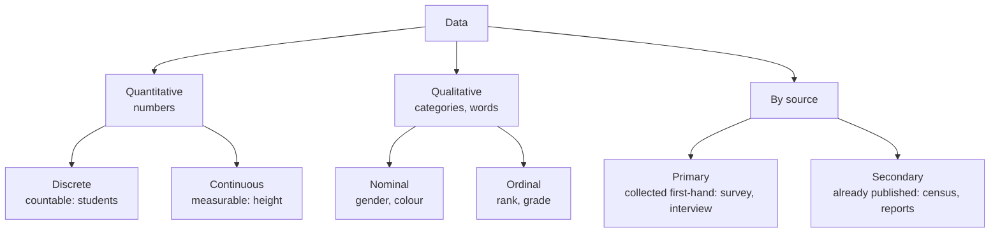

# Paper 1 · Unit 7 — Data Interpretation

**Expected questions: 5 (one data set) · Target: 5/5 — pure calculation marks**

## Syllabus Checklist
- [ ] Sources, acquisition and classification of data
- [ ] Quantitative and qualitative data
- [ ] Graphical representation (bar chart, histograms, pie chart, table chart, line chart) and mapping of data
- [ ] Data interpretation
- [ ] Data and governance

---

## 1. Data Basics



- Classification bases: **Geographical (spatial), Chronological (temporal), Qualitative, Quantitative**.
- Data mapping: choropleth maps (shades by region), dot maps, isopleths, cartograms.

## 2. Graph Types — When to Use

| Graph | Best for | Note |
|-------|----------|------|
| Bar chart | Comparing categories | Gaps between bars |
| Histogram | Frequency of continuous classes | **No gaps**; area ∝ frequency |
| Frequency polygon | Joining midpoints of histogram | |
| Ogive | Cumulative frequency (less than / more than) | Intersection gives **median** |
| Pie chart | Part of a whole | Angle = (value/total) × 360° |
| Line chart | Trend over time | |
| Scatter plot | Correlation between two variables | |
| Table | Exact values | |

```
Pie chart conversions
 1% = 3.6°      25% = 90°      50% = 180°
 angle θ  ⇒  percentage = θ / 3.6
```

## 3. Measures of Central Tendency & Dispersion

| Measure | Formula | Note |
|---------|---------|------|
| Mean | Σx / n | Affected by extreme values |
| Median | Middle value | Best for skewed data |
| Mode | Most frequent | Only one for nominal data |
| Empirical relation | Mode = 3 Median − 2 Mean | Moderately skewed |
| Range | Max − Min | |
| Variance | Σ(x − x̄)² / n | |
| SD | √Variance | |
| Coefficient of variation | SD / Mean × 100 | Compare consistency |

## 4. Speed-Calculation Tricks

```
Percentage change    = (New − Old)/Old × 100
Percentage points    = simple difference of two percentages
Ratio comparisons    → compare cross-products: a/b > c/d  ⇔ ad > bc
CAGR                 = (End/Start)^(1/n) − 1
Fraction-percent     1/2=50 1/3=33.33 1/4=25 1/5=20 1/6=16.67 1/7=14.28
                     1/8=12.5 1/9=11.11 1/11=9.09 1/12=8.33 1/16=6.25
```
Approximate first, then pick nearest option; options are usually far apart.

## 5. Worked Data Set (typical NET format)

Production of cars (thousands) by 4 companies:

| Year | P | Q | R | S | Total |
|------|---|---|---|---|-------|
| 2019 | 40 | 30 | 25 | 15 | 110 |
| 2020 | 45 | 35 | 20 | 20 | 120 |
| 2021 | 50 | 30 | 30 | 25 | 135 |
| 2022 | 60 | 40 | 35 | 25 | 160 |

```
Bar view of P across years
2019 ████████████████████ 40
2020 ██████████████████████▌ 45
2021 █████████████████████████ 50
2022 ██████████████████████████████ 60
```

1. % increase in total from 2019 to 2022 = 50/110 × 100 = **45.45%**
2. Average production of Q = 135/4 = **33.75**
3. In which year did R have the highest share of total? 2019: 22.7%, 2020: 16.7%, 2021: 22.2%, 2022: 21.9% → **2019**
4. Ratio of P(2022) to S(2019+2020) = 60 : 35 = **12 : 7**
5. Pie-chart angle for S in 2021 = 25/135 × 360 = **66.67°**

## 6. Data and Governance

- **Open Government Data (OGD) Platform India** — data.gov.in (NDSAP 2012 — National Data Sharing & Accessibility Policy).
- **Digital Personal Data Protection Act, 2023 (DPDP)** — rights of Data Principal, duties of Data Fiduciary, Data Protection Board.
- **National Data Governance Framework Policy (2022)**, India Data Management Office.
- **Aadhaar (UIDAI, 2009; Aadhaar Act 2016)**, **e-governance**: Digital India (2015), DigiLocker, UMANG, GSTN, PFMS.
- Data governance principles: quality, privacy, security, accountability, transparency, interoperability.
- Census of India — every 10 years (Registrar General & Census Commissioner, MHA); NSO (merged NSSO + CSO, 2019) under MoSPI.

---

## Previous Year Questions (PYQ pattern)

DI questions always come as a set of 5 on one table/graph. Typical stems:
1. "What is the percentage increase in X from year A to year B?"
2. "In which year was the ratio of X to Y the maximum?"
3. "What is the average of X over the given years?"
4. "The central angle corresponding to X in the pie chart is…"
5. "What is the difference between total X and total Y?"
6. "For how many years was X above its average?"

Concept questions:
7. A histogram is used for: **continuous frequency distribution**
8. The median can be obtained graphically from: **Ogives (intersection of less-than and more-than)**
9. Data collected by the researcher for the first time: **Primary data**
10. Census data used by a researcher is: **Secondary data**
11. Pie chart: if a sector is 72°, it represents **20%**
12. Classification of data by time is called: **Chronological**
13. Which measure is best for ordinal data? **Median**
14. Which portal provides open government data in India? **data.gov.in**
15. Coefficient of variation is used to compare: **consistency/variability of two series**

## Quick Revision Box
- 1% = 3.6° · Mode = 3Median − 2Mean · CV = SD/Mean × 100
- Histogram no gaps; bar chart gaps · Ogive → median
- Learn fraction ↔ percent table by heart
