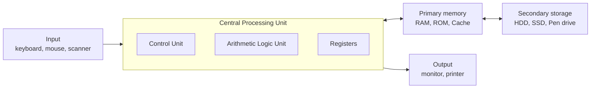
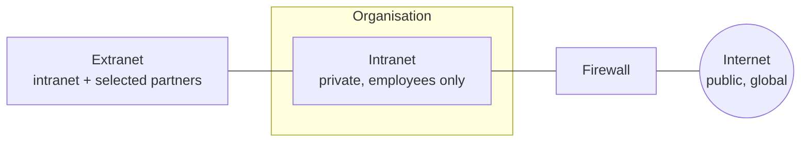
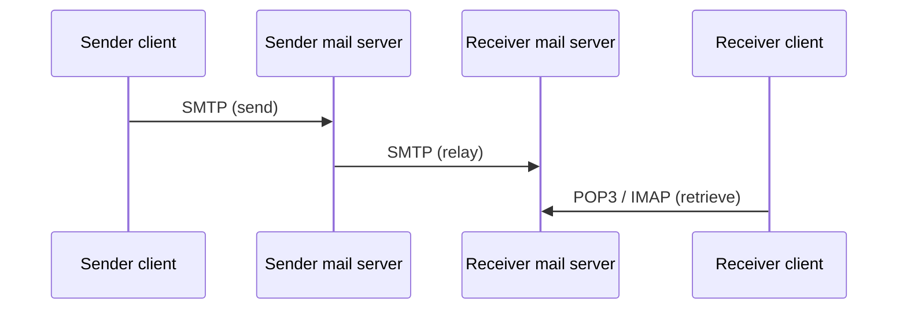
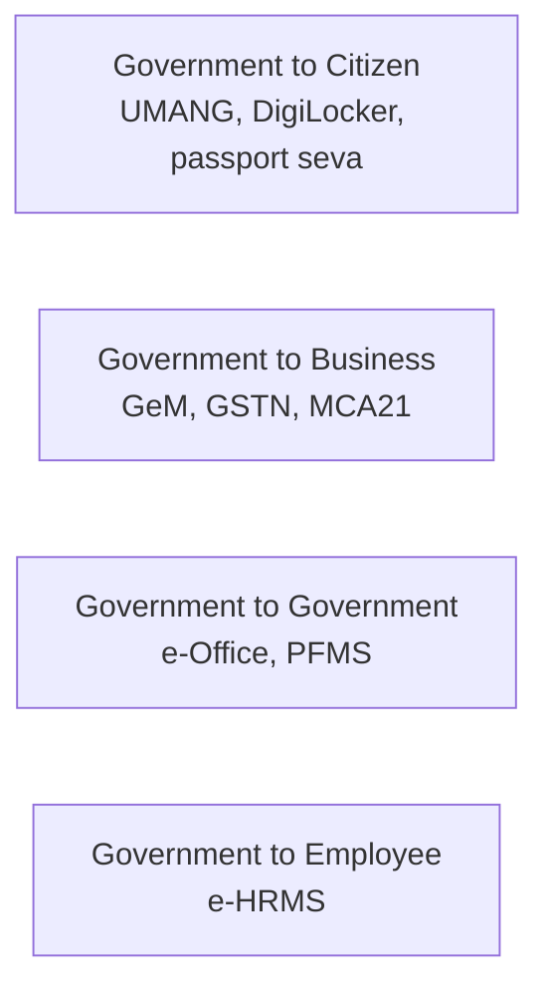
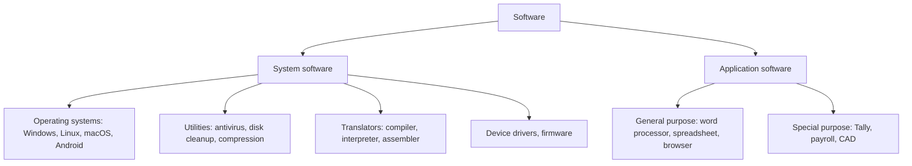

# Paper 1 · Unit 8 — Information & Communication Technology (ICT)

**Expected questions: ~5 (10 marks) · Target: 5/5 — easiest unit for a CS candidate**

## Syllabus Checklist
- [ ] ICT: general abbreviations and terminology
- [ ] Basics of Internet, Intranet, E-mail, Audio and Video-conferencing
- [ ] Digital initiatives in higher education
- [ ] ICT and Governance

---

## 1. Computer Basics

For Paper I you need a clear picture of what the parts of a computer do rather than how they are built.
Every computer, from a phone to a supercomputer, follows the same plan: data enter through input devices,
are processed by the CPU using instructions held in memory, and leave through output devices.

<!-- latex: p1-08-computer -->


### Memory hierarchy (fast/costly at top)

No single memory technology is both fast and cheap, so computers combine several in a hierarchy. Frequently
used data are kept in the small, fast levels near the processor; everything else waits in the large, slow
levels below.
<!-- latex: p1-08-pyramid -->
```
          ┌──────────┐            Registers       ▲ fastest, costliest, smallest
        ┌─┴──────────┴─┐          Cache (SRAM)    │
      ┌─┴──────────────┴─┐        Main memory     │
    ┌─┴──────────────────┴─┐      SSD / HDD       │
  ┌─┴──────────────────────┴─┐    Optical / Tape  ▼ slowest, cheapest, largest
  └──────────────────────────┘
```

### Units
<!-- latex: p1-08-units -->
```
1 nibble = 4 bits     1 byte = 8 bits
1 KB = 2^10 B   1 MB = 2^20 B   1 GB = 2^30 B   1 TB = 2^40 B
1 PB = 2^50 B   1 EB = 2^60 B   1 ZB = 2^70 B   1 YB = 2^80 B
```

### Number Systems (frequent question!)

Computers store everything in binary because electronic circuits have two reliable states. Octal and
hexadecimal are compact ways of writing binary: each octal digit stands for three bits and each hexadecimal
digit for four.
- Binary (2), Octal (8), Decimal (10), Hexadecimal (16).
- (25)₁₀ = (11001)₂ = (31)₈ = (19)₁₆
- (1010.101)₂ = 10.625
- Group 3 bits → octal, 4 bits → hex.

## 2. Abbreviations (must know)

| Abbr. | Full form |
|------|-----------|
| ALU | Arithmetic Logic Unit |
| BIOS | Basic Input Output System |
| CMOS | Complementary Metal Oxide Semiconductor |
| DNS | Domain Name System |
| DHCP | Dynamic Host Configuration Protocol |
| FTP | File Transfer Protocol |
| HTML | HyperText Markup Language |
| HTTP(S) | HyperText Transfer Protocol (Secure) |
| IMAP | Internet Message Access Protocol |
| ISP | Internet Service Provider |
| LAN/MAN/WAN | Local/Metropolitan/Wide Area Network |
| MODEM | Modulator–Demodulator |
| OCR / OMR / MICR | Optical Character / Optical Mark / Magnetic Ink Character Recognition |
| POP3 | Post Office Protocol v3 |
| SMTP | Simple Mail Transfer Protocol |
| TCP/IP | Transmission Control Protocol / Internet Protocol |
| URL | Uniform Resource Locator |
| VoIP | Voice over Internet Protocol |
| VPN | Virtual Private Network |
| Wi-Fi | Wireless Fidelity |
| GIF, JPEG, PNG | Graphics Interchange Format, Joint Photographic Experts Group, Portable Network Graphics |
| PDF | Portable Document Format |
| CC / BCC | Carbon Copy / Blind Carbon Copy |
| IoT | Internet of Things |
| LMS | Learning Management System (Moodle) |
| NIC | National Informatics Centre |
| CERT-In | Indian Computer Emergency Response Team |

## 3. Internet, Intranet, Extranet

The same Internet technologies — TCP/IP, web browsers, e-mail — can be used on a private network
(intranet), shared with trusted partners (extranet) or opened to the world (Internet). What differs is who
is allowed in.

<!-- latex: p1-08-intranet -->


- **Internet** originated from **ARPANET (1969)**, US DoD. **WWW** invented by **Tim Berners-Lee (1989, CERN)**.
- India's first: **ERNET (1986)**; public internet by **VSNL on 15 Aug 1995**.
- IPv4 = 32 bits; IPv6 = 128 bits. Domain types: .com, .org, .edu, .gov, .ac.in, .nic.in.
- Browser = client software (Chrome, Firefox); Search engine = website (Google, Bing).
- **Cookies** = small data files stored by websites in the browser.

## 4. E-mail

E-mail is a store-and-forward system: messages wait on servers until the recipient collects them, which is
why sender and recipient need not be online at the same time.

<!-- latex: p1-08-email -->


- **SMTP** = sending (port 25/587); **POP3** = download & delete (110); **IMAP** = sync, mail stays on server (143).
- First email: **Ray Tomlinson (1971)**, introduced `@`.
- **BCC** recipients are hidden from others. **Spam** = unsolicited mail. **Phishing** = fraudulent mail to steal data.
- Attachments: MIME (Multipurpose Internet Mail Extensions).

## 5. Audio & Video Conferencing
- Real-time communication over IP: Zoom, Google Meet, Microsoft Teams, Webex; government: **JioMeet, Bharat VC (NIC's)**.
- Protocols: **H.323**, **SIP** (Session Initiation Protocol), RTP. Codecs compress audio/video.
- Synchronous (live) vs asynchronous (recorded, forums, email) learning.
- Webinar = web seminar; Podcast = audio episodes; Vodcast = video podcast.

## 6. Digital Initiatives in Higher Education

These initiatives, coordinated largely by the Ministry of Education, UGC, AICTE and INFLIBNET, together
form India's digital infrastructure for higher education. Learn each name with its purpose.

| Initiative | Purpose |
|-----------|---------|
| SWAYAM | MOOCs (2017) |
| SWAYAM PRABHA | DTH educational TV channels |
| NDL India | National Digital Library (IIT Kharagpur) |
| e-PG Pathshala | PG e-content (UGC/INFLIBNET) |
| Shodhganga / Shodhgangotri | Theses / synopses repository |
| e-ShodhSindhu | E-journal consortium (merged UGC-INFONET, N-LIST, INDEST) |
| **ONOS (One Nation One Subscription)** | Nation-wide access to scholarly journals (2024/25) |
| NAD / DigiLocker | National Academic Depository — digital certificates |
| **ABC** | Academic Bank of Credits (NEP 2020) |
| **NIRF** | National Institutional Ranking Framework (2015) |
| AISHE | All India Survey on Higher Education |
| Virtual Labs, Spoken Tutorial, e-Yantra, FOSSEE | Lab/skill initiatives |
| SAMARTH | e-Governance suite for universities |
| VIDWAN | Database of experts (INFLIBNET) |
| PM e-VIDYA | Multi-mode access to digital education (2020) |
| NEAT | National Educational Alliance for Technology (AICTE, AI-based adaptive learning) |
| DIKSHA | Teachers' platform |

## 7. ICT & Governance

E-governance uses ICT to deliver government services more quickly, transparently and cheaply. It is
usually described by the parties it connects.

<!-- latex: p1-08-egov -->

- **Digital India** (1 July 2015) — 9 pillars incl. broadband highways, e-Kranti, Information for All.
- Key platforms: **UMANG** (unified app), **DigiLocker**, **GeM** (Government e-Marketplace), **BHIM-UPI** (NPCI), **CoWIN**, **MyGov**, **e-Hospital**, **Bhashini** (language AI).
- **IT Act 2000** (amended 2008) — legal recognition of e-records & digital signatures; Sec 66A struck down (Shreya Singhal, 2015). **DPDP Act 2023**.
- Cyber security: firewall, antivirus, encryption, 2FA. Malware: virus (needs host), worm (self-replicating), Trojan (disguised), ransomware, spyware.

## 8. Deeper Dive — Generations, Software, File Types & Emerging Tech

### 8.1 Generations of Computers

| Generation | Period | Technology | Example |
|-----------|--------|-----------|---------|
| 1st | 1940–56 | Vacuum tubes; machine language | ENIAC, UNIVAC |
| 2nd | 1956–63 | Transistors; assembly, FORTRAN, COBOL | IBM 1401 |
| 3rd | 1964–71 | Integrated circuits; OS, multiprogramming | IBM 360 |
| 4th | 1971–present | Microprocessors (VLSI); PCs, GUI | Intel 4004 (first microprocessor) |
| 5th | Present & beyond | AI, ULSI, parallel processing, quantum | — |

India: **PARAM 8000 (1991)** by C-DAC (first Indian supercomputer); **National Supercomputing Mission (2015)**; AIRAWAT (AI supercomputer).

### 8.2 Software

Hardware does nothing without instructions. Software is commonly divided into the programs that run the
computer itself and the programs that do useful work for the user.

<!-- latex: p1-08-software -->


- **Open source** (source available, free to modify: Linux, LibreOffice, Moodle) vs **proprietary** (MS Office).
- **Freeware** (free, closed), **shareware** (trial), **firmware** (software in ROM/flash).

### 8.3 File Extensions & Office Shortcuts

| Extension | Type | Extension | Type |
|-----------|------|-----------|------|
| .docx | Word document | .xlsx | Spreadsheet |
| .pptx | Presentation | .pdf | Portable document |
| .txt | Plain text | .csv | Comma-separated values |
| .jpg/.png/.gif | Images | .mp3/.wav | Audio |
| .mp4/.avi | Video | .zip/.rar | Compressed |
| .exe | Executable (Windows) | .html | Web page |

| Shortcut | Action | Shortcut | Action |
|----------|--------|----------|--------|
| Ctrl + C / X / V | Copy / cut / paste | Ctrl + Z / Y | Undo / redo |
| Ctrl + S | Save | Ctrl + P | Print |
| Ctrl + F | Find | Ctrl + H | Replace |
| Ctrl + A | Select all | F7 | Spell check (Word) |
| F5 | Slideshow / refresh | Alt + F4 | Close window |

Spreadsheet: cell address = column letter + row number (B3); **absolute reference** \$B\$3; functions SUM, AVERAGE, COUNT, IF, VLOOKUP.

### 8.4 Emerging Technologies (frequently asked one-liners)

| Term | Meaning |
|------|---------|
| Cloud computing | On-demand computing over the internet: SaaS, PaaS, IaaS |
| IoT | Physical devices with sensors connected to the internet |
| Artificial Intelligence | Machines performing tasks needing human intelligence; ChatGPT, Bhashini |
| Machine learning | Systems that learn patterns from data |
| Blockchain | Distributed, tamper-evident ledger (Bitcoin) |
| Big data | Volume, velocity, variety (+ veracity, value) |
| AR / VR | Augmented reality overlays digital on real; virtual reality is fully immersive |
| 5G | Fifth-generation mobile; launched in India on 1 Oct 2022 |
| Quantum computing | Qubits, superposition; India's National Quantum Mission (2023) |
| Open educational resources (OER) | Free, openly licensed learning materials (Creative Commons) |

### 8.5 Internet Basics Extended
- Web 1.0 (read-only) → Web 2.0 (read-write, social media) → Web 3.0 (semantic, decentralised).
- **Search operators**: "exact phrase", `site:ac.in`, `filetype:pdf`, minus sign to exclude.
- **Bandwidth** measured in bps; **latency** in ms. Wired (Ethernet, fibre) vs wireless (Wi-Fi, 4G/5G, satellite).
- **IP address** identifies a device; **MAC address** identifies a network card (48 bits).

---

## Previous Year Questions (PYQ pattern)

1. (1011)₂ + (0111)₂ = ? → **(10010)₂**
2. (237)₈ in decimal = 2×64+3×8+7 = **159**
3. 1 TB equals: **1024 GB**
4. Which protocol is used to send e-mail? **SMTP**
5. Which protocol keeps mail on the server and syncs folders? **IMAP**
6. BCC stands for: **Blind Carbon Copy**
7. Which is NOT an input device? (a) scanner (b) light pen (c) plotter (d) OMR — **Ans: (c)**
8. WWW was invented by: **Tim Berners-Lee**
9. The internet originated from: **ARPANET**
10. Private network inside an organisation using internet technology: **Intranet**
11. URL stands for: **Uniform Resource Locator**
12. Which is a volatile memory? **RAM**
13. Which converts domain names to IP addresses? **DNS**
14. IPv6 address length: **128 bits**
15. "Academic Bank of Credits" is an initiative under: **NEP 2020**
16. The portal providing Indian theses: **Shodhganga**
17. The national ranking framework for HEIs: **NIRF**
18. Which is a G2B service? **GeM / GSTN**
19. Malware that replicates itself without a host program: **Worm**
20. Fraudulent attempt to obtain credentials via email: **Phishing**
21. Video conferencing protocol: **H.323 / SIP**
22. The Information Technology Act was passed in: **2000**
23. Arrange in increasing order of capacity: **KB < MB < GB < TB < PB**

**More practice questions**

24. The first Indian supercomputer: **PARAM 8000**
25. Integrated circuits were used in: **third-generation computers**
26. Which is open-source software? (a) MS Word (b) LibreOffice Writer (c) Photoshop (d) Windows — **Ans: (b)**
27. Absolute cell reference in a spreadsheet: **\$A\$1**
28. Shortcut to undo: **Ctrl + Z**
29. A .csv file stores: **tabular data as comma-separated text**
30. Web 2.0 is characterised by: **user-generated content and interactivity**
31. Software stored permanently in ROM: **firmware**
32. Which is NOT system software? (a) OS (b) compiler (c) spreadsheet (d) device driver — **Ans: (c)**
33. 5G services were launched in India in: **October 2022**
34. Search operator to restrict results to a website: **site:**

## Quick Revision Box
- SMTP send · POP3 download · IMAP sync
- ARPANET 1969 · WWW 1989 (Berners-Lee) · India public internet 1995 (VSNL)
- IT Act 2000 · Digital India 2015 · DPDP Act 2023
