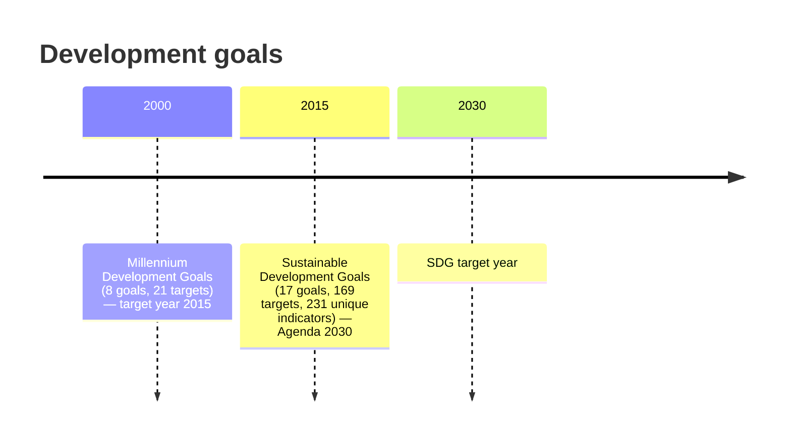
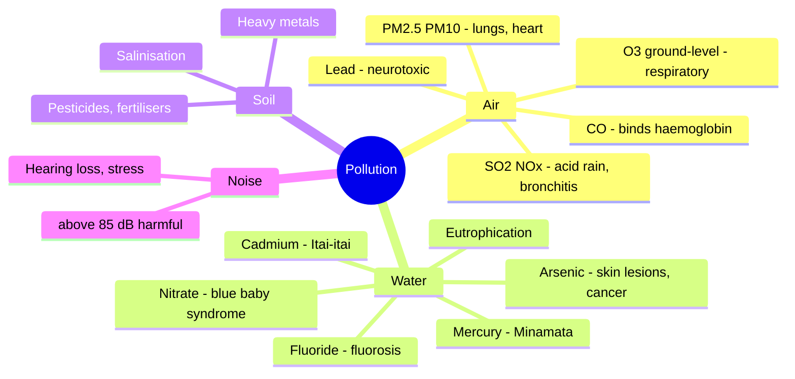
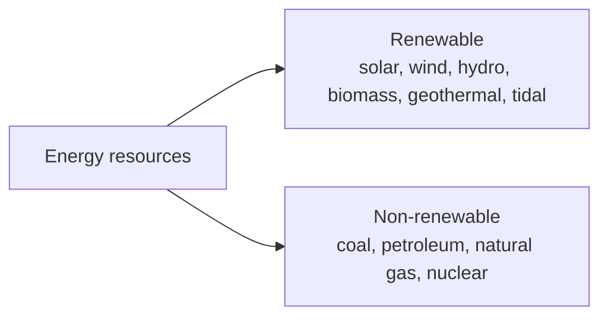
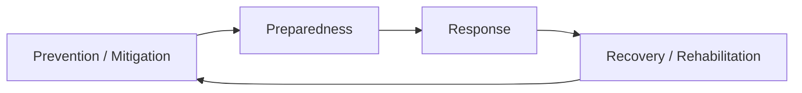
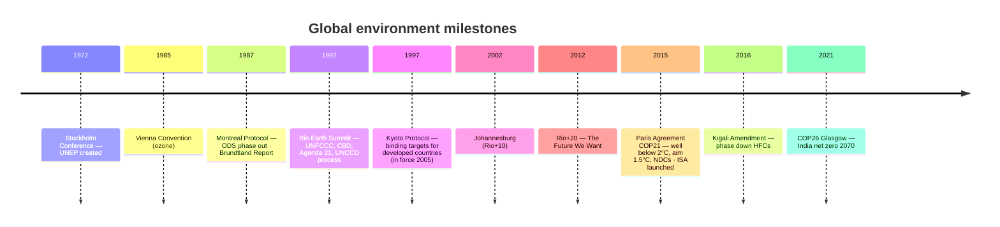
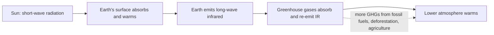

# Paper 1 · Unit 9 — People, Development & Environment

**Expected questions: ~5 (10 marks) · Target: 4–5/5**

## Syllabus Checklist
- [ ] Development and environment: Millennium Development and Sustainable Development Goals
- [ ] Human and environment interaction: anthropogenic activities and their impacts on environment
- [ ] Environmental issues: local, regional and global; air, water, soil, noise pollution; waste (solid, liquid, biomedical, hazardous, electronic); climate change and its socio-economic and political dimensions
- [ ] Impacts of pollutants on human health
- [ ] Natural and energy resources: solar, wind, soil, hydro, geothermal, biomass, nuclear and forests
- [ ] Natural hazards and disasters: mitigation strategies
- [ ] Environmental Protection Act (1986), NAPCC, international agreements/efforts: Montreal Protocol, Rio Summit, CBD, Kyoto Protocol, Paris Agreement, ISA

---

## 1. MDGs → SDGs

Development was long measured by income alone. The global goals reflect a broader view: development must
also reduce poverty, improve health and education, and do so without exhausting the environment on which
future generations depend.

<!-- latex: p1-09-mdg-sdg -->

**8 MDGs**: (1) eradicate extreme poverty & hunger (2) universal primary education (3) gender equality
(4) reduce child mortality (5) improve maternal health (6) combat HIV/AIDS, malaria (7) environmental sustainability (8) global partnership.

**17 SDGs** (memorise numbers — directly asked):

| # | Goal | # | Goal |
|---|------|---|------|
| 1 | No Poverty | 10 | Reduced Inequalities |
| 2 | Zero Hunger | 11 | Sustainable Cities |
| 3 | Good Health & Well-being | 12 | Responsible Consumption & Production |
| **4** | **Quality Education** | **13** | **Climate Action** |
| 5 | Gender Equality | 14 | Life Below Water |
| 6 | Clean Water & Sanitation | 15 | Life on Land |
| 7 | Affordable & Clean Energy | 16 | Peace, Justice & Strong Institutions |
| 8 | Decent Work & Economic Growth | 17 | Partnerships for the Goals |
| 9 | Industry, Innovation & Infrastructure | | |

5 Ps of SDGs: **People, Planet, Prosperity, Peace, Partnership**. In India, **NITI Aayog** monitors (SDG India Index, 2018).

**Sustainable development** (Brundtland Report "Our Common Future", 1987): *development that meets the needs of the present without compromising the ability of future generations to meet their own needs.*

## 2. Pollution — Sources & Health Effects

Pollution is the addition of substances or energy to the environment faster than it can disperse or
neutralise them. Questions often pair a pollutant with the disease or disaster it caused, so learn the
pairs in the figure and table together.

<!-- latex: p1-09-pollution -->

| Disease/Event | Cause |
|---------------|-------|
| Minamata disease | Mercury (Japan) |
| Itai-itai | Cadmium (Japan) |
| Blue baby syndrome (methaemoglobinaemia) | Nitrates in water |
| Black-foot disease | Arsenic |
| Fluorosis | Excess fluoride |
| Bhopal gas tragedy (1984) | Methyl isocyanate (MIC) |
| Chernobyl (1986) | Nuclear accident (Ukraine) |
| Silicosis | Silica dust |
| Asbestosis | Asbestos |
| London smog (1952) | SO₂ + smoke (classical/sulphurous smog) |
| Photochemical smog | NOx + VOC + sunlight → O₃, PAN |

- **NAAQS** (CPCB): PM2.5 annual 40 µg/m³, 24-hr 60; PM10 annual 60, 24-hr 100. **AQI** has 8 pollutants (PM10, PM2.5, NO₂, SO₂, CO, O₃, NH₃, Pb), 6 categories.
- **WHO 2021** guideline PM2.5 annual: 5 µg/m³.
- Greenhouse gases: CO₂, CH₄, N₂O, HFCs, PFCs, SF₆ (+ NF₃ under Doha amendment). GWP: CO₂=1, CH₄≈28, N₂O≈265, SF₆≈23,500.
- Ozone depletion: **CFCs** (chlorine radicals); ozone measured in **Dobson Units**; ozone layer in stratosphere.

## 3. Waste Management

India's 2016 set of waste rules shifted responsibility to the generators of waste and to producers
(extended producer responsibility). The guiding principle is the waste hierarchy: the best waste is the
waste never produced.

| Waste | Rules in India |
|------|----------------|
| Solid waste | Solid Waste Management Rules 2016 — segregation at source (wet, dry, hazardous) |
| Plastic | Plastic Waste Management Rules 2016 (amended 2021/22) — single-use plastic ban from 1 July 2022 |
| E-waste | E-Waste (Management) Rules 2016 → 2022 (EPR — Extended Producer Responsibility) |
| Bio-medical | Bio-Medical Waste Management Rules 2016 — colour-coded bins (yellow, red, white, blue) |
| Hazardous | Hazardous & Other Wastes Rules 2016 |
| C&D waste | Construction & Demolition Waste Rules 2016 |

Waste hierarchy (most → least preferred): **Prevent → Reduce → Reuse → Recycle → Recover → Dispose**.

## 4. Natural & Energy Resources

India's energy transition — from coal towards solar, wind and other renewables — is a frequent source of
questions, both for its targets and for its geography.

<!-- latex: p1-09-energy -->

- India's targets: **500 GW non-fossil capacity by 2030**; **Net zero by 2070** (Panchamrit, COP26 Glasgow).
- Largest share of India's electricity: **coal (thermal)**. Largest renewable: **solar** (overtook wind).
- Top states: solar — Rajasthan, Gujarat; wind — Gujarat, Tamil Nadu.
- Nuclear: Tarapur (first, 1969). Geothermal sites: Puga Valley (Ladakh). Tidal potential: Gulf of Khambhat, Kutch.
- India's forest cover ~21.7% (ISFR 2021); tree + forest ~25%. National Forest Policy 1988 target: **33%**.

## 5. Natural Hazards & Disasters

A hazard becomes a disaster only when it strikes people who are vulnerable and unprepared. Disaster
management therefore works continuously, not only after the event.

<!-- latex: p1-09-dmcycle -->

- **Disaster Management Act 2005** → **NDMA** (chaired by PM), SDMA (CM), DDMA (Collector). **NDRF** (response force).
- **Sendai Framework (2015–2030)** — 4 priorities, 7 targets (succeeded Hyogo Framework 2005–2015).
- Hazards: earthquake (Richter/moment magnitude), cyclone, flood, drought, landslide, tsunami (2004 Indian Ocean).
- Risk = Hazard × Vulnerability / Capacity.

## 6. Environmental Laws & International Agreements

Environmental law in India grew in response to specific crises — the Bhopal gas tragedy led directly to
the Environment (Protection) Act, 1986. Internationally, cooperation advanced through a series of
conferences and protocols whose years and subjects are a staple of the examination.

### Indian Acts
| Act | Year |
|-----|------|
| Wildlife Protection Act | 1972 |
| Water (Prevention & Control of Pollution) Act | 1974 (created CPCB) |
| Forest (Conservation) Act | 1980 |
| Air (Prevention & Control of Pollution) Act | 1981 |
| **Environment (Protection) Act** | **1986** (post-Bhopal; umbrella act) |
| Biological Diversity Act | 2002 |
| National Green Tribunal Act | 2010 |

**NAPCC (2008)** — 8 National Missions: Solar, Enhanced Energy Efficiency, Sustainable Habitat, Water, Sustaining Himalayan Ecosystem, Green India, Sustainable Agriculture, Strategic Knowledge on Climate Change.

### International

<!-- latex: p1-09-milestones -->

| Agreement | Key point |
|-----------|-----------|
| Ramsar (1971) | Wetlands |
| CITES (1973) | Trade in endangered species |
| Montreal (1987) | Ozone-depleting substances; most successful treaty |
| Basel (1989) | Transboundary hazardous waste |
| CBD (1992) | Biodiversity; Cartagena (biosafety, 2000), Nagoya (ABS, 2010), Kunming-Montreal GBF (2022, 30×30) |
| Kyoto (1997) | CDM, Joint Implementation, Emissions Trading; Annex-I countries' targets; 1st commitment 2008–12 |
| Paris (2015) | NDCs every 5 years; global stocktake |
| Stockholm Convention (2001) | POPs (persistent organic pollutants) |
| Minamata Convention (2013) | Mercury |
| **ISA** | International Solar Alliance — launched by India & France at COP21 (2015); HQ **Gurugram**; "One Sun One World One Grid" |

## 7. Deeper Dive — Climate Science, COP Timeline, Indian Programmes & Disasters

### 7.1 Greenhouse Effect & Climate Change

The greenhouse effect itself is natural and essential — without it the Earth would be about 33 °C colder.
The problem is its *enhancement* by human emissions, which traps extra heat.

<!-- latex: p1-09-greenhouse -->

- Pre-industrial CO₂ ≈ 280 ppm; now > 420 ppm. Largest anthropogenic GHG by volume: **CO₂**; methane is far more potent per molecule over 20 years.
- **IPCC** (1988, UNEP + WMO) assessment reports; AR6 (2021–23): warming about 1.1 °C above pre-industrial.
- Impacts: sea-level rise, glacier retreat, heatwaves, extreme rainfall, ocean acidification, coral bleaching, crop yield changes, vector-borne diseases.
- **Socio-economic & political dimensions**: climate justice; **CBDR-RC** (Common But Differentiated Responsibilities and Respective Capabilities) — principle from Rio 1992; loss and damage fund (COP27, Sharm el-Sheikh 2022); climate finance (USD 100 billion goal; NCQG at COP29 Baku 2024).
- Mitigation (reduce emissions) vs **adaptation** (adjust to impacts).
- **Carbon credit** = 1 tonne CO₂-equivalent reduced. India's Carbon Credit Trading Scheme (2023). **LiFE** (Lifestyle for Environment) mission launched by India at COP26.

### 7.2 Conference of Parties (COP) — Key Milestones

| COP | Year & place | Outcome |
|-----|-------------|---------|
| COP1 | 1995 Berlin | Berlin Mandate |
| COP3 | 1997 Kyoto | Kyoto Protocol |
| COP8 | 2002 New Delhi | Delhi Declaration |
| COP13 | 2007 Bali | Bali Action Plan |
| COP15 | 2009 Copenhagen | Copenhagen Accord |
| COP16 | 2010 Cancun | Green Climate Fund |
| COP21 | 2015 Paris | Paris Agreement; ISA launched |
| COP26 | 2021 Glasgow | Glasgow Climate Pact; India Panchamrit, net zero 2070 |
| COP27 | 2022 Sharm el-Sheikh | Loss & damage fund |
| COP28 | 2023 Dubai | First global stocktake; "transition away from fossil fuels" |
| COP29 | 2024 Baku | New climate finance goal (NCQG) |

### 7.3 Indian Environmental Programmes

| Programme | Year | Aim |
|-----------|------|-----|
| Ganga Action Plan | 1985 | River cleaning → Namami Gange (2014) |
| National Clean Air Programme (NCAP) | 2019 | Cut PM by 20–30% (revised 40%) in non-attainment cities |
| Swachh Bharat Mission | 2014 | Sanitation, ODF |
| Pradhan Mantri Ujjwala Yojana | 2016 | LPG to poor households (reduces indoor air pollution) |
| UJALA | 2015 | LED bulbs — energy efficiency |
| National Green Hydrogen Mission | 2023 | Green hydrogen production |
| Nagar Van Yojana | 2020 | Urban forests |
| Green India Mission | NAPCC | Increase forest/tree cover |
| Bharat Stage VI emission norms | 2020 | Leapfrogged from BS-IV |

Environmental movements: **Chipko** (1973, Uttarakhand — Sunderlal Bahuguna, Gaura Devi), **Appiko** (1983, Karnataka), **Silent Valley** (Kerala), **Narmada Bachao Andolan** (Medha Patkar), **Bishnoi** sacrifice (Khejarli, 1730, Amrita Devi).

### 7.4 Disasters — Scales & Facts

| Hazard | Measure / fact |
|--------|---------------|
| Earthquake | Magnitude (Richter / moment magnitude — logarithmic); intensity (Modified Mercalli, I–XII); India has seismic zones II–V (Zone V highest: NE, J&K, Kutch) |
| Cyclone | IMD categories; named by WMO/ESCAP panel; Bay of Bengal more cyclone-prone than Arabian Sea |
| Tsunami | Caused by undersea earthquakes; INCOIS Hyderabad runs the warning centre |
| Flood | Most frequent disaster in India; Assam, Bihar most affected |
| Drought | Meteorological, hydrological, agricultural |
| Landslide | Himalayas and Western Ghats |
| Heat wave | Declared by IMD when max temp ≥ 40 °C (plains) and departure ≥ 4.5 °C |

Disaster management cycle: **Mitigation → Preparedness → Response → Recovery**.

### 7.5 Renewable Energy — India Snapshot
- Installed renewable capacity crossed **200 GW** (2024); solar is the largest renewable source.
- Largest solar park: **Bhadla (Rajasthan)**; large hybrid park: **Khavda (Gujarat)**.
- **PM-KUSUM** (solar pumps for farmers), **PM Surya Ghar Muft Bijli Yojana** (2024, rooftop solar).
- Hydro: Tehri dam (tallest in India); nuclear plants: Kudankulam (largest), Tarapur (oldest).

---

## Previous Year Questions (PYQ pattern)

1. How many SDGs and targets? **17 goals, 169 targets**
2. SDG 4 is about: **Quality education**; SDG 13: **Climate action**
3. The Brundtland report is titled: **Our Common Future (1987)**
4. Minamata disease is caused by: **Mercury**
5. Blue baby syndrome is caused by excess: **Nitrates**
6. Bhopal gas tragedy gas: **Methyl isocyanate**
7. Which is NOT a greenhouse gas? (a) CO₂ (b) CH₄ (c) N₂ (d) N₂O — **Ans: (c)**
8. Montreal Protocol relates to: **ozone-depleting substances**
9. Kigali Amendment aims to phase down: **HFCs**
10. Kyoto Protocol came into force in: **2005**
11. Paris Agreement aims to limit warming to: **well below 2°C, pursue 1.5°C**
12. ISA headquarters: **Gurugram, India**
13. Environment (Protection) Act enacted in: **1986**
14. Number of missions in NAPCC: **8**
15. NDMA is chaired by: **Prime Minister**
16. Sendai Framework period: **2015–2030**
17. Arrange chronologically: Stockholm (1972), Montreal (1987), Rio (1992), Kyoto (1997), Paris (2015)
18. Which pollutant is NOT included in India's AQI? (a) PM2.5 (b) NH₃ (c) CO₂ (d) Pb — **Ans: (c)**
19. India's net-zero target year: **2070**
20. Ozone thickness is measured in: **Dobson units**
21. Which is a renewable resource? **Geothermal**
22. E-waste rules make producers responsible through: **Extended Producer Responsibility (EPR)**
23. CBD was opened for signature at: **Rio Earth Summit 1992**

**More practice questions**

24. The IPCC was established in: **1988 by UNEP and WMO**
25. The principle of CBDR originated at: **Rio Earth Summit 1992**
26. The loss and damage fund was agreed at: **COP27, Sharm el-Sheikh**
27. COP28 was held in: **Dubai (2023)**
28. National Clean Air Programme was launched in: **2019**
29. Chipko movement began in: **1973 (Uttarakhand)**
30. India's highest seismic zone: **Zone V**
31. Tsunami early-warning centre of India is at: **INCOIS, Hyderabad**
32. The most frequent natural disaster in India: **floods**
33. The LiFE mission was announced by India at: **COP26 Glasgow**
34. Bhadla solar park is in: **Rajasthan**
35. Arrange COPs chronologically: Kyoto (COP3) → Copenhagen (COP15) → Paris (COP21) → Glasgow (COP26)

## Quick Revision Box
- MDG 8 (2000–15) · SDG 17/169 (2015–30)
- Hg–Minamata · Cd–Itai-itai · NO₃–blue baby · As–black foot · F–fluorosis
- EPA 1986 · NAPCC 2008 (8 missions) · DM Act 2005 · NGT 2010
- Montreal 87 · Rio 92 · Kyoto 97 · Paris 15 · Kigali 16 · ISA 2015 (Gurugram)
