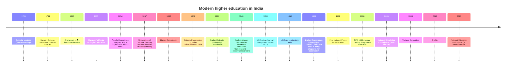
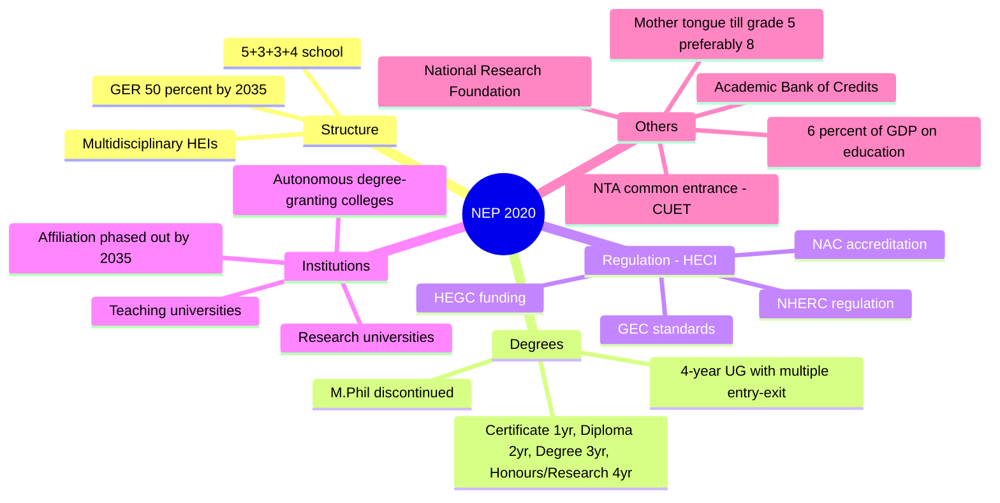
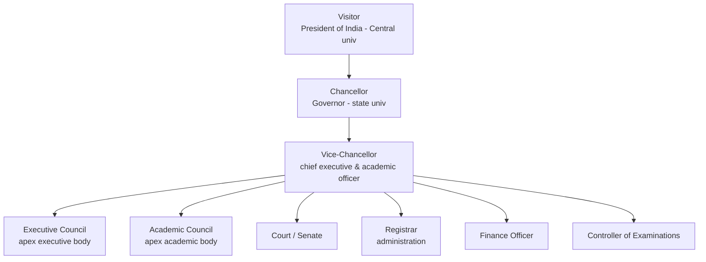

# Paper 1 · Unit 10 — Higher Education System

**Expected questions: ~5 (10 marks) · Target: 4–5/5**

## Syllabus Checklist
- [ ] Institutions of higher learning and education in ancient India
- [ ] Evolution of higher learning and research in post-independence India
- [ ] Oriental, conventional and non-conventional learning programmes in India
- [ ] Professional, technical and skill-based education
- [ ] Value education and environmental education
- [ ] Policies, governance and administration

---

## 1. Ancient Indian Centres of Learning

| Centre | Location (present) | Key facts |
|--------|--------------------|-----------|
| **Takshashila** | Rawalpindi, Pakistan | Oldest (~6th c. BCE); Chanakya, Panini, Charaka, Jivaka; no formal degrees |
| **Nalanda** | Bihar | Founded by **Kumaragupta I** (Gupta, 5th c. CE); Xuanzang & I-tsing studied; library *Dharmaganja* (Ratnasagara, Ratnodadhi, Ratnaranjaka); destroyed by **Bakhtiyar Khalji** (~1193) |
| **Vikramashila** | Bhagalpur, Bihar | Founded by **Dharmapala** (Pala, 8th c.); Tantric Buddhism; Atisha Dipankara |
| **Valabhi** | Gujarat | Maitraka dynasty; Hinayana Buddhism |
| **Odantapuri** | Bihar | Gopala (Pala) |
| **Somapura Mahavihara** | Bangladesh | Dharmapala; UNESCO site |
| **Kanchi (Kanchipuram)** | Tamil Nadu | Pallavas; Ghatika |
| **Pushpagiri** | Odisha | |
| **Jagaddala** | Bengal | Ramapala |

Vedic education: **Gurukul**; teaching via *Shravana (listening) → Manana (reflection) → Nididhyasana (meditation)*. Upanayana ceremony marked entry.
Buddhist education: *Pabbajja* (entry) and *Upasampada* (full ordination) ceremonies; viharas & monasteries.

## 2. Evolution of Higher Education — Timeline

## 3. NEP 2020 — Higher Education Highlights (most asked)

- **HECI** (Higher Education Commission of India) — single umbrella regulator with 4 verticals: NHERC, NAC, HEGC, GEC (proposed; would subsume UGC/AICTE/NCTE except medical & legal).
- **ANRF** (Anusandhan National Research Foundation) Act 2023 — implements NRF idea.
- **Multidisciplinary Education & Research Universities (MERUs)**.

## 4. Types of Institutions & Programmes

| Type | Notes |
|------|-------|
| Central university | Act of Parliament (e.g. JNU, DU, BHU, AMU) |
| State university | State Act |
| Deemed-to-be university | Sec 3 of UGC Act, declared by Central Govt on UGC advice |
| Private university | State Act; cannot affiliate colleges |
| Institutions of National Importance | Act of Parliament (IITs, NITs, AIIMS, IIMs) |
| Institution of Eminence | 2017 scheme — 10 public + 10 private |
| Open universities | IGNOU (1985); first state open univ: Dr. B.R. Ambedkar Open Univ, Hyderabad (1982) |

- **Oriental learning**: Sanskrit, Pali, Persian, Arabic institutions — e.g. Rashtriya Sanskrit Sansthan; Central Sanskrit University (2020).
- **Conventional**: classroom-based degrees. **Non-conventional**: distance, open, online, MOOCs, part-time.

## 5. Regulatory & Professional Bodies

| Body | Field | Est. |
|------|-------|------|
| UGC | Universities (funding, standards) | 1953 / Act 1956 |
| AICTE | Technical education | 1945 (statutory 1987) |
| NCTE | Teacher education | 1973 (statutory 1993) |
| NMC | Medical (replaced MCI) | 2020 |
| BCI | Legal education | 1961 |
| ICAR | Agriculture | 1929 |
| PCI / INC / DCI | Pharmacy / Nursing / Dental | |
| COA | Architecture | 1972 |
| RCI | Rehabilitation | 1992 |
| **NAAC** | Accreditation of HEIs (Bengaluru) | 1994 |
| **NBA** | Accreditation of programmes (technical) | 1994 |
| NIRF | Ranking (MoE) | 2015 |
| NTA | Testing (UGC NET, CUET, NEET, JEE Main) | 2017 |
| CABE | Central Advisory Board of Education — oldest advisory body | 1920/1935 |
| NIEPA | Educational planning & admin | |

NAAC grades: A++, A+, A, B++, B+, B, C, D on 4-point CGPA; criteria = **7** (Curricular aspects; Teaching-learning & evaluation; Research, innovations & extension; Infrastructure; Student support; Governance; Institutional values & best practices).

## 6. Skill-based & Professional Education
- **Skill India / PMKVY** (2015), **NSQF** (National Skills Qualification Framework, levels 1–10), **NCVET** (2018), B.Voc / D.Voc, Community colleges, **Apprenticeship embedded degree programmes**.
- **NHEQF** (National Higher Education Qualification Framework, levels 4.5–8) & **NCrF** (National Credit Framework).

## 7. Value & Environmental Education
- Value education: truth, non-violence, peace, love, right conduct (Sathya Sai model); constitutional values; NEP emphasises ethics, Indian Knowledge Systems (IKS).
- Environmental education made compulsory at all levels by **Supreme Court (M.C. Mehta case, 1991/2003)**; UGC mandated a 6-month core module course for UG.
- **Tbilisi Declaration (1977)** — first intergovernmental conference on environmental education (UNESCO-UNEP); Belgrade Charter (1975).

## 8. Governance & Administration

- Education was moved from State List to **Concurrent List** by the **42nd Amendment (1976)**.
- **Article 21A** — right to education (6–14 yrs) via 86th Amendment 2002; RTE Act 2009.
- Article 30 — minorities' right to establish institutions; Article 45 — ECCE; Article 46 — education of SC/ST/weaker sections.
- Entry 66, Union List — coordination & determination of standards in higher education.
- **Ministry of Education** (renamed from MHRD in 2020). **RUSA (2013)** — funding to state HEIs.

---

## Previous Year Questions (PYQ pattern)

1. Nalanda University was founded by: **Kumaragupta I**
2. Vikramashila was founded by: **Dharmapala**
3. Which Chinese traveller studied at Nalanda? **Xuanzang (Hiuen Tsang)** and I-tsing
4. Nalanda was destroyed by: **Bakhtiyar Khalji**
5. Takshashila is located in present-day: **Pakistan**
6. "Magna Carta of English education in India": **Wood's Despatch 1854**
7. The first three universities were established in: **1857**
8. University Education Commission (1948) was chaired by: **Dr. S. Radhakrishnan**
9. 10+2+3 pattern was recommended by: **Kothari Commission**
10. UGC became a statutory body in: **1956**
11. NEP 2020 GER target for higher education: **50% by 2035**
12. Which degree is discontinued by NEP 2020? **M.Phil**
13. NEP 2020 proposes a single regulator: **HECI**
14. NAAC is located in: **Bengaluru**
15. Programme-level accreditation for engineering: **NBA**
16. Education was placed in the Concurrent List by: **42nd Amendment, 1976**
17. Right to Education is under Article: **21A**
18. IGNOU was established in: **1985**
19. Apex academic body of a university: **Academic Council**
20. Who is the Visitor of central universities? **President of India**
21. Number of NAAC criteria: **7**
22. The Tbilisi conference (1977) dealt with: **Environmental education**
23. Arrange chronologically: Macaulay's Minute (1835), Wood's Despatch (1854), Hunter (1882), Sadler (1917), Radhakrishnan (1948), Kothari (1964–66)

## Quick Revision Box
- Nalanda–Kumaragupta I · Vikramashila–Dharmapala · Destroyer–Khalji
- 1835 Macaulay · 1854 Wood · 1857 3 univs · 1948 Radhakrishnan · 1953/56 UGC · 1964-66 Kothari · 1968/1986 NPE · 2020 NEP
- NEP: GER 50% (2035), 4-yr UG, ABC, HECI (4 verticals), M.Phil out
