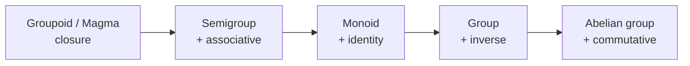
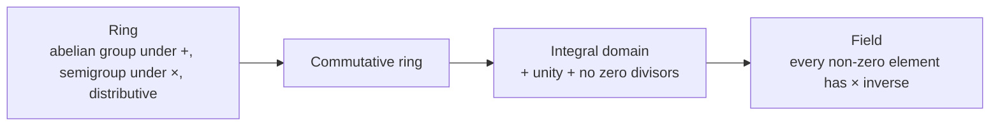
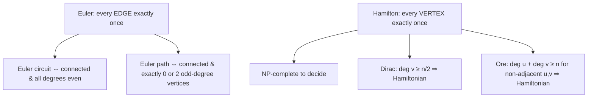
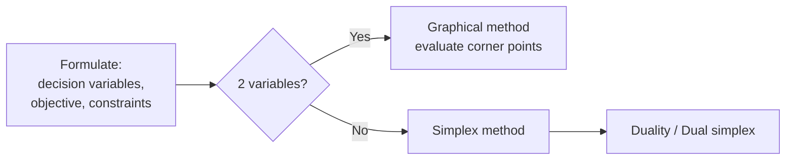
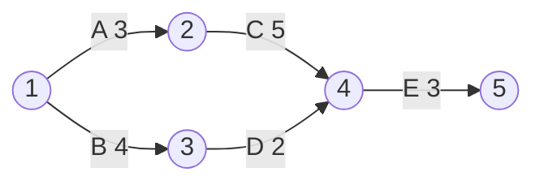

# Paper 2 · Unit 1 — Discrete Structures & Optimization

**Expected questions: 10–12 · Target: 9+ · Type: numerical + concept**

## Syllabus Checklist
- [ ] Mathematical logic: propositional & predicate logic, propositional equivalences, normal forms, predicates & quantifiers, nested quantifiers, rules of inference
- [ ] Sets & relations: set operations, representation & properties of relations, equivalence relations, partially ordering
- [ ] Counting, mathematical induction & discrete probability: basics of counting, pigeonhole principle, permutations & combinations, inclusion-exclusion, mathematical induction, probability, Bayes' theorem
- [ ] Group theory: groups, subgroups, semigroups, product & quotients of algebraic structures, isomorphism, homomorphism, automorphism, rings, integral domains, fields, applications of group theory
- [ ] Graph theory: simple graph, multigraph, weighted graph, paths & circuits, shortest paths, Eulerian & Hamiltonian, planar graph, graph colouring, bipartite graphs, trees & rooted trees, prefix codes, tree traversals, spanning trees & cut-sets
- [ ] Boolean algebra: Boolean functions & representation, simplification
- [ ] Optimization: linear programming (graphical, simplex, duality), integer programming, transportation & assignment, PERT-CPM

---

## 1. Mathematical Logic

### 1.1 Connectives & Truth Table

| p | q | ¬p | p∧q | p∨q | p→q | p↔q | p⊕q |
|---|---|----|-----|-----|-----|-----|-----|
| T | T | F | T | T | **T** | T | F |
| T | F | F | F | T | **F** | F | T |
| F | T | T | F | T | **T** | F | T |
| F | F | T | F | F | **T** | T | F |

**p → q is false ONLY when p is true and q is false.**

```
Implication family (p → q)
 Converse        q → p
 Inverse        ¬p → ¬q
 Contrapositive ¬q → ¬p   ≡ p → q   (logically equivalent)
 Converse ≡ Inverse
```

### 1.2 Important Equivalences
```
p → q        ≡ ¬p ∨ q
p ↔ q        ≡ (p → q) ∧ (q → p)
De Morgan    ¬(p ∧ q) ≡ ¬p ∨ ¬q ;  ¬(p ∨ q) ≡ ¬p ∧ ¬q
Absorption   p ∨ (p ∧ q) ≡ p ;  p ∧ (p ∨ q) ≡ p
Exportation  (p ∧ q) → r ≡ p → (q → r)
(p → q) ∧ (p → r) ≡ p → (q ∧ r)
(p → r) ∧ (q → r) ≡ (p ∨ q) → r
```
- **Tautology**: always true (p ∨ ¬p). **Contradiction**: always false. **Contingency**: neither.
- Functionally complete sets: {∧, ¬}, {∨, ¬}, {NAND}, {NOR}, {→, ¬}, {→, F}.

### 1.3 Normal Forms
- **CNF** = AND of ORs (product of sums); **DNF** = OR of ANDs (sum of products).
- Number of Boolean functions on n variables = **2^(2ⁿ)**.

### 1.4 Rules of Inference

| Rule | Form |
|------|------|
| Modus Ponens | p, p→q ⊢ q |
| Modus Tollens | ¬q, p→q ⊢ ¬p |
| Hypothetical syllogism | p→q, q→r ⊢ p→r |
| Disjunctive syllogism | p∨q, ¬p ⊢ q |
| Addition | p ⊢ p∨q |
| Simplification | p∧q ⊢ p |
| Resolution | p∨q, ¬p∨r ⊢ q∨r |
| Universal instantiation | ∀x P(x) ⊢ P(c) |
| Existential generalisation | P(c) ⊢ ∃x P(x) |

Fallacies: affirming the consequent (q, p→q ⊢ p ✗), denying the antecedent (¬p, p→q ⊢ ¬q ✗).

### 1.5 Predicates & Quantifiers
```
¬∀x P(x) ≡ ∃x ¬P(x)        ¬∃x P(x) ≡ ∀x ¬P(x)
∀x (P ∧ Q) ≡ ∀x P ∧ ∀x Q    ∃x (P ∨ Q) ≡ ∃x P ∨ ∃x Q
∃x∀y P(x,y) → ∀y∃x P(x,y)   (valid; converse NOT valid)
"All students are smart"     ∀x (S(x) → M(x))    ← use →  with ∀
"Some students are smart"    ∃x (S(x) ∧ M(x))    ← use ∧  with ∃
```

## 2. Sets & Relations

- |A ∪ B| = |A| + |B| − |A ∩ B|; |P(A)| = 2ⁿ; |A × B| = mn.
- Number of relations on A (|A| = n) = **2^(n²)**.

| Relation type | Count on n elements |
|---------------|---------------------|
| Reflexive | 2^(n² − n) |
| Irreflexive | 2^(n² − n) |
| Symmetric | 2^(n(n+1)/2) |
| Antisymmetric | 2ⁿ · 3^(n(n−1)/2) |
| Asymmetric | 3^(n(n−1)/2) |
| Reflexive & symmetric | 2^(n(n−1)/2) |
| Equivalence relations | Bell number Bₙ (1, 1, 2, 5, 15, 52, 203 …) |
| Functions A→B (|A|=m, |B|=n) | nᵐ |
| One-one (m ≤ n) | n!/(n−m)! |
| Onto | Σ (−1)ᵏ C(n,k)(n−k)ᵐ |
| Bijections (m = n) | n! |

### Equivalence relation = Reflexive + Symmetric + Transitive → partitions the set into **equivalence classes**.
### Partial order (POSET) = Reflexive + Antisymmetric + Transitive.

**Hasse diagram** of divisibility on {1, 2, 3, 6, 12}:
```
        12
        │
        6
       ╱ ╲
      2   3
       ╲ ╱
        1
```
- **Lattice**: every pair has LUB (join, ∨) and GLB (meet, ∧).
- **Bounded**: has 0 (least) and 1 (greatest). **Complemented**: every element has a complement. **Distributive**: no sub-lattice isomorphic to M₃ (diamond) or N₅ (pentagon).
- **Boolean algebra** = complemented + distributive lattice. Divisor lattice Dₙ is Boolean iff n is square-free.
- Total order (chain): every pair comparable. Well-ordered: every nonempty subset has least element.

```
 M3 (diamond)          N5 (pentagon)
      1                     1
    ╱ │ ╲                 ╱   ╲
   a  b  c               a     │
    ╲ │ ╱                │     c
      0                  b     │
                          ╲   ╱
                            0
 → Neither is distributive
```

## 3. Counting & Probability

```
Permutations  nPr = n!/(n−r)!       Combinations  nCr = n!/(r!(n−r)!)
Circular arrangements  (n−1)!       Necklace/garland (n−1)!/2
Permutations with repetition of types: n!/(p! q! r!)
r objects from n types with repetition: C(n+r−1, r)    (stars & bars)
Derangements  Dₙ = n! [1 − 1/1! + 1/2! − … + (−1)ⁿ/n!]   D1=0 D2=1 D3=2 D4=9 D5=44
Catalan Cₙ = C(2n,n)/(n+1)  → 1, 1, 2, 5, 14, 42 (BSTs with n keys, valid parentheses)
```

- **Pigeonhole principle**: n items into m boxes ⇒ some box has at least ⌈n/m⌉ items.
  *e.g. Min. people to ensure 2 share a birth month = 13.*
- **Inclusion–exclusion**: |A∪B∪C| = ΣA − Σ(A∩B) + (A∩B∩C).
- **Mathematical induction**: base case + (P(k) ⇒ P(k+1)). Strong induction assumes all P(1)…P(k).

### Recurrence relations
- Linear homogeneous: aₙ = c₁aₙ₋₁ + c₂aₙ₋₂ → characteristic equation r² − c₁r − c₂ = 0.
  Distinct roots r₁, r₂: aₙ = α r₁ⁿ + β r₂ⁿ; repeated root r: aₙ = (α + βn) rⁿ.
- Fibonacci: Fₙ = Fₙ₋₁ + Fₙ₋₂. Tower of Hanoi: Tₙ = 2Tₙ₋₁ + 1 = 2ⁿ − 1.

### Probability
```
P(A ∪ B) = P(A) + P(B) − P(A ∩ B)
P(A | B) = P(A ∩ B) / P(B)
Independent: P(A ∩ B) = P(A)·P(B)
Bayes: P(A|B) = P(B|A)·P(A) / P(B)
Binomial: P(X=k) = C(n,k) pᵏ (1−p)ⁿ⁻ᵏ ; mean np, variance npq
Poisson: P(X=k) = e^(−λ) λᵏ / k! ; mean = variance = λ
Expectation E[X] = Σ x·P(x) ; E[aX+b] = aE[X]+b ; Var = E[X²] − (E[X])²
```

## 4. Algebraic Structures





Key facts:
- **Lagrange's theorem**: order of a subgroup divides the order of the group (finite).
- Every group of **prime order** is cyclic and abelian. Every cyclic group is abelian.
- Number of generators of cyclic group of order n = **φ(n)** (Euler totient).
- Groups of order ≤ 5 are abelian. Smallest non-abelian group: S₃ (order 6).
- (Zₙ, +ₙ) is a group; (Zₙ*, ×ₙ) group of units has φ(n) elements; Zₙ is a **field iff n is prime**.
- Every finite integral domain is a field.
- **Homomorphism**: f(a∗b) = f(a)∘f(b). **Isomorphism**: bijective homomorphism. **Automorphism**: isomorphism onto itself.
- **Normal subgroup** H: gH = Hg ∀g; quotient group G/H has order |G|/|H|.
- Order of an element a = smallest k with aᵏ = e.

## 5. Graph Theory

### 5.1 Basic results
```
Handshaking lemma: Σ deg(v) = 2|E|  ⇒ number of odd-degree vertices is EVEN
Max edges in simple graph with n vertices = n(n−1)/2
Complete graph Kₙ: n(n−1)/2 edges, each vertex degree n−1
Complete bipartite K_{m,n}: mn edges
Tree with n vertices: n − 1 edges ; forest with k trees: n − k edges
Number of labelled trees on n vertices (Cayley): nⁿ⁻²  = spanning trees of Kₙ
Number of simple labelled graphs on n vertices: 2^(n(n−1)/2)
```

### 5.2 Euler vs Hamilton


- Kₙ is Eulerian iff n is odd. Kₙ has (n−1)!/2 Hamiltonian cycles.

### 5.3 Planar Graphs
```
Euler's formula (connected planar):  V − E + F = 2       (k components: V − E + F = k + 1)
Simple planar, V ≥ 3:          E ≤ 3V − 6
Planar with no triangles:      E ≤ 2V − 4
Kuratowski: G is planar ⇔ no subdivision of K₅ or K₃,₃
K₅ and K₃,₃ are the smallest non-planar graphs; K₄ is planar.
```

```
 K₃,₃ (non-planar)          K₄ (planar drawing)
 a   b   c                     1
 │╲ ╱│╲ ╱│                    ╱│╲
 │ ╳ │ ╳ │                   ╱ 4 ╲
 │╱ ╲│╱ ╲│                  ╱ ╱ ╲ ╲
 x   y   z                 2───────3
```

### 5.4 Colouring
- **Chromatic number χ(G)**: min colours so adjacent vertices differ.
- χ(Kₙ) = n; χ(bipartite with ≥1 edge) = 2; χ(tree, n ≥ 2) = 2; χ(cycle Cₙ) = 2 if n even, 3 if odd; χ(Wheel Wₙ) = 3 or 4.
- **Four colour theorem**: planar ⇒ χ ≤ 4.
- G is **bipartite ⇔ no odd cycle ⇔ 2-colourable**.
- Chromatic polynomial of tree with n vertices: k(k−1)ⁿ⁻¹; of Kₙ: k(k−1)…(k−n+1).

### 5.5 Other definitions
- **Independent set**, **clique**, **vertex cover**: α(G) + β(G) = n (independence number + vertex cover number).
- **Matching**; perfect matching. Edge chromatic number (Vizing): Δ ≤ χ′ ≤ Δ+1.
- **Cut vertex / articulation point**, **bridge**, **cut-set**. Vertex connectivity κ ≤ edge connectivity λ ≤ δ (min degree) — Whitney.
- **Isomorphism** invariants: same #vertices, #edges, degree sequence, cycles.
- **Prefix codes**: Huffman coding gives optimal prefix-free code using a binary tree.

## 6. Boolean Algebra
```
Idempotent  x + x = x,  x·x = x
Absorption  x + xy = x,  x(x + y) = x
x + x'y = x + y          (x + y)(x + z) = x + yz
Consensus   xy + x'z + yz = xy + x'z
Duality: swap + ↔ · and 0 ↔ 1
```
K-maps and minimisation are covered in [Unit 2](02-Computer-System-Architecture.md).

## 7. Optimization

### 7.1 Linear Programming (LPP)



**Graphical example**: Max Z = 3x + 5y, s.t. x + 2y ≤ 8, 3x + 2y ≤ 12, x, y ≥ 0.
```
 y
 6│\
 4│ \.        3x+2y=12
  │  •(0,4)
 3│   \ •(2,3)  ← intersection of x+2y=8 & 3x+2y=12
  │    \  \
  │ feasible\
 0└──────────•(4,0)──────── x
 Corner points: (0,0)→0, (4,0)→12, (2,3)→21, (0,4)→20  ⇒ Max Z = 21 at (2,3)
```
- Optimal solution occurs at a **corner point** (extreme point) of the convex feasible region.
- Special cases: **unbounded**, **infeasible**, **alternate optima** (objective parallel to a binding constraint), **degeneracy** (basic variable = 0).
- Slack (for ≤), surplus (for ≥), artificial variables (Big-M / Two-phase).
- Simplex: entering variable = most negative Cⱼ − Zⱼ (max) ; leaving variable = **minimum ratio test**.
- **Duality**: primal max ⇔ dual min; #constraints ↔ #variables; dual of dual = primal. Strong duality: optimal values equal. Weak duality: any feasible dual value bounds the primal.
- **Dual simplex**: starts optimal but infeasible, keeps optimality till feasibility.

### 7.2 Transportation Problem
- m sources, n destinations; balanced if supply = demand (else add dummy).
- A basic feasible solution has **m + n − 1** allocations (fewer → degenerate).
- Initial solution: **North-West Corner**, **Least Cost**, **Vogel's Approximation (VAM — best)**.
- Optimality: **MODI (u-v) method** or Stepping stone.

### 7.3 Assignment Problem
- n jobs to n persons, one-to-one; solved by **Hungarian method** (row reduction, column reduction, cover zeros with min lines; if lines = n ⇒ optimal).
- Special case of transportation (all supplies/demands = 1); highly degenerate.

### 7.4 Integer Programming
- Variables restricted to integers: **Branch and Bound**, **Gomory's cutting plane**.

### 7.5 PERT-CPM


Paths: A-C-E = 3+5+3 = **11** (critical), B-D-E = 4+2+3 = 9. Project duration = 11.

| Concept | Formula |
|---------|---------|
| Earliest start (forward pass) | ES = max(EF of predecessors) |
| Latest finish (backward pass) | LF = min(LS of successors) |
| Total float | LS − ES = LF − EF |
| Critical activity | Total float = 0 |
| PERT expected time | tₑ = (a + 4m + b)/6 |
| PERT variance | σ² = ((b − a)/6)² |
| Probability | Z = (T − Tₑ)/σ_path |

- **CPM**: deterministic time, cost-oriented (crashing). **PERT**: probabilistic (β-distribution), event-oriented.
- **Crashing**: reducing duration by adding resources; crash cost slope = (crash cost − normal cost)/(normal time − crash time).
- **Resource levelling**: smooth resource usage without changing project duration (use floats).

## 8. Deeper Dive — Worked Simplex, Transportation, Assignment, Groups & Recurrences

### 8.1 Simplex Method — Full Worked Example

Max Z = 3x₁ + 5x₂ subject to x₁ ≤ 4, 2x₂ ≤ 12, 3x₁ + 2x₂ ≤ 18, x₁, x₂ ≥ 0.
Add slacks s₁, s₂, s₃.

**Tableau 0** (Z row written as Z − 3x₁ − 5x₂ = 0)

| Basic | x₁ | x₂ | s₁ | s₂ | s₃ | RHS | Ratio |
|-------|----|----|----|----|----|-----|-------|
| s₁ | 1 | 0 | 1 | 0 | 0 | 4 | — |
| s₂ | 0 | **2** | 0 | 1 | 0 | 12 | 12/2 = **6** ← |
| s₃ | 3 | 2 | 0 | 0 | 1 | 18 | 18/2 = 9 |
| Z | −3 | **−5** ↑ | 0 | 0 | 0 | 0 | |

x₂ enters (most negative), s₂ leaves (minimum ratio). Pivot = 2.

**Tableau 1**

| Basic | x₁ | x₂ | s₁ | s₂ | s₃ | RHS | Ratio |
|-------|----|----|----|----|----|-----|-------|
| s₁ | 1 | 0 | 1 | 0 | 0 | 4 | 4 |
| x₂ | 0 | 1 | 0 | 1/2 | 0 | 6 | — |
| s₃ | **3** | 0 | 0 | −1 | 1 | 6 | 6/3 = **2** ← |
| Z | **−3** ↑ | 0 | 0 | 5/2 | 0 | 30 | |

x₁ enters, s₃ leaves.

**Tableau 2 (optimal — no negative entries in Z row)**

| Basic | x₁ | x₂ | s₁ | s₂ | s₃ | RHS |
|-------|----|----|----|----|----|-----|
| s₁ | 0 | 0 | 1 | 1/3 | −1/3 | 2 |
| x₂ | 0 | 1 | 0 | 1/2 | 0 | 6 |
| x₁ | 1 | 0 | 0 | −1/3 | 1/3 | 2 |
| Z | 0 | 0 | 0 | 3/2 | 1 | **36** |

**Optimal: x₁ = 2, x₂ = 6, Z = 36.** Shadow prices (dual solution) are read from the Z row under the slacks: y₁ = 0, y₂ = 3/2, y₃ = 1 — and 4(0) + 12(3/2) + 18(1) = 36 confirms strong duality.

### 8.2 Transportation Problem — NWC + MODI

| | D1 | D2 | D3 | Supply |
|-|----|----|----|--------|
| S1 | 4 | 6 | 8 | 20 |
| S2 | 5 | 8 | 7 | 30 |
| S3 | 6 | 9 | 5 | 25 |
| Demand | 10 | 25 | 40 | 75 (balanced) |

**North-West Corner**: S1D1 = 10, S1D2 = 10, S2D2 = 15, S2D3 = 15, S3D3 = 25 → 5 allocations = m + n − 1 ✓.
Cost = 40 + 60 + 120 + 105 + 125 = **450**.

**MODI test** (set u₁ = 0; for basic cells uᵢ + vⱼ = cᵢⱼ): v₁ = 4, v₂ = 6, u₂ = 2, v₃ = 5, u₃ = 0.
Reduced cost of non-basic cell = cᵢⱼ − uᵢ − vⱼ: S1D3 = 3, **S2D1 = 5 − 2 − 4 = −1** (negative → improve), S3D1 = 2, S3D2 = 3.

Closed loop for S2D1: S2D1(+) → S1D1(−) → S1D2(+) → S2D2(−); θ = min(10, 15) = 10.
New allocation: S1D2 = 20, S2D1 = 10, S2D2 = 5, S2D3 = 15, S3D3 = 25 → cost = 120 + 50 + 40 + 105 + 125 = **440**.
Recomputing u, v gives all reduced costs ≥ 0 → **optimal cost 440**.

### 8.3 Assignment Problem — Hungarian Method

| | J1 | J2 | J3 |
|-|----|----|----|
| A | 9 | 2 | 7 |
| B | 6 | 4 | 3 |
| C | 5 | 8 | 1 |

```
Row reduction (subtract row minima 2, 3, 1)     Column reduction (col minima 3, 0, 0)
   A  7  0  5                                       A  4  0  5
   B  3  1  0                                       B  0  1  0
   C  4  7  0                                       C  1  7  0
Zeros can be covered by 3 lines = n ⇒ optimal: A→J2, B→J1, C→J3
Minimum cost = 2 + 6 + 1 = 9
```

### 8.4 Groups — Cayley Tables

```
(Z₄, +₄)                        Klein four-group V₄ = {e, a, b, c}
 +  │ 0 1 2 3                     ·  │ e a b c
 ───┼────────                     ───┼────────
 0  │ 0 1 2 3                     e  │ e a b c
 1  │ 1 2 3 0                     a  │ a e c b
 2  │ 2 3 0 1                     b  │ b c e a
 3  │ 3 0 1 2                     c  │ c b a e
 cyclic (generators 1, 3)        not cyclic; every element has order 2
```
- Both have order 4 and are abelian, but are **not isomorphic** (Z₄ has an element of order 4; V₄ does not).
- Subgroups of Z₄: {0}, {0, 2}, Z₄. Cosets of H = {0, 2}: H and {1, 3} → Z₄/H ≅ Z₂.
- Every group of order 4 is isomorphic to Z₄ or V₄; every group of order 6 is Z₆ or S₃.

### 8.5 Solving a Recurrence

aₙ = 5aₙ₋₁ − 6aₙ₋₂, a₀ = 1, a₁ = 0.
```
Characteristic equation: r² − 5r + 6 = 0 → r = 2, 3
General: aₙ = α·2ⁿ + β·3ⁿ
a₀: α + β = 1 ;  a₁: 2α + 3β = 0  ⇒ β = −2, α = 3
aₙ = 3·2ⁿ − 2·3ⁿ          check: a₂ = 12 − 18 = −6 = 5(0) − 6(1) ✔
```
Non-homogeneous: aₙ = 2aₙ₋₁ + 1 (Hanoi) → particular solution constant c = 2c + 1 ⇒ c = −1; aₙ = A·2ⁿ − 1; a₁ = 1 ⇒ aₙ = 2ⁿ − 1.

**Generating functions**: the sequence 1, 1, 1, … ↔ 1/(1 − x); aₙ = C(n + k − 1, k − 1) ↔ 1/(1 − x)ᵏ. Used to count integer solutions and to solve recurrences.

### 8.6 Graph Isomorphism & Colouring Checks

```
 G1: square a-b-c-d with diagonal a–c      G2: vertices p, q, r, s with edges
     a ───── b                                 p–q, q–r, r–s, s–p, q–s
     │ ╲     │
     │   ╲   │                              Degrees: p 2, q 3, r 2, s 3
     │     ╲ │
     d ───── c                              Degrees: a 3, b 2, c 3, d 2
```
- Both graphs have 4 vertices, 5 edges and degree sequence (3, 3, 2, 2) — each is K₄ minus one edge.
- Mapping a→q, c→s, b→p, d→r preserves every edge → **isomorphic**.
- χ(G1) = 3, because the triangle a–b–c needs three colours.

Quick invariant checklist for isomorphism: number of vertices and edges, degree sequence, number of cycles of each length, connectivity, bipartiteness. Matching invariants are necessary, not sufficient — finish by exhibiting a mapping.

---

## Previous Year Questions (PYQ pattern)

**Logic**
1. Which is a tautology? (a) p→(p∨q) (b) (p∨q)→p (c) p∧¬p (d) p→¬p — **Ans: (a)**
2. The contrapositive of "If it rains, the ground is wet" is: **"If the ground is not wet, it did not rain."**
3. ¬∀x (P(x) → Q(x)) is equivalent to: **∃x (P(x) ∧ ¬Q(x))**
4. "Every student has a computer": with S(x), C(x): **∀x (S(x) → C(x))**
5. Number of Boolean functions of 3 variables: 2⁸ = **256**
6. Which is functionally complete? (a) {∧,∨} (b) {↑} NAND (c) {∨,↔} (d) {∧,→}... — **NAND**
7. From p→q and ¬q we infer ¬p — this is: **Modus Tollens**

**Sets, relations, functions**

8. Number of reflexive relations on a set of 4 elements: 2¹² = **4096**
9. Number of symmetric relations on 3 elements: 2⁶ = **64**
10. Number of equivalence relations on {1,2,3,4}: **15**
11. Number of onto functions from a 4-set to a 3-set: 3⁴ − 3·2⁴ + 3·1 = 81 − 48 + 3 = **36**
12. Relation "≤" on integers is: **partial order (in fact total)**
13. Which lattice is not distributive? **Pentagon N₅ / Diamond M₃**
14. D₃₀ (divisors of 30) is a Boolean algebra because 30 is: **square-free** (D₁₂ is not)

**Counting**

15. Minimum students so that at least 3 share birthday month: 2×12 + 1 = **25**
16. Number of derangements of 4 letters: **9**
17. Number of ways to arrange letters of "MISSISSIPPI": 11!/(4!4!2!) = **34650**
18. Number of non-negative integer solutions of x+y+z = 10: C(12,2) = **66**
19. Solution of aₙ = 6aₙ₋₁ − 9aₙ₋₂ has form: **(α + βn)3ⁿ**
20. Number of distinct BSTs with 3 keys: **5** (Catalan)

**Probability**

21. Two dice thrown; probability sum = 7: **1/6**
22. A box: 3 defective of 10. Probability of picking 2 non-defective without replacement: (7/10)(6/9) = **7/15**
23. Bayes problem: Machines A, B produce 60%, 40%; defect rates 2%, 3%. P(A | defective) = 0.012/0.024 = **1/2**

**Groups**

24. Which is NOT a group? (a) (Z,+) (b) (Q−{0},×) (c) (Z,×) (d) (R,+) — **Ans: (c)** (no inverses)
25. A group of order 7 is: **cyclic (prime order)**
26. Number of generators of cyclic group of order 12: φ(12) = **4**
27. Possible orders of subgroups of a group of order 15: **1, 3, 5, 15**
28. Zₙ is a field iff: **n is prime**
29. Every finite integral domain is a: **field**

**Graphs**

30. Sum of degrees of a graph with 15 edges: **30**
31. A connected planar graph has 10 vertices and 15 edges. Number of faces: 15 − 10 + 2 = **7**
32. Max edges in simple planar graph with 8 vertices: 3×8 − 6 = **18**
33. Which graph is non-planar? (a) K₄ (b) K₂,₃ (c) K₃,₃ (d) Q₃ — **(c)**
34. Kₙ has Euler circuit iff: **n is odd**
35. Chromatic number of a cycle with 7 vertices: **3**
36. Number of spanning trees of K₄: 4² = **16**
37. Graph with degree sequence (3,3,3,1) — possible? Sum = 10 even → yes; (3,3,3,3,1)? Sum = 13 odd → **No**
38. Chromatic number of bipartite graph: **2**

**Optimization**

39. In a transportation problem with 4 sources and 5 destinations, a non-degenerate BFS has: **8** allocations
40. The best initial basic feasible solution method: **Vogel's approximation**
41. Assignment problems are solved by: **Hungarian method**
42. The dual of a primal with 3 variables and 5 constraints has: **5 variables, 3 constraints**
43. In PERT, a=2, m=5, b=14: tₑ = (2+20+14)/6 = **6**, σ² = (12/6)² = **4**
44. Activities on the critical path have total float: **zero**
45. Simplex leaving variable is chosen by: **minimum ratio test**
46. If the objective function is parallel to a binding constraint: **multiple optimal solutions**

**More practice questions**

47. In simplex, if all entries in the pivot column are ≤ 0, the LPP has: **an unbounded solution**
48. If an artificial variable remains in the basis at a positive level in the optimal tableau: **the problem is infeasible**
49. Shadow price of a constraint equals the optimal value of the corresponding: **dual variable**
50. A transportation solution with fewer than m + n − 1 positive allocations is: **degenerate**
51. In MODI, a negative reduced cost (cᵢⱼ − uᵢ − vⱼ) for an unoccupied cell means: **the solution can be improved**
52. Unbalanced assignment problems are balanced by adding: **dummy rows or columns with zero cost**
53. Number of subgroups of Z₄: **3**
54. Klein four-group is: **abelian but not cyclic**
55. Solution of aₙ = 4aₙ₋₁ − 4aₙ₋₂ has the form: **(α + βn)2ⁿ**
56. Coefficient of x⁵ in 1/(1 − x)³: C(7, 2) = **21**
57. The number of edges in a graph with degree sequence (3, 3, 2, 2): **5**
58. Which statement is true? (a) every abelian group is cyclic (b) every cyclic group is abelian (c) every group of order 4 is cyclic (d) S₃ is abelian — **Ans: (b)**
59. Order of element 2 in (Z₆, +₆): **3**
60. Number of perfect matchings in K₄: **3**

## Quick Revision Box
- p→q ≡ ¬p∨q ≡ ¬q→¬p · Relations on n: 2^(n²)
- V − E + F = 2 · E ≤ 3V − 6 · Cayley nⁿ⁻² · Odd-degree vertices even
- Lagrange: |H| divides |G| · Zₙ field iff n prime · generators = φ(n)
- Transport BFS = m + n − 1 · PERT tₑ = (a+4m+b)/6
