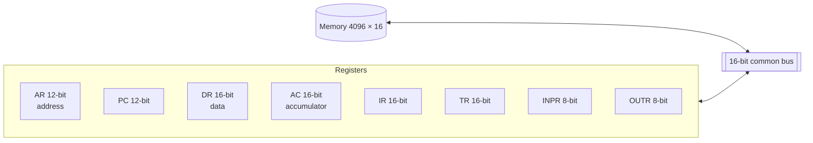
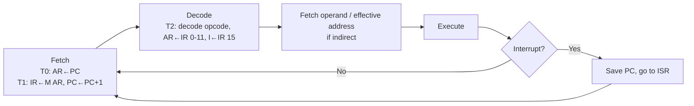
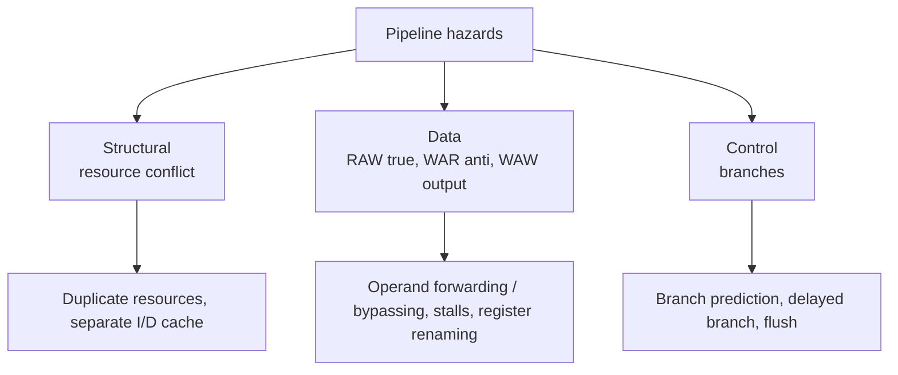
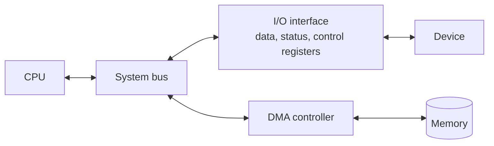
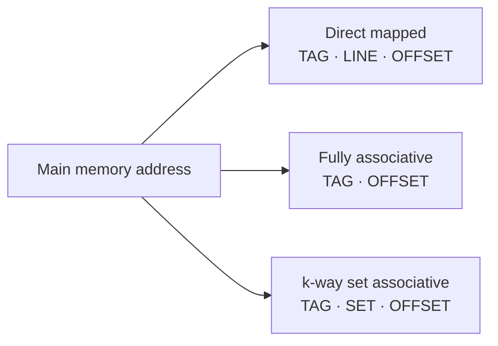
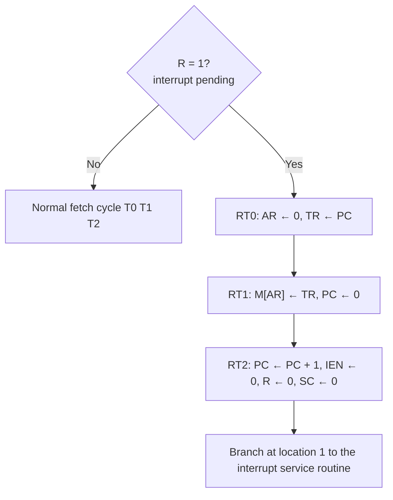

# Paper 2 · Unit 2 — Computer System Architecture

**Expected questions: 8–10 · Target: 8+ · Type: numericals (cache, pipeline, number systems) + concepts (Morris Mano)**

## Syllabus Checklist
- [ ] Digital logic circuits & components: gates, Boolean algebra, K-maps, combinational circuits, flip-flops, sequential circuits, ICs, decoders, multiplexers, registers, counters, memory unit
- [ ] Data representation: number systems, complements, fixed & floating point, error-detection codes, computer arithmetic
- [ ] Register transfer & micro-operations
- [ ] Basic computer organization & design: instruction codes, registers, timing & control, instruction cycle, interrupts
- [ ] Programming the basic computer; microprogrammed control
- [ ] CPU: general register & stack organisation, instruction formats, addressing modes, RISC vs CISC
- [ ] Pipeline & vector processing
- [ ] I/O organisation: interfaces, asynchronous transfer, modes of transfer, priority interrupt, DMA, serial communication
- [ ] Memory hierarchy: main, auxiliary, associative, cache, virtual memory
- [ ] Multiprocessors: interconnection structures, arbitration, synchronisation, cache coherence, multicore

---

## 1. Digital Logic

### 1.1 Gates

| Gate | Expression | Output 1 when |
|------|-----------|---------------|
| AND | AB | all inputs 1 |
| OR | A + B | any input 1 |
| NOT | A' | input 0 |
| NAND | (AB)' | any input 0 — **universal** |
| NOR | (A+B)' | all inputs 0 — **universal** |
| XOR | A⊕B = A'B + AB' | inputs differ (odd number of 1s) |
| XNOR | (A⊕B)' | inputs equal |

Gates needed using only NAND: NOT = 1, AND = 2, OR = 3, XOR = **4**, XNOR = 5.
Using only NOR: NOT = 1, OR = 2, AND = 3, XNOR = **4**, XOR = 5.

### 1.2 K-Map Simplification

```
 4-variable K-map (Gray code order)          Example: F = Σm(0,2,5,7,8,10,13,15)
          CD                                             CD
 AB    00  01  11  10                          AB    00  01  11  10
 00  │ m0  m1  m3  m2                          00  │ 1   0   0   1      corners → B'D'
 01  │ m4  m5  m7  m6                          01  │ 0   1   1   0      middle  → BD
 11  │ m12 m13 m15 m14                         11  │ 0   1   1   0
 10  │ m8  m9  m11 m10                         10  │ 1   0   0   1      F = BD + B'D' = B ⊙ D
```
Rules: group 1, 2, 4, 8, 16 adjacent cells (wrap-around allowed); larger groups = fewer literals; use don't-cares (X) when helpful.
- **Prime implicant**: largest possible group. **Essential PI**: covers a minterm no other PI covers.

### 1.3 Combinational Circuits

```
 Half adder                       Full adder
 S = A ⊕ B                        S    = A ⊕ B ⊕ Cin
 C = AB                           Cout = AB + Cin(A ⊕ B)
                                  (2 half adders + 1 OR gate)
```

| Circuit | Function |
|---------|----------|
| Multiplexer 2ⁿ:1 | n select lines choose one of 2ⁿ inputs; any n-var function with 2ⁿ:1 MUX (or n+1 var with 2ⁿ:1 + inverter) |
| Demultiplexer 1:2ⁿ | Routes one input to one of 2ⁿ outputs |
| Decoder n:2ⁿ | Activates one of 2ⁿ outputs (minterm generator) |
| Encoder 2ⁿ:n | Reverse; priority encoder handles multiple inputs |
| Comparator | A>B, A=B, A<B |
| Ripple carry adder | n full adders; delay ∝ n |
| Carry look-ahead adder | Gᵢ = AᵢBᵢ, Pᵢ = Aᵢ⊕Bᵢ; Cᵢ₊₁ = Gᵢ + PᵢCᵢ — faster |

### 1.4 Flip-Flops

| FF | Characteristic equation | Notes |
|----|------------------------|-------|
| SR | Q⁺ = S + R'Q (SR = 0) | S=R=1 invalid |
| JK | Q⁺ = JQ' + K'Q | J=K=1 toggles; race-around fixed by master-slave |
| D | Q⁺ = D | Delay / data latch |
| T | Q⁺ = T ⊕ Q | Toggle; used in counters |

```
 Excitation table (what inputs give Q → Q⁺)
 Q Q⁺ │ S R │ J K │ D │ T
 0 0  │ 0 X │ 0 X │ 0 │ 0
 0 1  │ 1 0 │ 1 X │ 1 │ 1
 1 0  │ 0 1 │ X 1 │ 0 │ 1
 1 1  │ X 0 │ X 0 │ 1 │ 0
```

### 1.5 Counters & Registers
- n flip-flops → **mod-2ⁿ** ripple counter. Ring counter with n FFs → mod-n. **Johnson (twisted ring)** with n FFs → **mod-2n**.
- Asynchronous (ripple) counter delay = n × t_pd; synchronous counters clock all FFs together.
- Shift registers: SISO, SIPO, PISO, PIPO.
- Memory: 2ᵏ × n RAM needs k address lines and n data lines. e.g. 4K × 8 → 12 address lines.
- Number of 1K × 4 chips to build 16K × 8: (16 × 8)/(1 × 4) = **32**.

## 2. Data Representation

### 2.1 Signed numbers (n bits)

| Representation | Range | Zeros |
|----------------|-------|-------|
| Sign-magnitude | −(2ⁿ⁻¹−1) … +(2ⁿ⁻¹−1) | Two (+0, −0) |
| 1's complement | −(2ⁿ⁻¹−1) … +(2ⁿ⁻¹−1) | Two |
| **2's complement** | **−2ⁿ⁻¹ … +(2ⁿ⁻¹−1)** | One |

8-bit 2's complement: −128 to +127. −5 = 11111011.
**Overflow** in 2's-complement addition: carry into MSB ≠ carry out of MSB (or adding two same-sign numbers gives opposite sign).
r's complement of N (n digits) = rⁿ − N; (r−1)'s complement = rⁿ − 1 − N.

### 2.2 Floating Point — IEEE 754

```
 Single precision (32 bits)
 ┌───┬──────────────┬────────────────────────────────┐
 │ S │ Exponent (8) │ Mantissa / fraction (23)       │   bias = 127
 └───┴──────────────┴────────────────────────────────┘
 Double precision (64 bits): 1 | 11 | 52            bias = 1023
 Value = (−1)^S × 1.M × 2^(E − bias)
```
Example: −6.25 = −110.01₂ = −1.1001 × 2² → S=1, E = 129 = 10000001, M = 1001000…
→ **C0C80000** (hex).
- E = 0, M = 0 → ±0; E = all 1s, M = 0 → ±∞; E = all 1s, M ≠ 0 → NaN; E = 0, M ≠ 0 → denormal.

### 2.3 Codes
- **BCD** (8421), **Excess-3** (BCD + 3, self-complementing), **Gray code** (one bit changes; G = B ⊕ (B >> 1)).
- **Parity** detects single-bit (odd number of) errors.
- **Hamming code**: number of parity bits r satisfies 2ʳ ≥ m + r + 1; parity bits at positions 1, 2, 4, 8 …; detects 2, corrects 1 (with extra bit: SEC-DED).
- **CRC**: polynomial division; used in networks.

### 2.4 Arithmetic
- **Booth's algorithm** (signed multiplication): look at Qₙ Qₙ₊₁ → 10: subtract M; 01: add M; 00/11: shift only; arithmetic right shift each step.
- Division: restoring and non-restoring.

## 3. Register Transfer & Micro-operations
- RTL: `R2 ← R1`, `P: R2 ← R1` (conditional on control P).
- Micro-operation types: register transfer, arithmetic (add, sub, inc, dec), logic, shift (logical, circular, arithmetic).
- Common bus with k registers of n bits: n multiplexers of k×1 each, log₂k select lines.

## 4. Basic Computer (Mano)



Instruction format (16 bits): `I (1) | Opcode (3) | Address (12)` — I = 0 direct, 1 indirect.
- Instruction types: memory-reference (opcode 000–110), register-reference (0111…), I/O (1111…).

### Instruction Cycle



## 5. Control Unit

| Hardwired | Microprogrammed |
|-----------|-----------------|
| Logic gates, decoders, sequence counter | Control memory stores microinstructions |
| Fast | Slower |
| Difficult to modify | Flexible, easy to modify |
| Used in RISC | Used in CISC |

- Control word bits: **horizontal** microprogramming (one bit per control signal, wide, parallel, fast) vs **vertical** (encoded, narrow, needs decoder).
- Control address register (CAR), control data register (CDR), sequencer, mapping logic.
- Control memory size = (#microinstructions) × (width).

## 6. CPU Organisation

### 6.1 Instruction formats (by number of addresses)
Evaluate X = (A + B) × (C + D):

| Type | Code |
|------|------|
| 3-address | ADD R1, A, B · ADD R2, C, D · MUL X, R1, R2 |
| 2-address | MOV R1, A · ADD R1, B · MOV R2, C · ADD R2, D · MUL R1, R2 · MOV X, R1 |
| 1-address (accumulator) | LOAD A · ADD B · STORE T · LOAD C · ADD D · MUL T · STORE X |
| 0-address (stack) | PUSH A · PUSH B · ADD · PUSH C · PUSH D · ADD · MUL · POP X |

### 6.2 Addressing Modes (very frequent)

| Mode | Effective address | Use |
|------|------------------|-----|
| Implied | Operand implicit | CMA, stack ops |
| Immediate | Operand in instruction | Constants |
| Register | Operand in register | Fast |
| Register indirect | EA = (R) | Pointers |
| Direct (absolute) | EA = A | Global variables |
| Indirect | EA = M[A] | Pointers |
| Auto-increment/decrement | EA = (R), then R±1 | Arrays, stacks |
| Relative | EA = PC + A | Branches, **position-independent code** |
| Indexed | EA = XR + A | Arrays |
| Base register | EA = BR + A | Relocation |

Memory references to get operand: immediate 0, direct 1, indirect 2.

### 6.3 RISC vs CISC

| RISC | CISC |
|------|------|
| Few, simple, fixed-length instructions | Many, complex, variable length |
| Few addressing modes | Many addressing modes |
| Load/store architecture | Memory operands in many instructions |
| Many registers, register windows | Fewer registers |
| Hardwired control | Microprogrammed |
| 1 instruction per cycle, pipelining easy | Multi-cycle |
| ARM, MIPS, SPARC, RISC-V | x86, VAX, IBM 370 |

## 7. Pipelining

```
 4-stage instruction pipeline (IF, ID, EX, WB), 5 instructions
 Cycle:   1    2    3    4    5    6    7    8
 I1      IF   ID   EX   WB
 I2           IF   ID   EX   WB
 I3                IF   ID   EX   WB
 I4                     IF   ID   EX   WB
 I5                          IF   ID   EX   WB
 Total = k + (n − 1) = 4 + 4 = 8 cycles
```

```
Pipelined time   T_pipe = (k + n − 1) × t_p        (t_p = max stage delay + latch delay)
Non-pipelined    T_seq  = n × t_n                   (t_n = sum of stage delays)
Speedup          S = n·t_n / ((k + n − 1)·t_p)  → k  as n → ∞ (ideal, equal stages)
Efficiency       η = S / k
Throughput       n / T_pipe
With stalls:     CPI_pipe = 1 + stall cycles per instruction ;  S = CPI_nonpipe / CPI_pipe
```

### Hazards



- Only **RAW** occurs in a simple in-order pipeline; WAR and WAW occur in out-of-order execution.
- **Flynn's taxonomy**: SISD (uniprocessor), **SIMD** (vector/array processors, GPU), MISD (rare; fault-tolerant), MIMD (multiprocessors).
- **Vector processing**: one instruction operates on arrays; **array processors** = SIMD with multiple PEs.
- **Amdahl's law**: Speedup = 1 / ((1 − f) + f/s), f = fraction enhanced, s = speedup of that fraction.
- Superscalar (multiple issue), VLIW, superpipelining.

## 8. I/O Organisation



| Mode | How | CPU involvement |
|------|-----|-----------------|
| Programmed I/O | CPU polls status flag | Very high (busy waiting) |
| Interrupt-driven | Device interrupts CPU | Per word |
| **DMA** | DMA controller transfers block directly to memory | Only at start/end |
| I/O processor (channel) | Dedicated processor | Minimal |

- DMA modes: **burst** (block at once), **cycle stealing** (one word per cycle), **transparent** (when CPU not using bus).
- DMA signals: Bus Request (BR) and Bus Grant (BG).
- Asynchronous transfer: **strobe** (one control line) or **handshaking** (two lines — data valid & data accepted).
- **Priority interrupts**: polling (software), **daisy chaining** (serial hardware — nearest device highest priority), parallel priority (priority encoder).
- Vectored interrupt: device supplies ISR address. Non-maskable interrupt (NMI): cannot be disabled.
- Isolated I/O (separate address space, IN/OUT instructions) vs **memory-mapped I/O** (same address space).
- Serial communication: asynchronous (start bit, data, parity, stop bits) — UART; synchronous — USRT.

## 9. Memory Hierarchy

```
 ┌─────────────────────────────┐  ▲  faster, costlier, smaller
 │ Registers                   │  │
 ├─────────────────────────────┤  │
 │ Cache L1 / L2 / L3 (SRAM)   │  │
 ├─────────────────────────────┤  │
 │ Main memory (DRAM)          │  │
 ├─────────────────────────────┤  │
 │ SSD / Magnetic disk         │  │
 ├─────────────────────────────┤  │
 │ Tape / Optical              │  ▼  slower, cheaper, larger
 └─────────────────────────────┘
```
- SRAM (flip-flops, no refresh, cache) vs DRAM (capacitors, refresh, main memory).
- ROM, PROM, EPROM (UV erase), EEPROM (electrical), Flash.
- **Associative memory (CAM)**: accessed by content; used in TLB.
- **Locality of reference**: temporal (same item soon) & spatial (nearby items soon).

### 9.1 Cache Mapping



**Worked example**: Main memory 4 GB (32-bit address), cache 64 KB, block 32 B.
```
Offset bits  = log₂ 32 = 5
Lines        = 64 KB / 32 B = 2048 → 11 bits
Direct:  TAG = 32 − 11 − 5 = 16 | LINE 11 | OFFSET 5
4-way:   sets = 2048/4 = 512 → 9 bits ; TAG = 32 − 9 − 5 = 18
Fully:   TAG = 32 − 5 = 27
Tag directory size (direct) = 2048 × 16 bits (+ valid/dirty bits)
```

```
Hit ratio h ;  cache access tc ; memory access tm
Avg access time (simultaneous/parallel)   T = h·tc + (1 − h)·tm
Avg access time (hierarchical/serial)     T = h·tc + (1 − h)(tc + tm)
AMAT = Hit time + Miss rate × Miss penalty
```
- Replacement: LRU, FIFO, random (needed for associative/set-associative only).
- Write policies: **write-through** (update memory immediately; with write buffer) vs **write-back** (dirty bit, on eviction).
- Write miss: write-allocate (usually with write-back) vs no-write-allocate (with write-through).
- Misses: **Compulsory** (cold), **Capacity**, **Conflict** (3 Cs).

### 9.2 Virtual Memory
Covered in depth in [Unit 5 (OS)](05-System-Software-OS.md): paging, TLB, page replacement.
- Effective access with TLB: EAT = h(t_TLB + t_m) + (1 − h)(t_TLB + 2t_m) (single-level page table).

### 9.3 Magnetic Disk
```
Disk access time = Seek time + Rotational latency + Transfer time
Avg rotational latency = ½ × (60/RPM) s
Capacity = surfaces × tracks × sectors/track × bytes/sector
```
e.g. 7200 RPM → one rotation 8.33 ms → avg latency **4.17 ms**.

## 10. Multiprocessors
- **Tightly coupled** (shared memory, UMA/NUMA) vs **loosely coupled** (distributed memory, message passing).
- Interconnection structures: time-shared common bus, multiport memory, **crossbar switch** (n² switches, non-blocking), multistage networks (Omega: (n/2) log₂ n 2×2 switches), hypercube (n-cube: 2ⁿ nodes, each with n links, diameter n).
- Inter-processor arbitration: serial (daisy chain), parallel, dynamic (time-slice, polling, LRU, FIFO, rotating daisy chain).
- Synchronisation: test-and-set, semaphores, mutual exclusion via hardware lock.
- **Cache coherence**: write-invalidate / write-update; snoopy protocols; **MESI** (Modified, Exclusive, Shared, Invalid); directory-based protocols.
- **Multicore**: multiple cores on one chip sharing L2/L3 cache; hyper-threading (SMT).

## 11. Deeper Dive — Booth Trace, Instruction Encoding, Cache Behaviour & Interrupts

### 11.1 Booth's Algorithm — Full Trace: 7 × (−3), 4 bits

M = 0111 (7), −M = 1001, Q = 1101 (−3), A = 0000, Q₋₁ = 0.

| Step | Q₀ Q₋₁ | Operation | A | Q | Q₋₁ |
|------|-------|-----------|---|---|-----|
| Init | | | 0000 | 1101 | 0 |
| 1 | 1 0 | A ← A − M | 1001 | 1101 | 0 |
| | | Arithmetic shift right | 1100 | 1110 | 1 |
| 2 | 0 1 | A ← A + M | 0011 | 1110 | 1 |
| | | Arithmetic shift right | 0001 | 1111 | 0 |
| 3 | 1 0 | A ← A − M | 1010 | 1111 | 0 |
| | | Arithmetic shift right | 1101 | 0111 | 1 |
| 4 | 1 1 | Shift only | 1110 | 1011 | 1 |

Result A Q = **1110 1011** = −21 in 8-bit 2's complement ✔.
Booth reduces additions for runs of 1s; worst case is alternating bits (0101…).

### 11.2 Instruction Encoding Numericals

**Fixed format**: 32-bit instructions, 64 registers, 45 distinct opcodes, format `opcode | Rd | Rs | immediate`.
```
opcode bits = ⌈log₂ 45⌉ = 6        register field = log₂ 64 = 6 each
immediate   = 32 − 6 − 6 − 6 = 14 bits  → signed range −8192 … +8191
```

**Expanding opcode**: 16-bit instruction, 4-bit address fields.
```
3-address: 4-bit opcode → 2⁴ = 16 patterns; use 15, keep 1 as escape
2-address: escape (4 bits) + 4 more opcode bits → 16 patterns; use 14, keep 2
1-address: 2 escapes × 16 = 32 patterns; use 31, keep 1
0-address: 1 escape × 16 = 16 instructions
General rule: unused patterns at level k × 2^(field width) = patterns available at level k+1
```

### 11.3 Mapping an Address into a Set-Associative Cache

2-way set associative, 128 lines, 16-byte blocks, 16-bit byte address **0x1A2B**.
```
Sets = 128 / 2 = 64 → 6 set bits ; offset = 4 bits ; tag = 16 − 6 − 4 = 6 bits
Block number = 0x1A2B >> 4 = 0x1A2 = 418
Set   = 418 mod 64 = 34           Tag = 418 div 64 = 6         Offset = 0xB = 11
```

### 11.4 Hits & Misses for Three Organisations

Block reference string: **0, 4, 0, 4, 8, 0** with 4 cache lines.

| Organisation | Trace | Misses |
|-------------|-------|--------|
| Direct mapped (line = block mod 4) | 0, 4, 8 all map to line 0 → every access evicts the previous | **6** |
| 2-way set assoc., LRU (set = block mod 2) | 0 M, 4 M, 0 H, 4 H, 8 M (evict 0), 0 M (evict 4) | **4** |
| Fully associative, LRU | 0 M, 4 M, 0 H, 4 H, 8 M, 0 H | **3** |

Higher associativity removes **conflict misses**; the three first-time misses are **compulsory**.

### 11.5 Interrupt Cycle (Mano basic computer)


Return address is saved in memory location 0; the ISR ends with an indirect branch through location 0 (BUN 0 I), re-enabling interrupts with ION.

### 11.6 Microprogrammed Control Numericals
Mano's microinstruction: `F1 (3) | F2 (3) | F3 (3) | CD (2) | BR (2) | AD (7)` = **20 bits**; control memory 128 × 20.
- Horizontal: n control signals → n bits. Vertical: encode k mutually exclusive signals in ⌈log₂(k + 1)⌉ bits.
- **Example**: 48 control signals in 4 mutually-exclusive groups of 12 → vertical needs 4 × ⌈log₂ 13⌉ = 4 × 4 = 16 bits (vs 48 horizontal).

### 11.7 DMA & I/O Numericals
- Disk transfers 4 MB/s in 32-bit words using cycle stealing on a memory that supports 100 million cycles/s:
  words/s = 4 MB / 4 B = 1 M → fraction of memory cycles stolen = 1 M / 100 M = **1%**.
- Programmed I/O polling overhead: polling 100 times/s × 500 cycles each = 50,000 cycles/s → **0.05%** of a 100 MHz CPU.

### 11.8 Memory Interleaving

```
 Low-order interleaving (4 modules): module = address mod 4
 Address:  0  1  2  3  4  5  6  7  8 …
 Module:   M0 M1 M2 M3 M0 M1 M2 M3 M0 …
 Consecutive words come from different modules → overlapped access, higher bandwidth
 High-order interleaving: module = high bits → consecutive words in the same module
```

---

## Previous Year Questions (PYQ pattern)

**Number systems & codes**
1. 2's complement of 01101000: **10011000**
2. Range of 8-bit 2's complement: **−128 to +127**
3. Gray code of binary 1011: 1, 1⊕0, 0⊕1, 1⊕1 → **1110**
4. Excess-3 of decimal 5: **1000**
5. Hamming code for 4 data bits needs **3** parity bits (2³ ≥ 4+3+1)
6. IEEE 754 single precision bias: **127**; exponent bits **8**; mantissa **23**
7. (−0.75) in IEEE 754 single: S=1, −1.1×2⁻¹, E=126 → **BF400000**

**Digital logic**

8. Minimum number of NAND gates for XOR: **4**
9. Simplify F = Σm(0,1,2,3): **A'** (for 3 variables A,B,C) — F = A'
10. Number of select lines for 32:1 MUX: **5**
11. Johnson counter with 4 FFs has **8** states
12. Characteristic equation of JK FF: **Q⁺ = JQ' + K'Q**
13. Race-around condition occurs in: **JK flip-flop when J=K=1 and clock pulse wide** — solved by master-slave
14. A 3-to-8 decoder with an OR gate can implement: **any 3-variable Boolean function**
15. 16K × 8 memory needs **14** address lines

**CPU & addressing**

16. Addressing mode used for position-independent code: **Relative (PC-relative)**
17. Addressing mode in which operand is part of instruction: **Immediate**
18. Which addressing mode needs two memory accesses to get operand (after fetch)? **Indirect**
19. Zero-address instructions are used in: **stack-organised computers**
20. Which is a feature of RISC? **Fixed-length instructions / load-store / hardwired control**
21. Horizontal microprogramming: **one bit per control signal, longer control words**

**Pipelining**

22. A 5-stage pipeline, stage delay 20 ns, executes 100 instructions. Time = (5 + 99) × 20 = **2080 ns**
23. Ideal speedup of a k-stage pipeline: **k**
24. Stages 150, 120, 160, 140 ns, latch 5 ns. Pipeline cycle = **165 ns**; non-pipelined instruction = 570 ns
25. RAW hazard is also called: **true data dependency**; fixed by **operand forwarding**
26. Amdahl: 40% of program sped up 10×. Speedup = 1/(0.6 + 0.04) = **1.5625**
27. Vector processors belong to which Flynn category? **SIMD**

**Memory & cache**

28. Cache 2 ns, memory 20 ns, hit ratio 0.9, hierarchical: 0.9×2 + 0.1×22 = **4 ns**
29. Direct-mapped cache with 128 lines, block 16 words; 64K-word memory → address 16 bits: TAG **5**, LINE **7**, WORD **4**
30. Which miss cannot be reduced by increasing cache size? **Compulsory miss**
31. Write-back cache uses a: **dirty bit**
32. Associative memory is accessed by: **content**
33. Disk 6000 RPM: average rotational latency = **5 ms**

**I/O**

34. Which mode transfers data without CPU intervention? **DMA**
35. In daisy chaining, priority is determined by: **position of device in the chain**
36. DMA cycle stealing means: **DMA takes the bus for one cycle at a time**
37. Handshaking uses: **two control lines**

**Multiprocessors**

38. Number of crosspoints in a crossbar connecting 8 processors to 8 memories: **64**
39. MESI protocol is used for: **cache coherence**
40. In a 4-dimensional hypercube, number of nodes: **16**, links per node: **4**

**More practice questions**

41. Booth's algorithm when Q₀Q₋₁ = 01: **add M then shift**
42. A machine has 32-bit instructions and 128 registers; a 3-register format leaves how many opcode bits? 32 − 21 = **11**
43. 16-bit instructions with 6-bit address fields: 2-address instructions use 4-bit opcodes; with 14 two-address instructions used, one-address instructions possible: 2 × 64 = **128**
44. 4-way set associative cache, 256 lines, 32-byte blocks, 32-bit addresses: set bits **6**, offset **5**, tag **21**
45. Which miss is eliminated by full associativity? **conflict miss**
46. In Mano's interrupt cycle, the return address is stored in: **memory location 0**
47. Vertical microprogramming requires a: **decoder** for the encoded control fields
48. Low-order interleaving places consecutive addresses in: **different memory modules**
49. A DMA transfer of 1 M words/s on 50 M memory cycles/s steals: **2%** of cycles
50. Booth multiplication of 2 × (−4) in 4 bits gives A Q = **1111 1000** (−8)

## Quick Revision Box
- NAND: XOR=4 · NOR: XNOR=4 · Johnson n FF → 2n states
- IEEE single 1/8/23 bias 127 · double 1/11/52 bias 1023
- Pipeline time (k + n − 1)t · speedup → k · Amdahl 1/((1−f)+f/s)
- Hierarchical cache T = h·tc + (1−h)(tc + tm)
- Direct: TAG|LINE|OFFSET · Set-assoc: TAG|SET|OFFSET · Fully: TAG|OFFSET
