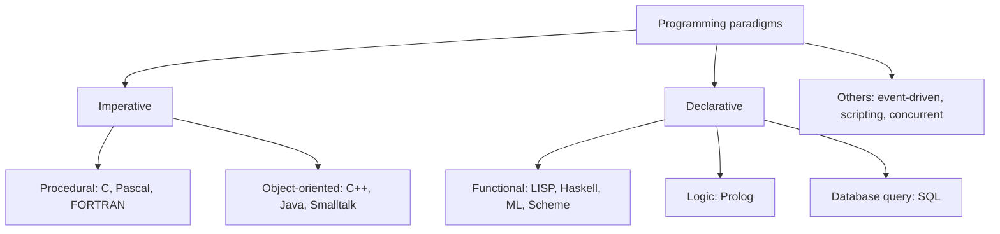
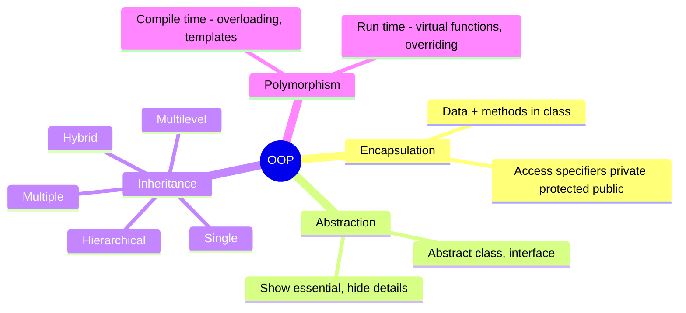
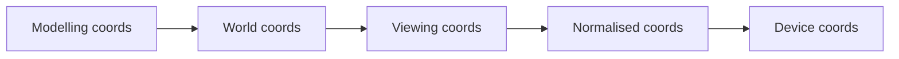
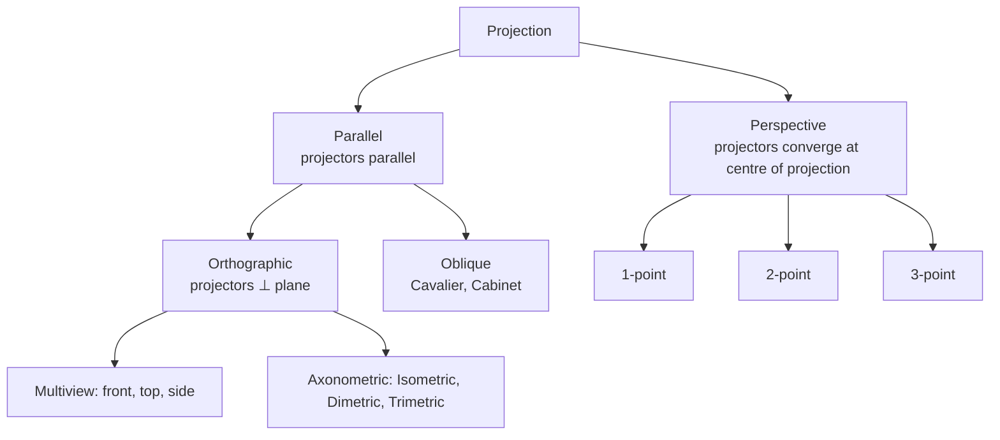

# Paper 2 · Unit 3 — Programming Languages & Computer Graphics

**Expected questions: 8–10 · Target: 8+ · Type: C/C++ output prediction, OOP concepts, graphics algorithms & transforms**

## Syllabus Checklist
- [ ] Language design & translation: paradigms, binding times, virtual computers, syntax, stages of translation
- [ ] Elementary data types: scalar & composite
- [ ] Programming in C: tokens, data types, control, arrays, structures, unions, strings, pointers, functions, files, command-line args, preprocessor
- [ ] OOP: class, object, inheritance, encapsulation, abstract class, polymorphism
- [ ] C++: constructors/destructors, overloading, virtual functions, templates, exceptions, streams & files
- [ ] Web programming: HTML, DHTML, XML, scripting, Java, servlets, applets
- [ ] Graphics: display devices, raster/random scan, line (DDA, Bresenham), circle & ellipse (mid-point), polygon fill, boundary/flood fill
- [ ] 2-D transforms & viewing: homogeneous coordinates, composite transforms, window-to-viewport, clipping (Cohen-Sutherland, Liang-Barsky, Sutherland-Hodgman)
- [ ] 3-D: polygon/quadric surfaces, splines, Bezier & B-spline, illumination, shading, projections

---

## 1. Language Concepts

### 1.1 Paradigms



| Language | Year/creator | Paradigm |
|----------|--------------|----------|
| FORTRAN | 1957, John Backus | First high-level, scientific |
| LISP | 1958, John McCarthy | Functional, AI |
| COBOL | 1959, Grace Hopper (CODASYL) | Business |
| ALGOL | 1958/60 | Block structure, BNF first used |
| Simula 67 | Dahl & Nygaard | **First OO language** (classes) |
| Smalltalk | Alan Kay | Pure OO |
| C | 1972, Dennis Ritchie | Procedural |
| Prolog | 1972, Colmerauer | Logic |
| C++ | 1979–83, Bjarne Stroustrup | OO + procedural |
| Ada | 1980, US DoD | Concurrency (tasks, rendezvous) |
| Java | 1995, James Gosling (Sun) | OO, platform independent |
| Python | 1991, Guido van Rossum | Multi-paradigm |

### 1.2 Binding Time
Binding = association of an attribute with an entity.
```
Language design time → Language implementation time → Compile time → Link time → Load time → Run time
  (meaning of *)          (size of int)                 (type of var)   (library code)  (address)    (value)
```
- **Static binding** (early) before run time; **dynamic binding** (late) at run time.
- **Static scoping (lexical)**: binding by program text (C, Java). **Dynamic scoping**: by calling sequence (early LISP, Perl `local`).
- Storage: static (globals), stack-dynamic (locals), explicit heap-dynamic (new/malloc), implicit heap-dynamic.

### 1.3 Parameter Passing

| Method | Behaviour | Language |
|--------|-----------|----------|
| Call by value | Copy of value | C (default) |
| Call by reference | Address passed; changes visible | C++ `&`, Pascal `var` |
| Call by value-result (copy-in/copy-out) | Copy in, copy back at return | Ada `in out` |
| Call by name | Textual substitution, evaluated each use (Jensen's device) | ALGOL 60 |
| Call by need | Lazy evaluation, memoised | Haskell |

**Classic question**:
```c
void swap(int x, int y) { int t = x; x = y; y = t; }   // by value: caller unchanged
```
With `a = 1, i = 1, A[1] = 5`, call `f(i, A[i])` where f does `x = x + 1; y = y + 1;`:
by name → `A[2]` incremented (since i changed first); by reference → `A[1]` incremented.

### 1.4 Data Types
- **Scalar**: integer, real, character, Boolean, enumeration, pointer.
- **Composite**: array, record/struct, union, string, set, list, file.
- Strong typing (Java, Ada), weak typing (C). Type equivalence: **name** vs **structural**.
- Type checking static (compile) vs dynamic (run time). Coercion = implicit type conversion.

## 2. C Programming — Exam Traps

### 2.1 Operator precedence (high → low)
```
() [] -> .     ++ -- (postfix)
! ~ ++ -- + - * & (type) sizeof   (unary, right-to-left)
* / %
+ -
<< >>
< <= > >=
== !=
&   ^   |
&&  ||
?:              (right-to-left)
= += -= ...     (right-to-left)
,
```

### 2.2 Output-prediction examples

```c
int i = 5;
printf("%d %d", i++, ++i);   // UNDEFINED behaviour (unsequenced modification)

int a = 10, b = 3;
printf("%d %d", a / b, a % b);   // 3 1
printf("%d", -7 % 3);            // -1 (sign follows dividend in C99)

int x = 0;
if (x = 5) printf("yes");        // prints yes (assignment, value 5)

char s[] = "NET";
printf("%zu %zu", sizeof(s), strlen(s));   // 4 3

int arr[] = {10, 20, 30};
int *p = arr;
printf("%d", *(p + 2));          // 30 ; arr[i] == *(arr + i) == i[arr]

int k = 3;
printf("%d", k << 2);            // 12 (multiply by 4)

static int counter() { static int c = 0; return ++c; }   // retains value: 1, 2, 3 ...

#define SQ(x) x*x
printf("%d", SQ(2+3));           // 2+3*2+3 = 11 (macro pitfall)
```

### 2.3 Pointers
```
int *p;          pointer to int
int **pp;        pointer to pointer
int *a[10];      array of 10 pointers to int
int (*a)[10];    pointer to an array of 10 ints
int *f();        function returning pointer to int
int (*f)();      pointer to function returning int
```
- Pointer arithmetic scales by `sizeof(type)`. `p + 1` on `int*` (4 bytes) adds 4.
- `void*` generic pointer; dangling pointer (freed memory); NULL pointer; wild pointer (uninitialised).
- Memory: `malloc` (uninitialised), `calloc` (zeroed, n × size), `realloc`, `free`.

### 2.4 Structures vs Unions
```c
struct S { int i; char c; double d; };  // size = sum + padding (typically 16)
union  U { int i; char c; double d; };  // size = largest member (8) — members share memory
```

### 2.5 Storage Classes

| Class | Scope | Lifetime | Default | Storage |
|-------|-------|----------|---------|---------|
| auto | Block | Block | Garbage | Stack |
| register | Block | Block | Garbage | CPU register (no `&`) |
| static | Block/file | Whole program | 0 | Data segment |
| extern | Global | Whole program | 0 | Data segment |

### 2.6 Files, Command line, Preprocessor
- `FILE *fp = fopen("a.txt", "r")`; modes r, w, a, r+, w+, a+, rb. `fgetc`, `fputc`, `fgets`, `fprintf`, `fscanf`, `fread`, `fwrite`, `fseek`, `ftell`, `rewind`.
- `int main(int argc, char *argv[])` — `argv[0]` is the program name; `argc ≥ 1`.
- Preprocessor: `#include`, `#define`, `#ifdef`, `#ifndef`, `#if`, `#pragma`, `#undef`; runs **before compilation**.

## 3. OOP Concepts



```
 Inheritance types
 Single      Multiple      Multilevel     Hierarchical      Hybrid (diamond)
   A         A     B          A               A                  A
   │          ╲   ╱           │             ╱ │ ╲               ╱ ╲
   B            C             B            B  C  D             B   C
                              │                                 ╲ ╱
                              C                                  D
```
- Diamond problem in C++ solved by **virtual base class**. Java avoids multiple class inheritance (uses interfaces).

## 4. C++ Specifics

| Topic | Key point |
|-------|-----------|
| Constructor | Same name as class, no return type; default, parameterised, **copy constructor** `X(const X&)` |
| Destructor | `~X()`, no args, cannot be overloaded; called in reverse order of construction |
| Order of construction | Base → member objects → derived; destruction reverse |
| `this` pointer | Hidden pointer to invoking object; not available in static functions |
| Friend function | Not a member but accesses private data; not inherited |
| Static member | Shared by all objects; static function accesses only static members |
| Inline function | Expanded at call site |
| Function overloading | Same name, different parameter lists (return type alone not enough) |
| Operator overloading | Cannot overload `::`, `.`, `.*`, `?:`, `sizeof` |
| Virtual function | Run-time polymorphism via **vtable/vptr**; call through base pointer/reference |
| Pure virtual | `virtual void f() = 0;` → class becomes **abstract** (cannot be instantiated) |
| Virtual destructor | Needed when deleting derived object via base pointer |
| Templates | Generic programming: function & class templates (compile-time polymorphism) |
| Exceptions | `try`, `throw`, `catch(...)` catches all |
| Streams | `cin` (istream), `cout` (ostream), `cerr` (unbuffered), `clog`; `ifstream`, `ofstream`, `fstream` |
| Access in inheritance | public base: public→public, protected→protected; protected base: both→protected; private base: both→private; private members never accessible |

```cpp
class Base { public: virtual void show() { cout << "Base"; } };
class Der : public Base { public: void show() { cout << "Derived"; } };
Base *b = new Der();
b->show();    // "Derived" (virtual)  — without virtual: "Base"
```

## 5. Web Programming

| Technology | Key facts |
|-----------|-----------|
| HTML | Markup; tags `<a href>`, ``, `<table><tr><td>`, `<form action method>`; HTML5 adds `<canvas>`, `<video>`, `<audio>`, `<section>`, `<article>` |
| DHTML | HTML + CSS + JavaScript + DOM → dynamic pages |
| CSS | Inline > internal > external (priority); selectors `.class`, `#id` |
| XML | User-defined tags, data description, must be well-formed (single root, closed tags, case-sensitive); validated by **DTD/XSD**; XSLT for transformation, XPath for navigation |
| JavaScript | Client-side scripting; `document.getElementById` |
| Server-side | PHP, JSP, ASP.NET, Servlets |
| Java Applet | Runs in browser; life cycle: `init() → start() → paint() → stop() → destroy()`; no `main()` (now obsolete) |
| Servlet | Runs on server; life cycle: `init() → service() (doGet/doPost) → destroy()`; container e.g. Tomcat |
| Java | Bytecode on JVM ("write once run anywhere"); garbage collection; no pointers; `final`, `abstract`, `interface` |
| HTTP methods | GET (in URL, idempotent), POST (in body), PUT, DELETE |

## 6. Computer Graphics

### 6.1 Display Devices

| Raster scan | Random (vector) scan |
|-------------|---------------------|
| Beam sweeps every row (top to bottom) | Beam draws only the lines of the picture |
| Uses frame buffer (refresh buffer) | Uses display file (display list) |
| Realistic images, shading | Line drawings only, smooth lines |
| Aliasing (jaggies) | No aliasing |
| TV, monitors | Pen plotters, early CAD |

```
Frame buffer size = Resolution × bits per pixel / 8   bytes
e.g. 1024 × 768, 24-bit colour → 1024×768×3 = 2.25 MB
Number of colours = 2^(bits per pixel)
Refresh: interlaced (odd/even lines alternately) vs non-interlaced
Aspect ratio = width : height
```
- CRT parts: electron gun, focusing & deflection system, phosphor coated screen. **Persistence** = time phosphor glows. Shadow-mask (RGB) and beam-penetration (limited colours) colour CRTs.
- LCD, LED, plasma (flat panel); DVST (Direct View Storage Tube). Colour lookup table saves memory.

### 6.2 Line Drawing

**DDA (Digital Differential Analyzer)**
```
dx = x2 − x1, dy = y2 − y1, steps = max(|dx|, |dy|)
xinc = dx/steps, yinc = dy/steps
repeat steps times: x += xinc, y += yinc, plot(round(x), round(y))
→ uses floating point and rounding (slower)
```

**Bresenham (|m| < 1)** — integer only:
```
p0 = 2dy − dx
if pk < 0:  next = (xk+1, yk),     pk+1 = pk + 2dy
else:       next = (xk+1, yk+1),   pk+1 = pk + 2dy − 2dx
```
Example (20,10)→(30,18): dx=10, dy=8, p0 = 6, 2dy = 16, 2dy−2dx = −4.
```
 k  pk   plot
 0   6   (21,11)
 1   2   (22,12)
 2  −2   (23,12)
 3  14   (24,13)
 4  10   (25,14)
 5   6   (26,15)
 ...
```

### 6.3 Mid-point Circle
- 8-way symmetry: compute one octant (x from 0 to x = y), reflect to 8.
```
p0 = 1 − r     (5/4 − r)
if pk < 0:  (xk+1, yk),     pk+1 = pk + 2xk+1 + 1
else:       (xk+1, yk−1),   pk+1 = pk + 2xk+1 + 1 − 2yk+1
```
Ellipse: **4-way symmetry**, two regions (slope −1 boundary).

### 6.4 Filling
- **Scan-line polygon fill**: intersect each scan line with edges, sort x, fill pairs; uses edge table & active edge table.
- **Boundary fill**: fills until boundary colour found. **Flood fill**: replaces a specific interior colour.
- 4-connected vs 8-connected (8-connected may leak through diagonal gaps).
- Inside test: **odd-even (even-odd) rule**, **non-zero winding number rule**.

### 6.5 2-D Transformations (Homogeneous coordinates)

```
Translation        Scaling            Rotation (anticlockwise θ)
| 1  0  tx |       | sx 0  0 |        | cosθ  −sinθ  0 |
| 0  1  ty |       | 0  sy 0 |        | sinθ   cosθ  0 |
| 0  0  1  |       | 0  0  1 |        |  0      0    1 |

Reflection about x-axis: diag(1, −1, 1)      about y-axis: diag(−1, 1, 1)
about origin: diag(−1, −1, 1)                about y = x: swap x and y  [[0 1 0][1 0 0][0 0 1]]
X-shear: x' = x + shx·y                      Y-shear: y' = y + shy·x
```
- Homogeneous coordinates allow **translation as matrix multiplication** → composite transforms.
- Rotation about arbitrary point (xr, yr): **T(xr, yr) · R(θ) · T(−xr, −yr)** (applied right-to-left).
- Successive translations add; successive rotations add angles; successive scalings multiply.
- Matrix multiplication is generally **not commutative** (except e.g. two rotations, two scalings, rotation & uniform scaling).

### 6.6 Viewing & Window-to-Viewport



```
xv = xvmin + (xw − xwmin) · sx      sx = (xvmax − xvmin)/(xwmax − xwmin)
yv = yvmin + (yw − ywmin) · sy      sy = (yvmax − yvmin)/(ywmax − ywmin)
```

### 6.7 Clipping

**Cohen–Sutherland line clipping** — 4-bit region code **TBRL** (Top, Bottom, Right, Left):
```
        1001 │ 1000 │ 1010
       ──────┼──────┼──────
        0001 │ 0000 │ 0010        window = 0000
       ──────┼──────┼──────
        0101 │ 0100 │ 0110
```
- Both codes 0000 → trivially accept. (code1 AND code2) ≠ 0 → trivially reject. Else clip against an edge and repeat.

| Algorithm | For |
|-----------|-----|
| Cohen–Sutherland | Lines (region codes) |
| **Liang–Barsky** | Lines (parametric, faster) |
| Cyrus–Beck | Lines vs convex polygon window |
| Nicholl–Lee–Nicholl | Lines (fewest comparisons) |
| Mid-point subdivision | Lines (binary search) |
| **Sutherland–Hodgman** | Polygon clipping (convex window; edge by edge) |
| Weiler–Atherton | Polygon clipping (concave too) |

### 6.8 3-D Graphics

- **Polygon surfaces**: vertex, edge, polygon tables; plane equation Ax + By + Cz + D = 0.
- **Quadric surfaces**: sphere, ellipsoid, torus.
- **Splines**: interpolation (passes through control points) vs approximation (near them).

| Bezier curve | B-spline curve |
|--------------|----------------|
| Degree = n − 1 for n control points | Degree independent of number of points |
| Passes through first & last control points | Generally doesn't pass through endpoints (uniform) |
| **Global control** — moving one point changes whole curve | **Local control** |
| Lies within convex hull of control points | Lies within convex hull |
| Bernstein basis polynomials | B-spline basis functions |

Cubic Bezier: P(t) = (1−t)³P₀ + 3t(1−t)²P₁ + 3t²(1−t)P₂ + t³P₃, 0 ≤ t ≤ 1.

### 6.9 Illumination & Shading
```
I = Ia·ka  +  Il·kd·(N·L)  +  Il·ks·(R·V)ⁿ
    ambient     diffuse (Lambert)   specular (Phong, n = shininess)
```

| Shading | Method | Quality |
|---------|--------|---------|
| Flat (constant) | One intensity per polygon | Faceted |
| **Gouraud** | Interpolate **intensities** at vertices | Smooth, may miss specular highlights, Mach bands |
| **Phong** | Interpolate **normals** | Best quality, costlier |

### 6.10 Projections


- Perspective: realistic, foreshortening, parallel lines meet at **vanishing points**; does not preserve parallelism/size.
- Cavalier (receding lines full length, 45°) vs Cabinet (half length, 63.4°).
- Hidden surface removal: **Z-buffer (depth buffer)**, painter's (depth sort), scan-line, BSP tree, back-face detection (N·V > 0 → back face), Warnock (area subdivision), ray casting.

## 7. Deeper Dive — Scoping, More C Traps, Java Essentials & Graphics Traces

### 7.1 Static vs Dynamic Scoping — Classic Question

```c
int x = 1;
void f()  { printf("%d", x); }
void g()  { int x = 2; f(); }
int main() { g(); }
```
- **Static (lexical) scoping**: f's free variable x refers to the global x → prints **1** (C, Java, Pascal).
- **Dynamic scoping**: x is looked up in the most recent active frame (g's) → prints **2**.

### 7.2 Recursion Trace

```c
int fun(int n) { if (n <= 1) return 1; return n * fun(n - 2); }
fun(7) = 7 × fun(5) = 7 × 5 × fun(3) = 7 × 5 × 3 × fun(1) = 105
```

```
Call stack (grows downward)       Returns (unwinding)
 fun(7)                            fun(1) → 1
   fun(5)                          fun(3) → 3 × 1  = 3
     fun(3)                        fun(5) → 5 × 3  = 15
       fun(1)                      fun(7) → 7 × 15 = 105
```

### 7.3 More C Output Questions (with reasons)

```c
// 1. switch fall-through
int k = 2;
switch (k) { case 1: printf("A"); case 2: printf("B"); case 3: printf("C"); break; default: printf("D"); }
// Output: BC   (no break after case 2)

// 2. bitwise
printf("%d %d %d", 5 & 3, 5 | 3, 5 ^ 3);      // 1 7 6
printf("%d", ~5);                               // -6  (2's complement: ~x = -x - 1)

// 3. pointer to string
char *s = "UGCNET";
printf("%s", s + 3);                            // NET
printf("%c", *s + 1);                           // V   ('U' + 1)

// 4. post-increment in loop condition
int i = 0; while (i++ < 3); printf("%d", i);    // 4

// 5. integer division & casting
printf("%.2f", (float)7 / 2);                   // 3.50
printf("%d", 7 / 2 * 2);                        // 6

// 6. comma operator
int a = (1, 2, 3); printf("%d", a);             // 3

// 7. short-circuit
int p = 0, q = 5;
if (p && (q = 10)) {}  printf("%d", q);         // 5 (second operand never evaluated)

// 8. 2-D array pointer arithmetic
int m[2][3] = {{1,2,3},{4,5,6}};
printf("%d", *(*(m + 1) + 2));                  // 6  (m[1][2])
```

### 7.4 Java Essentials

| Modifier | Same class | Same package | Subclass (other pkg) | World |
|----------|-----------|--------------|----------------------|-------|
| private | ✔ | ✘ | ✘ | ✘ |
| default (none) | ✔ | ✔ | ✘ | ✘ |
| protected | ✔ | ✔ | ✔ | ✘ |
| public | ✔ | ✔ | ✔ | ✔ |

| Abstract class | Interface |
|----------------|-----------|
| Can have constructors, state (fields), concrete methods | Constants + abstract methods (default/static methods since Java 8) |
| Single inheritance (`extends`) | A class can `implements` many interfaces |
| Use for "is-a" with shared code | Use for capability contracts |

- `final` variable = constant; `final` method = cannot be overridden; `final` class = cannot be inherited (String).
- `static` members belong to the class. `super` refers to the parent; `this` to the current object.
- JVM components: **class loader → bytecode verifier → interpreter / JIT compiler**; runtime areas: heap, method area, stack, PC registers.
- Exceptions: **checked** (IOException — must be handled or declared) vs **unchecked** (RuntimeException, e.g. NullPointerException, ArithmeticException).
- `String` is immutable; `StringBuffer` (synchronised) and `StringBuilder` (faster) are mutable.

### 7.5 Graphics Traces

**DDA**: (2, 3) → (8, 6); dx = 6, dy = 3, steps = 6, x-inc = 1, y-inc = 0.5.
```
x : 2   3    4   5    6   7    8
y : 3   3.5  4   4.5  5   5.5  6
plotted (round half up): (2,3) (3,4) (4,4) (5,5) (6,5) (7,6) (8,6)
```

**Mid-point circle, r = 10** (first octant, start (0, 10), p₀ = 1 − r = −9):

| k | pₖ | Next pixel | pₖ₊₁ |
|---|----|-----------|------|
| 0 | −9 | (1, 10) | −6 |
| 1 | −6 | (2, 10) | −1 |
| 2 | −1 | (3, 10) | 6 |
| 3 | 6 | (4, 9) | −3 |
| 4 | −3 | (5, 9) | 8 |
| 5 | 8 | (6, 8) | 5 |
| 6 | 5 | (7, 7) | stop (x ≥ y) |

**Composite transformation**: rotate P(4, 2) by 90° anticlockwise about pivot (2, 2).
```
1. Translate by (−2, −2):  (2, 0)
2. Rotate 90°: (x cos90 − y sin90, x sin90 + y cos90) = (0, 2)
3. Translate by (+2, +2):  (2, 4)        → P' = (2, 4)
```
Scaling about fixed point (xf, yf): T(xf, yf) · S(sx, sy) · T(−xf, −yf) → x' = xf + (x − xf)·sx.

**Cohen–Sutherland**: window (0, 0)–(10, 10); line (−5, 5) → (15, 5). Codes 0001 and 0010; AND = 0000 → not trivially rejected; clip at x = 0 → (0, 5) and at x = 10 → (10, 5).

**Liang–Barsky**: same window; line (−5, 3) → (15, 9); Δx = 20, Δy = 6.
```
p₁ = −Δx = −20, q₁ = x₁ − xmin = −5   → r₁ = 0.25    (entering)
p₂ =  Δx =  20, q₂ = xmax − x₁ = 15   → r₂ = 0.75    (leaving)
p₃ = −Δy = −6,  q₃ = y₁ − ymin = 3    → r₃ = −0.5    (entering)
p₄ =  Δy =  6,  q₄ = ymax − y₁ = 7    → r₄ ≈ 1.17    (leaving)
u₁ = max(0, 0.25, −0.5) = 0.25 ;  u₂ = min(1, 0.75, 1.17) = 0.75
Clipped line: (−5 + 0.25·20, 3 + 0.25·6) = (0, 4.5)  to  (−5 + 0.75·20, 3 + 0.75·6) = (10, 7.5)
```

### 7.6 3-D Transformation Matrices (homogeneous 4 × 4)

```
Translation           Scaling              Rotation about z-axis
| 1 0 0 tx |          | sx 0  0  0 |       | cosθ −sinθ 0 0 |
| 0 1 0 ty |          | 0  sy 0  0 |       | sinθ  cosθ 0 0 |
| 0 0 1 tz |          | 0  0  sz 0 |       |  0     0   1 0 |
| 0 0 0 1  |          | 0  0  0  1 |       |  0     0   0 1 |
Rotation about x: y' = y cosθ − z sinθ, z' = y sinθ + z cosθ
Rotation about y: z' = z cosθ − x sinθ, x' = z sinθ + x cosθ
Perspective (centre of projection at origin, plane z = d): x' = x·d/z, y' = y·d/z
```

---

## Previous Year Questions (PYQ pattern)

**Language concepts**
1. First object-oriented language: **Simula 67**
2. Which uses call by name? **ALGOL 60**
3. Binding of a variable to its type in C occurs at: **compile time**
4. Dynamic scoping resolves a non-local name using: **the calling sequence (most recent active binding)**
5. Prolog is a: **logic programming language**
6. LISP is primarily used for: **list processing / AI (functional)**

**C**

7. `int a = 5; a = a++ + ++a;` → **undefined behaviour** (option often given as 12 or 13; correct per standard: UB)
8. Output of `printf("%d", sizeof('A'))` in C: **4** (char constant is int in C; 1 in C++)
9. `#define MUL(a,b) a*b`; `MUL(2+3, 4)` → 2+3*4 = **14**
10. Size of union `{int a; char b[10];}` (int=4): **12** with alignment (largest member 10, padded to multiple of 4)
11. Which storage class retains value between function calls? **static**
12. `char *p = "hello"; printf("%c", *(p+1));` → **e**
13. `int (*p)[5];` declares: **pointer to an array of 5 integers**
14. Which function allocates zero-initialised memory? **calloc**

**OOP/C++**

15. Run-time polymorphism is achieved via: **virtual functions**
16. A class with at least one pure virtual function is: **abstract class**
17. Which operator cannot be overloaded? **:: (scope resolution)** (also `.`, `?:`, `sizeof`)
18. The copy constructor takes argument by: **reference** (by value would cause infinite recursion)
19. Diamond problem is resolved by: **virtual base class**
20. Templates support: **generic programming (compile-time polymorphism)**
21. Order of destructor calls: **reverse of constructor calls**
22. Java does not support multiple inheritance of classes; achieved via: **interfaces**

**Web**

23. Applet life cycle method called first: **init()**
24. Servlet method handling each request: **service()**
25. XML document conforming to DTD is called: **valid**; following syntax rules: **well-formed**
26. DHTML combines: **HTML, CSS, JavaScript, DOM**

**Graphics**

27. Frame buffer for 640×480 with 8 bits per pixel: **300 KB** (307200 bytes)
28. Bresenham's line algorithm uses: **only integer arithmetic**
29. Initial decision parameter for mid-point circle with r = 10: **1 − 10 = −9**
30. Circle uses __-way symmetry, ellipse __-way: **8, 4**
31. Composite transformation for rotation about point P: **T(P)·R(θ)·T(−P)**
32. Region code of a point above-left of window (TBRL): **1001**
33. Line endpoints codes 0101 and 0110: AND = 0100 ≠ 0 → **trivially rejected**
34. Polygon clipping algorithm: **Sutherland–Hodgman**
35. Shading that interpolates normal vectors: **Phong**
36. Z-buffer algorithm is a: **image-space hidden surface method**
37. Bezier curve with 4 control points has degree: **3**
38. Which curve has local control? **B-spline**
39. Projection in which parallel lines converge: **Perspective**
40. Isometric projection is a type of: **axonometric orthographic projection**
41. Scaling matrix with sx = sy = −1 is equivalent to: **reflection about origin (rotation by 180°)**
42. Translating (2,3) by (4,−1): **(6,2)**

**More practice questions**

43. Under dynamic scoping, the code in §7.1 prints: **2**
44. Output of `printf("%d", ~0);` in C: **−1**
45. Output of `printf("%d", 10 >> 1 << 2);`: (10 >> 1) << 2 = **20**
46. In Java, a member visible only within its package has: **default (package-private) access**
47. A Java class that cannot be subclassed is declared: **final**
48. NullPointerException is a: **unchecked (runtime) exception**
49. Number of steps in DDA for line (1, 1) to (9, 4): **8**
50. Rotating point (1, 0) by 90° anticlockwise about origin gives: **(0, 1)**
51. Reflection of (3, −2) about the line y = x: **(−2, 3)**
52. In Liang–Barsky, pₖ < 0 means the line is: **entering** the clip boundary
53. Shear in x with shx = 2 applied to (1, 3): **(7, 3)**
54. Homogeneous coordinates for 3-D points use: **4-element vectors / 4 × 4 matrices**

## Quick Revision Box
- Simula 67 first OO · ALGOL call-by-name · C static scope
- `::`, `.`, `?:`, `sizeof` can't be overloaded · Pure virtual → abstract
- Bresenham p0 = 2dy − dx · Mid-point circle p0 = 1 − r
- TBRL codes; AND ≠ 0 reject; both 0 accept
- Gouraud = intensity interpolation · Phong = normal interpolation
- Bezier global control, passes endpoints · B-spline local control
