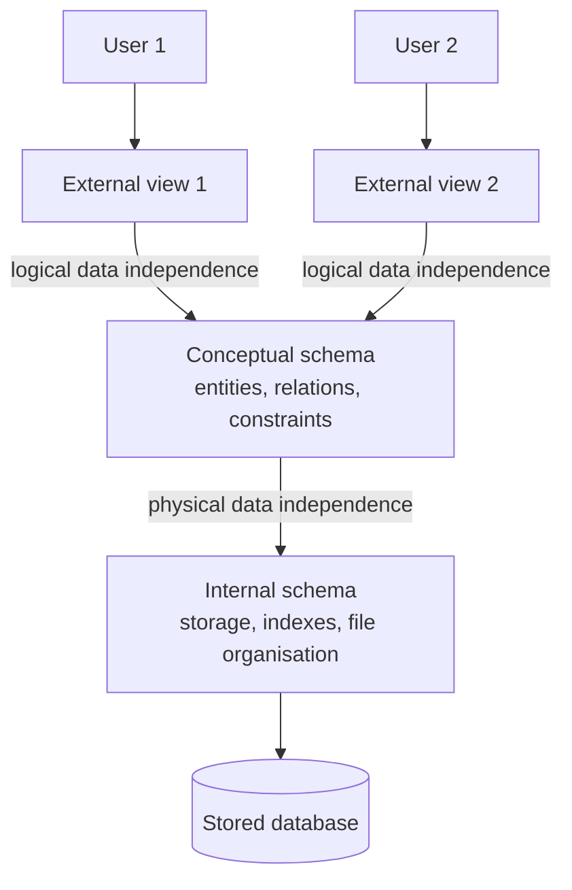
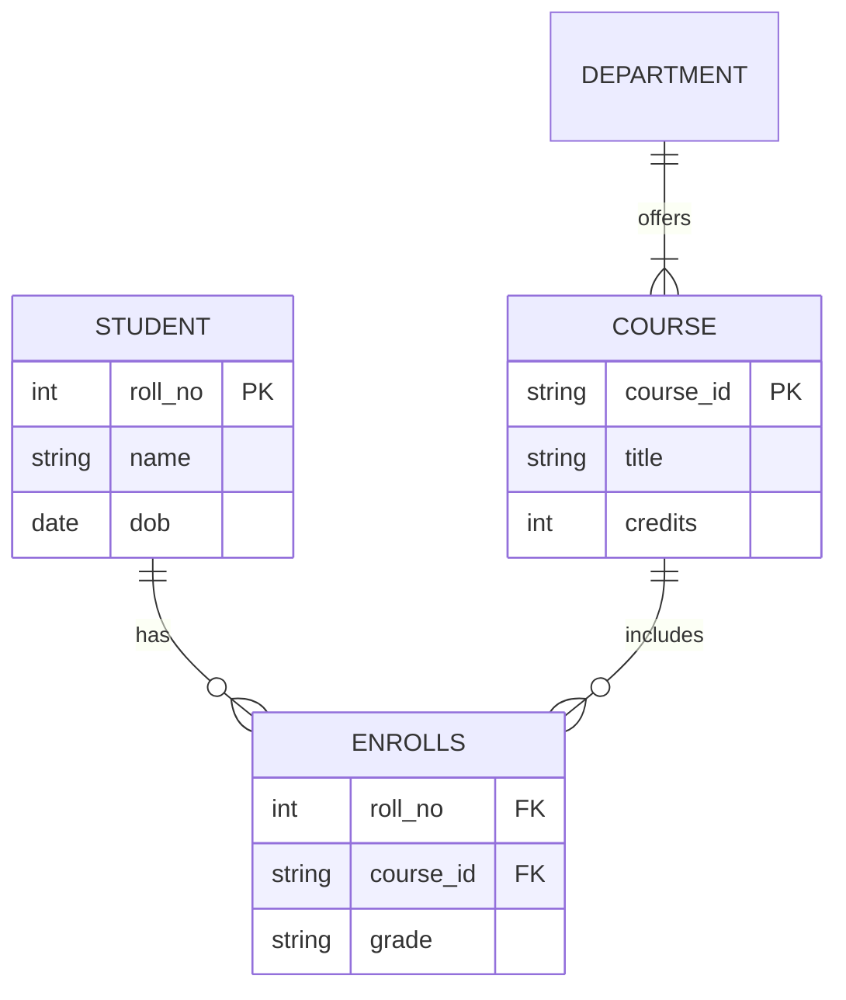
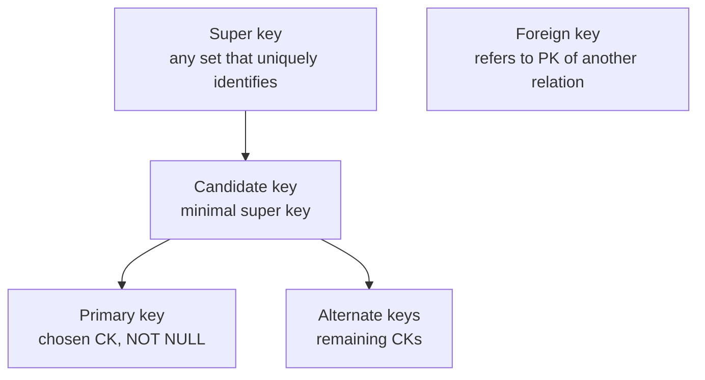
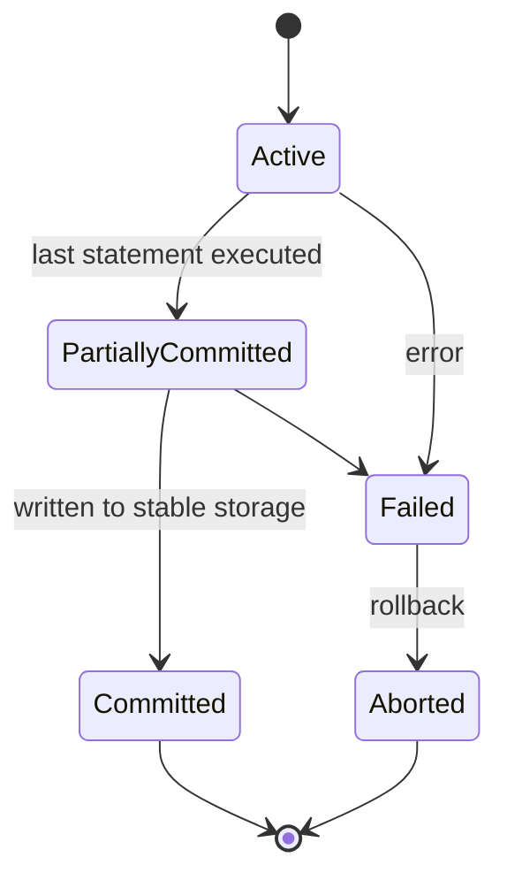
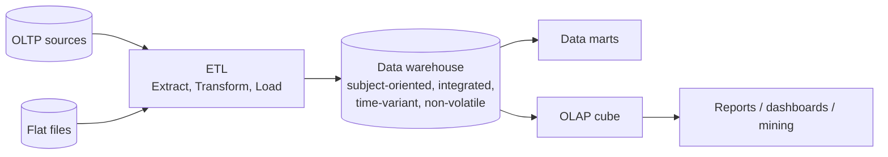

# Paper 2 · Unit 4 — Database Management Systems

**Expected questions: 10–12 · Target: 10+ · Type: normalisation, keys, SQL output, transactions, concepts — very scoring**

## Syllabus Checklist
- [ ] Database system concepts & architecture: data models, schemas, instances, three-schema architecture, data independence, database languages & interfaces, centralised & client/server architecture
- [ ] Data modelling: ER diagram, relational model (constraints, languages, design, programming), relational algebra & calculus, codd rules
- [ ] SQL: data definition, types, constraints, queries, insert, delete, update, views, stored procedures, functions, triggers, SQL injection
- [ ] Normalisation: functional dependencies, 1NF, 2NF, 3NF, BCNF, multivalued dependencies & 4NF, join dependencies & 5NF, inclusion dependencies
- [ ] Transaction processing, concurrency control & recovery
- [ ] Physical database design: file organisation, indexing (single-level, multilevel, B-tree, B+-tree), query processing & optimisation
- [ ] Object & object-relational databases; database security
- [ ] Enhanced data models: temporal, multimedia, deductive, XML & internet databases, mobile, GIS, genome, distributed databases
- [ ] Data warehousing & data mining: OLAP, data cube, association rules, classification, clustering
- [ ] Big data systems: characteristics, types, architecture, MapReduce, Hadoop, NoSQL (CAP theorem, document, key-value, column, graph)

---

## 1. Architecture

### 1.1 Three-Schema (ANSI/SPARC) Architecture


- **Logical data independence**: change conceptual schema without changing external views (harder to achieve).
- **Physical data independence**: change internal schema without changing conceptual schema.
- **Schema** = structure (intension, changes rarely); **Instance** = data at a moment (extension).
- Languages: **DDL** (CREATE, ALTER, DROP, TRUNCATE), **DML** (SELECT, INSERT, UPDATE, DELETE), **DCL** (GRANT, REVOKE), **TCL** (COMMIT, ROLLBACK, SAVEPOINT).
- Data models: hierarchical (IMS, tree), network (CODASYL, graph), relational (Codd 1970), object-oriented, object-relational.
- Architectures: centralised, **2-tier** client/server, **3-tier** (client – application server – DB server).

### 1.2 DBMS Components
Query processor (DDL interpreter, DML compiler, query evaluation engine), storage manager (authorisation, transaction manager, file manager, buffer manager), data dictionary (metadata).

## 2. ER Model

```
 ER notation (Chen)
 ┌────────┐   Entity              ╔════════╗  Weak entity
 └────────┘                       ╚════════╝
 (  attr  )   Attribute           (( multi ))  Multivalued
 ( _key_ )    Key (underlined)    (  - - -  )  Derived (dashed)
  ◇           Relationship        ◈            Identifying relationship (double diamond)
 ═══          Total participation  ───         Partial participation
```



- **Cardinality**: 1:1, 1:N, M:N. **Participation**: total (every entity participates — double line) or partial.
- **Weak entity**: no key of its own; identified via owner entity + partial key (discriminator).
- **Specialisation** (top-down), **generalisation** (bottom-up), **aggregation** (relationship as entity). Disjoint/overlapping, total/partial constraints.

### ER → Relational mapping (minimum tables)

| Case | Tables |
|------|--------|
| Strong entity | 1 table each |
| 1:1 relationship | Merge into either side (total participation side preferred) |
| 1:N relationship | FK on N-side; no separate table |
| **M:N relationship** | **Separate table** with both PKs |
| Multivalued attribute | Separate table |
| Weak entity | Table with owner's PK + partial key |

Classic: E1 —M:N— E2 —1:N— E3 → minimum tables = 3 entities + 1 (for M:N) = **4**.

## 3. Keys & Integrity


- Number of super keys of R(A1…An) with single candidate key A1: **2ⁿ⁻¹**.
- With candidate keys A1 and A2: 2ⁿ⁻¹ + 2ⁿ⁻¹ − 2ⁿ⁻² = **3·2ⁿ⁻²**.
- **Entity integrity**: PK cannot be NULL. **Referential integrity**: FK value must match an existing PK or be NULL.
- ON DELETE CASCADE / SET NULL / RESTRICT.

**Codd's 12 rules (13 with Rule 0)**: Rule 0 foundation; 1 information; 2 guaranteed access; 3 systematic NULLs; 4 active online catalog; 5 comprehensive data sublanguage; 6 view updating; 7 high-level insert/update/delete; 8 physical data independence; 9 logical data independence; 10 integrity independence; 11 distribution independence; 12 non-subversion.

## 4. Relational Algebra & Calculus

| Operation | Symbol | Notes |
|-----------|--------|-------|
| Selection | σ_cond(R) | Rows; commutative |
| Projection | π_attrs(R) | Columns; removes duplicates |
| Union | R ∪ S | Union-compatible |
| Difference | R − S | |
| Cartesian product | R × S | |R|·|S| tuples |
| Rename | ρ | |
| Intersection | R ∩ S = R − (R − S) | Derived |
| Natural join | R ⋈ S | Equal common attrs |
| Theta join | R ⋈_θ S | σ_θ(R × S) |
| Division | R ÷ S | "for all" queries |
| Outer joins | ⟕ ⟖ ⟗ | Keep unmatched with NULLs |

Fundamental: **σ, π, ∪, −, ×, ρ**. Relational algebra is **procedural**; relational calculus (TRC/DRC) is **non-procedural**. Safe calculus = relational algebra in power (relational completeness).

```
Tuple sizes: R has m tuples, S has n tuples
R × S            → m·n
R ⋈ S            → 0 … m·n
R ∪ S            → max(m,n) … m+n
R ∩ S            → 0 … min(m,n)
R − S            → 0 … m
R ⟕ S (left outer) → at least m
```

Division example: "students who took **all** courses": π_{sid,cid}(Enrolled) ÷ π_{cid}(Course).

TRC: `{ t | t ∈ Student ∧ t.age > 20 }` · DRC: `{ <n> | ∃a (<n,a> ∈ Student ∧ a > 20) }`.

## 5. SQL

```sql
SELECT dept, COUNT(*) AS n, AVG(salary)
FROM   employee
WHERE  salary > 20000          -- filters rows (before grouping)
GROUP  BY dept
HAVING COUNT(*) > 2            -- filters groups
ORDER  BY n DESC;
```
Logical order of execution: **FROM → WHERE → GROUP BY → HAVING → SELECT → DISTINCT → ORDER BY → LIMIT**.

- `COUNT(*)` counts all rows; `COUNT(col)` ignores NULLs; aggregates (SUM/AVG/MAX/MIN) ignore NULLs.
- NULL comparisons give UNKNOWN; use `IS NULL`. `NULL = NULL` → UNKNOWN.
- `DELETE` (DML, row-wise, rollback possible, WHERE allowed) vs `TRUNCATE` (DDL, all rows, faster) vs `DROP` (removes table structure).
- `IN`, `EXISTS`, `ANY/SOME`, `ALL`: `x > ALL (subquery)` = greater than max; `x > ANY` = greater than min.
- `UNION` removes duplicates; `UNION ALL` keeps them.
- Correlated subquery: inner query refers to outer — evaluated per outer row.
- Constraints: PRIMARY KEY, FOREIGN KEY, UNIQUE (allows NULL), NOT NULL, CHECK, DEFAULT.
- **View**: virtual table (stored query); updatable if based on single table without aggregates/DISTINCT/GROUP BY. **Materialised view** stores results.
- **Trigger**: ECA (Event–Condition–Action) rule; BEFORE/AFTER, row-level/statement-level.
- **Stored procedure** (CALL, may not return value) vs **function** (returns value, usable in SELECT).
- **SQL injection**: attacker inserts SQL via input, e.g. `' OR '1'='1`. Prevent with **prepared statements/parameterised queries**, input validation, least privilege.

**Nth highest salary**:
```sql
SELECT MAX(salary) FROM emp WHERE salary < (SELECT MAX(salary) FROM emp);   -- 2nd highest
```

## 6. Functional Dependencies & Normalisation

### 6.1 Armstrong's Axioms
- **Reflexivity**: Y ⊆ X ⇒ X → Y · **Augmentation**: X → Y ⇒ XZ → YZ · **Transitivity**: X → Y, Y → Z ⇒ X → Z
- Derived: Union, Decomposition, Pseudo-transitivity (X → Y, WY → Z ⇒ WX → Z).
- Sound and complete.

### 6.2 Attribute Closure — Finding Candidate Keys
R(A, B, C, D, E), F = {A → B, B → C, CD → E}
```
A⁺   = {A, B, C}
AD⁺  = {A, D, B, C, E}  = all → AD is a key
A and D never appear on the RHS → every key must contain both → AD is the ONLY candidate key
```
Trick: attributes not on any RHS must be in every key; attributes only on RHS are never in a key.

**Minimal (canonical) cover**: single attribute on RHS → remove extraneous LHS attributes → remove redundant FDs.

### 6.3 Normal Forms


| NF | Condition (for every non-trivial FD X → A) |
|----|--------------------------------------------|
| 1NF | All attributes atomic (no repeating groups / multivalued) |
| 2NF | 1NF + no **partial** dependency (non-prime attribute depends on part of a candidate key) |
| 3NF | X is a super key **OR** A is a **prime** attribute |
| BCNF | X is a **super key** |
| 4NF | For every non-trivial MVD X →→ Y, X is a super key |
| 5NF | Every join dependency is implied by candidate keys |

- Relation with **only two attributes is always in BCNF**.
- If all candidate keys are single attributes ⇒ automatically 2NF.
- If all attributes are prime ⇒ automatically 3NF.

### 6.4 Decomposition Properties

| Property | Test |
|----------|------|
| **Lossless join** (must) | R into R1, R2 is lossless iff (R1 ∩ R2) → R1 or (R1 ∩ R2) → R2 |
| **Dependency preserving** (desirable) | (F1 ∪ F2)⁺ = F⁺ |

- **3NF** decomposition: always lossless **and** dependency-preserving (synthesis algorithm).
- **BCNF** decomposition: always lossless but **not always** dependency-preserving.

**Worked**: R(A,B,C), F = {AB → C, C → B}. Keys: AB, AC. C → B: C not super key but B is prime → **3NF, not BCNF**. BCNF decomposition (C,B), (A,C) loses AB → C.

## 7. Transactions

### ACID
| Property | Ensured by |
|----------|-----------|
| **A**tomicity (all or nothing) | Recovery manager (undo log) |
| **C**onsistency | Programmer + integrity constraints |
| **I**solation | Concurrency control manager |
| **D**urability | Recovery manager (redo log) |

### Transaction States


### Schedules & Serializability
- **Conflicting operations**: same data item, different transactions, at least one write (RW, WR, WW).
- **Conflict serializable** ⇔ **precedence graph is acyclic** (edge Ti → Tj if Ti's op conflicts with and precedes Tj's).
- **View serializable**: same initial reads, same reads-from, same final writes. Every conflict-serializable schedule is view serializable; a view-serializable schedule that is not conflict-serializable has **blind writes**.
- Number of serial schedules of n transactions: **n!**.

```
Example schedule:  r1(A) w2(A) w1(A) r3(A)
Conflicts: r1(A)→w2(A): T1→T2 ; w2(A)→w1(A): T2→T1 ⇒ cycle ⇒ NOT conflict serializable
```

### Recoverability hierarchy
```
 Serial ⊂ Strict ⊂ Cascadeless (ACA) ⊂ Recoverable ⊂ All schedules
```
- **Recoverable**: if Tj reads from Ti, Ti commits before Tj commits.
- **Cascadeless**: read only committed data.
- **Strict**: no read/write of item until the last writer commits/aborts.

### Concurrency problems
Lost update (WW), dirty read (WR — uncommitted dependency), unrepeatable read (RW), phantom read (insertions).
SQL isolation levels: READ UNCOMMITTED < READ COMMITTED < REPEATABLE READ < SERIALIZABLE.

### Concurrency Control Protocols

| Protocol | Key points |
|----------|-----------|
| Lock-based (S/X) | S compatible with S only |
| **Basic 2PL** | Growing phase then shrinking phase; ensures conflict serializability; **deadlock possible**, cascading rollback possible |
| **Strict 2PL** | Hold **X locks** till commit → cascadeless, strict |
| **Rigorous 2PL** | Hold **all locks** till commit; serial order = commit order |
| Conservative 2PL | Acquire all locks before starting → **deadlock-free** |
| **Timestamp ordering** | Older first; Read: if TS(T) < W-TS(X) → rollback; Write: if TS(T) < R-TS(X) or < W-TS(X) → rollback. Deadlock-free, may starve |
| **Thomas' write rule** | Ignore obsolete write instead of rollback → allows some view-serializable schedules |
| Validation (optimistic) | Read → validate → write phases |
| Multiversion (MVCC) | Readers don't block writers |
| Multiple granularity | Intention locks IS, IX, SIX |

Deadlock prevention with timestamps:
```
 Wait–Die  (non-preemptive): older requests → WAITS;   younger requests → DIES (rolled back)
 Wound–Wait (preemptive):    older requests → WOUNDS (aborts) younger;  younger requests → WAITS
```

### Recovery
- **Log-based**: <T start>, <T, X, old, new>, <T commit>.
- **Deferred update** (NO-UNDO/REDO), **Immediate update** (UNDO/REDO).
- **Checkpoint** reduces log scanning. After crash: transactions committed after checkpoint → REDO; uncommitted → UNDO.
- **ARIES** (WAL, LSN, repeating history): Analysis → Redo → Undo.
- **WAL (Write-Ahead Logging)**: log record written to stable storage before data page.
- Shadow paging: no log needed; copy-on-write page table.

## 8. File Organisation & Indexing

| Index | Description |
|-------|-------------|
| Primary | On ordering **key** field; sparse (one entry per block) |
| Clustering | On ordering **non-key** field |
| Secondary | On non-ordering field; **dense** |
| Dense | Entry for every record |
| Sparse | Entry for some records (needs sorted file) |
| Multilevel | Index on index — log_fo(blocks) levels |

- A file can have **at most one primary or clustering index** but many secondary indexes.

### B-Tree vs B+ Tree

```
 B+ tree of order 3 (internal: keys only, leaves linked)
                 [ 30 | 60 ]
               /      |      \
        [10|20]    [30|40]   [60|70|80]   ← leaves contain all keys,
           └──────►───┘──────►────┘          linked for range queries
```

| B-Tree | B+ Tree |
|--------|---------|
| Data pointers in all nodes | Data pointers only at leaves |
| No duplicate keys | Internal keys repeated in leaves |
| Leaves not linked | Leaves linked → efficient range/sequential access |
| Lower fan-out | Higher fan-out (internal nodes smaller) → fewer levels |

Order p (max children): every node ≤ p children; non-root internal ≥ ⌈p/2⌉ children; root ≥ 2.
**Order calculation**: block 1024 B, key 9 B, block pointer 6 B, record pointer 7 B.
- B+ internal: p·6 + (p−1)·9 ≤ 1024 → 15p ≤ 1033 → **p = 68**.
- B+ leaf: q(9 + 7) + 6 ≤ 1024 → **q = 63**.
- B-tree node: p·6 + (p−1)(9 + 7) ≤ 1024 → 22p ≤ 1040 → **p = 47**.

**Hashing**: static (overflow chains), dynamic — extendible hashing (directory doubles, global/local depth), linear hashing.

### Query Optimisation
- Heuristics: perform **selection early**, projection early, most restrictive selection first, avoid Cartesian products, replace × + σ with joins.
- Cost-based: estimate block transfers & seeks. Join algorithms: nested-loop (nr·bs + br), block nested-loop (br·bs + br), indexed, sort-merge, hash join.
- Query tree; equivalence rules (σ commutes, cascade of π, joins associative/commutative).

## 9. Advanced & Enhanced Databases

| Model | Notes |
|-------|-------|
| OODBMS | Objects, OID, inheritance; ODMG standard, OQL |
| ORDBMS | Relational + UDTs, inheritance (PostgreSQL, Oracle) |
| Temporal | Valid time & transaction time |
| Multimedia | Images, audio, video; content-based retrieval |
| Deductive | Facts + rules; **Datalog** (Prolog-like) |
| XML DB | XPath, XQuery; native XML DBs |
| Mobile | Intermittent connectivity, caching |
| GIS | Spatial data: raster/vector; R-trees, quad-trees |
| Genome | Biological sequence data |
| **Distributed DB** | Fragmentation (horizontal, vertical, mixed), replication, transparency; **2PC** (two-phase commit: prepare → commit) — blocking; 3PC non-blocking |

**Security**: discretionary (GRANT/REVOKE, `WITH GRANT OPTION`), mandatory (Bell-LaPadula: no read up, no write down), role-based access control, statistical DB inference control, encryption.

## 10. Data Warehousing & Mining



- Definition by **W.H. Inmon**: subject-oriented, integrated, time-variant, non-volatile. Kimball: dimensional modelling (bottom-up data marts).
- Schemas: **Star** (one fact table + denormalised dimensions), **Snowflake** (normalised dimensions), **Fact constellation / Galaxy** (multiple fact tables).
- OLAP operations: **roll-up** (aggregate up / drill-up), **drill-down**, **slice** (fix one dimension), **dice** (sub-cube on multiple), **pivot** (rotate).
- ROLAP (relational), MOLAP (multidimensional arrays), HOLAP (hybrid).
- Number of cuboids in n-dimensional cube without hierarchies: **2ⁿ**; with Lᵢ levels: Π(Lᵢ + 1).
- OLTP (current, detailed, many short transactions, normalised) vs OLAP (historical, summarised, complex queries, denormalised).

### Data mining (KDD process)
Selection → Pre-processing → Transformation → **Data mining** → Interpretation/Evaluation.

**Association rules** (Apriori):
```
Support(A→B)    = count(A ∪ B) / N
Confidence(A→B) = support(A ∪ B) / support(A)
Lift            = confidence(A→B) / support(B)    (>1 positive correlation)
Apriori property: every subset of a frequent itemset is frequent (anti-monotone)
FP-growth: no candidate generation (FP-tree)
```
- Classification (supervised): decision tree (ID3 – information gain, C4.5 – gain ratio, CART – Gini), Naive Bayes, k-NN, SVM.
- Clustering (unsupervised): k-means (partitioning), k-medoids (PAM), hierarchical (agglomerative/divisive), DBSCAN (density).
- Outlier detection, regression.

## 11. Big Data & NoSQL

- **5 Vs**: Volume, Velocity, Variety, Veracity, Value (3 Vs originally — Doug Laney).
- Types: structured, semi-structured (JSON, XML), unstructured (text, video).
- **Hadoop**: HDFS (NameNode = master/metadata, DataNode = storage; default block 128 MB, replication 3) + **MapReduce** (Map → Shuffle & Sort → Reduce) + **YARN** (ResourceManager, NodeManager). Ecosystem: Hive (SQL-like), Pig (Pig Latin), HBase (column store), Sqoop (RDBMS ↔ HDFS), Flume (logs), ZooKeeper (coordination), Oozie (workflow), Spark (in-memory, RDDs).
- **CAP theorem** (Brewer): a distributed system can guarantee only **2 of 3**: Consistency, Availability, Partition tolerance. (CP: HBase, MongoDB; AP: Cassandra, CouchDB, DynamoDB.)
- **BASE**: Basically Available, Soft state, Eventual consistency (vs ACID).

| NoSQL type | Examples |
|-----------|----------|
| Key–value | Redis, DynamoDB, Riak |
| Document | MongoDB, CouchDB |
| Column-family | Cassandra, HBase, Bigtable |
| Graph | Neo4j, JanusGraph |

---

## Previous Year Questions (PYQ pattern)

**Architecture & ER**
1. Ability to change the conceptual schema without changing application programs: **logical data independence**
2. The overall design of the database is called: **schema**
3. A weak entity set is represented by: **double rectangle**
4. Minimum number of tables for E1 (1)–R–(N) E2 with no attributes on R: **2**
5. Minimum tables for M:N relationship between two entities: **3**
6. Which is a DCL command? **GRANT**
7. TRUNCATE is a: **DDL command**

**Keys**
8. R(A,B,C,D) with only candidate key A — number of super keys: 2³ = **8**
9. R(A,B,C,D) with candidate keys A and B: 8 + 8 − 4 = **12**
10. Which key cannot be NULL? **Primary key**

**Relational algebra / SQL**
11. R has 10 tuples, S has 5; R × S has: **50**
12. Which RA operation answers "for all" queries? **Division**
13. Which is not a fundamental RA operation? (a) σ (b) π (c) ∩ (d) − — **Ans: (c)**
14. `SELECT COUNT(*)` vs `COUNT(salary)` on a table with 10 rows and 2 NULL salaries: **10 and 8**
15. HAVING is applied: **after GROUP BY on groups**
16. `salary > ALL (SELECT salary FROM emp WHERE dept = 5)` means: **greater than the maximum salary of dept 5**
17. Which set operator retains duplicates? **UNION ALL**
18. A trigger follows which model? **Event–Condition–Action**
19. Best protection against SQL injection: **parameterised/prepared statements**

**Normalisation**
20. R(A,B,C,D), F = {A→B, B→C, C→D}. Candidate key? **A**; Normal form? **2NF** (transitive dependencies exist)
21. R(A,B,C,D), F = {AB→C, C→D}. Key AB; C→D is transitive → **2NF**, not 3NF
22. R(A,B,C), F = {AB→C, C→A}. Keys AB, CB. Highest NF: **3NF** (C→A, A is prime)
23. Every relation with two attributes is in: **BCNF**
24. Decomposition of R(A,B,C) with A→B into (A,B),(A,C) is: **lossless** (common A → AB)
25. Which NF deals with multivalued dependency? **4NF**; join dependency? **5NF**
26. BCNF decomposition always guarantees: **lossless join** (not dependency preservation)
27. Closure of {A} under {A→B, B→C, C→D, D→E}: **ABCDE**

**Transactions**
28. Which ACID property is ensured by the concurrency control manager? **Isolation**
29. A schedule is conflict serializable iff its precedence graph is: **acyclic**
30. 2PL ensures: **conflict serializability** (not freedom from deadlock)
31. Strict 2PL avoids: **cascading rollbacks**
32. In wait-die, if an older transaction requests a lock held by a younger: **older waits**
33. In wound-wait, if an older transaction requests: **younger is aborted (wounded)**
34. Thomas' write rule modifies: **timestamp ordering protocol**
35. Number of serial schedules for 4 transactions: **24**
36. Reading uncommitted data is: **dirty read**
37. Write-ahead logging ensures: **log record on stable storage before data item**
38. After a crash, a transaction that has <start> and <commit> in log is: **redone**

**Indexing**
39. B+ tree leaves are linked to support: **range queries / sequential access**
40. Max number of primary indexes on a file: **1**
41. Order of B+ tree internal node: block 512 B, key 10 B, pointer 6 B: p·6 + (p−1)·10 ≤ 512 → 16p ≤ 522 → **p = 32**
42. Secondary index is usually: **dense**

**Warehousing / mining / big data**
43. Data warehouse is NOT: (a) subject-oriented (b) volatile (c) time-variant (d) integrated — **Ans: (b)**
44. OLAP operation that rotates the axes: **pivot**
45. Star schema has: **one fact table, denormalised dimension tables**
46. Support of {bread, butter} in 5 of 20 transactions: **25%**; if bread in 10 → confidence(bread→butter) = **50%**
47. Apriori uses the property: **all subsets of a frequent itemset are frequent**
48. CAP theorem: choose **2 of Consistency, Availability, Partition tolerance**
49. MongoDB is a: **document store**; Cassandra: **column-family**; Neo4j: **graph**
50. In Hadoop, metadata is stored by: **NameNode**
51. K-means is a: **partitioning clustering** algorithm

## Quick Revision Box
- 3NF: X superkey OR A prime · BCNF: X superkey
- Lossless: (R1∩R2) → R1 or R2 · 3NF = lossless + dep. preserving
- Conflict serializable ⇔ acyclic precedence graph · 2PL → serializable but deadlock possible
- Wait-die: old waits, young dies · Wound-wait: old wounds, young waits
- CAP: pick 2 · HDFS NameNode/DataNode · MapReduce Map→Shuffle→Reduce
