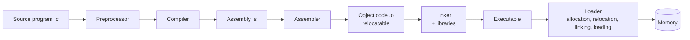
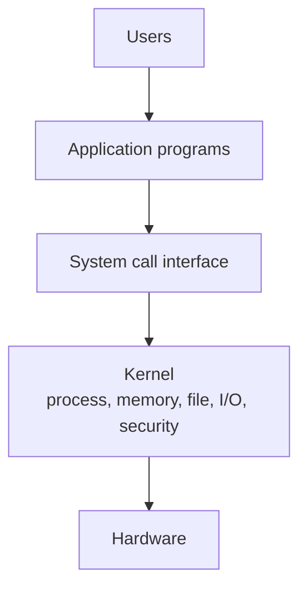
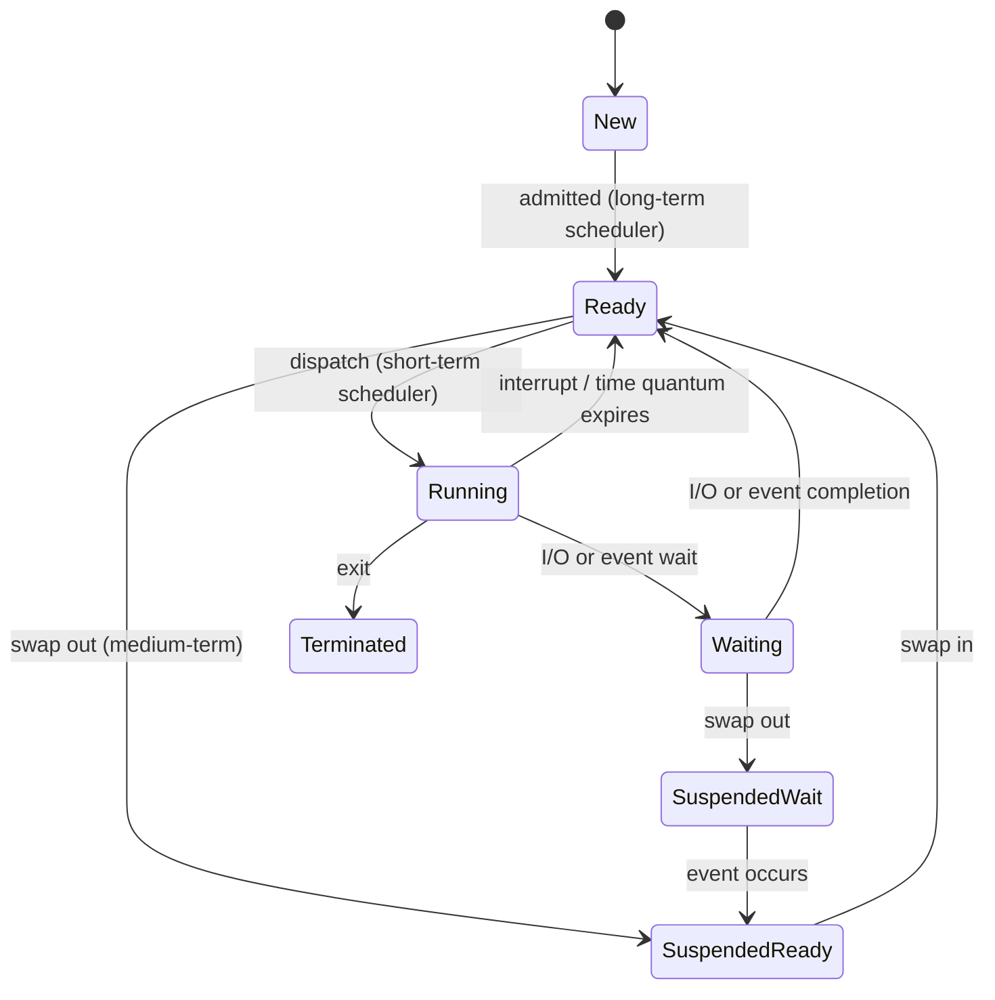
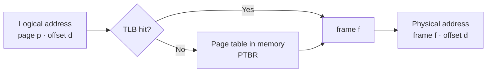

# Paper 2 · Unit 5 — System Software & Operating Systems

**Expected questions: 10–12 · Target: 10+ · Type: scheduling/paging/disk numericals + Galvin concepts — highly scoring**

## Syllabus Checklist
- [ ] System software: assembly language, assemblers, compilers vs interpreters, loading, linking, relocation, macros, debuggers
- [ ] OS basics: structure, services, system calls, boot
- [ ] Process management: process states, PCB, IPC, synchronisation, critical section, Peterson, semaphores, classical problems
- [ ] Threads: multithreading models, libraries, issues
- [ ] CPU scheduling: criteria, FCFS, SJF, SRTF, priority, RR, multilevel queues, multiprocessor & real-time scheduling
- [ ] Deadlocks: conditions, RAG, prevention, avoidance (Banker's), detection, recovery
- [ ] Memory management: contiguous allocation, paging, segmentation, TLB, demand paging, page replacement, thrashing
- [ ] Storage: disk structure, disk scheduling, RAID
- [ ] File systems & I/O: access methods, directories, allocation methods, free-space management, I/O subsystem
- [ ] Security & protection: access matrix, threats, authentication
- [ ] Virtual machines; Linux & Windows internals; distributed systems

---

## 1. System Software



| Tool | Job |
|------|-----|
| Assembler | Assembly → machine code. **Two-pass**: pass 1 builds symbol table (location counter), pass 2 generates code. One-pass needs **back-patching** for forward references |
| Compiler | Whole program → target code at once; faster execution |
| Interpreter | Statement by statement; slower, easier debugging |
| Linker | Resolves external references, combines object modules |
| Loader | Places program in memory; functions: **Allocation, Linking, Relocation, Loading** |
| Macro processor | Expands macros (text substitution, no call overhead); macro vs subroutine |
| Debugger | Breakpoints, single-step, watch variables |

- Loaders: **compile-and-go**, **absolute** (programmer does relocation), **relocating** (BSS loader), **direct-linking** loader, **dynamic loading** (load routine when called), **dynamic linking** (link at run time — DLL, `.so`).
- **Relocation**: adjusting address-sensitive instructions when program is loaded at a different address; relocation bits/table.
- Assembler data structures: **Symbol table (ST)**, **Literal table (LT)**, **Opcode table (MOT/OPTAB)**, **Pseudo-op table (POT)**, Pool table.
- Assembler directives (pseudo-ops): START, END, ORIGIN, EQU, LTORG, DC, DS.

## 2. OS Basics



| Structure | Example |
|-----------|---------|
| Simple / monolithic | MS-DOS, early UNIX, Linux (monolithic + loadable modules) |
| Layered | THE OS (Dijkstra) |
| **Microkernel** | Mach, QNX, Minix — minimal kernel, services in user space via message passing |
| Modular | Solaris, Linux LKMs |
| Hybrid | Windows NT, macOS (XNU) |
| Exokernel | Research — exposes hardware |

- **Dual mode**: user mode / kernel mode (mode bit). System call → trap → kernel mode.
- System call categories: process control (`fork`, `exec`, `exit`, `wait`), file management (`open`, `read`), device management (`ioctl`), information maintenance (`getpid`), communication (`pipe`, `shmget`), protection (`chmod`).
- Parameter passing to system calls: registers, block/table in memory, stack.
- Boot: power on → BIOS/UEFI firmware (POST) → bootstrap loader (MBR / GRUB) → kernel loaded → init/systemd.
- OS types: batch, multiprogramming (maximise CPU utilisation), time-sharing (multitasking, response time), real-time (hard/soft), distributed, network, embedded.

**`fork()` puzzle**: `n` consecutive `fork()` calls create **2ⁿ − 1** child processes (2ⁿ total).
```c
fork(); fork(); fork();   // 8 processes total, 7 children
if (fork() && fork()) fork();   // count carefully: 4 processes total (parent + 3 children)
```

## 3. Process Management

### 3.1 Process States



- **PCB** (Process Control Block): PID, state, PC, registers, scheduling info, memory info (page tables), accounting, I/O status.
- Schedulers: **long-term** (job; controls degree of multiprogramming), **short-term** (CPU; very frequent), **medium-term** (swapping).
- **Context switch** time is pure overhead. **Dispatcher latency**.
- **Zombie**: terminated but parent hasn't called `wait()`. **Orphan**: parent terminated (adopted by init).

### 3.2 IPC
- **Shared memory** (fast, needs synchronisation) vs **message passing** (send/receive; direct/indirect via mailboxes; blocking = synchronous, non-blocking = asynchronous).
- Pipes (ordinary – parent-child, unidirectional; named pipes/FIFOs), sockets (IP + port), RPC (stubs, marshalling), signals.

### 3.3 Critical Section Problem
Requirements: **Mutual exclusion**, **Progress**, **Bounded waiting**.

**Peterson's solution (2 processes)**:
```c
// shared: bool flag[2]; int turn;
do {
    flag[i] = true;
    turn = j;                       // politely give turn to other
    while (flag[j] && turn == j);   // busy wait
    /* critical section */
    flag[i] = false;
    /* remainder section */
} while (true);
```
Satisfies all three requirements (on sequentially consistent memory).

Hardware: **TestAndSet**, **CompareAndSwap** (atomic). Simple TAS lock gives ME + progress but not bounded waiting.

### 3.4 Semaphores
```c
wait(S)   { while (S <= 0); S--; }      // P(), down()
signal(S) { S++; }                      // V(), up()
```
- **Binary semaphore** (mutex, 0/1) vs **counting semaphore**.
- Blocking implementation uses a waiting queue — negative value = number of waiting processes.
- Counting semaphore initial value 10, then 6 P and 4 V → 10 − 6 + 4 = **8**.
- Misuse → deadlock (wrong order of waits) or starvation. **Priority inversion** → solved by priority inheritance.
- **Monitors**: high-level construct; condition variables with `wait()`/`signal()`.
- **Spinlock** = busy-waiting lock (good for short waits on multiprocessors).

### Classical problems

| Problem | Semaphores |
|---------|-----------|
| Bounded buffer (producer–consumer) | `mutex = 1`, `empty = n`, `full = 0` |
| Readers–writers | `rw_mutex = 1`, `mutex = 1`, `read_count = 0` (first readers–writers: writers may starve) |
| Dining philosophers (5) | `chopstick[5] = 1`; deadlock if all pick left — fixes: at most 4 at table, asymmetric pick, pick both atomically |
| Sleeping barber | customers, barbers, mutex |

```
Producer:                       Consumer:
  wait(empty);                    wait(full);
  wait(mutex);                    wait(mutex);
  add item                        remove item
  signal(mutex);                  signal(mutex);
  signal(full);                   signal(empty);
(swapping the two waits in producer can cause DEADLOCK)
```

## 4. Threads
- Thread = lightweight process: own **PC, registers, stack**; shares code, data, files with peers.
- **User-level threads** (fast, kernel unaware; one blocks → all block in many-to-one) vs **kernel-level threads**.
- Models: **Many-to-one** (Green threads), **One-to-one** (Linux, Windows), **Many-to-many**, two-level.
- Libraries: POSIX Pthreads, Windows threads, Java threads. Implicit threading: thread pools, OpenMP, GCD, fork-join.
- Issues: `fork()`/`exec()` semantics, signal handling, thread cancellation (asynchronous vs deferred), thread-local storage, scheduler activations (LWP, upcalls).
- **Amdahl's law** for multicore: speedup ≤ 1 / (S + (1−S)/N).

## 5. CPU Scheduling

```
Turnaround time (TAT) = Completion − Arrival
Waiting time (WT)     = TAT − Burst
Response time         = First run − Arrival
Throughput            = #processes / total time
```

| Algorithm | Preemptive? | Notes |
|-----------|-------------|-------|
| FCFS | No | Convoy effect |
| SJF | No | Optimal average waiting time (non-preemptive) |
| **SRTF** | Yes (preemptive SJF) | **Optimal** average WT overall; starvation |
| Priority | Both | Starvation → **aging** |
| **Round Robin** | Yes | Time quantum q; large q → FCFS; small q → high context switch overhead |
| Multilevel queue | — | Fixed queues (foreground RR, background FCFS) |
| Multilevel feedback queue | Yes | Processes move between queues; most general |
| HRRN | No | Response ratio = (W + S)/S; favours short jobs, avoids starvation |

### Worked Example

| Process | Arrival | Burst |
|---------|---------|-------|
| P1 | 0 | 8 |
| P2 | 1 | 4 |
| P3 | 2 | 9 |
| P4 | 3 | 5 |

**SRTF Gantt chart**:
```
| P1 | P2      | P4        | P1             | P3                  |
0    1         5           10               17                    26
```
| P | CT | TAT | WT |
|---|----|-----|----|
| P1 | 17 | 17 | 9 |
| P2 | 5 | 4 | 0 |
| P3 | 26 | 24 | 15 |
| P4 | 10 | 7 | 2 |
Average WT = 26/4 = **6.5**.

**Round Robin (q = 4)** on same data:
```
| P1 | P2 | P3 | P4 | P1 | P3 | P4 | P3 |
0    4    8    12   16   20   24   25   26
```
CT: P1 = 20, P2 = 8, P3 = 26, P4 = 25 → WT: P1 = 12, P2 = 3, P3 = 15, P4 = 17 → average = **11.75**.

### Multiprocessor & Real-time
- Asymmetric vs **symmetric multiprocessing (SMP)**; processor affinity (soft/hard); load balancing (push/pull migration).
- **Rate Monotonic** (static priority: shorter period → higher priority); schedulable if U ≤ n(2^(1/n) − 1) (≈ 0.69 for large n).
- **EDF** (Earliest Deadline First, dynamic): schedulable iff U ≤ 1.
- Linux: **CFS** (Completely Fair Scheduler, red-black tree keyed by virtual runtime). Windows: 32-level priority-based preemptive.

## 6. Deadlocks

### Four Necessary Conditions (Coffman)
**Mutual exclusion · Hold and wait · No preemption · Circular wait** — all four must hold.

```
Resource Allocation Graph
  P1 ──request──► [R1 •]──assigned──► P2
   ▲                                    │
   │                                    ▼
  [R2 •]◄─────────request───────────────┘
  (assigned to P1)
  Cycle with single-instance resources ⇒ DEADLOCK
  Cycle with multi-instance resources ⇒ deadlock POSSIBLE
```

| Strategy | How |
|----------|-----|
| Prevention | Break one condition: e.g. request all at once (hold & wait), allow preemption, **impose total order on resources** (circular wait) |
| Avoidance | **Banker's algorithm** — grant only if state remains safe |
| Detection & recovery | Wait-for graph (single instance), detection algorithm; recover by killing processes / preemption |
| Ignorance | Ostrich algorithm (UNIX, Windows) |

### Banker's Algorithm — Worked
5 processes, resources A(10), B(5), C(7).

| P | Allocation (A B C) | Max | Need = Max − Alloc |
|---|-----------|-----|------|
| P0 | 0 1 0 | 7 5 3 | 7 4 3 |
| P1 | 2 0 0 | 3 2 2 | 1 2 2 |
| P2 | 3 0 2 | 9 0 2 | 6 0 0 |
| P3 | 2 1 1 | 2 2 2 | 0 1 1 |
| P4 | 0 0 2 | 4 3 3 | 4 3 1 |

Available = (10,5,7) − (7,2,5) = **(3,3,2)**.
```
Work=(3,3,2): P1 need(1,2,2) ✓ → Work=(5,3,2)
              P3 need(0,1,1) ✓ → Work=(7,4,3)
              P4 need(4,3,1) ✓ → Work=(7,4,5)
              P0 need(7,4,3) ✓ → Work=(7,5,5)
              P2 need(6,0,0) ✓ → Work=(10,5,7)
Safe sequence: <P1, P3, P4, P0, P2>
```

**Deadlock-free condition formula**: n processes each needing max k instances of a resource with R instances total → deadlock-free if **R ≥ n(k − 1) + 1**.
e.g. 3 processes each need 3 units → minimum R = 3×2 + 1 = **7**.

## 7. Memory Management

### 7.1 Contiguous Allocation
- Fixed partitions → **internal fragmentation**. Variable partitions → **external fragmentation** (fix with compaction).
- Placement: **First fit**, **Best fit** (smallest adequate hole), **Worst fit** (largest), Next fit.
- **50-percent rule**: with first fit, N allocated blocks → 0.5N blocks lost to fragmentation.

### 7.2 Paging



```
Logical address bits = log₂(virtual space);  offset bits d = log₂(page size)
#pages = 2^(LA bits − d) ;  #frames = physical size / page size
Page table size = #pages × PTE size
EAT with TLB (hit ratio h, TLB t, memory m):
    EAT = h(t + m) + (1 − h)(t + 2m)
```

**Worked**: 32-bit logical address, 4 KB pages, 4-byte PTE.
- Offset = 12 bits; pages = 2²⁰; page table = 2²⁰ × 4 B = **4 MB** per process (hence multilevel paging).
- Two-level (10 | 10 | 12): outer table 1024 entries × 4 B = 4 KB = one page.
- Inverted page table: one entry per **frame** (size ∝ physical memory), searched by hashing.

### 7.3 Segmentation
- Logical address = (segment number, offset); segment table has **base & limit**; offset ≥ limit → trap.
- No internal fragmentation, but external fragmentation. Segmentation with paging (Intel x86).

### 7.4 Virtual Memory & Demand Paging
```
EAT with page faults = (1 − p) × ma + p × page-fault service time
e.g. ma = 200 ns, service = 8 ms, p = 0.001 → EAT ≈ 200 + 0.001 × 8,000,000 = 8.2 µs
```
Page fault steps: trap → check valid → find free frame → schedule disk read → update table → restart instruction.

### 7.5 Page Replacement — Worked
Reference string: **7 0 1 2 0 3 0 4 2 3 0 3 2**, 3 frames.

**FIFO**
```
Ref:  7  0  1  2  0  3  0  4  2  3  0  3  2
F1    7  7  7  2  2  2  2  4  4  4  0  0  0
F2       0  0  0  0  3  3  3  2  2  2  2  2
F3          1  1  1  1  0  0  0  3  3  3  3
Fault ✱  ✱  ✱  ✱     ✱  ✱  ✱  ✱  ✱  ✱
→ 10 faults
```
**Optimal (replace page used farthest in future)** → **7 faults**.
**LRU (replace least recently used)** → **9 faults**.

- **Belady's anomaly**: more frames → more faults; occurs in **FIFO**, not in stack algorithms (LRU, Optimal).
  Classic string: 1 2 3 4 1 2 5 1 2 3 4 5 → FIFO 3 frames: 9 faults, 4 frames: 10 faults.
- Other algorithms: Second chance (clock), LFU, MFU, NRU (reference & modify bits).
- **Thrashing**: process spends more time paging than executing — when Σ working sets > available frames; fix with **working-set model** or **page-fault frequency** control, reduce degree of multiprogramming.
- Frame allocation: equal, proportional; global vs local replacement.
- **Copy-on-write** for `fork()`. **Memory-mapped files**.

## 8. Disk & Storage

### 8.1 Disk Scheduling — Worked
Queue: **98, 183, 37, 122, 14, 124, 65, 67**; head at **53**; cylinders 0–199.

| Algorithm | Order | Total head movement |
|-----------|-------|--------|
| FCFS | 53→98→183→37→122→14→124→65→67 | **640** |
| SSTF | 53→65→67→37→14→98→122→124→183 | **236** |
| SCAN (towards 0) | 53→37→14→0→65→67→98→122→124→183 | **236** |
| C-SCAN (towards 199) | 53→65→…→183→199→0→14→37 | 146 + 199 + 37 = **382** (counting return jump) |
| LOOK (towards 0) | 53→37→14→65→…→183 | 39 + 169 = **208** |
| C-LOOK (up) | 53→65→67→98→122→124→183→14→37 | 130 + 169 + 23 = **322** |

```
SSTF head path (cylinder axis →)
0    14    37    53 65 67    98    122 124        183   199
                 ●──►──►                                    53→65→67
           ◄─────────────┘                                 67→37
      ◄────┘                                               37→14
      └──────────────────────►──────►──►──────────►         14→98→122→124→183
```
- SSTF may cause **starvation**. SCAN = elevator. C-SCAN gives more uniform wait time.

### 8.2 RAID

| Level | Technique | Min disks | Fault tolerance |
|-------|-----------|-----------|----------------|
| 0 | Striping (block) | 2 | None |
| 1 | Mirroring | 2 | 1 disk |
| 2 | Bit striping + Hamming ECC | — | 1 |
| 3 | Byte striping + dedicated parity | 3 | 1 |
| 4 | Block striping + dedicated parity | 3 | 1 (parity disk bottleneck) |
| **5** | Block striping + **distributed parity** | 3 | 1 |
| 6 | Distributed double parity (P+Q) | 4 | 2 |
| 10 (1+0) | Mirror then stripe | 4 | 1 per mirror pair |

## 9. File Systems & I/O

- Access methods: sequential, direct (relative), indexed.
- Directory structures: single-level → two-level → tree → **acyclic graph** (sharing via links) → general graph (cycles; needs garbage collection).
- Hard link (same inode, same FS, no dirs) vs soft/symbolic link (path, can cross FS, can dangle).

### Allocation Methods

```
 Contiguous        Linked (FAT is a variant)      Indexed (inode)
 [A A A A]         A→A→A→A→nil                   index block → [b1,b2,b3,…]
 fast, direct      no ext. fragmentation          direct access, no ext. frag.
 ext. fragmentation  only sequential access        overhead of index block
```

**UNIX inode max file size**: 12 direct + 1 single + 1 double + 1 triple indirect. Block 4 KB, pointer 4 B → 1024 pointers per block:
```
(12 + 1024 + 1024² + 1024³) × 4 KB ≈ 4 TB
```
- Free-space management: **bit vector** (1 bit per block), linked list, grouping, counting.
- Directory implementation: linear list, hash table.
- Mounting, file sharing, NFS. Journaling (log-structured) file systems for consistency.

**I/O**: polling, interrupts, DMA (see [Unit 2](02-Computer-System-Architecture.md)). Kernel I/O subsystem: scheduling, **buffering** (single, double, circular), **caching**, **spooling** (printer), error handling. Device drivers. Block vs character devices.

## 10. Protection & Security
- **Access matrix**: rows = domains, columns = objects. Implementations: global table, **access control lists** (column-wise, per object), **capability lists** (row-wise, per domain), lock-key.
- Revocation: immediate/delayed, selective/general, partial/total.
- Principle of **least privilege**; need-to-know.
- Program threats: Trojan horse, trap door (back door), logic bomb, stack/buffer overflow, virus. System/network threats: worms, port scanning, DoS/DDoS.
- Authentication: passwords (salted hash), OTP, biometrics, multi-factor.
- Cryptography — see [Unit 9](09-Computer-Networks.md).

## 11. Virtual Machines
- **Type 1 (bare-metal) hypervisor**: VMware ESXi, Xen, Hyper-V, KVM. **Type 2 (hosted)**: VirtualBox, VMware Workstation.
- Full virtualisation, para-virtualisation (guest OS modified — Xen), hardware-assisted (Intel VT-x, AMD-V), containers (OS-level: Docker — share host kernel), emulation (QEMU).
- JVM, .NET CLR = application/process VMs.

## 12. Linux & Windows

| Feature | Linux | Windows |
|---------|-------|---------|
| Kernel | Monolithic + loadable kernel modules | Hybrid (microkernel-inspired), HAL, executive |
| Process creation | `fork()` + `exec()` (clone for threads) | `CreateProcess()` |
| Scheduling | CFS (normal), real-time FIFO/RR | Priority-based preemptive, 32 levels |
| Memory | Buddy system + slab allocator, demand paging | Demand paging with clustering, working sets |
| File system | ext2/3/4 (inodes), VFS layer; `/proc` | NTFS (MFT, journaling, ACLs), FAT32, ReFS |
| IPC | pipes, signals, shared memory, message queues, sockets | ALPC, pipes, mailslots |
| Other | GPL; first released 1991 (Linus Torvalds) | Terminal services, fast user switching |

Linux process states: Running, Interruptible sleep, Uninterruptible sleep, Stopped, Zombie.
**Buddy system**: memory split into power-of-2 blocks; request 70 KB from 1 MB → gets 128 KB block.

## 13. Distributed Systems
- Network OS (users aware of machines; remote login, file transfer) vs **Distributed OS** (transparent: data, computation, process migration).
- Topologies & communication: naming, routing, connection strategies, contention.
- Robustness: failure detection (heartbeat), reconfiguration, recovery.
- Design issues: transparency, fault tolerance, scalability.
- **Distributed File Systems**: NFS (stateless, v3), AFS (whole-file caching), GFS/HDFS. Naming transparency vs location independence; caching & consistency (write-through, delayed-write, callback).
- Clock synchronisation: **Lamport logical clocks** (happened-before →), vector clocks, Cristian's, Berkeley algorithms.
- Mutual exclusion: centralised, Ricart–Agrawala (2(n−1) messages), token ring. Election: **Bully**, Ring.

## 14. Deeper Dive — More Scheduling, Semaphore Traces, Multilevel Paging & File Numericals

### 14.1 Priority & HRRN Scheduling — Worked

| Process | Arrival | Burst | Priority (lower = higher) |
|---------|---------|-------|---------------------------|
| P1 | 0 | 10 | 3 |
| P2 | 0 | 1 | 1 |
| P3 | 0 | 2 | 4 |
| P4 | 0 | 1 | 5 |
| P5 | 0 | 5 | 2 |

**Non-preemptive priority**:
```
| P2 | P5    | P1         | P3 | P4 |
0    1       6            16   18   19
```
Waiting times: P1 6, P2 0, P3 16, P4 18, P5 1 → average = 41/5 = **8.2**.

**HRRN** (non-preemptive; response ratio RR = (W + S)/S), processes A(0, 3), B(2, 6), C(4, 4), D(6, 5), E(8, 2):
```
t = 0: only A → run A to 3
t = 3: only B arrived → run B to 9
t = 9: C: (5 + 4)/4 = 2.25   D: (3 + 5)/5 = 1.6   E: (1 + 2)/2 = 1.5   → run C to 13
t = 13: D: (7 + 5)/5 = 2.4   E: (5 + 2)/2 = 3.5                        → run E to 15
t = 15: run D to 20
Order: A B C E D
```

### 14.2 Semaphore Tracing

```c
semaphore S = 1, T = 0;
P1: wait(S); print("A"); signal(T);
P2: wait(T); print("B"); signal(S);
```
Whatever the scheduling, P2 blocks on T until P1 signals → output **"AB"** (and the pair can repeat as A B A B … if looped). This is the standard **ordering** use of semaphores (initialise to 0 to force "happens-after").

**Deadlock with wrong order**:
```
P0: wait(S); wait(Q); …        P1: wait(Q); wait(S); …     (S = Q = 1)
P0 gets S, P1 gets Q, each waits for the other → deadlock
```

### 14.3 Multilevel Paging Numericals

48-bit virtual address, 4 KB pages, 8-byte PTEs.
```
Offset = 12 bits → page-number bits = 36
Entries per page-table page = 4096 / 8 = 512 = 2⁹ → each level indexes 9 bits
Levels needed = ⌈36 / 9⌉ = 4  (this is x86-64 4-level paging: 9 | 9 | 9 | 9 | 12)
Memory accesses per reference without TLB = 4 (tables) + 1 (data) = 5
```

**Effective access time with TLB and 2-level paging**: TLB 10 ns, memory 100 ns, hit ratio 90%:
EAT = 0.9 × (10 + 100) + 0.1 × (10 + 3 × 100) = 99 + 31 = **130 ns**.

### 14.4 Segmentation — Address Translation

| Segment | Base | Limit |
|---------|------|-------|
| 0 | 219 | 600 |
| 1 | 2300 | 14 |
| 2 | 90 | 100 |
| 3 | 1327 | 580 |

- (0, 430) → 430 < 600 → physical **649**
- (1, 10) → **2310**
- (2, 500) → 500 ≥ 100 → **segmentation fault (trap)**
- (3, 400) → **1727**

### 14.5 Page Replacement with 4 Frames (Belady check)

Reference: 1 2 3 4 1 2 5 1 2 3 4 5
- FIFO, 3 frames → **9** faults; 4 frames → **10** faults (anomaly).
- LRU, 4 frames → **8** faults; Optimal, 4 frames → **6** faults.

### 14.6 File-System Numericals

**Max file size with UNIX inode**: block 1 KB, pointer 4 B → 256 pointers/block; 10 direct, 1 single, 1 double, 1 triple:
```
(10 + 256 + 256² + 256³) × 1 KB = (10 + 256 + 65,536 + 16,777,216) KB ≈ 16 GB
```
**FAT size**: 4 GB disk, 4 KB clusters, 32-bit entries → 2²⁰ clusters × 4 B = **4 MB** FAT.

**Disk access**: 7200 RPM, average seek 8 ms, transfer rate 100 MB/s, read 4 KB block:
seek 8 + latency 4.17 + transfer 0.04 ≈ **12.2 ms**.

### 14.7 Buddy System — Worked

1 MB block; requests A = 70 KB, B = 35 KB, C = 80 KB.
```
1024 → 512 + 512 → 256 + 256 → 128 + 128          A gets 128 KB (wastes 58 KB internal)
B (35 KB): split a 128 → 64 + 64                   B gets 64 KB
C (80 KB): needs 128 → split the second 256 → 128 + 128, C gets 128 KB
Release: buddies of equal size and adjacent addresses coalesce back
```

### 14.8 Process Synchronisation Hardware

```c
// Test-and-Set lock
bool lock = false;
do {
    while (test_and_set(&lock));   // atomically: old = lock; lock = true; return old
    /* critical section */
    lock = false;
} while (true);
```
Gives mutual exclusion and progress, but **not bounded waiting** (a process can be overtaken indefinitely); the bounded-waiting version uses a `waiting[]` array.

---

## Previous Year Questions (PYQ pattern)

**System software**
1. A two-pass assembler's first pass: **builds the symbol table (assigns addresses)**
2. Forward reference problem in one-pass assembler is solved by: **back-patching**
3. Which loader function adjusts address-dependent locations? **Relocation**
4. Dynamic linking is performed at: **run time**
5. Macro expansion is done by: **macro processor / preprocessor** (before assembly/compilation)

**Processes & threads**

6. Number of child processes created by `for(i=0;i<n;i++) fork();`: **2ⁿ − 1**
7. Which is NOT shared by threads of a process? **Stack (and registers)**
8. Degree of multiprogramming is controlled by: **long-term scheduler**
9. A process whose parent has not called wait(): **zombie**
10. Which multithreading model blocks the whole process on a blocking system call? **Many-to-one**

**Synchronisation**

11. Critical section solution requirements: **mutual exclusion, progress, bounded waiting**
12. Semaphore S = 7; 20 P and 15 V operations performed: final = 7 − 20 + 15 = **2**
13. Producer-consumer with bounded buffer of size n: initial values mutex = 1, empty = **n**, full = **0**
14. Priority inversion is solved by: **priority inheritance protocol**
15. Peterson's solution is for: **two processes**

**Scheduling**

16. Algorithm with minimum average waiting time: **SJF / SRTF**
17. Round robin with very large quantum becomes: **FCFS**
18. Starvation in priority scheduling is solved by: **aging**
19. Convoy effect occurs in: **FCFS**
20. Processes P1(0,10), P2(1,1), P3(2,2) with SRTF: average waiting time = P1: 3, P2: 0, P3: 0 → **1**
21. Rate-monotonic schedulability bound for 2 tasks: 2(√2 − 1) ≈ **0.828**

**Deadlock**

22. Necessary conditions for deadlock: **mutual exclusion, hold & wait, no preemption, circular wait**
23. Banker's algorithm is for deadlock: **avoidance**
24. Ordering resources numerically prevents: **circular wait**
25. 4 processes each need 2 tape drives; minimum drives to ensure no deadlock: 4×1 + 1 = **5**
26. Cycle in RAG with single-instance resources implies: **deadlock**

**Memory**

27. Belady's anomaly occurs in: **FIFO**
28. Page size 4 KB, logical address 32 bits → number of pages: **2²⁰**
29. TLB 20 ns, memory 100 ns, hit 80%: EAT = 0.8×120 + 0.2×220 = **140 ns**
30. Thrashing is caused by: **high degree of multiprogramming / insufficient frames**
31. Internal fragmentation occurs in: **paging (fixed-size)**; external in: **segmentation / variable partitions**
32. Best fit, memory holes 100K, 500K, 200K, 300K, 600K; request 212K → **300K hole**
33. LRU faults for 1,2,3,4,1,2,5,1,2,3,4,5 with 3 frames: **10**
34. Optimal page replacement is not implementable because: **future references are unknown**
35. Working set model is used to prevent: **thrashing**

**Disk / file**

36. Disk scheduling that may cause starvation: **SSTF**
37. Elevator algorithm: **SCAN**
38. RAID level with distributed parity: **RAID 5**
39. RAID with mirroring: **RAID 1**
40. Allocation method that supports direct access and has no external fragmentation: **Indexed**
41. FAT uses which allocation method? **Linked (table variant)**
42. Bit vector for 1 TB disk with 4 KB blocks: 2²⁸ bits = **32 MB**

**Security / VM / distributed**

43. Access control lists correspond to: **columns of the access matrix**
44. Capability list corresponds to: **rows (domains)**
45. A program that appears useful but performs malicious actions: **Trojan horse**
46. VMware ESXi is a: **Type 1 hypervisor**
47. Lamport clocks capture: **happened-before ordering (logical time)**
48. Linux kernel is: **monolithic with loadable modules**
49. Windows file system with MFT: **NTFS**

**More practice questions**

50. HRRN favours: **short jobs, while preventing starvation of long jobs (waiting time raises the ratio)**
51. Response ratio of a process with waiting time 9 and burst 3: **4**
52. Semaphore initialised to 0 is used for: **ordering / signalling between processes**
53. 32-bit virtual address, 4 KB pages, 4-byte PTEs, single-level: page table size = **4 MB**
54. Levels of paging for 48-bit VA, 4 KB pages, 8 B PTEs (page-sized tables): **4**
55. Segment (2, 500) with limit 100: **trap / segmentation fault**
56. LRU with 4 frames on 1 2 3 4 1 2 5 1 2 3 4 5: **8** faults
57. Optimal with 4 frames on the same string: **6** faults
58. Buddy system allocation for a 70 KB request: **128 KB** block
59. Test-and-set spin lock fails to guarantee: **bounded waiting**
60. Average rotational latency at 15,000 RPM: **2 ms**

## Quick Revision Box
- n forks → 2ⁿ processes · Threads share code/data/files, not stack/registers
- SRTF optimal WT · RR big q = FCFS · aging fixes starvation
- Deadlock-free: R ≥ n(k−1)+1 · Banker = avoidance
- EAT(TLB) = h(t+m) + (1−h)(t+2m) · Belady only FIFO
- SSTF starvation · SCAN elevator · RAID 5 distributed parity
