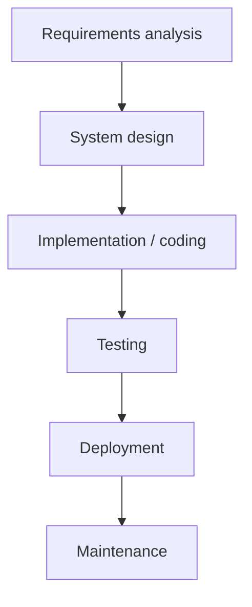
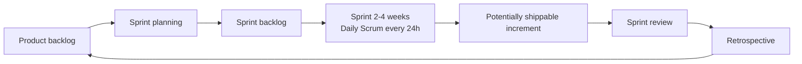
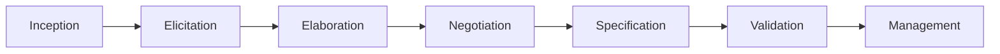
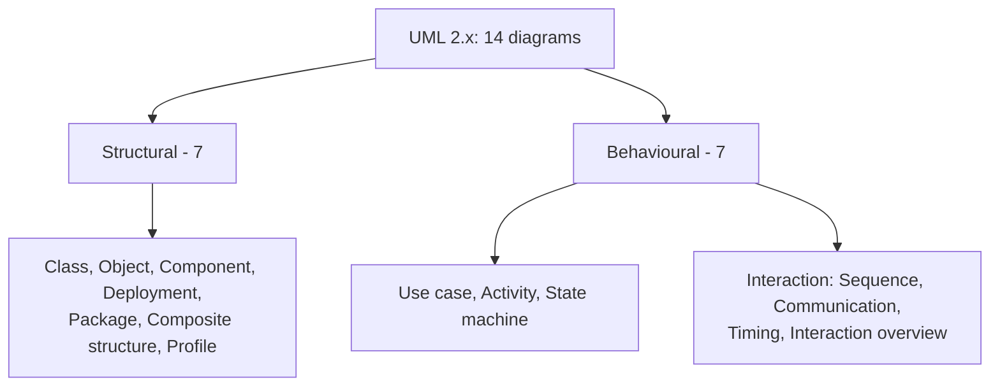
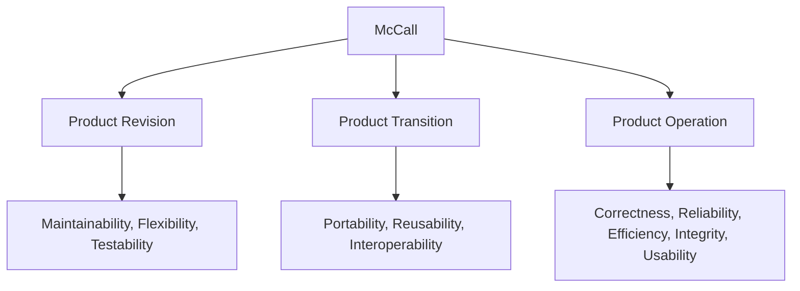
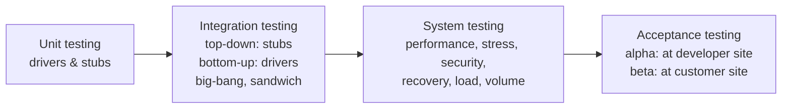
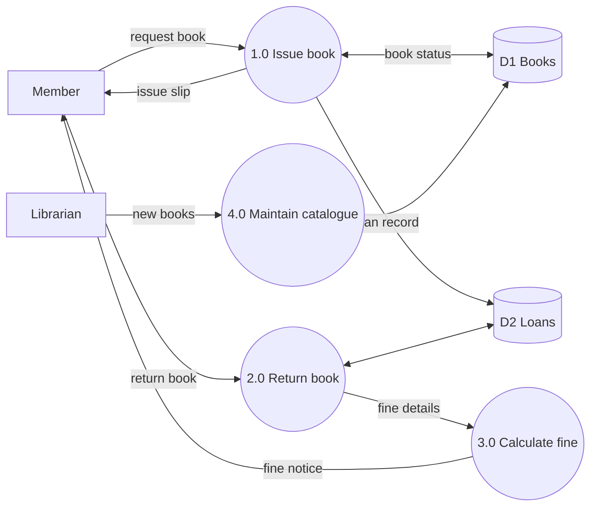
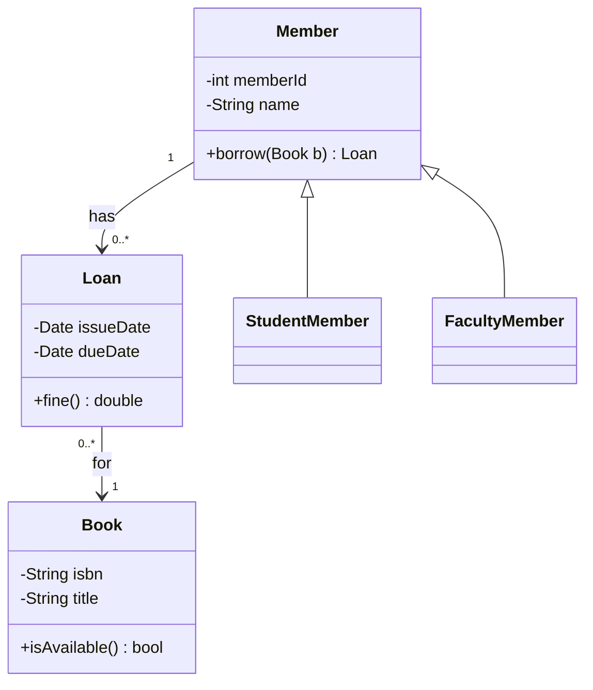
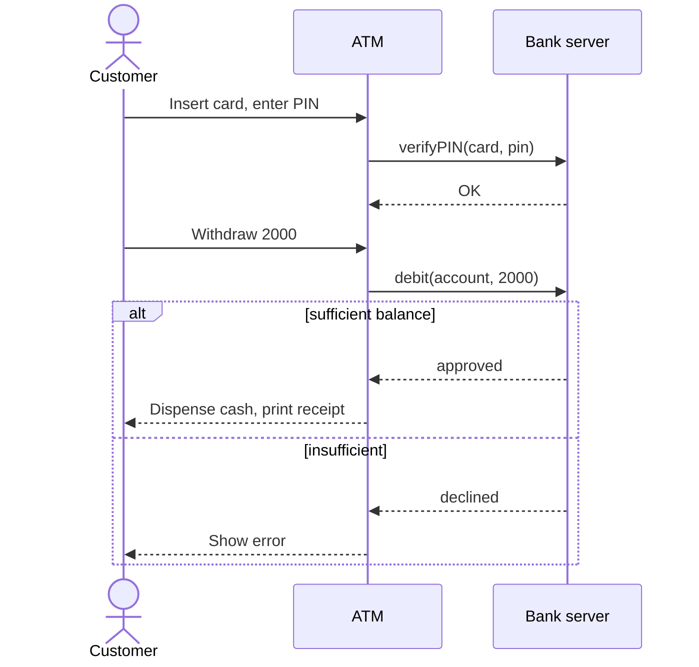

# Paper 2 · Unit 6 — Software Engineering

**Expected questions: 8–10 · Target: 9+ · Type: mostly theory (Pressman) + metrics numericals (COCOMO, FP, cyclomatic) — most scoring unit**

## Syllabus Checklist
- [ ] Software process models: waterfall, prototype, evolutionary (incremental, spiral), concurrent, component-based, formal methods, AOSD, unified process, Agile (XP, Scrum, DSDM, Crystal, FDD, ASD, Kanban)
- [ ] Software requirements: functional & non-functional, eliciting, analysis, requirements specification, SRS, validation, management
- [ ] Software design: abstraction, architecture, patterns, modularity, cohesion & coupling, information hiding, functional independence, refinement, architectural & UI design
- [ ] Software quality: McCall, ISO 9126, quality control & assurance, risk management, RMMM, software reliability
- [ ] Estimation & scheduling: size (LOC, FP), COCOMO, project scheduling & staffing, timeline charts
- [ ] Software testing: verification & validation, error/fault/defect/failure, unit/integration/system/acceptance, white-box & black-box, regression, performance, stress, alpha/beta
- [ ] Configuration management; maintenance & re-engineering; reverse engineering

---

## 1. Software Process Models

### 1.1 Waterfall (Royce, 1970)


- Linear sequential; each phase completes before next. Good when **requirements are clear & stable**. No working software until late; high risk.
- **V-Model**: verification phases (left) paired with validation/testing phases (right): Requirements↔Acceptance test, System design↔System test, Architecture↔Integration test, Module design↔Unit test.

```
 Requirements ─────────────────────────► Acceptance testing
   System design ───────────────────► System testing
     Architecture design ────────► Integration testing
        Module design ─────────► Unit testing
                    ╲         ╱
                      Coding
```

### 1.2 Prototype Model
Quick design → build prototype → customer evaluation → refine → (throwaway or evolutionary). Best when **requirements are unclear**.

### 1.3 Incremental & RAD
- **Incremental**: deliver in increments; first increment = core product.
- **RAD** (Rapid Application Development): 60–90 days, component reuse, multiple teams; needs modular & well-understood requirements.

### 1.4 Spiral Model (Barry Boehm, 1986) — **risk-driven**

```
            1. Determine objectives,      │      2. Evaluate alternatives,
               alternatives, constraints  │         IDENTIFY & RESOLVE RISKS
                                          │
             ┌────────────────────────────┼────────────────────────────┐
             │       ┌────────────────────┼────────────────────┐       │
             │       │       ┌────────────┼────────────┐       │       │
             │       │       │          START          │       │       │
  ───────────┼───────┼───────┼────────────┼────────────┼───────┼───────┼──────────
             │       │       └────────────┼────────────┘       │       │
             │       └────────────────────┼────────────────────┘       │
             └────────────────────────────┼────────────────────────────┘
                                          │
            4. Plan the next phase        │      3. Develop & verify the
                                          │         next-level product
  Each loop = one phase; radius = cumulative cost; angle = progress through the quadrants
```
- 4 quadrants: Planning (objectives) → **Risk analysis** → Engineering → Evaluation. Meta-model; suits large, high-risk projects.

### 1.5 Others
| Model | Key idea |
|-------|---------|
| Concurrent | Activities exist simultaneously in different states (state chart) |
| Component-based (CBSE) | Assemble pre-built COTS components |
| Formal methods | Mathematical specification (Z, VDM); **Cleanroom** SE (statistical testing, defect prevention) |
| AOSD | Aspect-oriented: crosscutting concerns (logging, security) as aspects |
| **Unified Process (RUP)** | Use-case driven, architecture-centric, iterative & incremental. Phases: **Inception → Elaboration → Construction → Transition** (+ Production) |

### 1.6 Agile

**Agile Manifesto (2001)** values:
- **Individuals & interactions** over processes & tools
- **Working software** over comprehensive documentation
- **Customer collaboration** over contract negotiation
- **Responding to change** over following a plan
(12 principles; e.g. deliver frequently, welcome changing requirements, sustainable pace, face-to-face communication.)

| Method | Highlights |
|--------|-----------|
| **XP** (Kent Beck) | Pair programming, **test-first (TDD)**, refactoring, continuous integration, small releases, **user stories**, spike solutions, CRC cards, collective ownership, 40-hour week |
| **Scrum** | **Sprint** (2–4 weeks, time-boxed), **Product backlog**, Sprint backlog, **Daily Scrum** (15 min stand-up), Sprint review, retrospective; roles: **Product Owner, Scrum Master, Development Team**; burndown chart |
| DSDM | Time-boxing, **MoSCoW** prioritisation (Must, Should, Could, Won't); 80/20 principle |
| Crystal | Family (Clear, Orange…) by team size & criticality (Alistair Cockburn) |
| FDD | Feature Driven Development; features in ≤ 2 weeks |
| ASD | Adaptive SD: Speculation, Collaboration, Learning (Highsmith) |
| Kanban | Visual board, limit Work-In-Progress (WIP) |
| Lean | Eliminate waste |



### Model selection cheat-sheet
| Situation | Model |
|-----------|-------|
| Clear, fixed requirements | Waterfall |
| Unclear requirements | Prototyping |
| High risk, large | Spiral |
| Quick delivery, modular | RAD / Incremental |
| Changing requirements, small teams | Agile |
| Safety-critical | Formal methods / Cleanroom |

## 2. Requirements Engineering


- **Functional**: what the system does (services). **Non-functional**: quality constraints — performance, security, reliability, usability, portability, maintainability (FURPS+).
- Elicitation techniques: interviews, questionnaires, **JAD** (Joint Application Development), **QFD** (Quality Function Deployment: normal, expected, exciting requirements), brainstorming, use cases, observation, prototyping.
- **SRS** (IEEE 830): characteristics — correct, unambiguous, complete, consistent, ranked, **verifiable**, modifiable, traceable. SRS says **what**, not **how**.
- Requirement traceability matrix. Validation: reviews, prototyping, test-case generation.
- Analysis models: **DFD** (process), ER (data), **state diagrams** (behaviour), use case diagrams, data dictionary.

```
 DFD notation (Yourdon/DeMarco)
 ┌──────┐  External entity   ( ○ )  Process (bubble)   ═══  Data store   ──►  Data flow
 Level 0 DFD = Context diagram (single process, shows external entities only)
 Balancing: inputs/outputs of child DFD = those of parent process
```

### UML Diagrams

Relationships: association, aggregation (◇ hollow, "has-a", weak), composition (◆ filled, strong ownership), generalisation (△ "is-a"), dependency (dashed arrow), realisation. Use case relations: «include» (mandatory), «extend» (optional).

## 3. Software Design

### 3.1 Design Concepts
Abstraction (procedural, data), architecture, patterns, separation of concerns, **modularity**, **information hiding** (Parnas), **functional independence** (high cohesion + low coupling), stepwise refinement (Wirth), refactoring, aspects.

### 3.2 Cohesion (within a module) — best to worst

```
 BEST  ▲  Functional      – single well-defined task
       │  Sequential      – output of one part is input to next
       │  Communicational – parts operate on same data
       │  Procedural      – parts follow a sequence of execution
       │  Temporal        – executed at same time (e.g. initialisation)
       │  Logical         – logically similar tasks, selected by flag
 WORST ▼  Coincidental    – unrelated tasks
```
Mnemonic (worst→best): **"Coin Logic Temp Proc Comm Seq Func"**.

### 3.3 Coupling (between modules) — best to worst

```
 BEST  ▲  No coupling / Data coupling – pass only needed data
       │  Stamp coupling   – pass whole data structure, use part
       │  Control coupling – pass control flag
       │  External coupling – share external format/device/protocol
       │  Common coupling  – share global data
 WORST ▼  Content coupling – one module modifies/uses internals of another
```
**Goal: high cohesion, low coupling.**

### 3.4 Architectural Styles
Data-centred (repository/blackboard), data-flow (**pipe & filter**, batch sequential), call-and-return (main/subprogram, remote procedure), object-oriented, layered, client-server, **MVC**, event-driven, microservices, SOA.

### 3.5 Design Patterns (GoF – 23)
| Category | Patterns |
|----------|----------|
| Creational (5) | Singleton, Factory Method, Abstract Factory, Builder, Prototype |
| Structural (7) | Adapter, Bridge, Composite, Decorator, Facade, Flyweight, Proxy |
| Behavioural (11) | Observer, Strategy, Command, Iterator, State, Template Method, Visitor, Mediator, Memento, Chain of Responsibility, Interpreter |

### 3.6 UI Design
Golden rules (Mandel): place user in control, reduce memory load, make interface consistent. Usability heuristics (Nielsen).

## 4. Software Quality

### McCall's Quality Factors (1977) — 11 factors in 3 perspectives



**ISO 9126** (6 characteristics): **Functionality, Reliability, Usability, Efficiency, Maintainability, Portability** (FRUEMP). Replaced by **ISO/IEC 25010** (8: + Security, Compatibility; "functional suitability", "performance efficiency").

- **Quality control (QC)**: inspections, reviews, tests — product-oriented, detect defects.
- **Quality assurance (QA)**: auditing & reporting — process-oriented, prevent defects.
- **SQA** activities: FTR (Formal Technical Reviews — walkthrough, inspection: 3–5 people, ≤ 2 hours prep, ≤ 2 hours meeting), standards, audits.
- **Six Sigma**: 3.4 defects per million opportunities; DMAIC (Define, Measure, Analyse, Improve, Control).
- **CMMI levels**: 1 Initial → 2 Managed (Repeatable) → 3 Defined → 4 Quantitatively Managed → **5 Optimising**.
- ISO 9001 — QMS standard applicable to software.

### Reliability
```
MTBF = MTTF + MTTR
Availability = MTTF / (MTTF + MTTR) × 100%
ROCOF = rate of occurrence of failure; POFOD = probability of failure on demand
Reliability R(t) = e^(−λt)   (λ = failure rate)
```

### Risk Management
- **Reactive** (fire-fighting) vs **Proactive**.
- Risk categories: project, technical, business; known, predictable, unpredictable.
- **Risk exposure RE = P × C** (probability × cost/impact).
- Risk table → **RMMM**: Risk **Mitigation** (avoid), **Monitoring**, **Management** (contingency).

## 5. Estimation

### 5.1 LOC & Function Points
**Function Point (Albrecht, 1979)**:
```
FP = UFP × VAF        VAF = 0.65 + 0.01 × ΣFᵢ     (14 GSCs, each 0–5 → ΣFᵢ ∈ [0, 70])
VAF range: 0.65 to 1.35
```

| Parameter | Simple | Average | Complex |
|-----------|--------|---------|---------|
| External Inputs (EI) | 3 | 4 | 6 |
| External Outputs (EO) | 4 | 5 | 7 |
| External Inquiries (EQ) | 3 | 4 | 6 |
| Internal Logical Files (ILF) | 7 | 10 | 15 |
| External Interface Files (EIF) | 5 | 7 | 10 |

**Worked**: EI = 10 (avg), EO = 8 (avg), EQ = 5 (avg), ILF = 4 (avg), EIF = 2 (avg); ΣFᵢ = 42.
```
UFP = 10×4 + 8×5 + 5×4 + 4×10 + 2×7 = 40 + 40 + 20 + 40 + 14 = 154
VAF = 0.65 + 0.42 = 1.07
FP  = 154 × 1.07 = 164.78
```

### 5.2 COCOMO (Boehm, 1981)

```
Basic COCOMO:  Effort E = a·(KLOC)^b  person-months
               Time   D = c·(E)^d     months
               Staff  = E / D
```

| Mode | a | b | c | d | Description |
|------|---|---|---|---|-------------|
| **Organic** | 2.4 | 1.05 | 2.5 | 0.38 | Small team, familiar, < 50 KLOC |
| **Semi-detached** | 3.0 | 1.12 | 2.5 | 0.35 | Medium, mixed experience |
| **Embedded** | 3.6 | 1.20 | 2.5 | 0.32 | Tight constraints, hardware |

**Worked**: Organic, 32 KLOC.
```
E = 2.4 × 32^1.05 ≈ 2.4 × 38.06 ≈ 91 PM
D = 2.5 × 91^0.38 ≈ 2.5 × 5.55 ≈ 13.9 months
Staff ≈ 91 / 13.9 ≈ 6.5 persons
```
- **Intermediate COCOMO**: E = a·KLOC^b × **EAF** (product of **15 cost drivers** in 4 groups: product, hardware/computer, personnel, project). Coefficients a: 3.2, 3.0, 2.8.
- **Detailed COCOMO**: phase-sensitive effort multipliers.
- **COCOMO II**: Application composition (object points), Early design, Post-architecture models; scale factors.
- **Putnam/SLIM** model: Rayleigh curve; L = Ck · K^(1/3) · td^(4/3).
- **Brooks' law**: "Adding manpower to a late project makes it later." Communication paths among n people = n(n−1)/2.

### 5.3 Scheduling
- **WBS** (work breakdown structure), **Gantt / timeline charts**, **PERT/CPM** (critical path; see [Unit 1](01-Discrete-Structures-Optimization.md#75-pert-cpm)).
- **Earned Value Analysis**: BCWS (planned value), BCWP (earned value), ACWP (actual cost).
  - SPI = BCWP/BCWS; CPI = BCWP/ACWP; SV = BCWP − BCWS; CV = BCWP − ACWP. SPI < 1 → behind schedule.
- 40-20-40 rule: 40% analysis & design, 20% coding, 40% testing.

## 6. Software Testing

### 6.1 Terminology
```
Mistake/Error (human) ──► Fault/Defect/Bug (in code) ──► Failure (observed deviation at run time)
```
- **Verification**: "Are we building the product right?" (static — reviews, inspections).
- **Validation**: "Are we building the right product?" (dynamic — testing against user needs).
- Testing shows the **presence** of bugs, not their absence (Dijkstra).

### 6.2 Levels of Testing


- **Stub** = dummy called module (top-down). **Driver** = dummy calling module (bottom-up).
- **Regression testing**: re-run tests after changes. **Smoke testing**: build verification. **Sanity**: narrow check after fix.
- **Alpha**: by customers at developer's site (controlled). **Beta**: by end users at their site (uncontrolled).
- Stress (beyond limits), load (expected load), volume (large data), performance, recovery, security testing.

### 6.3 Black-box vs White-box

| Black-box (functional, behavioural) | White-box (structural, glass-box) |
|-------------------------------------|----------------------------------|
| Equivalence partitioning | Statement coverage |
| **Boundary value analysis** | Branch/decision coverage |
| Cause-effect graphing / decision tables | Condition, MC/DC coverage |
| State transition testing | **Basis path testing** (cyclomatic complexity) |
| Orthogonal array testing | Data-flow testing, loop testing |
| Error guessing | Mutation testing |

- **Boundary value analysis** for range [1, 100]: test 0, 1, 2, 99, 100, 101 (robust) or 1, 2, 50, 99, 100 (normal: 4n + 1 for n variables).
- **Equivalence classes** for [1, 100]: one valid (1–100), two invalid (< 1, > 100).
- Coverage strength: Statement < Branch < Condition/Decision < MC/DC < Multiple condition < Path.

### 6.4 Cyclomatic Complexity (McCabe, 1976)

```
V(G) = E − N + 2P        (P = connected components, usually 1)
V(G) = number of predicate (decision) nodes + 1
V(G) = number of bounded regions + 1  (regions of planar flow graph incl. outer)
     = number of linearly independent paths = minimum test cases for basis path testing
```

```
 Flow graph for: if (a) { x } else { y }; while (b) { z }
      (1) if a
      ╱    ╲
    (2)x   (3)y
      ╲    ╱
      (4) while b ◄──┐
        │   ╲        │
        │   (5) z ───┘
        ▼
       (6) end
 N = 6, E = 7  → V(G) = 7 − 6 + 2 = 3   (2 decisions + 1 = 3)
```
V(G) ≤ 10 recommended.

## 7. Software Configuration Management
- **SCM** activities: identification, version control, change control, configuration auditing, status reporting.
- **Baseline**: formally reviewed & agreed work product; changes only via formal change control (Change Control Board / Authority).
- SCIs (Software Configuration Items). Tools: Git, SVN, CVS.

## 8. Maintenance & Re-engineering

| Maintenance type | Share (approx.) | Purpose |
|-----------------|------|---------|
| Corrective | ~20% | Fix bugs |
| **Adaptive** | ~25% | Adapt to new environment (OS, hardware) |
| **Perfective** | ~50% (largest) | New features, performance |
| Preventive | ~5% | Improve future maintainability (refactoring) |

- **Lehman's laws** of software evolution (continuing change, increasing complexity…).
- **Re-engineering**: inventory analysis → document restructuring → **reverse engineering** → code restructuring → data restructuring → **forward engineering**.
- **Reverse engineering**: extracting design/specification from code (abstraction level ↑). Forward engineering: design → code.
- **Restructuring**: change form without changing functionality.
- Software maintenance cost is typically **60–80%** of total lifecycle cost.

### Other Metrics
```
Halstead:  n1 = distinct operators, n2 = distinct operands, N1, N2 = totals
           Vocabulary n = n1 + n2 ; Length N = N1 + N2
           Volume V = N log₂ n ; Difficulty D = (n1/2)(N2/n2) ; Effort E = D × V
Defect density = defects / KLOC
DRE (Defect Removal Efficiency) = E / (E + D)   E = errors before delivery, D = defects after
CK (OO) metrics: WMC, DIT, NOC, CBO, RFC, LCOM
```

## 9. Deeper Dive — Modelling Examples, Test Design, Estimation & Reliability Models

### 9.1 Level-1 DFD — Library System


Rules: every process has at least one input and one output; data stores connect only through processes; external entities never connect directly to data stores.

### 9.2 UML Class Diagram


Visibility: `+` public, `-` private, `#` protected, `~` package. Multiplicity: 1, 0..1, 0..*, 1..*.

### 9.3 UML Sequence Diagram — ATM Withdrawal



### 9.4 Black-box Test Design — Worked

Function: `eligible(age, grade)` where age ∈ [18, 60] and grade ∈ {A, B, C}.

| Technique | Test values |
|-----------|-------------|
| Equivalence classes (age) | valid 18–60 (e.g. 35); invalid < 18 (e.g. 10); invalid > 60 (e.g. 70) |
| Equivalence classes (grade) | valid {A, B, C}; invalid (e.g. D) |
| BVA (age, normal) | 18, 19, 39, 59, 60 |
| Robust BVA (age) | 17, 18, 19, 39, 59, 60, 61 |
| Worst-case BVA (2 variables) | 5² = 25 combinations; robust worst-case 7² = 49 |

**Decision table** (login):

| Conditions / Actions | R1 | R2 | R3 | R4 |
|----------------------|----|----|----|----|
| Valid user ID? | T | T | F | F |
| Valid password? | T | F | T | F |
| Grant access | ✔ | | | |
| Show "wrong password" | | ✔ | | |
| Show "unknown user" | | | ✔ | ✔ |

### 9.5 Intermediate COCOMO — Worked

Semi-detached project, 50 KLOC, EAF = 1.2 (product of the 15 cost-driver multipliers).
```
Intermediate coefficients a: organic 3.2, semi-detached 3.0, embedded 2.8 (b as in basic)
E = 3.0 × 50^1.12 × 1.2 ≈ 3.0 × 80 × 1.2 ≈ 288 person-months
D = 2.5 × 288^0.35 ≈ 2.5 × 7.26 ≈ 18 months
Average staff ≈ 288 / 18 = 16 persons
```
Cost drivers include RELY (reliability), CPLX (complexity), ACAP (analyst capability), PCAP, TOOL, SCED (schedule constraint), etc.

### 9.6 Software Reliability Models

| Model | Idea |
|-------|------|
| **Jelinski–Moranda** (1972) | N initial faults; each fix reduces failure rate by a constant φ: λᵢ = φ(N − i + 1) |
| **Musa basic execution time** | λ(μ) = λ₀ (1 − μ/ν₀): failure intensity falls linearly with failures experienced |
| Musa–Okumoto logarithmic | Failure intensity decreases exponentially with failures experienced |
| Goel–Okumoto (NHPP) | Expected failures m(t) = a(1 − e^(−bt)) |
| Littlewood–Verrall | Bayesian; failure rates random |

**Worked (Musa basic)**: λ₀ = 10 failures/CPU-hr, ν₀ = 100 total failures. After 50 failures: λ = 10(1 − 50/100) = **5 failures/CPU-hr**.

### 9.7 Risk Table — Example

| Risk | Category | Probability | Impact (1–4) | Exposure (₹) | RMMM response |
|------|----------|-------------|--------------|-------------|---------------|
| Key developer leaves | Project | 0.3 | 2 | 0.3 × 4 L = 1.2 L | Cross-training, documentation |
| Requirements change late | Business | 0.6 | 2 | 0.6 × 2 L = 1.2 L | Agile iterations, change control |
| New tool unreliable | Technical | 0.2 | 3 | 0.2 × 1 L = 0.2 L | Prototype tool early |

Risks are sorted by probability × impact; a **cut-off line** decides which get full RMMM plans.

### 9.8 CMMI Process Areas by Level (examples)

| Level | Focus | Example process areas |
|-------|-------|----------------------|
| 2 Managed | Basic project management | Requirements management, project planning, configuration management, measurement & analysis, QA |
| 3 Defined | Organisation-wide standard process | Requirements development, technical solution, verification, validation, risk management |
| 4 Quantitatively managed | Statistical control | Organisational process performance, quantitative project management |
| 5 Optimising | Continuous improvement | Causal analysis & resolution, organisational performance management |

---

## Previous Year Questions (PYQ pattern)

**Process models**
1. Which model is most suitable when requirements are not clear? **Prototyping**
2. The spiral model was proposed by: **Barry Boehm**; its key feature: **risk analysis**
3. In the spiral model, the radial dimension represents: **cumulative cost**
4. RUP phases in order: **Inception, Elaboration, Construction, Transition**
5. Which is NOT an agile method? (a) XP (b) Scrum (c) Waterfall (d) DSDM — **Ans: (c)**
6. Pair programming is a practice of: **Extreme Programming**
7. In Scrum, the time-boxed iteration is called: **Sprint**; daily meeting lasts: **15 minutes**
8. MoSCoW prioritisation is associated with: **DSDM**
9. V-model emphasises: **verification and validation at each phase**

**Requirements & design**

10. A level-0 DFD is also called: **context diagram**
11. "The system shall respond within 2 seconds" is a: **non-functional requirement**
12. SRS should specify: **what the system should do, not how**
13. Best type of cohesion: **functional**; worst: **coincidental**
14. Best coupling: **data coupling**; worst: **content coupling**
15. Modules sharing global data exhibit: **common coupling**
16. Passing a flag to control another module's logic: **control coupling**
17. Information hiding was proposed by: **David Parnas**
18. Which UML diagram shows the time-ordered interaction of objects? **Sequence diagram**
19. «include» vs «extend»: include is **mandatory**, extend is **optional/conditional**
20. Singleton pattern belongs to: **creational patterns**
21. Filled diamond in UML indicates: **composition**

**Quality**

22. Which is NOT a McCall product-operation factor? (a) correctness (b) reliability (c) portability (d) usability — **Ans: (c)**
23. ISO 9126 quality characteristics count: **6**
24. CMMI level 5 is: **Optimising**
25. Availability with MTTF = 90 h and MTTR = 10 h: **90%**
26. Risk exposure with probability 0.3 and cost ₹50,000: **₹15,000**
27. RMMM stands for: **Risk Mitigation, Monitoring and Management**
28. QA is ____-oriented while QC is ____-oriented: **process; product**

**Estimation**

29. Value adjustment factor range: **0.65 to 1.35**
30. Number of general system characteristics in FP: **14**
31. Basic COCOMO organic effort constants: **a = 2.4, b = 1.05**
32. Intermediate COCOMO uses how many cost drivers? **15**
33. "Adding manpower to a late project makes it later" — **Brooks' law**
34. Number of communication paths among 6 team members: **15**
35. SPI = 0.8 indicates the project is: **behind schedule**

**Testing**

36. Cyclomatic complexity of a graph with 10 edges, 8 nodes: 10 − 8 + 2 = **4**
37. A program has 3 `if` and 1 `while`: V(G) = 4 + 1 = **5**
38. Boundary value testing is a: **black-box technique**
39. Basis path testing is: **white-box**
40. Testing at developer's site by customer: **alpha testing**
41. Re-running tests after modification: **regression testing**
42. In top-down integration, dummy modules are: **stubs**
43. "Are we building the product right?" — **Verification**
44. Mutation testing evaluates: **the quality of test cases**
45. Number of test cases in BVA (normal) for 2 variables: 4n + 1 = **9**
46. DRE when 90 errors found before release and 10 after: **0.9**

**Maintenance / SCM**

47. Maintenance to accommodate a new OS: **adaptive**
48. Largest share of maintenance effort: **perfective**
49. Extracting design from source code: **reverse engineering**
50. A formally reviewed work product serving as basis for further development: **baseline**

**More practice questions**

51. In a DFD, a data store can connect directly to: **a process only**
52. Number of test cases in robust BVA for one variable: **7** (6n + 1 for n variables)
53. Worst-case BVA for 3 variables: 5³ = **125**
54. Intermediate COCOMO coefficient a for embedded mode: **2.8**
55. In UML, `#` before an attribute means: **protected**
56. A hollow triangle arrowhead in a class diagram denotes: **generalisation (inheritance)**
57. In Musa's basic model, failure intensity decreases: **linearly with the number of failures experienced**
58. Goel–Okumoto is an example of: **NHPP (non-homogeneous Poisson process) model**
59. Risk management process area is introduced at CMMI level: **3**
60. A decision table with 3 Boolean conditions has at most: **8 rules**
61. Which UML diagram best shows the order of messages between objects? **Sequence diagram**

## Quick Revision Box
- Unclear req → Prototype · Risk → Spiral · Changing req → Agile
- Cohesion: Functional best, Coincidental worst · Coupling: Data best, Content worst
- FP: VAF = 0.65 + 0.01ΣF (0.65–1.35), 14 GSCs · COCOMO organic 2.4/1.05/2.5/0.38
- V(G) = E − N + 2 = decisions + 1 · BVA 4n+1
- Alpha at dev site · Beta at customer site · Perfective maintenance largest
