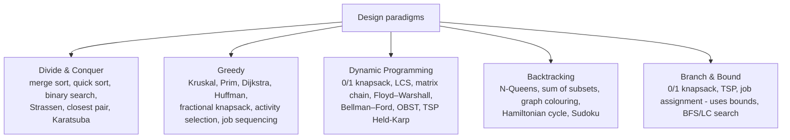
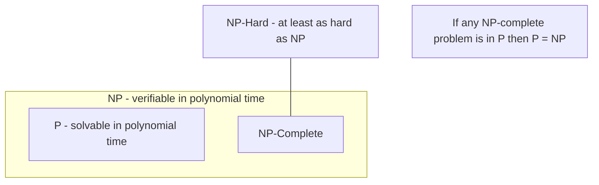

# Paper 2 · Unit 7 — Data Structures & Algorithms

**Expected questions: 10–12 · Target: 9+ · Type: complexity, recurrences, tree/heap/hash numericals, algorithm traces**

## Syllabus Checklist
- [ ] Data structures: arrays, sparse matrices, stacks, queues, priority queues, linked lists, trees, binary trees, threaded trees, BST, AVL, B/B+/B* trees, sets (union-find), graphs, sorting, searching, hashing
- [ ] Performance analysis: time & space complexity, asymptotic notation, recurrence relations
- [ ] Design techniques: divide & conquer, dynamic programming, greedy, backtracking, branch & bound
- [ ] Lower bound theory: comparison trees, reductions
- [ ] Graph algorithms: BFS, DFS, shortest paths, maximum flow, MST
- [ ] Complexity theory: P, NP, NP-complete, NP-hard, reducibility
- [ ] Selected topics: number-theoretic algorithms, polynomial arithmetic, FFT, string matching
- [ ] Advanced: parallel algorithms (sorting, searching, merging), approximation & randomised algorithms

---

## 1. Asymptotic Analysis

```
O  (upper bound)      f(n) ≤ c·g(n)        for n ≥ n₀
Ω  (lower bound)      f(n) ≥ c·g(n)
Θ  (tight bound)      c₁g(n) ≤ f(n) ≤ c₂g(n)
o  (strict upper)     lim f/g = 0
ω  (strict lower)     lim f/g = ∞
```

Growth order (memorise):
```
1 < log log n < log n < (log n)^k < √n < n < n log n < n² < n³ < 2ⁿ < 3ⁿ < n! < nⁿ
Note: log(n!) = Θ(n log n) ; n^(1/log n) = Θ(1) ; 2^(log n) = n ; n^(log n) is super-polynomial
```

### Recurrences — Master Theorem
T(n) = a·T(n/b) + f(n), a ≥ 1, b > 1. Compare f(n) with **n^(log_b a)**:

| Case | Condition | Result |
|------|-----------|--------|
| 1 | f(n) = O(n^(log_b a − ε)) | Θ(n^(log_b a)) |
| 2 | f(n) = Θ(n^(log_b a) · logᵏ n) | Θ(n^(log_b a) · logᵏ⁺¹ n) |
| 3 | f(n) = Ω(n^(log_b a + ε)) and regularity | Θ(f(n)) |

| Recurrence | Solution | Algorithm |
|-----------|----------|-----------|
| T(n) = T(n/2) + 1 | Θ(log n) | Binary search |
| T(n) = 2T(n/2) + n | Θ(n log n) | Merge sort |
| T(n) = 2T(n/2) + 1 | Θ(n) | Tree traversal, max-min |
| T(n) = T(n−1) + n | Θ(n²) | Quick sort worst, selection |
| T(n) = T(n−1) + 1 | Θ(n) | Linear recursion |
| T(n) = 2T(n−1) + 1 | Θ(2ⁿ) | Tower of Hanoi |
| T(n) = 7T(n/2) + n² | Θ(n^2.81) | Strassen |
| T(n) = 8T(n/2) + n² | Θ(n³) | Naive D&C matrix multiply |
| T(n) = 3T(n/2) + n | Θ(n^1.585) | Karatsuba |
| T(n) = T(√n) + 1 | Θ(log log n) | — |
| T(n) = 2T(√n) + log n | Θ(log n · log log n) | — |
| T(n) = T(n/3) + T(2n/3) + n | Θ(n log n) | Recursion tree |

## 2. Linear Data Structures

### 2.1 Arrays
- Row-major address: **A[i][j] = B + w·[(i − L₁)·N + (j − L₂)]** where N = number of columns.
- Column-major: **B + w·[(j − L₂)·M + (i − L₁)]**, M = rows.
- Lower triangular n×n stored row-wise: index of (i, j) = i(i−1)/2 + j (1-based). Total elements = n(n+1)/2.
- **Sparse matrix**: triplet (row, col, value) representation; or linked lists.

### 2.2 Stack (LIFO)
- Applications: expression conversion/evaluation, recursion, backtracking, parenthesis matching, undo.
- **Infix → Postfix** example: `A + B * C − D / E` → **`A B C * + D E / −`**.
- Postfix evaluation `6 2 3 + − 3 8 2 / + *` → 6 − 5 = 1; 8/2 = 4; 3 + 4 = 7; 1 × 7 = **7**.
- Number of stack permutations of n elements = Catalan number Cₙ.

### 2.3 Queue (FIFO)
- Circular queue: full when (rear + 1) % n == front (one slot wasted). Deque, priority queue.
- Queue using two stacks: amortised O(1).

### 2.4 Linked Lists
Singly, doubly, circular. Insert at head O(1); search O(n). Reverse a list: three pointers. Detect cycle: Floyd's tortoise-hare. Middle: slow/fast pointers.

## 3. Trees

### 3.1 Binary Tree Facts
```
Max nodes at level i (root level 0)          = 2^i
Max nodes in tree of height h (root h = 0)   = 2^(h+1) − 1
Min height with n nodes                      = ⌈log₂(n+1)⌉ − 1
n₀ = n₂ + 1          (leaves = nodes with 2 children + 1)
Null pointers in n-node binary tree          = n + 1
Number of unlabelled binary trees with n nodes = Catalan Cₙ = C(2n,n)/(n+1)
Number of labelled binary trees = n! · Cₙ
Full k-ary tree with i internal nodes: n = k·i + 1 nodes, leaves L = (k−1)i + 1
```

### 3.2 Traversals

```
          A
        ╱   ╲
       B     C
      ╱ ╲     ╲
     D   E     F
 Preorder  (NLR): A B D E C F
 Inorder   (LNR): D B E A C F
 Postorder (LRN): D E B F C A
 Level order    : A B C D E F
```
- Unique tree reconstruction needs **inorder + (preorder or postorder or level-order)**. Preorder + postorder is unique only for full binary trees.
- **Threaded binary tree**: null right pointers point to inorder successor, null left to predecessor → traversal without stack.

### 3.3 Binary Search Tree
- Search/insert/delete: O(h); h = O(log n) average, O(n) worst (skewed).
- Delete node with 2 children: replace with **inorder successor** (min of right subtree) or predecessor.
- Inorder traversal of BST = **sorted order**.

### 3.4 AVL Tree
Balance factor = height(left) − height(right) ∈ {−1, 0, 1}.

```
 LL case → single right rotation        RR case → single left rotation
       30                20                 10                 20
      ╱                 ╱  ╲                  ╲               ╱  ╲
     20       ──►      10   30                 20    ──►     10   30
    ╱                                            ╲
   10                                             30
 LR case → left rotate child, then right rotate parent (double rotation)
 RL case → right rotate child, then left rotate parent
```
- Min nodes in AVL of height h: **N(h) = N(h−1) + N(h−2) + 1**, N(0)=1, N(1)=2 → 1, 2, 4, 7, 12, 20, 33…
- Max height ≈ 1.44 log₂ n. All operations O(log n).
- **Red-Black tree**: root black, no two consecutive reds, same black-height on every path; height ≤ 2 log₂(n+1).

### 3.5 B-Trees (multi-way, disk-based)
- Order m: each node ≤ m children, ≤ m−1 keys; non-root ≥ ⌈m/2⌉ children; all leaves same level.
- Insertion splits a full node and pushes the median up; tree grows at root.
- **B+ tree**: all data at leaves, leaves linked. **B\* tree**: nodes at least 2/3 full (redistribution before split).
- Details and order calculations: see [DBMS unit](04-DBMS.md#8-file-organisation--indexing).

### 3.6 Heaps
```
 Max-heap (array: 90 70 80 30 60 50)
          90
        ╱    ╲
      70      80
     ╱  ╲    ╱
   30   60  50
 Parent(i) = ⌊(i−1)/2⌋, Left = 2i+1, Right = 2i+2  (0-based)
```
- Insert O(log n); delete-max O(log n); **build-heap O(n)**; find-max O(1); search O(n).
- In a max-heap, the minimum is among the leaves (⌈n/2⌉ candidates).
- **Binomial heap** (union O(log n)), **Fibonacci heap** (decrease-key O(1) amortised → Dijkstra O(E + V log V)).

### 3.7 Disjoint Sets (Union–Find)
Union by rank + path compression → nearly O(1) amortised: **O(α(n))** (inverse Ackermann). Used in Kruskal.

## 4. Hashing

```
Division:       h(k) = k mod m  (m prime, not close to power of 2)
Multiplication: h(k) = ⌊m·(k·A mod 1)⌋, A ≈ 0.618 (Knuth)
Load factor α = n/m
```

| Collision resolution | Probe sequence | Issues |
|---------------------|----------------|--------|
| Chaining | Linked list per slot | Expected search 1 + α |
| Linear probing | h(k) + i | **Primary clustering** |
| Quadratic probing | h(k) + c₁i + c₂i² | **Secondary clustering** |
| Double hashing | h₁(k) + i·h₂(k) | Best of open addressing |

Open addressing expected probes: unsuccessful ≤ 1/(1 − α); successful ≤ (1/α) ln(1/(1−α)).

**Worked (linear probing, m = 10, h(k) = k mod 10)**: insert 12, 18, 13, 2, 3, 23, 5, 15
```
12 → 2        18 → 8        13 → 3
 2 → 2 ✗ 3 ✗ → 4               3 → 3 ✗ 4 ✗ → 5
23 → 3 ✗ 4 ✗ 5 ✗ → 6           5 → 5 ✗ 6 ✗ → 7
15 → 5 ✗ 6 ✗ 7 ✗ 8 ✗ → 9

Index: 0   1   2   3   4   5   6   7   8   9
       -   -   12  13  2   3   23  5   18  15
```

## 5. Sorting

| Algorithm | Best | Average | Worst | Space | Stable | In-place |
|-----------|------|---------|-------|-------|--------|----------|
| Bubble | n (with flag) | n² | n² | 1 | ✔ | ✔ |
| Selection | n² | n² | n² | 1 | ✘ | ✔ |
| Insertion | n | n² | n² | 1 | ✔ | ✔ |
| Merge | n log n | n log n | n log n | n | ✔ | ✘ |
| **Quick** | n log n | n log n | **n²** | log n | ✘ | ✔ |
| Heap | n log n | n log n | n log n | 1 | ✘ | ✔ |
| Shell | n log n | ~n^1.3 | n² (gap-dependent) | 1 | ✘ | ✔ |
| Counting | n + k | n + k | n + k | k | ✔ | ✘ |
| Radix | d(n + k) | d(n + k) | d(n + k) | n + k | ✔ | ✘ |
| Bucket | n + k | n + k | n² | n | ✔ | ✘ |

- Selection sort makes the **minimum number of swaps** (n − 1).
- Insertion sort is best for **nearly sorted** data; number of comparisons ≈ number of inversions.
- Quick sort worst case on sorted input with first/last element as pivot. Randomised pivot → expected O(n log n).
- **Comparison-sort lower bound: Ω(n log n)** (decision tree with n! leaves has height ≥ log₂ n!).
- Merging k sorted lists of total n: O(n log k) with min-heap.

```
Quick sort partition (Lomuto, pivot = last)
[ 7  2  1  6  8  5  3  4 ]  pivot 4
→ [ 2  1  3 | 4 | 8  5  7  6 ]
```

## 6. Searching
- Linear O(n); **Binary** O(log n) on sorted array — max comparisons ⌊log₂ n⌋ + 1.
- Interpolation search O(log log n) average on uniform data.
- Selection (k-th smallest): Quickselect O(n) average; **median of medians O(n) worst**.
- Min & max together: **3n/2 − 2** comparisons. Second largest: n + ⌈log₂ n⌉ − 2.

## 7. Algorithm Design Techniques



| Greedy | Dynamic programming |
|--------|---------------------|
| Locally optimal choice, never reconsidered | Solves overlapping subproblems, stores results |
| **Greedy-choice property** + optimal substructure | **Optimal substructure + overlapping subproblems** |
| Faster, not always optimal | Always optimal (if formulated correctly) |
| Fractional knapsack ✔ ; 0/1 knapsack ✘ | 0/1 knapsack ✔ O(nW) — pseudo-polynomial |

### 7.1 Key DP Problems

**LCS** of X = ABCBDAB, Y = BDCABA → length **4** (e.g. BCBA). Time O(mn).
```
LCS[i][j] = LCS[i−1][j−1] + 1                if xᵢ = yⱼ
          = max(LCS[i−1][j], LCS[i][j−1])    otherwise
```

**Matrix chain multiplication**: dims 10×30, 30×5, 5×60.
```
(AB)C = 10·30·5 + 10·5·60 = 1500 + 3000 = 4500  ✔ optimal
A(BC) = 30·5·60 + 10·30·60 = 9000 + 18000 = 27000
m[i][j] = min over k of m[i][k] + m[k+1][j] + p(i−1)·p(k)·p(j)    O(n³)
Number of parenthesisations of n matrices = Catalan C(n−1)
```

**0/1 Knapsack**: K[i][w] = max(K[i−1][w], vᵢ + K[i−1][w − wᵢ]).

### 7.2 Greedy Problems
- **Huffman coding**: repeatedly merge two least-frequent nodes. O(n log n).
  Frequencies a:5, b:9, c:12, d:13, e:16, f:45 → codes f:0, c:100, d:101, a:1100, b:1101, e:111. Average bits = 2.24.
- **Activity selection**: sort by finish time, pick compatible.
- **Job sequencing with deadlines**: sort by profit, place in latest free slot.
- **Fractional knapsack**: sort by value/weight.
- **Optimal merge pattern**: like Huffman.

### 7.3 Backtracking
- N-Queens: 4-Queens has **2** solutions; 8-Queens has **92**.
- State-space tree; prune when constraint violated (bounding function).
- Graph m-colouring, sum of subsets, Hamiltonian cycles.

### 7.4 Branch & Bound
- Uses BFS / **least-cost (LC) search** with bounds; FIFO B&B, LIFO B&B, LC B&B. Used for optimisation (TSP, 0/1 knapsack, assignment).

## 8. Graph Algorithms

### 8.1 Representations
Adjacency matrix: O(V²) space, O(1) edge check. Adjacency list: O(V + E).

### 8.2 BFS & DFS

```
 Graph:  A ── B ── E
         │    │
         C ── D
 BFS from A: A B C E D   (queue; shortest path in unweighted graph)
 DFS from A: A B E D C   (stack/recursion; topological sort, SCC, cycle detection)
 Both O(V + E) with adjacency list, O(V²) with matrix
```
- DFS edge types: tree, back (→ cycle), forward, cross. Undirected DFS has only tree and back edges.
- **Topological sort** (DAG only): DFS finishing order reversed, or Kahn's algorithm (in-degree 0).
- **Strongly connected components**: Kosaraju (2 DFS), Tarjan (1 DFS). O(V + E).
- Articulation points & bridges: DFS with low values.

### 8.3 Shortest Paths

| Algorithm | Type | Negative edges? | Complexity |
|-----------|------|-----------------|------------|
| BFS | Single-source, unweighted | — | O(V + E) |
| **Dijkstra** | Single-source | **No** | O((V + E) log V) binary heap; O(V²) array; O(E + V log V) Fibonacci |
| **Bellman–Ford** | Single-source | Yes; detects negative cycles | O(VE) |
| DAG shortest path | Single-source | Yes | O(V + E) |
| **Floyd–Warshall** | All-pairs (DP) | Yes (no neg. cycles) | O(V³) |
| Johnson | All-pairs, sparse | Yes | O(V² log V + VE) |

**Dijkstra worked** (directed edges: A→B 4, A→C 1, C→B 2, C→D 5, B→D 1; source A)
```
        4
   A ────────► B
   │           ▲ │
  1│         2 │ │1
   ▼           │ ▼
   C ──────────┘ D
   └─────5──────►┘   (C→D weight 5)

Step  Visited     dist(A, B, C, D)
0     {}          0, ∞, ∞, ∞
1     {A}         0, 4, 1, ∞
2     {A,C}       0, 3, 1, 6      B via C = 1+2 ; D via C = 1+5
3     {A,C,B}     0, 3, 1, 4      D via B = 3+1
4     {A,C,B,D}   final: A=0, B=3, C=1, D=4
```

### 8.4 Minimum Spanning Tree

| Kruskal | Prim |
|---------|------|
| Sort edges, add smallest that doesn't form a cycle (union-find) | Grow tree from a vertex, add cheapest edge leaving tree |
| O(E log E) | O(E log V) heap; O(V²) matrix |
| Better for sparse graphs | Better for dense graphs |
| Forest during execution | Always a single tree |

- MST is unique if all edge weights are distinct.
- **Cut property**: lightest edge across any cut belongs to some MST. **Cycle property**: heaviest edge in a cycle is not in any MST.
- Number of spanning trees of Kₙ: nⁿ⁻².

### 8.5 Maximum Flow
- **Ford–Fulkerson** (augmenting paths): O(E · f*). **Edmonds–Karp** (BFS augmenting paths): O(VE²).
- **Max-flow min-cut theorem**: value of max flow = capacity of min s–t cut.
- Bipartite matching reduces to max flow.

## 9. Lower Bound Theory
- **Comparison tree (decision tree)**: sorting needs ≥ ⌈log₂ n!⌉ = Ω(n log n) comparisons; searching sorted array Ω(log n).
- Merging two sorted lists of size n: 2n − 1 comparisons (worst). Finding max: n − 1 (tournament argument).
- **Reductions**: if A reduces to B and A has lower bound L, B has lower bound L (e.g. sorting ≤ convex hull → convex hull Ω(n log n)).

## 10. Complexity Classes



- **P ⊆ NP** (P = NP? is open). NP-Complete = NP ∩ NP-Hard.
- To prove X is NP-complete: (1) X ∈ NP; (2) reduce a known NP-complete problem **to X** (Y ≤ₚ X).
- **Cook–Levin theorem**: **SAT** is the first NP-complete problem.
- NP-complete: SAT, 3-SAT, CLIQUE, Vertex Cover, Independent Set, Hamiltonian cycle, TSP (decision), Subset sum, 0/1 Knapsack (decision), Graph colouring (k ≥ 3), Set cover, Partition.
- In P: 2-SAT, shortest path, MST, 2-colouring (bipartite test), Euler circuit, sorting, matching, linear programming, primality (AKS 2002).
- **NP-Hard but not in NP**: Halting problem; optimisation TSP.
- Reductions chain: SAT → 3-SAT → CLIQUE → Vertex Cover → Hamiltonian cycle → TSP.

## 11. Selected Topics

| Topic | Key result |
|-------|-----------|
| GCD (Euclid) | gcd(a, b) = gcd(b, a mod b); O(log min(a,b)); extended Euclid gives x, y with ax + by = gcd |
| Modular exponentiation | Repeated squaring O(log e) |
| RSA | n = pq, φ = (p−1)(q−1), ed ≡ 1 mod φ |
| Primality | Miller–Rabin (randomised), AKS (deterministic polynomial) |
| Polynomial multiplication | Naive O(n²); **FFT O(n log n)** (evaluate at roots of unity, pointwise multiply, inverse FFT) |
| Naive string match | O((n − m + 1)m) |
| **Rabin–Karp** | Rolling hash; average O(n + m), worst O(nm) |
| **KMP** | Prefix (failure) function; **O(n + m)** |
| Boyer–Moore | Bad-character & good-suffix; sub-linear in practice |
| Finite automaton matcher | O(n) matching after O(m·|Σ|) preprocessing |

KMP prefix function for pattern **"ababaca"**: π = [0, 0, 1, 2, 3, 0, 1].

## 12. Advanced Algorithms
- **Parallel algorithms** (PRAM models: EREW, CREW, CRCW). Parallel prefix sum O(log n) with n processors. Odd-even transposition sort O(n) with n processors; bitonic sort O(log² n). Parallel merge O(log n). Brent's theorem.
- **Approximation algorithms**: Vertex cover — 2-approximation (pick both ends of uncovered edge); Metric TSP — 2-approx (MST doubling), **1.5-approx (Christofides)**; Set cover — ln n approx (greedy). Approximation ratio ρ(n).
- **Randomised**: **Las Vegas** (always correct, random time — randomised quicksort) vs **Monte Carlo** (fixed time, may be wrong — Miller–Rabin, Karger's min-cut).

---

## Previous Year Questions (PYQ pattern)

**Complexity & recurrences**
1. Solution of T(n) = 2T(n/2) + n log n: **Θ(n log² n)**
2. T(n) = 4T(n/2) + n: **Θ(n²)**
3. T(n) = T(n/2) + n: **Θ(n)**
4. T(n) = 3T(n/4) + n log n: **Θ(n log n)** (case 3)
5. Which is the slowest-growing? (a) n log n (b) n^1.01 (c) n/log n (d) √n log n — **(d)**
6. Time complexity of the loop `for(i=1;i<n;i*=2)`: **O(log n)**
7. Nested `for(i=1;i<=n;i++) for(j=1;j<=n;j+=i)`: **O(n log n)** (harmonic series)

**Arrays, stacks, queues**
8. A[1..10][1..15], row-major, base 100, 4 bytes/element. Address of A[5][7]: 100 + 4[(4)(15) + 6] = **364**
9. Postfix of (A + B) * (C − D): **AB+CD−\***
10. Prefix of A + B * C: **+A\*BC**
11. Minimum stacks to implement a queue: **2**
12. Circular queue of size n holds at most: **n − 1** elements (one-slot-empty convention)

**Trees**
13. A binary tree with 20 leaves has how many nodes of degree 2? **19**
14. Maximum nodes in a binary tree of height 5 (root at height 0): 2⁶ − 1 = **63**
15. Number of distinct binary trees with 4 nodes: **14**
16. Inorder: D B E A F C; Preorder: A B D E C F → Postorder: **D E B F C A**
17. Minimum nodes in an AVL tree of height 4: **12**
18. In a complete ternary tree with 10 internal nodes, leaves = 2×10 + 1 = **21**
19. Inorder traversal of BST gives: **sorted order**
20. Worst-case height of BST with n nodes: **n − 1**

**Heaps & hashing**
21. Time to build a heap of n elements: **O(n)**
22. Array 89, 19, 50, 17, 12, 15, 2, 5, 7, 11, 6, 9, 100 — after inserting 100 into max-heap, root = **100**
23. Linear probing suffers from: **primary clustering**
24. With chaining and load factor α, expected unsuccessful search: **Θ(1 + α)**
25. Keys 43, 36, 92, 87, 11, 4, 71, 13, 14 hashed with h(k) = k mod 11 using chaining. Keys in slot 3: **36 and 14** (43→10, 36→3, 92→4, 87→10, 11→0, 4→4, 71→5, 13→2, 14→3)

**Sorting & searching**
26. Which sorting algorithm has worst case O(n log n) and is in-place? **Heap sort**
27. Best algorithm for nearly sorted data: **Insertion sort**
28. Quick sort worst case occurs when: **array is already sorted (pivot = first/last)**
29. Which sorts are stable? **Merge, insertion, bubble, counting, radix**
30. Lower bound for comparison sorting: **Ω(n log n)**
31. Maximum comparisons in binary search on 1000 elements: ⌊log₂1000⌋ + 1 = **10**
32. Min and max of n elements need at least: **⌈3n/2⌉ − 2 comparisons**

**Design techniques**
33. Matrix chain 10×20, 20×30, 30×40: min multiplications = (AB)C = 6000 + 12000 = **18000**
34. LCS of "ABCD" and "ACBD": **3**
35. 0/1 knapsack using DP: **O(nW)** (pseudo-polynomial)
36. Huffman coding is an example of: **greedy**
37. Floyd–Warshall uses: **dynamic programming**
38. N-Queens problem is solved by: **backtracking**
39. Which needs both optimal substructure & overlapping subproblems? **Dynamic programming**

**Graphs**
40. Dijkstra fails with: **negative edge weights**
41. Bellman-Ford time complexity: **O(VE)**
42. Kruskal's time complexity: **O(E log E)**
43. BFS is used to find: **shortest path in unweighted graph**
44. Topological sort is possible only for: **DAG**
45. Number of edges in the MST of a connected graph with n vertices: **n − 1**
46. Back edge in DFS of a directed graph indicates: **a cycle**
47. Max-flow equals: **min-cut capacity**

**Complexity theory**
48. First problem proved NP-complete: **SAT (Cook–Levin)**
49. Which is in P? (a) 3-SAT (b) 2-SAT (c) Clique (d) Hamiltonian cycle — **(b)**
50. If A ≤ₚ B and B ∈ P then: **A ∈ P**
51. If an NP-complete problem is solved in polynomial time: **P = NP**
52. Halting problem is: **undecidable, NP-hard but not in NP**

**Selected topics**
53. KMP string matching time: **O(n + m)**
54. FFT multiplies two polynomials of degree n in: **O(n log n)**
55. Randomised quicksort is a: **Las Vegas algorithm**
56. Christofides algorithm gives approximation ratio: **1.5** (metric TSP)

## Quick Revision Box
- Master theorem: compare f(n) with n^(log_b a)
- n₀ = n₂ + 1 · Catalan 1, 1, 2, 5, 14, 42 · AVL min nodes 1, 2, 4, 7, 12, 20
- Build-heap O(n) · Comparison sort Ω(n log n)
- Dijkstra no negatives · Bellman–Ford O(VE) · Floyd O(V³)
- SAT first NPC · 2-SAT in P · KMP O(n + m)
