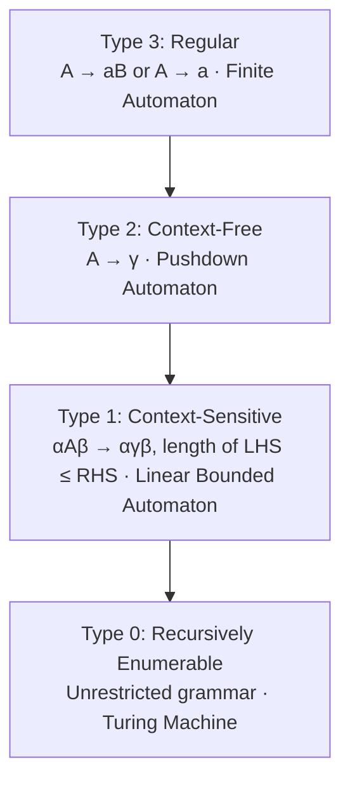
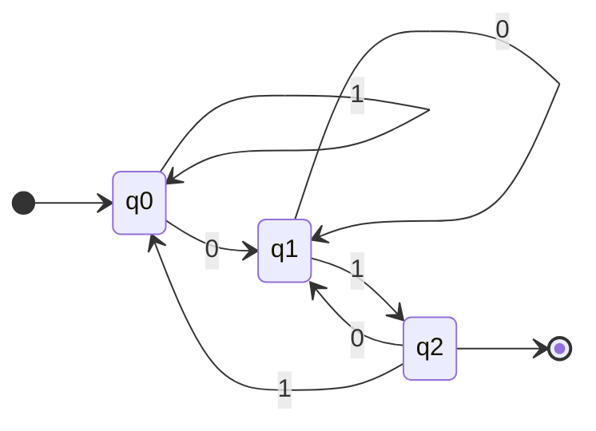
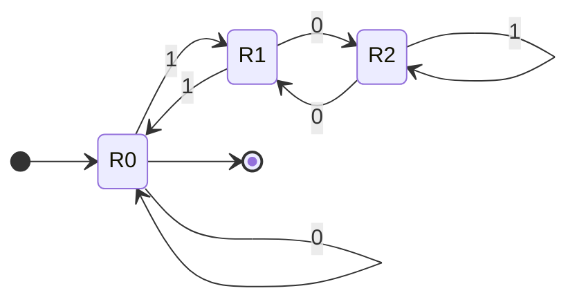
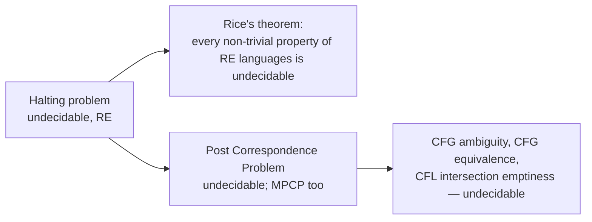
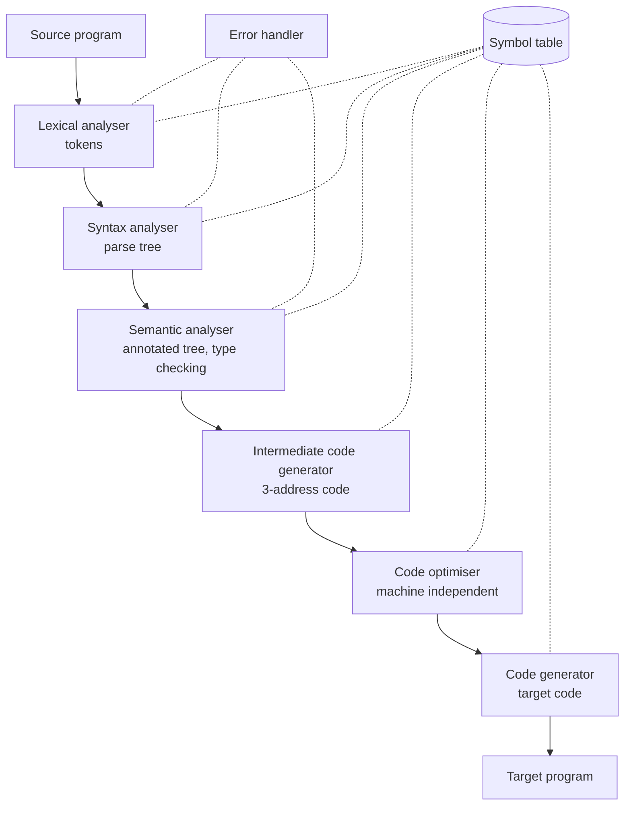
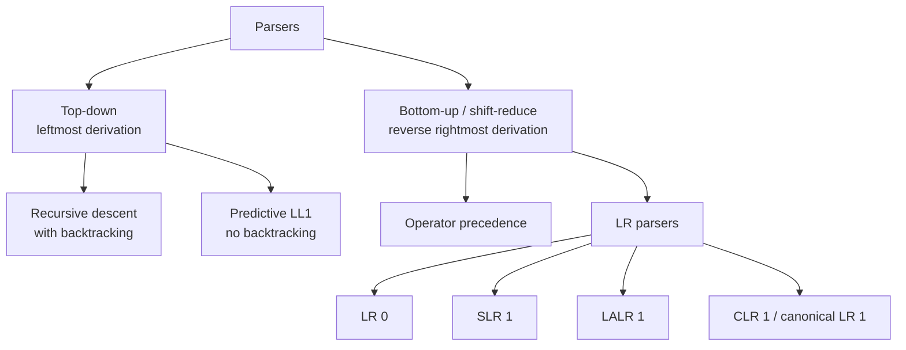
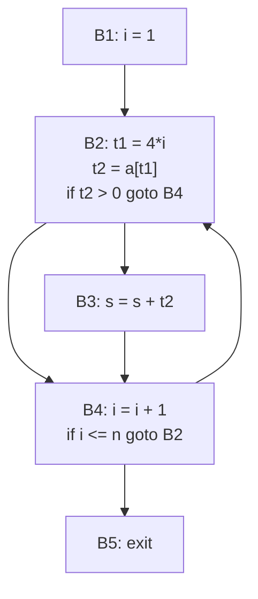
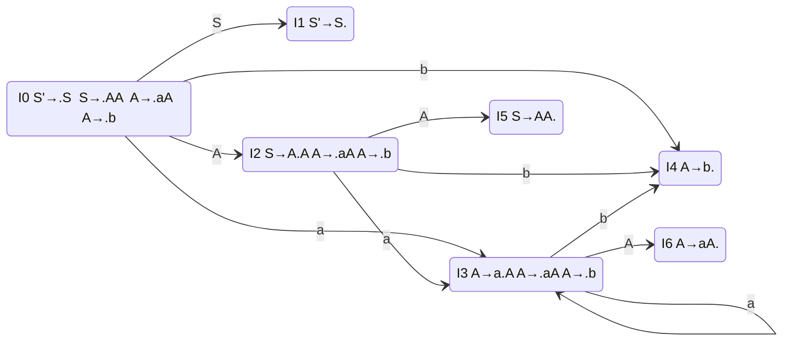

# Paper 2 · Unit 8 — Theory of Computation & Compilers

**Expected questions: 10–12 · Target: 9+ · Type: closure/decidability facts, automata construction, parsing tables — the differentiator unit for 250+**

## Syllabus Checklist
- [ ] Formal languages, non-computational problems, diagonal argument, Russell's paradox
- [ ] Regular languages: DFA, NFA, ε-NFA, equivalence, regular expressions, regular grammars, pumping lemma, closure & decision properties, Mealy & Moore machines, minimisation
- [ ] Context-free languages: CFG, derivations, parse trees, ambiguity, CNF, GNF, PDA (DPDA/NPDA), pumping lemma, closure & decision properties, CYK
- [ ] Turing machines: variants, universal TM, Church–Turing thesis, recursive & RE languages, CSL & LBA, unrestricted grammars, Chomsky hierarchy
- [ ] Undecidability: halting problem, PCP, undecidable CFL problems, Rice's theorem, complexity classes
- [ ] Syntax analysis: precedence, associativity, left recursion & factoring, recursive descent, LL(1), LR(0), SLR(1), LALR(1), CLR(1)
- [ ] Semantic analysis: SDD, synthesized & inherited attributes, S- and L-attributed, dependency graphs, type checking
- [ ] Run-time environment: storage organisation, activation records, parameter passing, symbol table
- [ ] Intermediate code: three-address code, quadruples, triples, DAG, translation of expressions, Booleans, control flow
- [ ] Code generation & optimisation: basic blocks, flow graphs, data-flow analysis, local/global/loop/peephole optimisation, register allocation, instruction scheduling

---

## Part A — Theory of Computation

## 1. Basics
- Alphabet Σ (finite set of symbols), string, language L ⊆ Σ*. |Σ*| is countably infinite; the set of all languages 2^(Σ*) is **uncountable**.
- **Diagonal argument (Cantor)**: proves uncountability of reals / power sets; used to show existence of non-RE languages (L_d = diagonal language).
- Since TMs are countable but languages are uncountable, **most languages are not even recursively enumerable**.
- **Russell's paradox**: the set of all sets that do not contain themselves — self-reference leads to contradiction (basis of diagonalisation).

## 2. Chomsky Hierarchy



```
 ┌──────────────────────────────────────────────────┐
 │ All languages (uncountable)                      │
 │ ┌──────────────────────────────────────────────┐ │
 │ │ RE — Turing machine (may loop on rejection)  │ │
 │ │ ┌──────────────────────────────────────────┐ │ │
 │ │ │ Recursive / decidable (TM always halts)  │ │ │
 │ │ │ ┌──────────────────────────────────────┐ │ │ │
 │ │ │ │ CSL — linear bounded automaton       │ │ │ │
 │ │ │ │ ┌──────────────────────────────────┐ │ │ │ │
 │ │ │ │ │ CFL — non-deterministic PDA      │ │ │ │ │
 │ │ │ │ │ ┌──────────────────────────────┐ │ │ │ │ │
 │ │ │ │ │ │ DCFL — deterministic PDA     │ │ │ │ │ │
 │ │ │ │ │ │ ┌──────────────────────────┐ │ │ │ │ │ │
 │ │ │ │ │ │ │ Regular — finite automata│ │ │ │ │ │ │
 │ │ │ │ │ │ └──────────────────────────┘ │ │ │ │ │ │
 │ │ │ │ │ └──────────────────────────────┘ │ │ │ │ │
 │ │ │ │ └──────────────────────────────────┘ │ │ │ │
 │ │ │ └──────────────────────────────────────┘ │ │ │
 │ │ └──────────────────────────────────────────┘ │ │
 │ └──────────────────────────────────────────────┘ │
 └──────────────────────────────────────────────────┘
```

## 3. Finite Automata

### 3.1 DFA vs NFA
- DFA: δ: Q × Σ → Q. NFA: δ: Q × (Σ ∪ {ε}) → 2^Q.
- **DFA ≡ NFA ≡ ε-NFA ≡ Regular expressions ≡ Regular grammars** in power.
- Subset construction: n-state NFA → DFA with up to **2ⁿ** states.

**Example**: DFA for binary strings ending in "01".


**Example**: DFA for binary numbers divisible by 3 (state = remainder so far; reading bit b takes remainder i to (2i + b) mod 3).


### 3.2 Counting minimum DFA states (common shortcuts)
| Language over {a, b} | Min DFA states |
|---------------------|----------------|
| Strings of length exactly n | n + 2 |
| Length ≥ n | n + 1 |
| Length ≤ n | n + 2 |
| Strings where length ≡ 0 mod k | k |
| Strings ending with a given string of length n | n + 1 |
| Strings containing a given substring of length n | n + 1 |
| Strings starting with a given string of length n | n + 2 |
| Number of a's ≡ 0 mod m AND b's ≡ 0 mod n | m·n |
| Binary numbers divisible by n (n odd) | n |
| n-th symbol from the end is 'a' (DFA) | 2ⁿ (NFA: n + 1) |

### 3.3 Minimisation (Myhill–Nerode / partition method)
1. Remove unreachable states. 2. Partition into {final}, {non-final}. 3. Repeatedly split groups whose members go to different groups on some symbol. 4. Merge equivalent states.
**Myhill–Nerode**: L is regular ⇔ the number of equivalence classes of ≡_L is finite; that number = states of minimal DFA.

### 3.4 Mealy & Moore

| Moore | Mealy |
|-------|-------|
| Output depends on **state** only | Output depends on **state + input** |
| Output length = input length + 1 | Output length = input length |
| More states usually | Fewer states |
- Mealy → Moore may need up to |Q| × |Δ| states. Both are equivalent (ignoring first output).

## 4. Regular Expressions
- Operators: union (+), concatenation, Kleene star (*). Precedence: * > concatenation > +.
- **Arden's theorem**: R = Q + RP ⇒ R = QP* (if P doesn't contain ε).
- Identities: (a + b)* = (a*b*)* = (a* + b*)*; (ab)*a = a(ba)*; ε* = ε; ∅* = ε; R + R* = R*; (R*)* = R*.

| Language | RE |
|----------|----|
| All strings over {a,b} | (a + b)* |
| Contains "aa" | (a + b)*aa(a + b)* |
| Even length | ((a + b)(a + b))* |
| Starts and ends with same symbol | a(a+b)*a + b(a+b)*b + a + b |
| No two consecutive a's | (b + ab)*(ε + a) |
| Exactly one 'a' | b*ab* |

### Pumping Lemma (Regular)
If L is regular, ∃ p such that every w ∈ L with |w| ≥ p can be split w = xyz with |xy| ≤ p, |y| ≥ 1, and **xyⁱz ∈ L for all i ≥ 0**. Used to prove **non-regularity** (it is a necessary, not sufficient condition).
Non-regular: aⁿbⁿ, ww^R, palindromes, a^(n²), a^p (p prime), balanced parentheses, aⁿbᵐ (n < m).
Regular: aⁿbᵐ (n, m ≥ 0), (ab)ⁿ, a^(2n), strings with equal number of "ab" and "ba" substrings, aⁿbⁿ for n ≤ 100 (finite).

## 5. Context-Free Languages

### 5.1 Grammars & Ambiguity
- **Ambiguous** grammar: some string has ≥ 2 parse trees (leftmost derivations). E → E + E | E * E | id is ambiguous.
- **Inherently ambiguous language**: every grammar ambiguous, e.g. {aⁱbʲcᵏ | i = j or j = k}.
- Checking ambiguity of a CFG is **undecidable**.
- Remove ambiguity by encoding precedence & associativity:
```
E → E + T | T        (+ left-assoc, lower precedence)
T → T * F | F        (* higher precedence)
F → (E) | id
```

### 5.2 Normal Forms
- **CNF**: A → BC | a. A string of length n needs exactly **2n − 1** derivation steps; parse tree height ≥ ⌈log₂ n⌉ + 1.
- **GNF**: A → aα (α ∈ V*). Derivation of length-n string takes exactly **n** steps.
- Simplification order: remove ε-productions → unit productions → useless symbols.

### 5.3 PDA
- PDA = FA + stack. Acceptance by final state ≡ by empty stack (for NPDA).
- **NPDA ⊋ DPDA** (unlike FA). ww^R needs NPDA; wcw^R is DCFL.
- DCFLs are unambiguous; every LR(k) grammar generates a DCFL.

```
PDA for aⁿbⁿ
 δ(q0, a, Z) = (q0, aZ)       push a
 δ(q0, a, a) = (q0, aa)       push a
 δ(q0, b, a) = (q1, ε)        pop on b
 δ(q1, b, a) = (q1, ε)
 δ(q1, ε, Z) = (qf, Z)        accept
```

### 5.4 Pumping Lemma (CFL)
w = uvxyz, |vxy| ≤ p, |vy| ≥ 1, uvⁱxyⁱz ∈ L ∀ i ≥ 0.
Non-CFL: aⁿbⁿcⁿ, ww, a^(n²), a^p (prime), aⁿbᵐcⁿdᵐ.
CFL (non-regular): aⁿbⁿ, ww^R, aⁿbᵐcᵐ, aⁿbⁿcᵐ, aⁱbʲcᵏ with i = j or j = k.

### 5.5 CYK Algorithm
Membership for CNF grammar in **O(n³·|G|)**; dynamic programming over substrings.

## 6. Closure & Decision Properties (MOST ASKED TABLE)

| Operation | Regular | DCFL | CFL | CSL | Recursive | RE |
|-----------|:------:|:----:|:---:|:---:|:---------:|:--:|
| Union | ✔ | ✘ | ✔ | ✔ | ✔ | ✔ |
| Intersection | ✔ | ✘ | ✘ | ✔ | ✔ | ✔ |
| Complement | ✔ | **✔** | **✘** | ✔ | ✔ | **✘** |
| Concatenation | ✔ | ✘ | ✔ | ✔ | ✔ | ✔ |
| Kleene star | ✔ | ✘ | ✔ | ✔ | ✔ | ✔ |
| Reversal | ✔ | ✘ | ✔ | ✔ | ✔ | ✔ |
| Homomorphism | ✔ | ✘ | ✔ | ✘ | ✘ | ✔ |
| Inverse homomorphism | ✔ | ✔ | ✔ | ✔ | ✔ | ✔ |
| Intersection with regular | ✔ | ✔ | ✔ | ✔ | ✔ | ✔ |
| Difference | ✔ | ✘ | ✘ | ✔ | ✔ | ✘ |

Notes: CFL ∩ Regular = CFL. DCFL ∪ Regular, DCFL ∩ Regular = DCFL. If L and L' are both RE ⇒ L is recursive.

| Decision problem | Regular | CFL | CSL | Recursive | RE |
|-----------------|:------:|:---:|:---:|:---:|:--:|
| Membership | D | D | D | D | **U** (semi-decidable) |
| Emptiness | D | D | U | U | U |
| Finiteness | D | D | U | U | U |
| Equivalence | D | **U** (DCFL: D) | U | U | U |
| Ambiguity | — | U | — | — | — |
| L = Σ* | D | U | U | U | U |
| Subset (L₁ ⊆ L₂) | D | U | U | U | U |
| Intersection empty? | D | U | U | U | U |
D = decidable, U = undecidable.

## 7. Turing Machines
- TM = (Q, Σ, Γ, δ, q₀, B, F); infinite tape, read/write head moves L/R.
- **Variants equivalent in power**: multi-tape, multi-track, two-way infinite tape, non-deterministic TM, multi-head, TM with stay option, 2-stack PDA, queue automaton, counter machine with 2 counters.
- **PDA with 2 stacks = TM**. FA with a queue = TM.
- **Universal TM**: simulates any TM given its encoding ⟨M, w⟩.
- **Church–Turing thesis**: every effectively computable function is computable by a TM (a hypothesis, not a theorem).
- **Recursive (decidable)**: TM halts on all inputs. **RE (semi-decidable)**: TM halts & accepts on members; may loop otherwise.
- **LBA** (tape bounded by input length) accepts CSLs. Membership for CSL is decidable; emptiness for CSL is undecidable.
- **Unrestricted grammar** (α → β) ≡ TM.

```
TM for aⁿbⁿ: repeatedly mark leftmost a as X, move right to leftmost b, mark as Y,
return left; when no a's left, check no b's remain → accept.
```

## 8. Undecidability



- **Halting problem** HALT_TM = {⟨M, w⟩ | M halts on w}: **RE but not recursive**; its complement is **not RE**.
- A_TM (acceptance) is RE, undecidable. Complement of A_TM is not RE.
- **Rice's theorem**: any non-trivial property of the **language** of a TM is undecidable (e.g. "L(M) is empty", "L(M) is regular", "L(M) is finite").
- **PCP**: undecidable in general; decidable for single-letter alphabet. Bounded PCP is NP-complete.
- E_TM (emptiness) — not RE (its complement is RE). EQ_TM — neither RE nor co-RE.
- Decidable examples: whether a DFA accepts any string; whether a CFG generates the empty language; whether a TM makes more than k steps on input w (simulate k steps).
- Complexity: P, NP, PSPACE, EXPTIME; tractable (polynomial) vs intractable. See [Unit 7 §10](07-Data-Structures-Algorithms.md#10-complexity-classes).

---

## Part B — Compiler Design

## 9. Phases of a Compiler


- **Front end** (analysis): lexical, syntax, semantic, ICG — language-dependent, machine-independent.
- **Back end** (synthesis): optimisation, code generation — machine-dependent.
- **Lexical analysis**: regular expressions → DFA (tools: **LEX/Flex**). Token, lexeme, pattern. Errors: illegal characters.
- **Count tokens**: `printf("i = %d", i);` → printf, (, "i = %d", ",", i, ), ; = **7 tokens**.
- Parser generator: **YACC/Bison** (LALR(1)).
- Compiler passes: single-pass vs multi-pass. **Cross compiler**: runs on one machine, generates code for another. **Bootstrapping**: writing a compiler in its own language (T-diagrams).

## 10. Syntax Analysis (Parsing)



**Power**: LR(0) ⊂ SLR(1) ⊂ LALR(1) ⊂ CLR(1); LL(1) ⊂ LR(1). Number of states: **LR(0) = SLR = LALR ≤ CLR**.

### 10.1 Grammar Transformations for Top-down
- **Left recursion removal**: A → Aα | β ⇒ A → βA′, A′ → αA′ | ε.
- **Left factoring**: A → αβ₁ | αβ₂ ⇒ A → αA′, A′ → β₁ | β₂.

### 10.2 FIRST and FOLLOW

Grammar:
```
E  → T E'
E' → + T E' | ε
T  → F T'
T' → * F T' | ε
F  → ( E ) | id
```

| NT | FIRST | FOLLOW |
|----|-------|--------|
| E | { (, id } | { ), $ } |
| E' | { +, ε } | { ), $ } |
| T | { (, id } | { +, ), $ } |
| T' | { *, ε } | { +, ), $ } |
| F | { (, id } | { *, +, ), $ } |

**LL(1) parsing table**:

| | id | + | * | ( | ) | $ |
|-|----|---|---|---|---|---|
| E | E→TE' | | | E→TE' | | |
| E' | | E'→+TE' | | | E'→ε | E'→ε |
| T | T→FT' | | | T→FT' | | |
| T' | | T'→ε | T'→*FT' | | T'→ε | T'→ε |
| F | F→id | | | F→(E) | | |

**LL(1) condition**: for A → α | β: FIRST(α) ∩ FIRST(β) = ∅; if β ⇒* ε then FIRST(α) ∩ FOLLOW(A) = ∅. A left-recursive or ambiguous grammar is **never** LL(1).

### 10.3 LR Parsing

```
 LR parser model
 input:  a1 a2 ... an $
           ▲
 stack:  s0 X1 s1 X2 s2 ... Xm sm     ACTION[s, a]: shift / reduce / accept / error
                                     GOTO[s, A]: next state after reduce
```

| Parser | Items | Reduce A → α· placed in |
|--------|-------|------------------------|
| LR(0) | [A → α·β] | **all** terminals |
| SLR(1) | LR(0) items | **FOLLOW(A)** |
| LALR(1) | LR(1) items with same core merged | lookaheads |
| CLR(1) | [A → α·β, a] | lookahead a only |

Conflicts: **shift-reduce (S/R)** and **reduce-reduce (R/R)**.
- Merging CLR states into LALR can introduce **R/R conflicts** but **never new S/R conflicts**.
- An unambiguous grammar can still have conflicts; every ambiguous grammar has conflicts in every LR table.

**Operator precedence parsing**: for operator grammars (no ε, no two adjacent non-terminals); relations ⋖, ≐, ⋗.

**Handle**: substring matching RHS whose reduction is a step of reverse rightmost derivation. **Viable prefixes** are recognised by a DFA (LR(0) automaton).

## 11. Syntax-Directed Translation

| Attribute | Computed from | Example |
|-----------|---------------|---------|
| **Synthesized** | Children (bottom-up) | E.val = E1.val + T.val |
| **Inherited** | Parent and/or left siblings | type info in declarations: L.in = T.type |

- **S-attributed SDD**: only synthesized attributes → evaluate in **bottom-up (postorder)**, natural for LR parsers.
- **L-attributed SDD**: inherited attributes depend only on parent & **left** siblings → evaluated in one **depth-first left-to-right** pass (LL parsers). **Every S-attributed is L-attributed.**
- **Dependency graph**: evaluation order = any **topological sort**; a cycle → no valid order.
- **Annotated parse tree**: shows attribute values.
- **Type checking**: static vs dynamic; type expressions; coercion; overloading resolution; strongly typed language.

```
SDT for desk calculator: input 3 * 5 + 4
L → E n      { print(E.val) }
E → E1 + T   { E.val = E1.val + T.val }
T → T1 * F   { T.val = T1.val * F.val }
F → digit    { F.val = digit.lexval }
Annotated root value: 19
```

## 12. Run-Time Environment

```
 Memory layout
 ┌──────────────┐ high address
 │    Stack     │  activation records (grows ↓)
 │      ↓       │
 │      ↑       │
 │    Heap      │  dynamic allocation (grows ↑)
 ├──────────────┤
 │ Static data  │  globals, static
 ├──────────────┤
 │    Code      │  text
 └──────────────┘ low address
```

**Activation record (stack frame)**:
```
 ┌──────────────────────────┐
 │ Actual parameters        │
 │ Returned value           │
 │ Control link (dynamic)   │ → caller's AR
 │ Access link (static)     │ → AR of lexically enclosing procedure
 │ Saved machine status     │ (return address, registers)
 │ Local data               │
 │ Temporaries              │
 └──────────────────────────┘
```
- **Activation tree**: each node = a procedure activation; the stack holds the path from root to the current node.
- Static allocation (FORTRAN — no recursion), stack allocation (C, recursion), heap allocation (closures, dynamic data).
- **Display**: array of pointers for fast non-local access in nested scopes.
- Parameter passing: see [Unit 3 §1.3](03-Programming-Languages-Graphics.md#13-parameter-passing).
- **Symbol table**: implemented with linear list, **hash table** (most common), BST; stores name, type, scope, offset. Scope handling via a stack of tables.

## 13. Intermediate Code

Expression: **a = b * −c + b * −c**

**Three-address code**:
```
t1 = minus c
t2 = b * t1
t3 = minus c
t4 = b * t3
t5 = t2 + t4
a  = t5
```

**Quadruples** (op, arg1, arg2, result) · **Triples** (op, arg1, arg2 — results referred by position) · **Indirect triples** (list of pointers to triples, easy to reorder).

| # | op | arg1 | arg2 | result |
|---|----|------|------|--------|
| 0 | minus | c | | t1 |
| 1 | * | b | t1 | t2 |
| 2 | minus | c | | t3 |
| 3 | * | b | t3 | t4 |
| 4 | + | t2 | t4 | t5 |
| 5 | = | t5 | | a |

**DAG** for the same expression shares the common subexpression b * −c:
```
        =
       ╱ ╲
      a   +
         ╱ ╲
         ╲ ╱      (both operands point to the same * node)
          *
         ╱ ╲
        b   minus
             │
             c
```
- Other IRs: syntax tree, postfix, **SSA (static single assignment)** — each variable assigned once, φ-functions at joins.
- Boolean expressions: numerical vs **short-circuit (jumping) code**; **backpatching** for one-pass generation of jumps (makelist, merge, backpatch).

## 14. Code Optimisation & Generation

### 14.1 Basic Blocks & Flow Graphs
**Leaders**: (1) first statement; (2) target of any jump; (3) statement immediately after a jump. A basic block runs from a leader up to (not including) the next leader.



### 14.2 Optimisations

| Level | Technique | Example |
|-------|-----------|---------|
| Local | Common subexpression elimination | `t1 = b*c; t2 = b*c` → reuse t1 |
| Local | Constant folding | `x = 2 * 3.14` → `x = 6.28` |
| Local | Constant/copy propagation | `x = y; z = x + 1` → `z = y + 1` |
| Local | Dead code elimination | Remove assignments never used |
| Loop | **Code motion (loop-invariant)** | Move `t = x*y` out of the loop |
| Loop | **Induction variable elimination** | Replace `i` with pointer arithmetic |
| Loop | **Strength reduction** | `i*4` → `t = t + 4` ; `x²` → `x*x` |
| Loop | Loop unrolling, loop fusion (jamming), loop fission | |
| Global | Data-flow analysis based | |
| Peephole | Redundant load/store, unreachable code, flow-of-control (jump to jump), algebraic simplification, use of machine idioms (INC) | Window over target code |

### 14.3 Data-Flow Analysis

| Analysis | Direction | Meet | Use |
|----------|-----------|------|-----|
| Reaching definitions | Forward | ∪ | Constant propagation |
| **Live variables** | **Backward** | ∪ | Register allocation, dead code |
| Available expressions | Forward | ∩ | Global CSE |
| Very busy expressions | Backward | ∩ | Code hoisting |

```
Reaching definitions:  OUT[B] = gen[B] ∪ (IN[B] − kill[B]) ;  IN[B] = ∪ OUT[pred]
Live variables:        IN[B]  = use[B] ∪ (OUT[B] − def[B]) ;  OUT[B] = ∪ IN[succ]
```
- **Loops** detected using **dominators** and back edges (n → d where d dom n). Natural loop. Reducible flow graphs.

### 14.4 Code Generation
- Issues: instruction selection, **register allocation** (graph colouring — interference graph; spilling), evaluation order.
- **Sethi–Ullman** numbering gives the minimum registers for an expression tree.
- `getreg`, register & address descriptors. Next-use information.
- **Instruction scheduling**: reorder to avoid pipeline stalls (list scheduling); respects data dependences.

## 15. Deeper Dive — Constructions & Parsing Traces

### 15.1 NFA → DFA (Subset Construction)

NFA for strings over {0, 1} ending in "01": q0 —0,1→ q0, q0 —0→ q1, q1 —1→ q2 (final).

| DFA state | on 0 | on 1 | Final? |
|-----------|------|------|--------|
| → {q0} | {q0, q1} | {q0} | |
| {q0, q1} | {q0, q1} | {q0, q2} | |
| {q0, q2} | {q0, q1} | {q0} | ✔ |

Only 3 of the 2³ = 8 subsets are reachable — this is the same DFA drawn in §3.1.

### 15.2 DFA Minimisation (partition refinement)

| State | on 0 | on 1 | Final? |
|-------|------|------|--------|
| → A | B | C | |
| B | A | D | |
| C | E | F | ✔ |
| D | E | F | ✔ |
| E | E | F | ✔ |
| F | F | F | |

```
P0 = { C D E } { A B F }                       (final / non-final)
P1: in {A B F}, F goes to non-final on 1 while A, B go to final → split
    = { C D E } { A B } { F }
P2: {A B}: both go to {A B} on 0 and {C D E} on 1 → no split
    {C D E}: all go to {C D E} on 0 and {F} on 1 → no split   → stable
Minimal DFA: 3 states  [AB] —1→ [CDE] —1→ [F] (dead), 0-loops on each
Language: strings over {0,1} containing exactly one 1
```

### 15.3 CFG → CNF

S → aSb | ab
```
1. Replace terminals in long bodies:  A → a, B → b
   S → A S B | A B
2. Break bodies longer than 2:        S → A X,  X → S B
CNF:  S → AX | AB,   X → SB,   A → a,   B → b
```

### 15.4 Pumping-Lemma Proof Template (L = { aⁿbⁿ | n ≥ 0 } is not regular)

1. Assume L is regular with pumping length p.
2. Choose w = aᵖbᵖ ∈ L, |w| ≥ p.
3. Any split w = xyz with |xy| ≤ p, |y| ≥ 1 forces y = aᵏ (k ≥ 1).
4. Pump i = 2: xy²z = a^(p+k) bᵖ ∉ L — contradiction. Hence L is not regular.

### 15.5 LR(0) Automaton and Parse — Worked

Grammar: (0) S′ → S (1) S → AA (2) A → aA (3) A → b



| State | a | b | $ | A | S |
|-------|---|---|---|---|---|
| 0 | s3 | s4 | | 2 | 1 |
| 1 | | | **acc** | | |
| 2 | s3 | s4 | | 5 | |
| 3 | s3 | s4 | | 6 | |
| 4 | r3 | r3 | r3 | | |
| 5 | r1 | r1 | r1 | | |
| 6 | r2 | r2 | r2 | | |

No state contains both a shift and a complete item → the grammar is **LR(0)** (hence also SLR, LALR, CLR).

Parse of **abb$**:

| Stack | Input | Action |
|-------|-------|--------|
| 0 | abb$ | shift 3 |
| 0 a 3 | bb$ | shift 4 |
| 0 a 3 b 4 | b$ | reduce A → b, goto(3, A) = 6 |
| 0 a 3 A 6 | b$ | reduce A → aA, goto(0, A) = 2 |
| 0 A 2 | b$ | shift 4 |
| 0 A 2 b 4 | $ | reduce A → b, goto(2, A) = 5 |
| 0 A 2 A 5 | $ | reduce S → AA, goto(0, S) = 1 |
| 0 S 1 | $ | **accept** |

**A grammar that is LALR(1) but not SLR(1)**: S → L = R | R, L → *R | id, R → L. In the state containing S → L·= R and R → L·, '=' ∈ FOLLOW(R), so SLR has a shift/reduce conflict on '='; LR(1) lookaheads resolve it.

### 15.6 Basic Blocks — Worked

```
 1  i = 1                      Leaders: 1 (first), 2 & 3 & 13 (jump targets),
 2  j = 1                               10 & 12 (follow a conditional jump)
 3  t1 = 10 * i
 4  t2 = t1 + j                Blocks:  B1 = {1}      B2 = {2}
 5  t3 = 8 * t2                         B3 = {3–9}    B4 = {10–11}
 6  t4 = t3 - 88                        B5 = {12}     B6 = {13–17}
 7  a[t4] = 0.0
 8  j = j + 1                  Loops: B3 (inner, back edge B3→B3),
 9  if j <= 10 goto 3                 B2–B4 (outer), B6 (self loop)
10  i = i + 1
11  if i <= 10 goto 2
12  i = 1
13  t5 = i - 1
14  t6 = 88 * t5
15  a[t6] = 1.0
16  i = i + 1
17  if i <= 10 goto 13
```

### 15.7 DAG-Based Local Optimisation

```
 Block                       DAG nodes built                         Optimised block
 a = b + c                   n1 = + (b0, c0)        label a          a = b + c
 b = a - d                   n2 = − (n1, d0)        label b          b = a - d
 c = b + c                   n3 = + (n2, c0)        label c          c = b + c
 d = a - d                   − (n1, d0) exists = n2 → label d too    d = b
```
- `d = a − d` recomputes node n2 (same operator, same operands, nothing changed in between) → replaced by the copy `d = b`.
- `c = b + c` is **not** a repeat of `a = b + c`, because b was reassigned in between (its operand is n2, not b0).

---

## Previous Year Questions (PYQ pattern)

**Finite automata & regular languages**
1. Minimum states in DFA accepting strings over {0,1} where the number of 0s is divisible by 3 and number of 1s divisible by 2: **6**
2. Minimum DFA states for binary strings whose 3rd symbol from the right is 1: **8**
3. Minimum DFA states for strings over {a,b} of length exactly 3: **5**
4. An NFA with n states can be converted to a DFA with at most: **2ⁿ states**
5. Which is NOT regular? (a) a*b* (b) aⁿbⁿ (c) (ab)* (d) a^(2n) — **(b)**
6. (a + b)* is equivalent to: **(a*b*)\***
7. Regular languages are NOT closed under: (a) union (b) complement (c) infinite union (d) intersection — **(c)** (infinite union can give any language)
8. Moore vs Mealy: in Moore the output depends on: **present state only**
9. Arden's theorem solution of R = Q + RP: **R = QP\***
10. Pumping lemma for regular languages is used to prove a language is: **not regular**

**CFLs & PDAs**

11. Which language is context-free but not regular? **aⁿbⁿ**
12. Which is not context-free? **aⁿbⁿcⁿ**
13. CFLs are NOT closed under: **intersection and complement**
14. DCFLs are closed under: **complement** (not union/intersection)
15. In CNF, a string of length n is derived in: **2n − 1 steps**
16. Which is undecidable for CFGs? **ambiguity / equivalence / L = Σ\***
17. Membership of a string in a CFL can be decided by: **CYK algorithm (O(n³))**
18. ww^R is accepted by: **NPDA, not DPDA**
19. CFL ∩ regular is: **context-free**
20. Grammar S → aSb | ab generates: **aⁿbⁿ, n ≥ 1**

**TMs & decidability**

21. A language accepted by an LBA is: **context-sensitive**
22. Halting problem is: **recursively enumerable but not recursive**
23. Complement of an RE but non-recursive language is: **not RE**
24. If L and its complement are both RE then L is: **recursive**
25. Rice's theorem applies to: **non-trivial properties of the languages of TMs**
26. PCP is: **undecidable**
27. Which is equivalent in power to a TM? **PDA with two stacks**
28. Which is decidable? (a) whether a TM halts on all inputs (b) whether a CFG is ambiguous (c) whether a DFA accepts an infinite language (d) PCP — **(c)**
29. Recursive languages are closed under: **complement** (RE are not)
30. Type-1 grammars are: **context-sensitive**

**Compilers**

31. Number of tokens in `int a = b + 10;`: int, a, =, b, +, 10, ; = **7**
32. Lexical analysis is based on: **regular expressions / finite automata**
33. YACC generates: **LALR(1) parsers**
34. Which parser is most powerful? **Canonical LR(1)**
35. Number of states: SLR vs LALR for the same grammar: **equal**
36. Left-recursive grammar cannot be parsed by: **top-down (LL / recursive descent) parsers**
37. Merging CLR(1) states to LALR(1) may introduce: **reduce-reduce conflicts**
38. FOLLOW of the start symbol always contains: **$**
39. A bottom-up parser produces: **reverse of the rightmost derivation**
40. S-attributed definitions use only: **synthesized attributes**
41. Inherited attributes from parent and left siblings: **L-attributed**
42. Access link in an activation record points to: **the AR of the lexically enclosing procedure**
43. Representation where results are referenced by position: **triples**
44. Replacing x * 2 by x + x (or x << 1): **strength reduction**
45. Moving a loop-invariant computation outside the loop: **code motion**
46. Live variable analysis is a: **backward data-flow problem**
47. Peephole optimisation is applied to: **target (or intermediate) code over a small window**
48. Register allocation is commonly modelled as: **graph colouring**
49. A DAG for a basic block helps to detect: **common subexpressions**
50. Number of basic blocks in a flow graph — first find **leaders**: first statement, jump targets, statements after jumps

**More practice questions**

51. Subset construction for the "ends in 01" NFA yields how many reachable DFA states? **3**
52. Minimal DFA for "exactly one 1" over {0, 1} (with dead state): **3 states**
53. CNF of S → aSb | ab needs how many non-terminals? **4** (S, X, A, B)
54. In the pumping-lemma proof for aⁿbⁿ, pumping y changes: **only the number of a's**
55. Number of LR(0) item sets for S → AA, A → aA | b: **7**
56. The grammar S → L = R | R, L → *R | id, R → L is: **LALR(1) but not SLR(1)**
57. Number of basic blocks in the code of §15.6: **6**
58. In `a = b + c; b = a − d; c = b + c; d = a − d`, the redundant computation is: **d = a − d** (equals b)
59. A shift/reduce conflict in SLR arises when a terminal in FOLLOW(A) also: **labels a shift from the same state**
60. The handle in a right-sentential form is reduced by: **a bottom-up (shift-reduce) parser**

## Quick Revision Box
- Regular closed under everything basic · CFL ✘ ∩, ✘ complement · DCFL ✔ complement · RE ✘ complement
- CNF 2n−1 steps · GNF n steps · CYK O(n³)
- Halting: RE not recursive · L & L̄ RE ⇒ recursive · Rice: non-trivial language properties undecidable
- LR(0) ⊂ SLR ⊂ LALR ⊂ CLR · SLR = LALR states · LALR merge → R/R only
- S-attributed ⊂ L-attributed · Live variables backward · Reaching definitions forward
