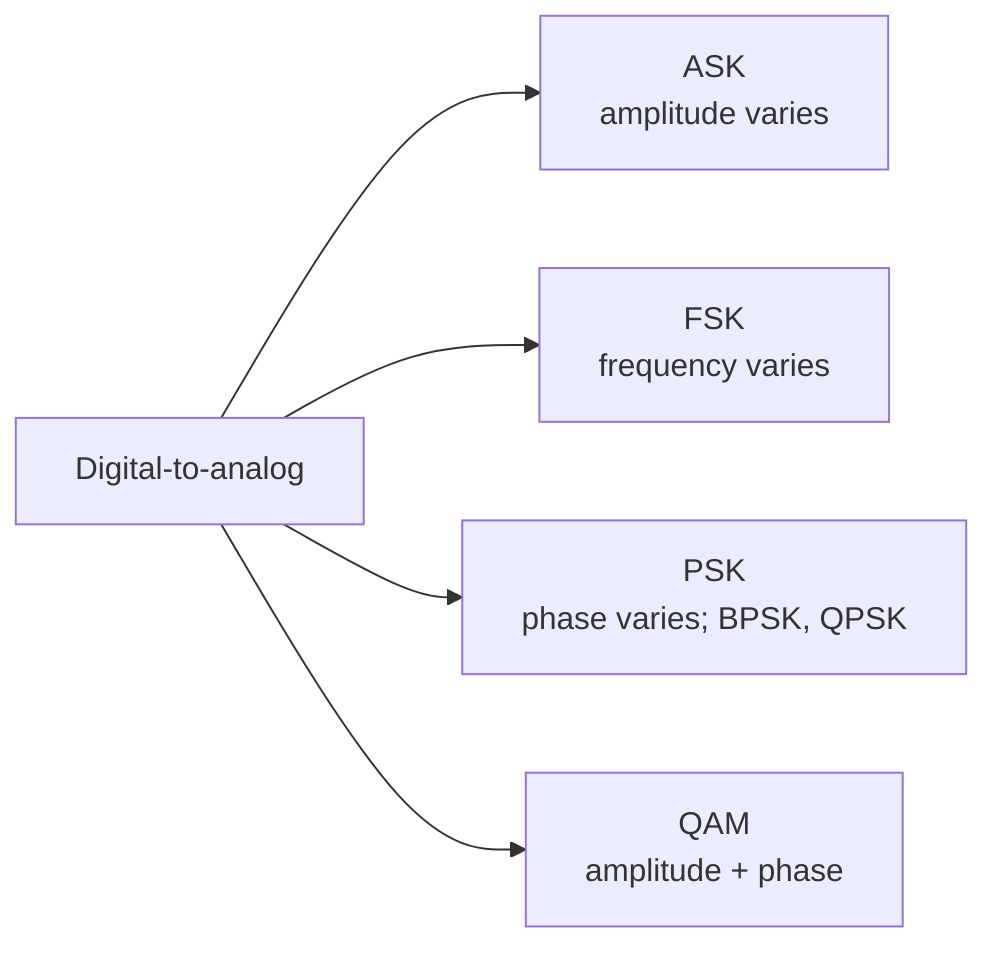
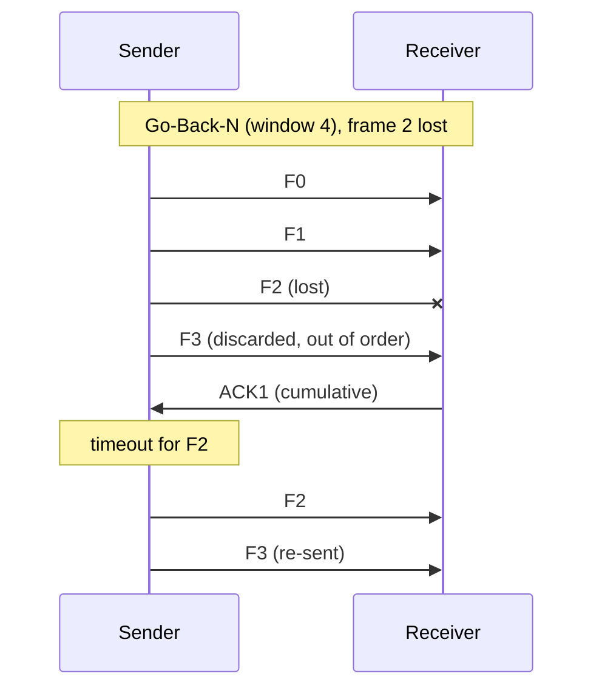
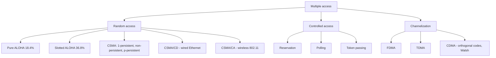
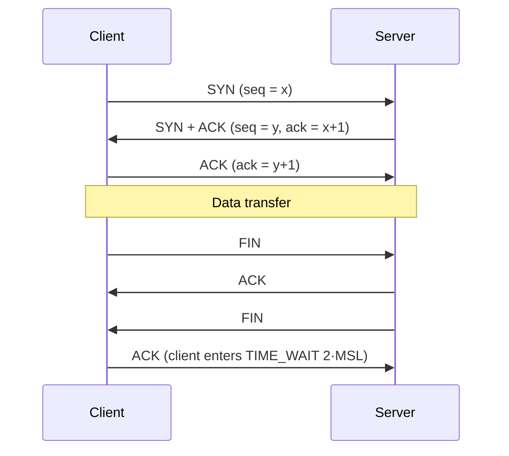
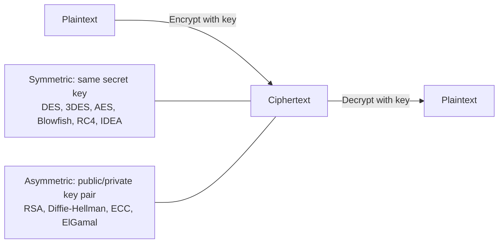
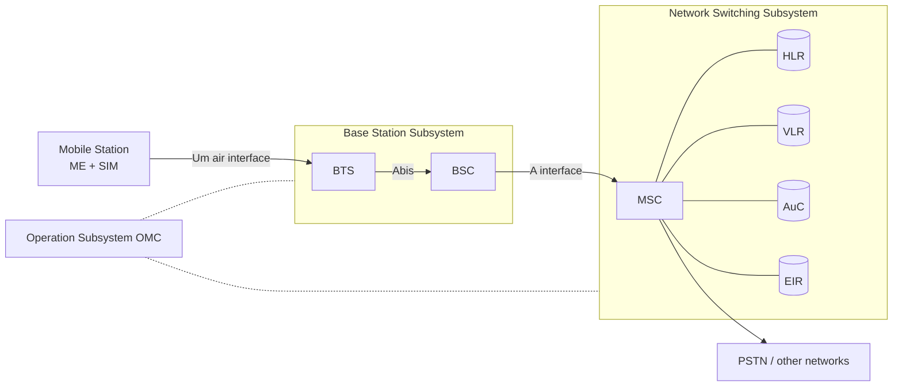
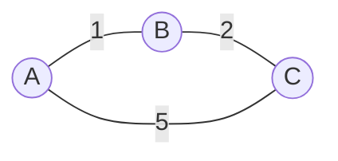
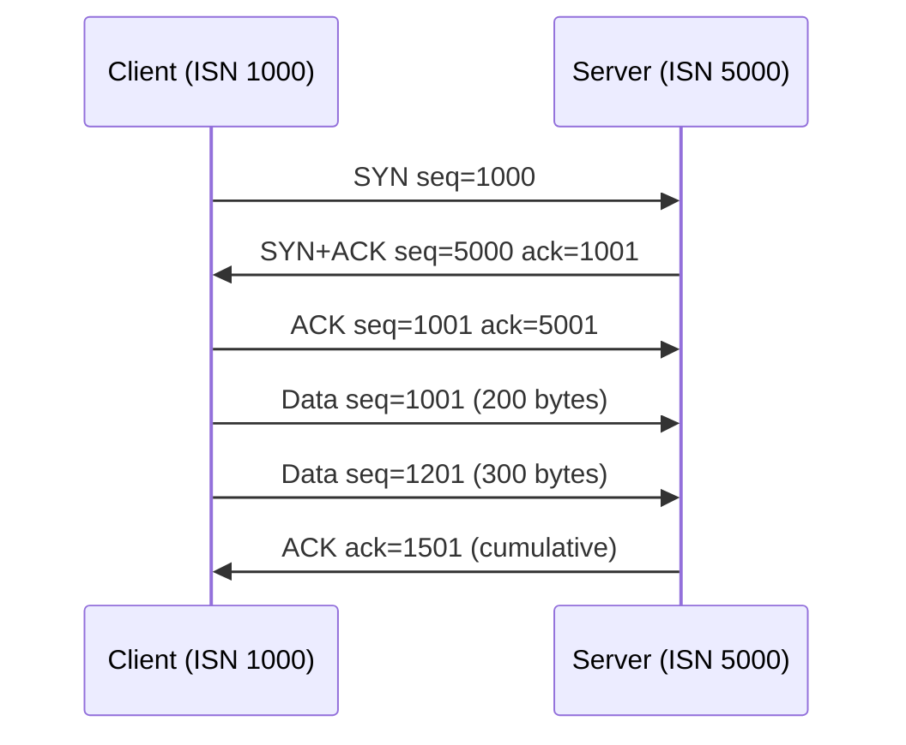
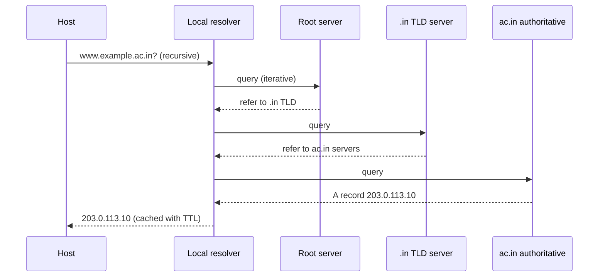

# Paper 2 · Unit 9 — Data Communication & Computer Networks

**Expected questions: 10–12 · Target: 10+ · Type: subnetting, sliding window, Shannon/Nyquist numericals + Forouzan concepts**

## Syllabus Checklist
- [ ] Data communication: components, data flow, topologies, protocols & standards, OSI & TCP/IP
- [ ] Analog & digital signals: bandwidth, impairments, Nyquist & Shannon limits, performance
- [ ] Digital transmission: line coding, block coding, scrambling, PCM, delta modulation
- [ ] Analog transmission: ASK, FSK, PSK, QAM
- [ ] Multiplexing (FDM, WDM, TDM), spread spectrum, transmission media
- [ ] Switching: circuit, message, packet (datagram, virtual circuit)
- [ ] Data link layer: framing, error detection & correction, flow control, Stop-and-Wait, Go-Back-N, Selective Repeat, HDLC, PPP
- [ ] MAC: ALOHA, CSMA, CSMA/CD, CSMA/CA, polling, token passing, FDMA/TDMA/CDMA; Ethernet
- [ ] Network layer: IPv4, subnetting, CIDR, NAT, IPv6, routing (DV, LS, path vector), RIP, OSPF, BGP, ARP, ICMP, DHCP
- [ ] Transport layer: UDP, TCP, SCTP, congestion control, QoS
- [ ] Application layer: DNS, HTTP, FTP, SMTP, TELNET, SNMP
- [ ] Network security: cryptography, RSA, Diffie-Hellman, digital signatures, VPN, firewalls
- [ ] Mobile technology: GSM, CDMA, GPRS, Mobile IP, MANETs, satellites, wireless LANs
- [ ] Cloud computing & IoT

---

## 1. Network Models

Networking software is built in layers. Each layer offers a service to the layer above and uses the service of
the layer below, so that, for example, a web browser never needs to know whether its data travels over Wi-Fi or
fibre.

### 1.1 OSI vs TCP/IP

<!-- latex: p2-09-osi -->
```
   OSI (7 layers)              TCP/IP (4/5 layers)        PDU          Devices / protocols
 ┌──────────────────┐        ┌───────────────────┐
 │ 7 Application    │        │                   │
 ├──────────────────┤        │                   │                     HTTP, FTP, SMTP, DNS,
 │ 6 Presentation   │  ───►  │   Application     │      Message        SNMP, TELNET, DHCP
 ├──────────────────┤        │                   │                     (gateway)
 │ 5 Session        │        │                   │
 ├──────────────────┤        ├───────────────────┤
 │ 4 Transport      │  ───►  │   Transport       │      Segment        TCP, UDP, SCTP
 ├──────────────────┤        ├───────────────────┤      (datagram)
 │ 3 Network        │  ───►  │   Internet        │      Packet         IP, ICMP, ARP, IGMP (router)
 ├──────────────────┤        ├───────────────────┤
 │ 2 Data Link      │  ───►  │   Network access  │      Frame          Ethernet, PPP, HDLC (switch, bridge)
 ├──────────────────┤        │   (link+physical) │
 │ 1 Physical       │        │                   │      Bits           (hub, repeater)
 └──────────────────┘        └───────────────────┘
 Mnemonic (top→bottom): "All People Seem To Need Data Processing"
```

| Layer | Key responsibilities | Address |
|-------|---------------------|---------|
| Physical | Bit transmission, encoding, topology, data rate | — |
| Data link | **Framing**, physical addressing, flow & error control (hop-to-hop), MAC | **MAC (48-bit)** |
| Network | **Logical addressing, routing** (host-to-host / source-to-destination) | **IP** |
| Transport | **Process-to-process (end-to-end)** delivery, segmentation, flow, error, congestion control | **Port (16-bit)** |
| Session | Dialog control, **synchronisation (checkpoints)** | — |
| Presentation | **Translation, encryption, compression** | — |
| Application | User services | Specific (URL, email) |

### 1.2 Topologies

| Topology | Cables / links (n devices) | Notes |
|----------|---------------------------|-------|
| **Mesh** | **n(n−1)/2** links; each device n−1 I/O ports | Robust, expensive |
| Star | n links | Central hub; hub failure kills network |
| Bus | 1 backbone + drop lines | Cheap; backbone fault fails all |
| Ring | n links | Token passing; one break can disable |
| Tree / Hybrid | — | |

Data flow: **simplex** (keyboard), **half-duplex** (walkie-talkie), **full-duplex** (telephone).

## 2. Signals & Data Rates

Every link has a limited bandwidth and some noise. Two classical results bound how fast data can be sent:
Nyquist's for a noiseless channel and Shannon's for a noisy one.

<!-- latex: p2-09-signals -->
```
Nyquist (noiseless):    Max bit rate = 2 · B · log₂ L          (L signal levels)
Shannon (noisy):        Capacity C = B · log₂(1 + SNR)
SNR_dB = 10 log₁₀(SNR)  → 30 dB = 1000, 20 dB = 100, 10 dB = 10
Bandwidth-delay product = bandwidth × propagation delay  (bits "in the pipe")
Propagation delay = distance / propagation speed ;  Transmission delay = frame size / bandwidth
Throughput, latency = propagation + transmission + queuing + processing
Baud rate (signal rate) S = N / r  where r = bits per signal element
```

**Worked**: telephone line B = 3000 Hz, SNR = 3162 (≈ 35 dB): C = 3000 × log₂(3163) ≈ 3000 × 11.62 = **34.86 kbps**.
Nyquist: B = 3000 Hz, 4 levels → 2 × 3000 × 2 = **12 kbps**.

Impairments: **attenuation** (loss of energy, dB = 10 log(P₂/P₁)), **distortion** (different delays of components), **noise** (thermal, induced, crosstalk, impulse).

## 3. Digital & Analog Transmission

### 3.1 Line Coding

Line coding turns a bit sequence into a digital signal. Good codes keep the receiver's clock synchronised (by
including transitions) and avoid a DC component.

<!-- latex: p2-09-linecode -->
```
 Bits:        1      0      1      1      0
 NRZ-L      ──────┐      ┌─────────────┐      
 (1 = high)       └──────┘             └──────

 Bits:        1       0       1       1       0
 Manchester    ┌───────┐       ┌───┐   ┌───────┐   
 (IEEE)     ───┘       └───────┘   └───┘       └───
 0 = high→low, 1 = low→high: every bit has a MID-BIT transition → receiver recovers the clock

 NRZ-I: invert the level at the start of every 1, no change for 0
 Differential Manchester: transition at START of bit for 0, none for 1; mid-bit transition always
 AMI (bipolar): 0 → zero voltage; successive 1s alternate +V and −V (no DC component)
```

| Scheme | Category | Notes |
|--------|----------|-------|
| NRZ-L, NRZ-I | Polar | No self-sync; baseline wandering |
| RZ | Polar | 3 levels; 2 transitions per bit |
| **Manchester**, Differential Manchester | Biphase | Self-synchronising; bandwidth = 2× NRZ; Ethernet (10 Mbps) / Token ring |
| AMI, Pseudoternary | Bipolar | No DC component |
| 2B1Q, 8B6T, 4D-PAM5 | Multilevel | |
| MLT-3 | Multitransition | 100Base-TX |

- **Block coding**: 4B/5B (Fast Ethernet), 8B/10B (Gigabit) — for synchronisation & error detection.
- **Scrambling**: B8ZS (North America), HDB3 (Europe) — replace long zeros in AMI.
- **PCM**: Sampling → Quantisation → Encoding. **Nyquist sampling theorem**: fs ≥ 2·f_max. Bit rate = fs × n bits. Voice: 8000 samples/s × 8 bits = **64 kbps**.
- **Delta modulation**: 1 bit per sample (up/down).
- Transmission modes: **parallel**; **serial** — asynchronous (start/stop bits, gaps), synchronous, isochronous.

### 3.2 Digital-to-Analog

<!-- latex: p2-09-modulation -->

- QPSK: 2 bits per symbol; 16-QAM: 4 bits per symbol; 64-QAM: 6. Bits per baud = log₂(constellation points).
- Analog-to-analog: AM, FM, PM. FM bandwidth (Carson) = 2(1 + β)B.

## 4. Multiplexing & Media

| Technique | Domain | Use |
|-----------|--------|-----|
| FDM | Frequency (analog) | Radio, TV, cable |
| WDM | Wavelength (optical) | Fibre (DWDM) |
| Synchronous TDM | Time slots fixed | T1 (24 channels, 1.544 Mbps), E1 (32 channels, 2.048 Mbps) |
| Statistical TDM | Slots on demand | Needs address in slot |
| Spread spectrum | FHSS, DSSS | Wireless, security |

- T1 = (24 × 8 + 1 framing bit) × 8000 = **1.544 Mbps**.

**Transmission media**:
<!-- latex: p2-09-media -->
```
Guided:   Twisted pair (UTP Cat5/6, RJ-45; twisting reduces crosstalk)
          Coaxial (BNC; cable TV)
          Optical fibre (total internal reflection; single-mode vs multimode; highest bandwidth, no EMI)
Unguided: Radio waves (3 kHz–1 GHz, omnidirectional)
          Microwaves (1–300 GHz, unidirectional, line-of-sight)
          Infrared (300 GHz–400 THz, short range, can't penetrate walls)
```

## 5. Switching

| Circuit switching | Packet (datagram) | Virtual circuit | Message switching |
|-------------------|-------------------|-----------------|------------------|
| Dedicated path, setup/teardown | No setup; each packet routed independently | Setup phase; packets follow same path | Store-and-forward whole message |
| Telephone | Internet (IP) | ATM, Frame Relay, X.25 | Telegraph |
| In-order, constant delay | Out-of-order possible | In-order | Large buffers |
| Physical layer | Network layer | Data link (ATM) / network | Application |

**Delay for packet switching**: message split into k packets over h hops: total ≈ (k + h − 1) × transmission time per packet (+ propagation).

## 6. Data Link Layer

The data link layer moves frames between two directly connected nodes. It frames the bit stream, detects (and
sometimes corrects) errors and keeps a fast sender from swamping a slow receiver.

### 6.1 Framing
Character count, **byte stuffing** (ESC/FLAG), **bit stuffing** (insert 0 after five consecutive 1s — HDLC flag 01111110), physical layer coding violations.
Bit-stuffing example: data `0111111111110` → `011111011111010`.

### 6.2 Error Detection & Correction
- **Parity**: detects odd number of bit errors. 2-D parity detects all 1, 2, 3-bit errors and corrects single.
- **Checksum** (1's complement sum; used in IP, TCP, UDP).
- **CRC**: append (degree r) zeros, divide by generator (mod-2), remainder = CRC. Detects all burst errors of length ≤ r; all odd errors if generator has factor (x + 1).

**CRC worked**: data 1101011011, generator x⁴ + x + 1 = 10011 → append 4 zeros, divide → remainder **1110**; transmitted **11010110111110**.

- **Hamming distance**: detect d errors needs d_min ≥ d + 1; correct t errors needs d_min ≥ 2t + 1.
- Hamming code (7,4): r parity bits with 2ʳ ≥ m + r + 1.

### 6.3 Flow & Error Control (Sliding Window)

<!-- latex: p2-09-window -->
```
a = propagation delay / transmission time = Tp / Tt
Stop-and-Wait efficiency   η = 1 / (1 + 2a)
Sliding window (size W)    η = W / (1 + 2a)   if W < 1 + 2a, else 1
For 100% utilisation       W ≥ 1 + 2a
Sequence number bits n:    Go-Back-N  W_s ≤ 2ⁿ − 1, W_r = 1
                           Selective Repeat  W_s = W_r ≤ 2ⁿ⁻¹
Throughput = η × bandwidth
```

<!-- latex: p2-09-gbn -->


| Protocol | Sender window | Receiver window | Retransmits | ACK |
|----------|--------------|-----------------|-------------|-----|
| Stop-and-Wait ARQ | 1 | 1 | The one frame | Individual; seq numbers 0/1 |
| **Go-Back-N** | 2ⁿ − 1 | 1 | Lost frame **and all after it** | Cumulative |
| **Selective Repeat** | 2ⁿ⁻¹ | 2ⁿ⁻¹ | Only lost frame | Individual / NAK |

**Worked**: 1 Mbps link, frame 1000 bits, Tp = 20 ms. Tt = 1 ms, a = 20.
Stop-and-Wait η = 1/41 ≈ **2.4%**. Window for 100% = 1 + 40 = 41 → sequence bits = ⌈log₂ 41⌉ = **6** (GBN; 2⁶ − 1 = 63 ≥ 41).

### 6.4 HDLC & PPP
- **HDLC**: bit-oriented; frames I (information), S (supervisory), U (unnumbered); modes NRM, ABM, ARM; flag 01111110.
- **PPP**: byte-oriented, point-to-point (dial-up, DSL); LCP (link control), NCP, authentication **PAP** (plain-text) and **CHAP** (challenge-handshake, more secure). No flow control/sequence numbers by default.

## 7. Medium Access Control

When many stations share one channel, a medium-access protocol decides who may transmit when.

<!-- latex: p2-09-mac -->


<!-- latex: p2-09-aloha -->
```
Pure ALOHA:     S = G·e^(−2G), max 1/(2e) = 0.184 at G = 0.5 ; vulnerable time = 2·Tt
Slotted ALOHA:  S = G·e^(−G),  max 1/e  = 0.368 at G = 1   ; vulnerable time = Tt
CSMA/CD:        minimum frame size: Tt ≥ 2·Tp  ⇒  L_min = 2 · Tp · B
                Efficiency = 1 / (1 + 6.44a)
```
**Worked**: 10 Mbps Ethernet, max RTT 51.2 µs → L_min = 10⁷ × 51.2 × 10⁻⁶ = **512 bits = 64 bytes**.

- CSMA/CD: on collision send **jam signal**, use **binary exponential backoff** (wait random k × slot, k ∈ [0, 2ⁿ − 1]; give up after 16 attempts).
- CSMA/CA (802.11): **IFS** (DIFS, SIFS), **contention window**, **RTS/CTS** (solves **hidden terminal**), NAV, ACK.
- Token ring (802.5), token bus (802.4).

### Ethernet (IEEE 802.3)
<!-- latex: p2-09-ethernet -->
```
Frame: | Preamble 7 | SFD 1 | Dest 6 | Src 6 | Type/Len 2 | Data 46–1500 | CRC 4 |
Min frame = 64 B (without preamble) ; Max = 1518 B ; MAC address 48 bits (OUI 24 + 24)
Broadcast MAC: FF:FF:FF:FF:FF:FF ; multicast: LSB of first byte = 1
```
| Standard | Speed | Media |
|----------|-------|-------|
| 10Base5 / 10Base2 | 10 Mbps | Thick / thin coax |
| 10Base-T | 10 Mbps | UTP |
| 100Base-TX / FX | 100 Mbps | UTP / fibre |
| 1000Base-T | 1 Gbps | UTP Cat5e |
| 10GBase | 10 Gbps | Fibre/Cat6a |

Devices: **Repeater/hub** (L1, one collision & broadcast domain), **Bridge/switch** (L2, separates collision domains, one broadcast domain; learning, STP), **Router** (L3, separates broadcast domains), **Gateway** (all layers / protocol conversion). VLANs split broadcast domains on switches.

## 8. Network Layer

The network layer carries packets from source host to destination host across many networks. Its two jobs are
addressing (IP) and routing (choosing the path).

### 8.1 IPv4 Addressing

| Class | First bits | First octet | Default mask | Networks | Hosts/net |
|-------|-----------|-------------|--------------|----------|-----------|
| A | 0 | 0–127 | /8 255.0.0.0 | 2⁷ (126 usable) | 2²⁴ − 2 |
| B | 10 | 128–191 | /16 | 2¹⁴ | 2¹⁶ − 2 |
| C | 110 | 192–223 | /24 | 2²¹ | 254 |
| D | 1110 | 224–239 | — | Multicast | — |
| E | 1111 | 240–255 | — | Reserved | — |

- Private ranges: **10.0.0.0/8, 172.16.0.0/12, 192.168.0.0/16**. Loopback: 127.0.0.0/8. APIPA 169.254/16.
- **Subnetting worked**: 192.168.10.0/26
<!-- latex: p2-09-subnet -->
```
Mask 255.255.255.192 → 4 subnets of 64 addresses (62 usable hosts each)
Subnet 1: 192.168.10.0   – .63   (broadcast .63)
Subnet 2: 192.168.10.64  – .127
Subnet 3: 192.168.10.128 – .191
Subnet 4: 192.168.10.192 – .255
Host 192.168.10.100/26 → network 192.168.10.64, broadcast 192.168.10.127
```
- Usable hosts in /n = 2^(32−n) − 2 (except /31, /32).
- **CIDR** & supernetting: 200.1.0.0/24 … 200.1.3.0/24 aggregate to **200.1.0.0/22**. Longest prefix match in forwarding.
- **NAT**: maps private addresses to public; PAT uses ports.

### 8.2 IPv4 Header
<!-- latex: p2-09-ipv4 -->
```
| Ver 4 | HLEN 4 | DSCP/ToS 8 | Total length 16 |
| Identification 16 | Flags 3 (–, DF, MF) | Fragment offset 13 (units of 8 bytes) |
| TTL 8 | Protocol 8 (1 ICMP, 6 TCP, 17 UDP) | Header checksum 16 |
| Source IP 32 | Destination IP 32 | Options (0–40 B) |
Header 20–60 bytes (HLEN × 4) ; max datagram 65,535 bytes
```
**Fragmentation worked**: 4000-byte datagram (20 B header) over MTU 1500 → data per fragment = 1480 (multiple of 8):
fragments carry 1480, 1480, 1020 bytes; offsets **0, 185, 370**; MF = 1, 1, 0.

### 8.3 IPv6
- 128-bit address (hex, colon notation; `::` compresses zeros once), fixed **40-byte header**, no header checksum, **no fragmentation at routers** (source only), extension headers, flow label, built-in IPsec support, types: unicast, multicast, **anycast** (no broadcast).
- Transition: dual stack, tunnelling, header translation.

### 8.4 Routing

| | Distance Vector | Link State | Path Vector |
|-|-----------------|-----------|-------------|
| Algorithm | **Bellman–Ford** | **Dijkstra** | — |
| Knowledge | Neighbours' tables | Whole topology (LSPs flooded) | Paths (AS list) |
| Protocol | **RIP** | **OSPF** (also IS-IS) | **BGP** |
| Problem | **Count-to-infinity** (fix: split horizon, poison reverse, hold-down) | Heavy computation/flooding | Policy-based |
| Scope | Intra-AS (IGP) | Intra-AS (areas, backbone area 0) | Inter-AS (EGP) |

- RIP: hop count metric, max **15** (16 = infinity), updates every **30 s**, runs over **UDP 520**.
- OSPF: cost metric, runs directly over **IP (protocol 89)**, hierarchical areas.
- BGP: runs over **TCP 179**; eBGP & iBGP.
- Multicast routing: DVMRP, MOSPF, PIM; **IGMP** for group membership.

### 8.5 Support Protocols
| Protocol | Purpose |
|----------|---------|
| **ARP** | IP → MAC (broadcast request, unicast reply) |
| RARP / BOOTP / **DHCP** | Obtain IP address (DHCP: DORA — Discover, Offer, Request, Ack; UDP 67/68) |
| **ICMP** | Error reporting & query: echo (ping), destination unreachable, time exceeded (traceroute), redirect, source quench |
| IGMP | Multicast group membership |

## 9. Transport Layer

The transport layer provides process-to-process delivery using port numbers. TCP adds reliability, ordering, flow
control and congestion control on top of IP; UDP adds almost nothing and is therefore fast.

| Feature | TCP | UDP | SCTP |
|---------|-----|-----|------|
| Connection | Connection-oriented | Connectionless | Connection-oriented (association) |
| Reliability | Reliable, ordered | Unreliable | Reliable, multi-stream |
| Unit | Byte stream | Message | Message (chunks) |
| Header | 20–60 B | **8 B** | 12 B common header |
| Flow/congestion control | Yes | No | Yes |
| Use | HTTP, FTP, SMTP | DNS, SNMP, DHCP, VoIP, TFTP | Signalling; multihoming |

### TCP Connection Management

<!-- latex: p2-09-tcp-conn -->

- SYN and FIN each **consume one sequence number**. Sequence numbers count bytes.
- TCP header flags: URG, ACK, PSH, RST, SYN, FIN. Window field 16 bits (window scaling option extends).
- **Wrap-around time** = 2³² / bandwidth (bytes/s).
- **Silly window syndrome**: Nagle's algorithm (sender), Clark's solution (receiver).
- Timers: retransmission (RTO via Jacobson/Karn), persistence, keep-alive, TIME-WAIT.
- RTT estimate: EstimatedRTT = (1 − α)·EstRTT + α·SampleRTT (α = 1/8).

### TCP Congestion Control

<!-- latex: p2-09-cwnd -->
```
 cwnd
  │                 timeout → ssthresh = cwnd/2, cwnd = 1 (Tahoe/Reno)
  │            ╱╲   3 dup ACKs → ssthresh = cwnd/2, cwnd = ssthresh (Reno fast recovery)
  │          ╱    ╲
  │      ___╱       ╲_____/‾‾‾ (additive increase, +1 MSS per RTT)
  │     ╱ ← threshold
  │    ╱  slow start (exponential: doubles each RTT)
  │  ╱
  └─────────────────────────────────── RTT
```
**Worked**: ssthresh = 16, starting cwnd = 1 MSS: 1, 2, 4, 8, 16 (slow start), then 17, 18, 19 … (congestion avoidance). If timeout at cwnd = 20: ssthresh = 10, cwnd = 1.
- Effective window = min(cwnd, rwnd).
- **QoS**: leaky bucket (constant output rate), **token bucket** (allows bursts: max burst S = C / (M − ρ)), IntServ (RSVP), DiffServ.

### Well-known Ports
<!-- latex: p2-09-ports -->
```
FTP 20 (data) / 21 (control)   SSH 22   TELNET 23   SMTP 25   DNS 53   DHCP 67/68
TFTP 69   HTTP 80   POP3 110   NTP 123   IMAP 143   SNMP 161/162   BGP 179   HTTPS 443
Ports: well-known 0–1023, registered 1024–49151, dynamic 49152–65535
```

## 10. Application Layer
- **DNS**: hierarchical (root → TLD → authoritative); records **A** (IPv4), **AAAA** (IPv6), **MX** (mail), **CNAME** (alias), **NS**, **PTR** (reverse), SOA; recursive vs iterative resolution; UDP 53 (TCP for zone transfers). **DDNS** updates records dynamically.
- **HTTP**: stateless; non-persistent (HTTP/1.0; 2 RTT per object) vs persistent (HTTP/1.1, pipelining); cookies for state; methods GET, POST, PUT, DELETE, HEAD; status 1xx info, 2xx success (200 OK), 3xx redirect (301), 4xx client error (404), 5xx server error (500). HTTP/2 multiplexing, HTTP/3 over QUIC (UDP).
- **FTP**: two connections — control (21, persistent, out-of-band) & data (20, per file).
- **Email**: SMTP (push), POP3/IMAP (pull), MIME for attachments. See [Paper 1 ICT](../Paper-1/08-ICT.md).
- **TELNET** (insecure remote login; NVT), **SSH** (secure).
- **SNMP**: manager–agent, **MIB**, **SMI**; GET, SET, TRAP; UDP 161/162.
- **WWW**: URL = protocol://host:port/path; web caching (proxy).
- **Bluetooth** (IEEE 802.15.1): piconet (1 primary + up to **7 active** secondaries), scatternet; 2.4 GHz FHSS.

## 11. Network Security

Network security protects data in transit (confidentiality, integrity, authentication) and the network itself
(availability). Cryptography supplies the first three; firewalls and intrusion-detection systems defend the
network.

### 11.1 Goals & Attacks
CIA: **Confidentiality, Integrity, Availability** + authentication, non-repudiation.
Passive attacks (eavesdropping, traffic analysis) vs active (masquerade, replay, modification, DoS).
Malware: virus, worm, Trojan, ransomware, spyware, rootkit, botnet, logic bomb, keylogger.

### 11.2 Cryptography

<!-- latex: p2-09-crypto -->


| Algorithm | Type | Key facts |
|-----------|------|-----------|
| Caesar | Substitution (mono-alphabetic) | Shift by k (k = 3) |
| Vigenère | Poly-alphabetic | Keyword shifts |
| Playfair | Digraph substitution | 5×5 matrix |
| Rail fence, columnar | **Transposition** | Rearranges letters |
| **DES** | Symmetric block (Feistel) | 64-bit block, **56-bit key**, **16 rounds** |
| 3DES | Symmetric | EDE, 112/168-bit key |
| **AES (Rijndael)** | Symmetric block (SPN) | 128-bit block; keys 128/192/256 → **10/12/14 rounds** |
| IDEA | Symmetric | 64-bit block, 128-bit key |
| RC4 | Stream cipher | WEP |
| **RSA** | Asymmetric | Factoring problem |
| **Diffie–Hellman** | Key exchange | Discrete log; vulnerable to man-in-the-middle |
| ECC | Asymmetric | Smaller keys for same security |
| MD5 / SHA-1 / SHA-256 | Hash | 128 / 160 / 256-bit digests |

- Number of keys for n users: symmetric **n(n − 1)/2**, asymmetric **2n**.
- **RSA worked**: p = 3, q = 11 → n = 33, φ = 20; choose e = 3 (gcd(3,20)=1); d = 7 (3×7 = 21 ≡ 1 mod 20). Encrypt M = 4: C = 4³ mod 33 = 64 mod 33 = **31**. Decrypt: 31⁷ mod 33 = **4**.
- **Diffie–Hellman worked**: p = 23, g = 5, a = 6, b = 15 → A = 5⁶ mod 23 = 8, B = 5¹⁵ mod 23 = 19; shared key = 19⁶ mod 23 = 8¹⁵ mod 23 = **2**.

### 11.3 Digital Signature & PKI
<!-- latex: p2-09-signature -->
```
Sign:   signature = Encrypt(hash(M), sender's PRIVATE key)
Verify: Decrypt(signature, sender's PUBLIC key) == hash(M)
Confidentiality: encrypt with receiver's PUBLIC key; decrypt with receiver's PRIVATE key
```
Provides authentication, integrity, **non-repudiation**. Certificates (X.509) issued by **CA**; MAC/HMAC for message integrity with shared key.
- **Steganography**: hiding the existence of a message (e.g. in image LSBs), vs cryptography (hides meaning).

### 11.4 Security Protocols & Devices
- **IPsec** (network layer): AH (authentication), ESP (encryption); transport vs tunnel mode; IKE.
- **SSL/TLS** (transport layer): handshake, record protocol; HTTPS. **PGP** & S/MIME (email).
- **VPN**: secure tunnel over public network (IPsec, SSL VPN, PPTP, L2TP).
- **Firewalls**: packet filter (network/transport headers — stateless), stateful inspection, **proxy / application-level gateway**, circuit-level gateway. DMZ. **IDS/IPS** (signature vs anomaly).
- Kerberos (tickets, KDC: AS + TGS).

## 12. Mobile & Wireless

### 12.1 Cellular Concepts
- Frequency reuse; cluster size N = i² + ij + j² (1, 3, 4, 7, 12…); co-channel reuse distance D = R√(3N).
- Handoff (hard — GSM, soft — CDMA). Generations: 1G (analog AMPS), 2G (GSM/CDMA digital voice, SMS), 2.5G (**GPRS**), 2.75G (EDGE), 3G (UMTS/WCDMA, CDMA2000), 4G (LTE, all-IP, OFDMA), 5G (mmWave, massive MIMO, URLLC, eMBB, mMTC).

### 12.2 GSM Architecture

<!-- latex: p2-09-gsm -->

- GSM: TDMA + FDMA; 900/1800 MHz; 200 kHz carriers, 8 time slots; **HLR** (permanent subscriber data), **VLR** (temporary for visitors), **AuC** (authentication keys), **EIR** (IMEI database). IMSI in SIM.
- **GPRS**: packet-switched over GSM; SGSN & GGSN nodes. **SMS**: 160 characters, via SMSC, uses signalling channels.
- **CDMA** (IS-95): spread spectrum, unique codes, soft handoff, RAKE receiver.

### 12.3 Mobile IP & Others
- **Mobile IP**: home agent, foreign agent, **care-of address** (CoA), registration, **tunnelling**, triangle routing problem (route optimisation).
- Mobile computing middleware & gateways (WAP; WAP gateway translates between WAP & HTTP).
- **MANET**: infrastructure-less, self-configuring; routing — proactive (**DSDV**, OLSR), reactive (**AODV**, **DSR**), hybrid (ZRP).
- **Wireless LAN (IEEE 802.11)**: infrastructure (BSS, ESS via APs) vs ad hoc (IBSS); 802.11a/b/g/n/ac/ax (Wi-Fi 6). Security WEP → WPA → WPA2 (AES-CCMP) → WPA3.
- **Satellites**: GEO (35,786 km; ~270 ms one-way delay; 3 satellites cover earth), MEO (GPS ~20,200 km), LEO (500–2000 km; Starlink, Iridium). Uplink frequency > downlink.
- **Wireless geolocation**: GPS (trilateration, ≥ 4 satellites for 3-D fix), cell-ID, AoA, ToA, TDoA, RSSI. India: **NavIC (IRNSS, 7 satellites)**.

## 13. Cloud Computing & IoT

<!-- latex: p2-09-cloud -->
```
   ┌─────────────────────────────────────────────────────────────┐
   │ SaaS  (Gmail, Salesforce, Office 365)    — user uses app    │
   ├─────────────────────────────────────────────────────────────┤
   │ PaaS  (Google App Engine, Heroku, Azure App Service) — dev  │
   ├─────────────────────────────────────────────────────────────┤
   │ IaaS  (AWS EC2, Google Compute Engine, Azure VMs) — admin   │
   └─────────────────────────────────────────────────────────────┘
   Customer manages more as you go down ; provider manages more as you go up
```
- **NIST essential characteristics (5)**: on-demand self-service, broad network access, resource pooling, rapid elasticity, measured service.
- Deployment: **public, private, community, hybrid**.
- **Virtualisation**: hypervisors (see [OS unit](05-System-Software-OS.md#11-virtual-machines)); virtual servers; live migration.
- Cloud storage (object: S3; block: EBS; file), database-as-a-service; multi-tenancy; resource management (load balancing, auto-scaling).
- **SLA** (Service Level Agreement): availability (e.g. 99.9% → ~8.76 h downtime/year), response time, penalties.
- **IoT**: things with sensors + connectivity. Architecture (3-layer): **Perception (sensing) → Network → Application** (5-layer adds processing/middleware & business). Protocols: **MQTT** (publish–subscribe over TCP), **CoAP** (REST over UDP), 6LoWPAN, Zigbee (802.15.4), BLE, LoRaWAN, NB-IoT, RFID/NFC. Edge/fog computing reduces latency.

## 14. Deeper Dive — VLSM, Routing Tables, TCP Numbers, Hamming & Ciphers

### 14.1 VLSM — Worked

Split **192.168.1.0/24** for LANs needing 100, 50, 25 and 10 hosts (allocate largest first):

| LAN | Hosts needed | Prefix (usable) | Subnet | Range | Broadcast |
|-----|-------------|-----------------|--------|-------|-----------|
| A | 100 | /25 (126) | 192.168.1.0 | .1 – .126 | .127 |
| B | 50 | /26 (62) | 192.168.1.128 | .129 – .190 | .191 |
| C | 25 | /27 (30) | 192.168.1.192 | .193 – .222 | .223 |
| D | 10 | /28 (14) | 192.168.1.224 | .225 – .238 | .239 |
| Free | — | /28 | 192.168.1.240 | — | — |

### 14.2 Distance-Vector Update — Worked

<!-- latex: p2-09-dv -->


| A's table | Initially | After receiving B's vector (B: A 1, B 0, C 2) |
|-----------|-----------|---------------------------------------------|
| to A | 0 | 0 |
| to B | 1 (direct) | 1 (direct) |
| to C | 5 (direct) | min(5, 1 + 2) = **3 via B** |

Bellman–Ford equation: Dₓ(y) = minᵥ { c(x, v) + Dᵥ(y) }.

**Count-to-infinity**: suppose link B–C fails. B may then believe A's stale advertisement "C at cost 3" (which was itself via B) and set C = 1 + 3 = 4 via A; A then updates to 1 + 4 = 5 via B, and the two keep raising each other's cost one step at a time. Here the climb stops once it exceeds A's direct link (cost 5), but with no alternative path it would continue until "infinity" (16 in RIP). **Split horizon** (never advertise a route back to the neighbour it was learned from) and **poison reverse** (advertise it as ∞) cure this two-node loop.

### 14.3 TCP Sequence and Acknowledgement Numbers

<!-- latex: p2-09-tcp-seq -->

Next expected byte = last seq + length; SYN and FIN consume one number each.

**Go-Back-N count**: window 4, frames 0–6, frame 2 lost once (no other losses). Assume frames 0–4 have been sent when frame 2's timer expires (ACKs for 0 and 1 slid the window to 2–5).
Sent 0, 1, 2 (lost), 3, 4 → on timeout resend 2, 3, 4, then send 5, 6. Total transmissions = 5 + 3 + 2 = **10**. Selective Repeat resends only frame 2: 7 + 1 = **8**.

### 14.4 Hamming (7, 4) — Encode and Correct

Data 1011 → positions: 1 p1, 2 p2, 3 d1, 4 p4, 5 d2, 6 d3, 7 d4 (even parity).
<!-- latex: p2-09-hamming -->
```
d1 d2 d3 d4 = 1 0 1 1
p1 covers 1,3,5,7 → d1 d2 d4 = 1 0 1 → p1 = 0
p2 covers 2,3,6,7 → d1 d3 d4 = 1 1 1 → p2 = 1
p4 covers 4,5,6,7 → d2 d3 d4 = 0 1 1 → p4 = 0
Codeword (positions 1..7) = 0 1 1 0 0 1 1

Received 0 1 1 0 0 0 1 (bit 6 flipped):
c1 = b1 b3 b5 b7 = 0 1 0 1 → 0
c2 = b2 b3 b6 b7 = 1 1 0 1 → 1
c4 = b4 b5 b6 b7 = 0 0 0 1 → 1
Syndrome c4 c2 c1 = 110₂ = 6 → flip bit 6 → corrected
```

### 14.5 Delay Calculations
- Store-and-forward: a 1000-byte packet over 3 links of 1 Mbps (propagation ignored) → 3 × 8 ms = **24 ms**.
- Message of 3 packets over the same path (pipelining): (3 + 3 − 1) × 8 = **40 ms**.
- Circuit switching instead: setup time + message/bandwidth + propagation.

### 14.6 IPv6 Address Compression

| Full | Compressed |
|------|-----------|
| 2001:0db8:0000:0000:0000:ff00:0042:8329 | 2001:db8::ff00:42:8329 |
| fe80:0000:0000:0000:0202:b3ff:fe1e:8329 | fe80::202:b3ff:fe1e:8329 |
| 0000:0000:0000:0000:0000:0000:0000:0001 | ::1 (loopback) |
Rules: drop leading zeros in each group; replace **one** longest run of all-zero groups with `::`.

### 14.7 DNS Resolution

<!-- latex: p2-09-dns -->


### 14.8 Classical Ciphers — Worked
- **Caesar (k = 3)**: NET → **QHW**.
- **Vigenère**, key LEMON: ATTACK → A+L = L, T+E = X, T+M = F, A+O = O, C+N = P, K+L = V → **LXFOPV**.
- **Rail fence (2 rails)**: HELLOWORLD → rails HLOOL / ELWRD → **HLOOLELWRD**.
- **Columnar transposition** rearranges letters by a key order; **substitution** replaces letters. Product ciphers (DES, AES) combine both (confusion + diffusion — Shannon).

### 14.9 HTTP Exchange (what a request looks like)

<!-- latex: p2-09-http -->
```
GET /index.html HTTP/1.1                 HTTP/1.1 200 OK
Host: www.ugcnet.example                 Content-Type: text/html
User-Agent: Mozilla/5.0                  Content-Length: 3421
Accept: text/html                        Set-Cookie: sid=abc123
Connection: keep-alive
                                         <html> … </html>
```

---

## Previous Year Questions (PYQ pattern)

**Models & topologies**
1. Which OSI layer handles encryption & compression? **Presentation**
2. Process-to-process delivery is the job of: **Transport layer**
3. Dialog control & synchronisation: **Session layer**
4. Number of links in a fully connected mesh of 10 nodes: **45**
5. Router operates at: **Network layer**; switch at: **Data link layer**
6. Number of collision domains with a 24-port switch: **24**; broadcast domains: **1**

**Physical layer**

7. Channel B = 4 kHz, SNR = 63: C = 4000 × log₂ 64 = **24 kbps**
8. Noiseless 3 kHz channel with 8 levels: 2 × 3000 × 3 = **18 kbps**
9. Manchester encoding needs bandwidth: **twice that of NRZ** (it is self-clocking)
10. Sampling a 4 kHz voice signal per Nyquist: **8000 samples/s**
11. 16-QAM carries how many bits per symbol? **4**
12. T1 line data rate: **1.544 Mbps**
13. Medium immune to electromagnetic interference: **optical fibre**

**Data link**

14. Bit stuffing after five consecutive 1s inserts: **a 0**
15. CRC with generator of degree 4 appends how many bits? **4**
16. Min Hamming distance to correct 2-bit errors: **5**
17. Go-Back-N with 3-bit sequence numbers: max sender window **7**; Selective Repeat: **4**
18. Stop-and-wait, Tt = 1 ms, Tp = 2 ms: η = 1/(1 + 4) = **20%**
19. Window size for full utilisation with a = 10: **21**
20. Which protocol uses cumulative ACKs and discards out-of-order frames? **Go-Back-N**
21. PPP authentication protocol using a challenge: **CHAP**

**MAC**

22. Max throughput of slotted ALOHA: **36.8%**; pure ALOHA: **18.4%**
23. CSMA/CD: 1 Gbps, 2 km cable, signal speed 2×10⁸ m/s → Tp = 10 µs → L_min = 2 × 10 µs × 10⁹ = **20,000 bits**
24. Hidden terminal problem is solved by: **RTS/CTS (CSMA/CA)**
25. Minimum Ethernet frame size: **64 bytes**
26. Binary exponential backoff is used in: **CSMA/CD Ethernet**

**Network layer**

27. Class of 191.10.20.1: **Class B**
28. Usable hosts in a /27 subnet: **30**
29. Network address of 172.16.45.14/20: 45 = 0010 1101 → /20 keeps 0010 → **172.16.32.0**
30. Broadcast address of 10.1.1.130/25: **10.1.1.255**
31. Subnet mask for 500 hosts per subnet: **/23 (255.255.254.0)**
32. IPv4 header field preventing infinite looping: **TTL**
33. Fragment offset is measured in units of: **8 bytes**
34. IPv6 address size: **128 bits**; header: **40 bytes**
35. RIP uses: **distance vector, hop count (max 15)**
36. OSPF uses: **link state (Dijkstra)**
37. BGP is a: **path vector, inter-domain protocol over TCP 179**
38. Count-to-infinity occurs in: **distance vector routing**
39. Which protocol maps IP to MAC? **ARP**
40. `ping` and `traceroute` use: **ICMP**
41. DHCP message sequence: **Discover, Offer, Request, Acknowledge**

**Transport & application**

42. UDP header size: **8 bytes**
43. TCP 3-way handshake segments: **SYN, SYN-ACK, ACK**
44. After a timeout with cwnd = 32, new ssthresh: **16**, cwnd: **1**
45. Port of SMTP **25**, DNS **53**, HTTP **80**, HTTPS **443**, FTP control **21**
46. DNS record for mail server: **MX**; for IPv6: **AAAA**
47. FTP uses __ connections: **two (control + data)**; control channel is **out-of-band**
48. HTTP is: **stateless** (state maintained via cookies)
49. SNMP database of managed objects: **MIB**
50. Token bucket: capacity C = 1 MB, token rate ρ = 2 MBps, max rate M = 10 MBps → max burst time = C/(M − ρ) = **0.125 s**

**Security**

51. DES key length: **56 bits**; rounds: **16**
52. AES-128 rounds: **10**
53. RSA with p = 5, q = 11, e = 3 → φ = 40, d = **27**
54. In digital signatures, the sender signs with: **own private key**
55. Number of keys for 100 users with symmetric crypto: **4950**; asymmetric: **200**
56. Diffie–Hellman is vulnerable to: **man-in-the-middle attack**
57. Hiding a message inside an image: **steganography**
58. IPsec operates at: **network layer**; SSL/TLS at: **transport layer**
59. A firewall that examines application-layer data: **proxy (application-level gateway)**

**Mobile, cloud, IoT**

60. GSM database holding permanent subscriber information: **HLR**; temporary visitor data: **VLR**
61. GPRS is a: **packet-switched 2.5G service**
62. In Mobile IP, the address used at the foreign network: **care-of address**
63. AODV is a: **reactive (on-demand) MANET routing protocol**
64. GEO satellite altitude: **≈ 35,786 km**
65. Google App Engine is an example of: **PaaS**; AWS EC2: **IaaS**
66. Rapid elasticity is a characteristic of: **cloud computing (NIST)**
67. MQTT follows: **publish–subscribe model**
68. Bluetooth piconet can have at most __ active secondaries: **7**

**More practice questions**

69. Using VLSM on 192.168.1.0/24, the prefix for a LAN with 50 hosts: **/26**
70. Broadcast address of 192.168.1.192/27: **192.168.1.223**
71. Split horizon is a remedy for: **count-to-infinity**
72. Client ISN 1000; after the handshake it sends 200 bytes. Sequence number of the next segment: **1201**
73. In the GBN scenario of §14.3 (frames 0–4 sent before the timeout), total transmissions: **10**; with Selective Repeat: **8**
74. Hamming (7, 4) codeword for data 1011 (even parity): **0110011**
75. Syndrome 101 in Hamming (7, 4) means the error is in bit: **5**
76. Compressed form of 2001:0db8:0000:0000:0000:0000:0000:0001: **2001:db8::1**
77. `::` may appear in an IPv6 address: **only once**
78. Vigenère encryption of "ATTACK" with key "LEMON": **LXFOPV**
79. Caesar cipher with key 3 encrypts "NET" as: **QHW**
80. Store-and-forward delay of a 1000-byte packet over 3 links of 1 Mbps: **24 ms**

## Quick Revision Box
- Shannon C = B log₂(1+SNR) · Nyquist 2B log₂L
- η_SW = 1/(1+2a) · GBN W ≤ 2ⁿ−1 · SR W ≤ 2ⁿ⁻¹ · L_min = 2·Tp·B
- ALOHA 18.4% / 36.8% · Ethernet min 64 B
- /n hosts = 2^(32−n) − 2 · RIP DV/15 hops/UDP 520 · OSPF LS/IP 89 · BGP PV/TCP 179
- TCP: slow start exponential → AIMD; timeout → cwnd 1
- DES 56/16 · AES 10/12/14 · sign with private, encrypt with receiver's public
