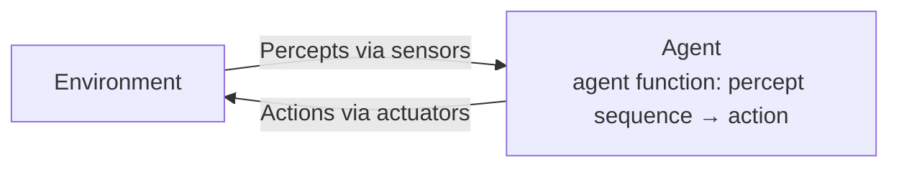
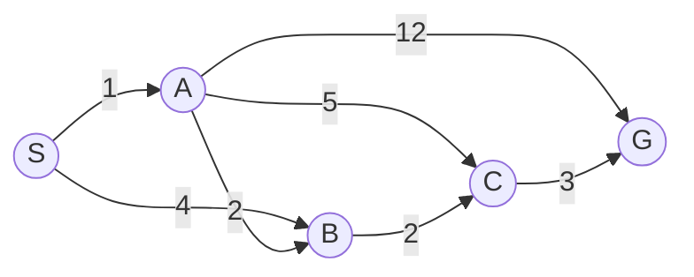
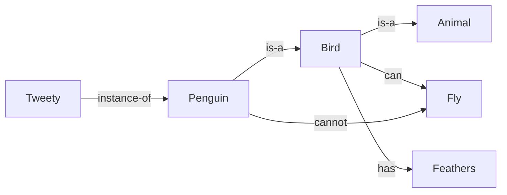
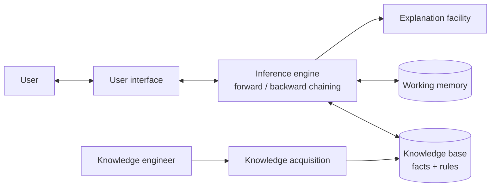
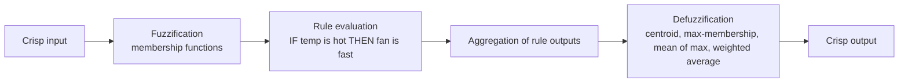
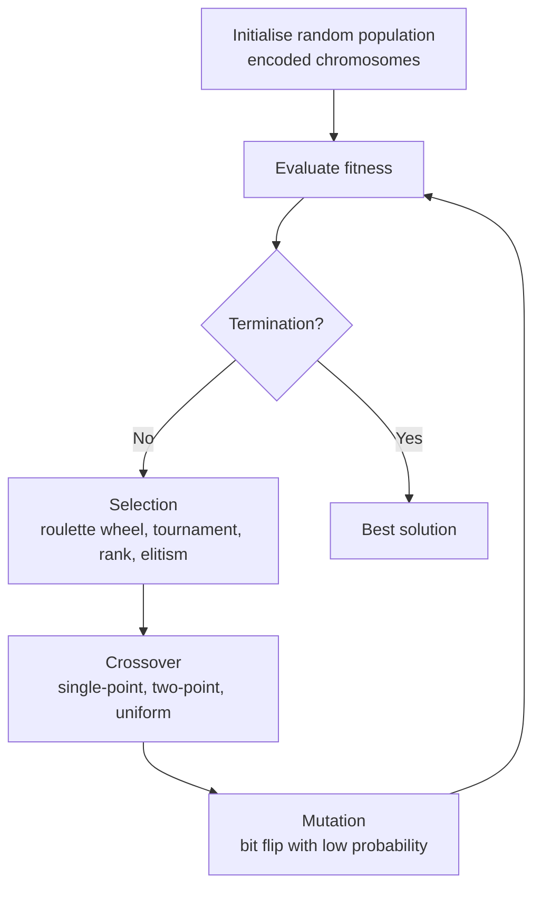
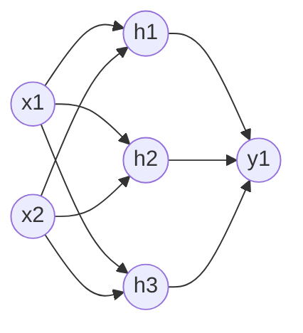
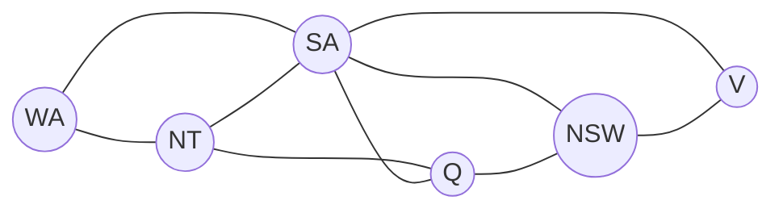

# Paper 2 · Unit 10 — Artificial Intelligence

**Expected questions: 8–10 · Target: 8+ · Type: search traces, alpha-beta, fuzzy operations, perceptron, concepts (Rich & Knight, Russell & Norvig)**

## Syllabus Checklist
- [ ] Approaches to AI: Turing test, rational agents, state-space representation, heuristic search, game playing, minimax, alpha-beta pruning
- [ ] Knowledge representation: logic, semantic networks, frames, rules, scripts, conceptual dependency, ontologies, expert systems, uncertainty
- [ ] Planning: components, linear & non-linear planning, goal stack, hierarchical planning, STRIPS, partial-order planning
- [ ] NLP: grammars, parsing techniques, semantic analysis, pragmatics
- [ ] Multi-agent systems: agents vs objects vs expert systems, MAS structure, semantic web, agent communication, ontologies, tools
- [ ] Fuzzy sets: membership functions, fuzzification/defuzzification, operations, linguistic variables, fuzzy relations, fuzzy inference & control
- [ ] Genetic algorithms: encoding, operators, fitness function, GA cycle
- [ ] Neural networks: supervised, unsupervised, reinforcement learning; perceptron, MLP, SOM, Hopfield

---

## 1. Approaches to AI

| | Human-like | Rational |
|-|-----------|----------|
| **Thinking** | Cognitive modelling (GPS — Newell & Simon) | Laws of thought (logic) |
| **Acting** | **Turing test** (1950, "Computing Machinery and Intelligence") | **Rational agent** (Russell & Norvig — the modern approach) |

- **Turing test**: interrogator communicates via text with a human and a machine; machine passes if indistinguishable. Needed capabilities: NLP, knowledge representation, automated reasoning, machine learning (+ vision & robotics for "total Turing test").
- **Chinese Room** (John Searle): argues passing the test ≠ understanding (strong vs weak AI).
- Term "AI" coined by **John McCarthy** at **Dartmouth Conference (1956)**.

### 1.1 Agents



**PEAS** description: Performance measure, Environment, Actuators, Sensors.
(Automated taxi: P = safety, speed, legality; E = roads, traffic; A = steering, brake; S = cameras, GPS, sonar.)

| Agent type | Behaviour |
|-----------|-----------|
| Simple reflex | condition–action rules on current percept only |
| Model-based reflex | keeps internal state of the world |
| Goal-based | chooses actions to reach goals (search/planning) |
| Utility-based | maximises expected utility |
| Learning agent | performance element + learning element + critic + problem generator |

Environment properties: fully/partially observable, deterministic/stochastic, episodic/sequential, static/dynamic, discrete/continuous, single/multi-agent, known/unknown.
(Chess with clock: fully observable, strategic, sequential, semi-dynamic, discrete, multi-agent.)

## 2. State Space Search

Problem = initial state, actions, transition model, **goal test**, path cost.
Examples: 8-puzzle (9!/2 = 181,440 reachable states), water jug, missionaries & cannibals, 8-queens, Tower of Hanoi.

```
 Water jug (4 L & 3 L, get 2 L in 4 L jug)
 (0,0) → (0,3) → (3,0) → (3,3) → (4,2) → (0,2) → (2,0)   ✔
```

### 2.1 Uninformed Search
b = branching factor, d = depth of shallowest goal, m = max depth, l = depth limit, C* = optimal cost.

| Strategy | Complete | Optimal | Time | Space |
|----------|---------|---------|------|-------|
| **BFS** | Yes (finite b) | Yes (unit cost) | O(b^d) | **O(b^d)** |
| Uniform-cost | Yes | **Yes** | O(b^(1+⌊C*/ε⌋)) | same |
| **DFS** | No (infinite paths) | No | O(b^m) | **O(bm)** |
| Depth-limited | No | No | O(b^l) | O(bl) |
| **Iterative deepening (IDDFS)** | Yes | Yes (unit cost) | O(b^d) | **O(bd)** |
| Bidirectional | Yes | Yes | O(b^(d/2)) | O(b^(d/2)) |

IDDFS combines BFS's completeness/optimality with DFS's memory — preferred uninformed method for large spaces.

### 2.2 Heuristic (Informed) Search

```
Greedy best-first:  f(n) = h(n)                 — fast, not optimal, not complete
A*:                 f(n) = g(n) + h(n)          — optimal if h is ADMISSIBLE (tree search)
                                                  or CONSISTENT (graph search)
Admissible:   h(n) ≤ h*(n)  (never overestimates)
Consistent:   h(n) ≤ c(n, n') + h(n')    (consistent ⇒ admissible)
Dominance:    h₂ ≥ h₁ (both admissible) ⇒ h₂ better (expands fewer nodes)
```
8-puzzle heuristics: h₁ = misplaced tiles, h₂ = **Manhattan distance** (h₂ dominates h₁).

**A\* worked** — h(S)=7, h(A)=6, h(B)=2, h(C)=1, h(G)=0 (all admissible)

| Step | Expand (g, f) | Open list after expansion (g, f = g + h) |
|------|---------------|-------------------------------------------|
| 1 | S (0, 7) | A (1, 7), B (4, 6) |
| 2 | B (4, 6) | A (1, 7), C (6, 7) |
| 3 | A (1, 7) | **B (3, 5)** — cheaper path found, B re-opened; C (6, 7); G (13, 13) |
| 4 | B (3, 5) | **C (5, 6)**; G (13, 13) |
| 5 | C (5, 6) | **G (8, 8)** |
| 6 | G (8, 8) | Goal reached: **S → A → B → C → G, cost 8** (optimal) |

Note: h here is admissible but **not consistent** (h(A) = 6 > c(A,B) + h(B) = 4), which is why B had to be re-opened.
With a consistent heuristic, a node is never re-expanded.

- **AO\*** — for AND-OR graphs (problem decomposition).
- **IDA\*** — iterative deepening with f-cost limits (memory O(bd)). **SMA\*** — memory bounded.
- **Local search**: **Hill climbing** (steepest ascent) — problems: **local maxima, plateaus, ridges**; fixes: random restart, sideways moves. **Simulated annealing** — accepts worse moves with probability e^(ΔE/T), T decreases. **Local beam search**. **Genetic algorithms** (§8).
- **Constraint satisfaction (CSP)**: variables, domains, constraints; backtracking + MRV (minimum remaining values), degree heuristic, LCV (least constraining value), forward checking, **arc consistency (AC-3)**.
- **Means–ends analysis** (GPS): reduce the difference between current and goal state.

## 3. Game Playing

### 3.1 Minimax
MAX picks maximum, MIN picks minimum child value; complete & optimal against an optimal opponent. Time O(b^m), space O(bm).

### 3.2 Alpha–Beta Pruning
α = best value MAX can guarantee so far (lower bound); β = best value MIN can guarantee (upper bound). **Prune when α ≥ β.**

```
                         MAX                    A = 3
                    ┌─────┴─────┬───────────┐
                   MIN         MIN          MIN
                   B=3         C≤2          D=2
                 ┌─┼─┐       ┌─┼─┐        ┌─┼─┐
                 3 12 8      2  ✂  ✂      14 5 2
                                (pruned: once C sees 2 < α=3, MAX will never choose C)
 Minimax value at root = 3 ; 2 leaves pruned
```
- Pruning does **not** change the final result.
- With perfect move ordering: time **O(b^(m/2))** (effectively doubles the searchable depth); random ordering ≈ O(b^(3m/4)).
- Stochastic games: **Expectiminimax** (chance nodes). Imperfect real-time decisions: cutoff test + evaluation function, quiescence search, horizon effect.

## 4. Knowledge Representation

### 4.1 Logic
- **Propositional logic**; **First-order predicate logic (FOPL)** — see [Unit 1](01-Discrete-Structures-Optimization.md#1-mathematical-logic).
- Inference: **resolution** (refutation — negate goal, convert to **CNF/clausal form**, derive empty clause), **forward chaining** (data-driven; production systems, OPS5), **backward chaining** (goal-driven; Prolog, MYCIN).
- CNF conversion steps: eliminate ↔, → ; move ¬ inward; standardise variables; **Skolemise** (remove ∃ using Skolem constants/functions); drop ∀; distribute ∨ over ∧.
- **Unification**: find substitution making literals identical (most general unifier, MGU); occurs check.
- Horn clause: at most one positive literal — basis of Prolog.
- Monotonic vs **non-monotonic** reasoning (default logic, closed-world assumption, circumscription, truth-maintenance systems).

### 4.2 Structured Representations


- **Semantic network** (Quillian): nodes = concepts, arcs = relations (is-a, has-a, instance); inheritance.
- **Frames** (Minsky, 1975): slots & fillers, default values, procedural attachments (if-needed, if-added demons).
- **Scripts** (Schank & Abelson): stereotyped event sequences — e.g. restaurant script: entry conditions, roles, props, scenes (entering, ordering, eating, exiting), results.
- **Conceptual Dependency** (Roger Schank): language-independent primitives — **ATRANS** (transfer possession: give), **PTRANS** (physical transfer: go), **MTRANS** (mental info: tell), **MBUILD** (build info: decide), **PROPEL**, **MOVE**, **GRASP**, **INGEST** (eat), **EXPEL**, **SPEAK**, **ATTEND** (11 primitive acts).
- **Production rules**: IF condition THEN action; conflict resolution (refractoriness, recency, specificity).
- **Ontologies**: formal specification of a shared conceptualisation (Gruber); OWL, RDF; upper ontologies.

### 4.3 Expert Systems



| Expert system | Domain |
|--------------|--------|
| **DENDRAL** (first) | Chemical structure (mass spectrometry) |
| **MYCIN** | Blood infections — backward chaining, **certainty factors** |
| EMYCIN | Shell from MYCIN |
| PROSPECTOR | Mineral exploration |
| XCON / R1 | DEC computer configuration — forward chaining |
| INTERNIST / CADUCEUS | Internal medicine |

### 4.4 Uncertainty
```
Bayes:   P(H|E) = P(E|H)·P(H) / P(E)
Certainty factor (MYCIN): CF = MB − MD ∈ [−1, 1]
  combining two positive CFs: CF = CF1 + CF2(1 − CF1)
Dempster–Shafer: belief Bel(A) ≤ plausibility Pl(A) ; mass function m over subsets
Bayesian network: DAG + conditional probability tables; P(x₁…xₙ) = Π P(xᵢ | parents(xᵢ))
```
Other: fuzzy logic (vagueness — §7), Markov models, HMMs.

## 5. Planning

| Concept | Meaning |
|---------|---------|
| **STRIPS** (Fikes & Nilsson, 1971) | Operators with **preconditions, add list, delete list**; closed-world assumption |
| Linear planning (goal stack) | Solve goals one at a time using a stack — can fail on interacting goals (**Sussman anomaly**) |
| Non-linear planning | Goals interleaved; constraint posting |
| **Partial-order planning (POP)** | Least-commitment; causal links, ordering constraints; resolves **threats** by promotion/demotion |
| **Hierarchical planning (HTN)** | Abstract actions decomposed into sub-tasks (ABSTRIPS) |
| Graphplan | Planning graph with mutex links |
| Forward (progression) vs backward (regression) state-space planning | |

```
STRIPS operator (Blocks world)
 PICKUP(x)
   PRE:  ONTABLE(x) ∧ CLEAR(x) ∧ HANDEMPTY
   ADD:  HOLDING(x)
   DEL:  ONTABLE(x), CLEAR(x), HANDEMPTY
 STACK(x, y)
   PRE:  HOLDING(x) ∧ CLEAR(y)
   ADD:  ON(x,y), CLEAR(x), HANDEMPTY
   DEL:  HOLDING(x), CLEAR(y)
```
**Sussman anomaly**: initial C on A, A and B on table; goal ON(A,B) ∧ ON(B,C) — goal-stack (linear) planning cannot solve it without undoing a subgoal.

## 6. Natural Language Processing


- Grammars: CFG, **Transformational grammar** (Chomsky), **ATN (Augmented Transition Network** — Woods), Case grammar (Fillmore), DCG, unification grammars, Systemic grammar.
- Parsing: top-down, bottom-up, **chart parsing** (Earley — O(n³)), CYK, deterministic parsing.
- Ambiguity: lexical ("bank"), syntactic/structural ("I saw a man with a telescope"), semantic, anaphoric/referential ("he"), pragmatic.
- Semantic analysis: lexical semantics, word sense disambiguation, semantic grammar, case roles.
- **Pragmatics**: speech acts (Austin, Searle) — what the speaker intends; **discourse**: anaphora resolution.
- Modern NLP: n-grams, tokenisation, stemming (Porter) vs lemmatisation, POS tagging (HMM), NER, TF-IDF, word embeddings (word2vec), transformers/LLMs.
- Early systems: **ELIZA** (Weizenbaum, pattern matching therapist), SHRDLU (Winograd, blocks world), LUNAR, PARRY.

## 7. Multi-Agent Systems

| | Object | Agent | Expert system |
|-|--------|-------|---------------|
| Autonomy | Methods invoked by others | Decides itself whether to act | Advises user |
| Behaviour | Passive | Proactive, reactive, social | Passive reasoning |
| Interaction | Method calls | Communication languages | User interface |

- Agent properties: **autonomy, reactivity, pro-activeness, social ability** (Wooldridge & Jennings); BDI architecture (**Beliefs, Desires, Intentions**).
- MAS structure: agents + environment + interactions (cooperation, coordination, negotiation — contract net protocol, auctions).
- **Agent communication languages**: **KQML** (performatives: ask, tell, achieve…), **FIPA-ACL**; content language **KIF**.
- Knowledge sharing via **ontologies**. **Semantic web** (Tim Berners-Lee): RDF (triples subject–predicate–object), RDFS, **OWL**, SPARQL; layered cake.
- Tools: **JADE** (Java, FIPA-compliant), JACK, Jason (AgentSpeak), Zeus, Aglets, NetLogo.

## 8. Fuzzy Sets & Logic (Zadeh, 1965)

Membership μ_A(x) ∈ [0, 1] (vs crisp {0, 1}).

```
 μ
 1 ┤      ╱‾‾‾‾╲              triangular(a,b,c): peak at b
   │     ╱      ╲             trapezoidal(a,b,c,d): flat top b..c
   │    ╱        ╲            Gaussian: e^(−(x−c)²/2σ²)
 0 ┼───┴──────────┴───────
       a   b    c   d         Core: μ = 1 ; Support: μ > 0 ; Crossover: μ = 0.5
```

### Operations (standard Zadeh)
```
Union          μ_{A∪B}(x) = max(μA, μB)
Intersection   μ_{A∩B}(x) = min(μA, μB)
Complement     μ_{A'}(x)  = 1 − μA(x)
Algebraic sum  μA + μB − μA·μB ; Algebraic product μA·μB
Bounded sum    min(1, μA + μB) ; Bounded difference max(0, μA − μB)
Concentration (very)   μ²     Dilation (somewhat) √μ
```
**Laws that FAIL in fuzzy sets**: **law of excluded middle** (A ∪ A' ≠ U) and **law of contradiction** (A ∩ A' ≠ ∅). De Morgan, associativity, distributivity still hold.

**Worked**: A = {0.2/x₁, 0.7/x₂, 1/x₃}, B = {0.5/x₁, 0.3/x₂, 0.8/x₃}
```
A ∪ B = {0.5, 0.7, 1}      A ∩ B = {0.2, 0.3, 0.8}     A' = {0.8, 0.3, 0}
A ∩ A' = {0.2, 0.3, 0} ≠ ∅
α-cut A₀.₅ = {x₂, x₃}       Height(A) = 1 (normal fuzzy set)
```

- **Fuzzy relations**: max–min composition: (R∘S)(x, z) = max_y min(R(x,y), S(y,z)). Max-product composition.
- **Linguistic variables**: e.g. Temperature ∈ {cold, warm, hot}; hedges: very, somewhat.
- **Fuzzy inference system**:


- **Mamdani** (fuzzy output sets, centroid defuzzification — intuitive) vs **Sugeno / TSK** (output = linear function/constant, weighted average — efficient).
- Centroid: z* = ∫μ(z)·z dz / ∫μ(z) dz. Weighted average: Σ μᵢ zᵢ / Σ μᵢ.
- Applications: washing machines, ABS brakes, air-conditioners, cameras (fuzzy control).

## 9. Genetic Algorithms (John Holland, 1975)



- **Encoding**: binary, permutation (TSP), value/real, tree (genetic programming).
- **Fitness function** guides selection. Roulette wheel probability pᵢ = fᵢ / Σf.
- **Crossover** (exploitation of good genes) with probability ~0.6–0.9; **mutation** (exploration, maintains diversity) ~0.001–0.01.
- Single-point crossover: 1011|010 × 0110|111 → 1011111, 0110010.
- **Schema theorem** (Holland): short, low-order, above-average schemata grow exponentially (building block hypothesis). Order o(H) = fixed positions; defining length δ(H) = distance between first & last fixed positions. Number of schemata in a string of length l: 3ˡ.
- Premature convergence; elitism keeps the best individuals.

## 10. Artificial Neural Networks

### 10.1 Learning Paradigms
| Type | Data | Examples |
|------|------|----------|
| **Supervised** | Labelled input–output pairs | Perceptron, back-propagation MLP, SVM, decision trees |
| **Unsupervised** | Unlabelled | **SOM (Kohonen)**, k-means, Hebbian, competitive learning, ART |
| **Reinforcement** | Rewards / penalties from environment | Q-learning, SARSA, TD learning; MDP (states, actions, rewards, policy) |

Q-learning: Q(s,a) ← Q(s,a) + α[r + γ max_a′ Q(s′,a′) − Q(s,a)].

### 10.2 Perceptron (Rosenblatt, 1958)

```
 x1 ──w1──╲
 x2 ──w2───► Σ wᵢxᵢ + b ──► step(·) ──► y
 x3 ──w3──╱
 Update rule:  wᵢ ← wᵢ + η (t − y) xᵢ        (t = target, η = learning rate)
```
- **McCulloch–Pitts neuron (1943)**: first model; binary threshold, fixed weights.
- Single-layer perceptron can learn only **linearly separable** functions — AND, OR, NAND ✔; **XOR ✘** (Minsky & Papert, 1969).
- AND with w₁ = w₂ = 1, threshold θ = 1.5 (or bias −1.5); OR with θ = 0.5.
- Perceptron convergence theorem: converges in finite steps if data is linearly separable.

### 10.3 Multilayer Perceptron & Backpropagation


- Input → hidden → output layers; non-linear activations: **sigmoid** σ(x) = 1/(1 + e⁻ˣ) with σ′ = σ(1 − σ), **tanh**, **ReLU** max(0, x), softmax (output).
- **Backpropagation** (Rumelhart, Hinton, Williams, 1986): forward pass → compute error → propagate gradients backwards (chain rule) → gradient descent: w ← w − η ∂E/∂w. Problems: local minima, vanishing gradients (sigmoid); momentum, learning-rate tuning.
- MLP with one hidden layer is a **universal approximator**; can solve XOR.
- Overfitting → regularisation, dropout, early stopping.
- **Delta rule / Widrow–Hoff / LMS** (ADALINE): Δw = η(t − y_in)x. MADALINE = multiple ADALINEs.

### 10.4 Self-Organising Map (Kohonen)
- **Unsupervised, competitive** learning; maps high-dimensional input to a low-dimensional (2-D) grid preserving **topology**.
- Steps: find **Best Matching Unit (BMU)** (min Euclidean distance) → update BMU and neighbours: w ← w + η·h(t)(x − w); neighbourhood and η shrink over time.

### 10.5 Hopfield Network (1982)
- **Recurrent**, fully connected, **symmetric weights** (wᵢⱼ = wⱼᵢ), **no self-connections** (wᵢᵢ = 0); binary/bipolar states.
- **Associative (content-addressable) memory**: stores patterns via Hebbian rule W = Σ pᵀp − I (bipolar); retrieves from noisy input.
- Energy function E = −½ ΣΣ wᵢⱼ sᵢ sⱼ decreases monotonically → converges to stable state (local minimum).
- Capacity ≈ **0.138 N** patterns for N neurons.
- Also: **Hebbian learning** ("neurons that fire together wire together") Δw = η·x·y; **BAM** (bidirectional associative memory — Kosko); **ART** (Grossberg – stability–plasticity); RBF networks; Boltzmann machine.

## 11. Deeper Dive — Worked Traces for Every Numerical Topic

### 11.1 Alpha–Beta Trace (depth 3)

```
                         MAX  A
               ┌──────────┴──────────┐
              MIN B                 MIN C
          ┌─────┴─────┐          ┌─────┴─────┐
        MAX D       MAX E      MAX F       MAX G
        ┌─┴─┐       ┌─┴─┐      ┌─┴─┐       ┌─┴─┐
        3   5       6   9      1   2       0  −1
```

| Step | Node | α, β on entry | What happens |
|------|------|---------------|--------------|
| 1 | D | −∞, +∞ | sees 3, 5 → D = 5 |
| 2 | B | — | β = 5 |
| 3 | E | −∞, 5 | sees 6 → α = 6 ≥ β = 5 → **prune leaf 9**; E returns 6 |
| 4 | B | — | B = min(5, 6) = 5 → A's α = 5 |
| 5 | F | 5, +∞ | sees 1, 2 → F = 2 |
| 6 | C | 5, +∞ | β = 2 ≤ α = 5 → **prune G (leaves 0, −1)** |
| 7 | A | — | A = max(5, 2) = **5** |

3 of 8 leaves pruned; the root value is the same as plain minimax.

### 11.2 Resolution Refutation

**First-order**: "All men are mortal. Socrates is a man. Prove Socrates is mortal."
```
1. ¬Man(x) ∨ Mortal(x)          (∀x Man(x) → Mortal(x))
2. Man(Socrates)
3. ¬Mortal(Socrates)            (negated goal)
4. ¬Man(Socrates)               resolve 1, 3 with {x / Socrates}
5. □  (empty clause)            resolve 2, 4  → goal proved
```
**Propositional**: from P → Q, Q → R, P prove R. Clauses ¬P ∨ Q, ¬Q ∨ R, P, ¬R → resolve ¬Q ∨ R with ¬R → ¬Q; with ¬P ∨ Q → ¬P; with P → □.

### 11.3 Forward vs Backward Chaining

Rules: R1: A ∧ B → C; R2: C → D; R3: D ∧ E → F. Facts: A, B, E. Goal: F.

| Forward chaining (data-driven) | Backward chaining (goal-driven) |
|-------------------------------|---------------------------------|
| A, B ⊢ C (R1) | Goal F ← need D and E (R3) |
| C ⊢ D (R2) | E is a fact; D ← need C (R2) |
| D, E ⊢ F (R3) ✔ | C ← need A and B (R1); both facts ✔ |

### 11.4 Bayes — Medical Test

Disease prevalence 1%, test sensitivity 99%, false-positive rate 5%.
```
P(D | +) = P(+ | D)·P(D) / [P(+ | D)·P(D) + P(+ | ¬D)·P(¬D)]
         = 0.99 × 0.01 / (0.0099 + 0.05 × 0.99)
         = 0.0099 / 0.0594 ≈ 0.167      → only about 17% of positives actually have the disease
```

### 11.5 Fuzzy Max–Min Composition & Inference

```
R = | 0.6  0.3 |      S = | 1.0  0.5 |      T = R ∘ S
    | 0.2  0.9 |          | 0.8  0.4 |
T₁₁ = max(min(0.6, 1.0), min(0.3, 0.8)) = max(0.6, 0.3) = 0.6
T₁₂ = max(min(0.6, 0.5), min(0.3, 0.4)) = max(0.5, 0.3) = 0.5
T₂₁ = max(min(0.2, 1.0), min(0.9, 0.8)) = max(0.2, 0.8) = 0.8
T₂₂ = max(min(0.2, 0.5), min(0.9, 0.4)) = max(0.2, 0.4) = 0.4
T = | 0.6  0.5 |
    | 0.8  0.4 |
```

**Sugeno-style inference**: temperature 30 °C → μ_warm = 0.4, μ_hot = 0.6. Rules: warm → fan 40%, hot → fan 80%.
Output = (0.4 × 40 + 0.6 × 80) / (0.4 + 0.6) = **64%**.

### 11.6 Genetic Algorithm — One Generation (maximise f(x) = x², 5-bit x)

| String | x | f(x) | pᵢ = f/Σf | Expected copies (4pᵢ) |
|--------|---|------|-----------|----------------------|
| 01101 | 13 | 169 | 0.144 | 0.58 |
| 11000 | 24 | 576 | 0.492 | 1.97 |
| 01000 | 8 | 64 | 0.055 | 0.22 |
| 10011 | 19 | 361 | 0.309 | 1.23 |
| | | Σ = 1170 | | |

Crossover 0110|1 × 1100|0 at position 4 → **01100 (12)** and **11001 (25)** — the child 25 is fitter than any parent.

### 11.7 Perceptron Learning AND (η = 1, w = (0, 0), b = 0, output 1 if w·x + b > 0)

| End of epoch | w₁ | w₂ | b | Errors in epoch |
|--------------|----|----|---|-----------------|
| 1 | 1 | 1 | 1 | 1 |
| 2 | 2 | 1 | 0 | 3 |
| 3 | 2 | 1 | −1 | 3 |
| 4 | 2 | 2 | −1 | 2 |
| 5 | 2 | 1 | −2 | 1 |
| 6 | 2 | 1 | −2 | 0 → converged |

Check: (0,0) → −2 → 0; (0,1) → −1 → 0; (1,0) → 0 → 0; (1,1) → 1 → 1 ✔ = AND.

### 11.8 One Backpropagation Step (single sigmoid neuron)

x = 1, w = 0.5, b = 0, target t = 1, η = 1, E = ½(t − o)².
```
net = 0.5 → o = σ(0.5) = 0.6225
δ = (t − o) · o(1 − o) = 0.3775 × 0.6225 × 0.3775 ≈ 0.0887
Δw = η δ x = 0.0887 → w_new = 0.5887 (output moves toward the target)
```

### 11.9 Hopfield Storage & Recall

Store bipolar pattern p = [1, −1, 1]: W = p pᵀ − I.
```
W = |  0  −1   1 |      Noisy input x = [1, 1, 1]
    | −1   0  −1 |      W x = [0, −2, 0] → sign (keep old value on 0) = [1, −1, 1]
    |  1  −1   0 |      → stored pattern recovered
```

### 11.10 CSP — Map Colouring with Heuristics


Three colours. **MRV/degree heuristic** picks SA first (degree 5). Assign SA = red → WA, NT, Q, NSW, V lose red; WA = green → NT = blue → Q = green → NSW = blue → V = green. Solution found without backtracking; **forward checking** removes inconsistent values early.

---

## Previous Year Questions (PYQ pattern)

**Foundations & agents**
1. The term "Artificial Intelligence" was coined by: **John McCarthy (1956)**
2. Turing test evaluates: **whether a machine's behaviour is indistinguishable from a human's**
3. PEAS stands for: **Performance, Environment, Actuators, Sensors**
4. Agent that acts only on the current percept: **simple reflex agent**
5. Chess is: **fully observable, deterministic (strategic), sequential, discrete, multi-agent**

**Search**

6. Space complexity of BFS: **O(b^d)**; of DFS: **O(bm)**
7. Search that combines benefits of BFS and DFS: **iterative deepening DFS**
8. A* is optimal if the heuristic is: **admissible (never overestimates)**
9. If h(n) = 0 for all n, A* reduces to: **uniform-cost search** (Dijkstra)
10. Greedy best-first search uses: **f(n) = h(n)**
11. Hill climbing can get stuck due to: **local maxima, plateau, ridges**
12. Simulated annealing accepts worse moves with probability: **e^(ΔE/T)**
13. Problem reduction (AND-OR graphs) uses: **AO\***
14. Means-ends analysis was used in: **GPS (General Problem Solver)**
15. For 8-puzzle, Manhattan distance is: **admissible and dominates misplaced tiles**

**Games**

16. Alpha-beta pruning with perfect ordering reduces time to: **O(b^(m/2))**
17. Pruning occurs when: **α ≥ β**
18. Alpha-beta pruning changes the minimax value? **No**
19. Minimax value of tree with MIN nodes having leaves (3,12,8), (2,4,6), (14,5,2): max(3, 2, 2) = **3**

**Knowledge representation**

20. Frames were proposed by: **Marvin Minsky**
21. Scripts were proposed by: **Schank & Abelson**
22. "John gave Mary a book" in CD uses primitive: **ATRANS**
23. MYCIN used: **backward chaining with certainty factors**
24. First expert system: **DENDRAL**
25. Skolemisation removes: **existential quantifiers**
26. Prolog is based on: **Horn clauses with backward chaining (SLD resolution)**
27. Resolution proves a goal by: **refutation (deriving the empty clause from negated goal)**
28. Combining CF 0.6 and 0.4 (both positive): 0.6 + 0.4 × 0.4 = **0.76**
29. Dempster–Shafer theory uses: **belief and plausibility**

**Planning & NLP**

30. STRIPS operators contain: **preconditions, add list, delete list**
31. Sussman anomaly illustrates a problem with: **linear (goal-stack) planning**
32. Partial-order planning follows: **least-commitment strategy**
33. ATN stands for: **Augmented Transition Network**
34. "I saw the man with the telescope" exhibits: **structural (syntactic) ambiguity**
35. Correct NLP pipeline: **morphological → syntactic → semantic → discourse → pragmatic**
36. ELIZA was developed by: **Joseph Weizenbaum**

**MAS**

37. BDI stands for: **Beliefs, Desires, Intentions**
38. KQML is used for: **agent communication**
39. JADE is: **a Java framework for FIPA-compliant multi-agent systems**
40. Semantic web ontology language: **OWL**

**Fuzzy**

41. Fuzzy logic was introduced by: **Lotfi Zadeh (1965)**
42. μA = 0.6, μB = 0.3: union **0.6**, intersection **0.3**, complement of A **0.4**
43. Which law does NOT hold in fuzzy sets? **Law of excluded middle / contradiction**
44. Defuzzification method computing centre of area: **centroid**
45. Sugeno fuzzy model output is: **a linear function or constant (crisp)**
46. Max–min composition of R = [0.3 0.8] and S = [0.5; 0.9] (column): max(min(0.3,0.5), min(0.8,0.9)) = **0.8**
47. "Very" hedge applied to μ = 0.8: **0.64**

**GA**

48. Genetic algorithms were introduced by: **John Holland**
49. Operator that maintains diversity: **mutation**
50. Roulette wheel: fitness values 10, 20, 30, 40 → probability of 3rd: **0.3**
51. Number of schemata in binary string length 5: **3⁵ = 243**

**Neural networks**

52. Single-layer perceptron cannot learn: **XOR**
53. Perceptron learning rule: **Δw = η(t − y)x**
54. Backpropagation uses: **gradient descent with chain rule**
55. Derivative of sigmoid: **σ(1 − σ)**
56. Kohonen SOM is: **unsupervised, competitive learning preserving topology**
57. Hopfield network weights are: **symmetric with zero diagonal**; used as **associative memory**
58. Hopfield storage capacity: **≈ 0.138 N**
59. Learning with reward/penalty: **reinforcement learning**
60. Hebbian learning rule: **Δw = η·x·y**

**More practice questions**

61. In the tree of §11.1, the number of leaves pruned by alpha–beta: **3**
62. Resolution proves a goal by deriving: **the empty clause from the negated goal**
63. Backward chaining starts from: **the goal**
64. Prevalence 1%, sensitivity 99%, false-positive 5%: P(disease | positive) ≈ **0.17**
65. Max–min composition entry max(min(0.2, 1.0), min(0.9, 0.8)) = **0.8**
66. In a GA with fitness values 169, 576, 64, 361, the selection probability of the fittest: **≈ 0.49**
67. Single-point crossover of 01101 and 11000 after bit 4: **01100 and 11001**
68. Perceptron weights (w₁, w₂, b) = (2, 1, −2) implement: **AND**
69. Derivative of the sigmoid at output 0.5: **0.25**
70. Hopfield weight matrix for one stored pattern p: **p pᵀ − I**
71. In map colouring, choosing the variable with the fewest legal values is the: **MRV heuristic**
72. Degree heuristic chooses the variable: **involved in the most constraints with unassigned variables**

## Quick Revision Box
- BFS O(b^d) space · DFS O(bm) · IDDFS best uninformed · A* optimal if admissible
- α–β: prune when α ≥ β · best ordering O(b^(m/2))
- Minsky frames · Schank scripts & CD (ATRANS, PTRANS, MTRANS) · MYCIN backward + CF
- STRIPS: pre/add/delete · Sussman anomaly → linear planning fails
- Fuzzy: ∪ max, ∩ min, ' = 1 − μ; excluded middle fails
- Perceptron no XOR · SOM unsupervised · Hopfield symmetric, recurrent, 0.138N
