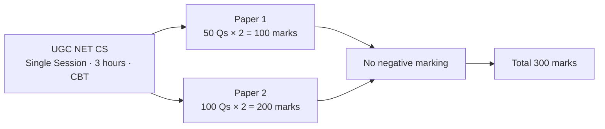
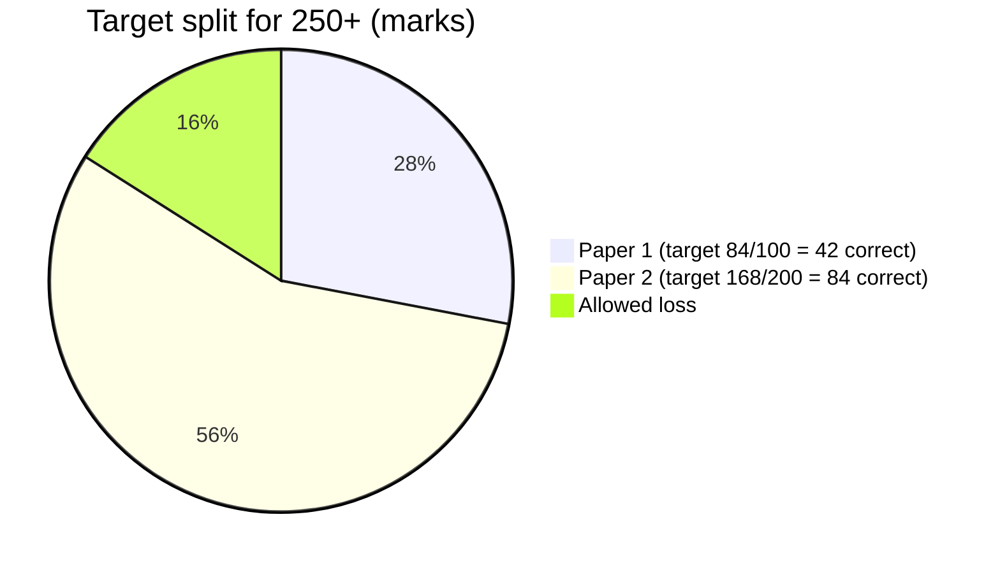
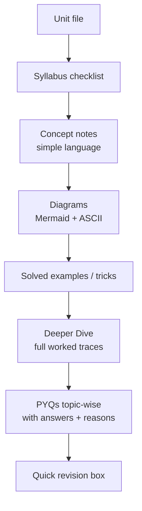

# UGC NET Computer Science — Complete Study Material (Target: 250+ / 300)

Detailed, simple-language notes for **Paper 1 (General)** and **Paper 2 (Computer Science & Applications, Code 87)**,
with diagrams (Mermaid + ASCII) and **previous-year-pattern questions (PYQs) for every topic**.

> Mermaid diagrams render automatically on GitHub. In VS Code, install "Markdown Preview Mermaid Support".

📄 **Printable book (LaTeX):** [UGC-NET-CS-Study-Material.pdf](UGC-NET-CS-Study-Material.pdf) — all units typeset as one
A4 book (≈ 210 pages, clickable contents, per-unit mini contents, vector diagrams). The LaTeX source is in
[`latex/`](latex/) — see [Building the LaTeX book](#7-building-the-latex-book).

---

## 1. Exam Pattern at a Glance

<!-- latex: intro-pattern -->


| Item | Paper 1 | Paper 2 |
|------|---------|---------|
| Questions | 50 (all compulsory) | 100 (all compulsory) |
| Marks | 100 | 200 |
| Negative marking | None | None |
| Nature | Teaching/Research aptitude, reasoning | Core CS (10 units) |

**No negative marking → never leave a question blank.**

---

## 2. What 250+ Really Means

250 / 300 = **125 correct out of 150** (≈ 83% accuracy).

<!-- latex: intro-target -->


| Paper | Questions | Target correct | Marks | Allowed mistakes |
|-------|-----------|----------------|-------|------------------|
| Paper 1 | 50 | 42+ | 84+ | 8 |
| Paper 2 | 100 | 84+ | 168+ | 16 |
| **Total** | **150** | **126** | **252** | **24** |

### Where marks come from (approx. Paper 2 weightage — ~10 Qs per unit)

| Unit | Expected Qs | Difficulty | Priority for 250+ |
|------|-------------|------------|-------------------|
| Discrete Structures & Optimization | 10–12 | Medium | ★★★ |
| Computer System Architecture | 8–10 | Medium | ★★★ |
| Programming Languages & Graphics | 8–10 | Easy-Med | ★★ |
| DBMS | 10–12 | Easy-Med | ★★★ (scoring) |
| System Software & OS | 10–12 | Medium | ★★★ (scoring) |
| Software Engineering | 8–10 | Easy | ★★★ (scoring, theory) |
| Data Structures & Algorithms | 10–12 | Medium | ★★★ |
| TOC & Compilers | 10–12 | Hard | ★★★ (differentiator) |
| Networks | 10–12 | Medium | ★★★ |
| Artificial Intelligence | 8–10 | Medium | ★★ |

Paper 1: roughly 5 questions per unit; **Data Interpretation, Reasoning, Comprehension** are "sure marks" (≈ 15 Qs) — aim for 100% there.

---

## 3. Material Index

### Paper 1 — General Paper on Teaching & Research Aptitude
| # | Unit | File |
|---|------|------|
| 1 | Teaching Aptitude | [Paper-1/01-Teaching-Aptitude.md](Paper-1/01-Teaching-Aptitude.md) |
| 2 | Research Aptitude | [Paper-1/02-Research-Aptitude.md](Paper-1/02-Research-Aptitude.md) |
| 3 | Comprehension | [Paper-1/03-Comprehension.md](Paper-1/03-Comprehension.md) |
| 4 | Communication | [Paper-1/04-Communication.md](Paper-1/04-Communication.md) |
| 5 | Mathematical Reasoning & Aptitude | [Paper-1/05-Mathematical-Reasoning.md](Paper-1/05-Mathematical-Reasoning.md) |
| 6 | Logical Reasoning | [Paper-1/06-Logical-Reasoning.md](Paper-1/06-Logical-Reasoning.md) |
| 7 | Data Interpretation | [Paper-1/07-Data-Interpretation.md](Paper-1/07-Data-Interpretation.md) |
| 8 | ICT | [Paper-1/08-ICT.md](Paper-1/08-ICT.md) |
| 9 | People, Development & Environment | [Paper-1/09-People-Development-Environment.md](Paper-1/09-People-Development-Environment.md) |
| 10 | Higher Education System | [Paper-1/10-Higher-Education-System.md](Paper-1/10-Higher-Education-System.md) |

### Paper 2 — Computer Science & Applications
| # | Unit | File |
|---|------|------|
| 1 | Discrete Structures & Optimization | [Paper-2/01-Discrete-Structures-Optimization.md](Paper-2/01-Discrete-Structures-Optimization.md) |
| 2 | Computer System Architecture | [Paper-2/02-Computer-System-Architecture.md](Paper-2/02-Computer-System-Architecture.md) |
| 3 | Programming Languages & Computer Graphics | [Paper-2/03-Programming-Languages-Graphics.md](Paper-2/03-Programming-Languages-Graphics.md) |
| 4 | Database Management Systems | [Paper-2/04-DBMS.md](Paper-2/04-DBMS.md) |
| 5 | System Software & Operating System | [Paper-2/05-System-Software-OS.md](Paper-2/05-System-Software-OS.md) |
| 6 | Software Engineering | [Paper-2/06-Software-Engineering.md](Paper-2/06-Software-Engineering.md) |
| 7 | Data Structures & Algorithms | [Paper-2/07-Data-Structures-Algorithms.md](Paper-2/07-Data-Structures-Algorithms.md) |
| 8 | Theory of Computation & Compilers | [Paper-2/08-TOC-Compilers.md](Paper-2/08-TOC-Compilers.md) |
| 9 | Data Communication & Computer Networks | [Paper-2/09-Computer-Networks.md](Paper-2/09-Computer-Networks.md) |
| 10 | Artificial Intelligence | [Paper-2/10-Artificial-Intelligence.md](Paper-2/10-Artificial-Intelligence.md) |

### Revision
- [Revision/Formula-Sheet.md](Revision/Formula-Sheet.md) — every formula & number you must know on exam day
- [Revision/Study-Plan.md](Revision/Study-Plan.md) — 120-day plan, mock strategy, exam-hall tactics

---

## 4. How Each Unit File Is Organised



## 5. About the PYQs

The questions under **"Previous Year Questions (PYQ pattern)"** are reconstructed from the recurring
question types and concepts asked in NTA UGC NET (2012–2025) and its predecessor CBSE NET papers. Numbers and
wording may differ from the original papers, and year tags are deliberately left out where they could not be verified.
Always pair these notes with the **official NTA question papers & answer keys** (ugcnet.nta.ac.in) for the
last 5–6 cycles — solve them fully timed at least twice.

## 6. Golden Rules for 250+

1. **Paper 2 decides your score** — 2/3 of total marks. Spend ~70% of your time on it.
2. **Theory units are free marks** (SE, DBMS, OS, Networks, AI): learn definitions exactly.
3. **Numerical units are differentiators** (Discrete, COA, TOC, Algorithms): practise daily.
4. **PYQs repeat** — concepts recur cycle after cycle. Solve every PYQ in these files twice.
5. **Mocks**: at least 25 full-length mocks in the last 6 weeks; analyse every wrong answer.
6. **Attempt all 150** — no negative marking.

## 7. Building the LaTeX Book

The Markdown files are the single source of truth; the LaTeX book is generated from them.

```
latex/
├── main.tex          ← hand-written: classic book layout, fonts, boxes, title page, part structure
├── tikzstyles.tex    ← shared TikZ palette and styles (boxes, 3-D slabs, cylinders, Gantt rows …)
├── art/*.tex         ← hand-drawn TikZ / pgfplots figures and typeset formula tables
└── chapters/*.tex    ← generated, one per unit (intro, p1-01 … p1-10, p2-01 … p2-10, rev-*)
scripts/
├── build.sh          ← runs everything below and copies the PDF to the repo root
├── md2latex.py       ← Markdown → LaTeX via pandoc; swaps marked blocks for latex/art figures
├── latex-filter.lua  ← tables, boxes, cross-links, page-break rules
└── render-diagrams.cjs ← fallback: renders any *unmarked* Mermaid block to a PDF figure
```

- **How figures work**: in a unit file, a comment `<!-- latex: NAME -->` placed just before a code block
  tells the converter to replace that block with `latex/art/NAME.tex` in the book. GitHub keeps showing the
  Mermaid / text version, the PDF gets the TikZ drawing. A marker with no block after it simply inserts the figure.
- **Just compile the LaTeX** (e.g. on Overleaf or local TeX Live): upload/open `latex/`, choose **LuaLaTeX**,
  compile `main.tex` twice. Fonts used: TeX Gyre Pagella (+ Pagella Math) and DejaVu Sans Mono, with DejaVu /
  GNU FreeFont as fallbacks for symbols.
- **Rebuild after editing the notes**: install `pandoc` (≥ 3) and TeX Live (LuaLaTeX), then run `scripts/build.sh`.
  Node ≥ 18 (`cd scripts && npm install`) is needed only if a Mermaid block without a `latex:` marker is added.

