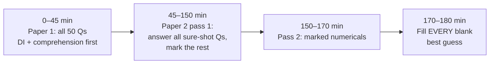

# 120-Day Study Plan for 250+ (Paper 1 + Paper 2)

Assumes ~5–6 hours/day. Compress proportionally if you have less time (e.g. 90 days → shrink Phase 1).

## Overview

```mermaid
gantt
    title Preparation timeline (days from start)
    dateFormat  X
    axisFormat  %s
    section Phase 1 – Concepts
    Paper 2 units 1-10 (first pass)   :p1, 0, 60
    Paper 1 units (parallel, 1 hr/day) :p1b, 0, 60
    section Phase 2 – PYQs & Practice
    Unit-wise PYQs + numericals        :p2, 60, 90
    Sectional tests                    :p2b, 70, 90
    section Phase 3 – Mocks & Revision
    Full mocks (25+) + analysis        :p3, 90, 115
    Formula sheet + weak areas         :p3b, 100, 120
```

<!-- latex: rev-gantt -->

## Phase 1 — Concept Building (Day 1–60)

Daily split: **4 hrs Paper 2 + 1 hr Paper 1 + 30 min revision of previous day**.

| Days | Paper 2 unit (file) | Paper 1 unit (parallel) |
|------|--------------------|-------------------------|
| 1–6 | Discrete Structures & Optimization | Teaching Aptitude |
| 7–12 | Computer System Architecture | Research Aptitude |
| 13–18 | DBMS | Communication |
| 19–24 | System Software & OS | Mathematical Reasoning (daily 10 Qs from here on) |
| 25–30 | Data Structures & Algorithms | Logical Reasoning (incl. Indian logic) |
| 31–37 | TOC & Compilers | Data Interpretation (daily 1 set from here on) |
| 38–43 | Computer Networks | ICT |
| 44–48 | Software Engineering | People, Development & Environment |
| 49–53 | Programming Languages & Graphics | Higher Education System |
| 54–58 | Artificial Intelligence | Comprehension (daily 1 passage from here on) |
| 59–60 | Buffer / catch-up | Buffer |

**For each unit**: read the notes → redraw every diagram from memory → solve every PYQ in the file → mark wrong ones with ✘ → re-solve ✘ ones after 3 days.

## Phase 2 — PYQs & Numerical Mastery (Day 61–90)
- Solve **official NTA papers** (last 5–6 cycles) **unit-wise** — attempt every question of a unit across years together; patterns become obvious.
- Daily numerical drill (30 min): rotate — cache/pipeline → scheduling/paging → subnetting/sliding window → recurrences → normalisation → COCOMO/FP/V(G) → DFA minimisation.
- Sectional tests: 25 questions per unit, 30 minutes, target ≥ 85%.
- Maintain an **error log**: question, why wrong (concept / calculation / misread), correct idea.

## Phase 3 — Mocks & Final Revision (Day 91–120)
- **25+ full-length mocks** (150 Qs, 180 min). Analyse each for at least as long as it took.
- Days 91–105: 1 mock every alternate day; fix weak areas on off days.
- Days 106–115: 1 mock daily.
- Days 116–120: only revision — [Formula Sheet](Formula-Sheet.md), Quick Revision Boxes of each unit, error log. No new topics.

## Score Tracker (fill in after every mock)

| Mock | P1 /100 | P2 /200 | Total | Weakest unit | Action |
|------|---------|---------|-------|--------------|--------|
| 1 | | | | | |
| 2 | | | | | |
| 3 | | | | | |
| … | | | | | |

Target trajectory: 180 → 210 (mock 5) → 235 (mock 12) → 250+ (mock 20 onwards, consistently).

## Exam-Hall Strategy (3 hours, 150 questions, no negative marking)

<!-- latex: rev-examhall -->

1. **Paper 1 in ≤ 45 minutes** — it carries 1/3 marks with easier questions; don't over-invest.
2. **Paper 2 two-pass method**: pass 1 answers what you know in < 40 s; mark anything needing long calculation.
3. **Statement/assertion questions**: evaluate each statement independently; eliminate options.
4. **Match-the-following**: fix the one pair you are surest of, then eliminate options.
5. **Never leave anything blank** — no negative marking. For pure guesses, eliminate first.
6. Watch for **"NOT" / "incorrect" / "false"** in question stems.

## Recommended Standard Books (for depth where needed)

| Unit | Book |
|------|------|
| Discrete | Kenneth Rosen — *Discrete Mathematics and Its Applications* |
| Optimization | Hamdy Taha — *Operations Research* |
| COA | M. Morris Mano — *Computer System Architecture* |
| C/C++ | Kernighan & Ritchie; E. Balagurusamy |
| Graphics | Hearn & Baker — *Computer Graphics, C Version* |
| DBMS | Korth / Navathe |
| OS | Galvin (Silberschatz) — *Operating System Concepts* |
| SE | Roger Pressman — *Software Engineering* |
| Algorithms | Cormen (CLRS); Horowitz–Sahni |
| TOC | Peter Linz; Hopcroft & Ullman |
| Compilers | Aho, Lam, Sethi, Ullman (Dragon book) |
| Networks | Forouzan — *Data Communications and Networking*; Tanenbaum |
| AI | Rich & Knight; Russell & Norvig; S.N. Sivanandam (fuzzy, GA, ANN) |
| Paper 1 | Any standard Paper 1 guide + NTA official papers |

## Weekly Checklist
- [ ] 6 days study + 1 day revision & error-log review
- [ ] All diagrams of the week redrawn from memory
- [ ] At least 150 PYQ/practice questions solved
- [ ] One full or sectional mock analysed
